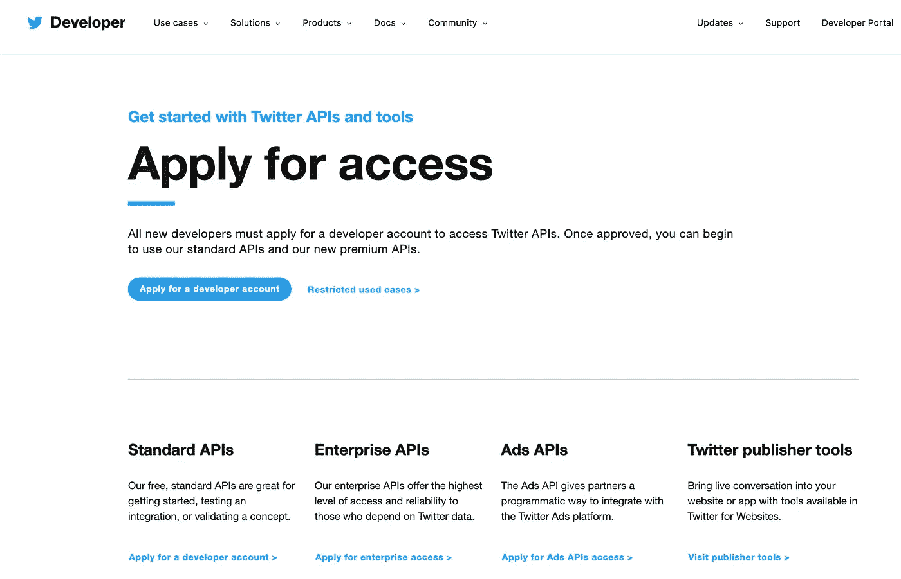
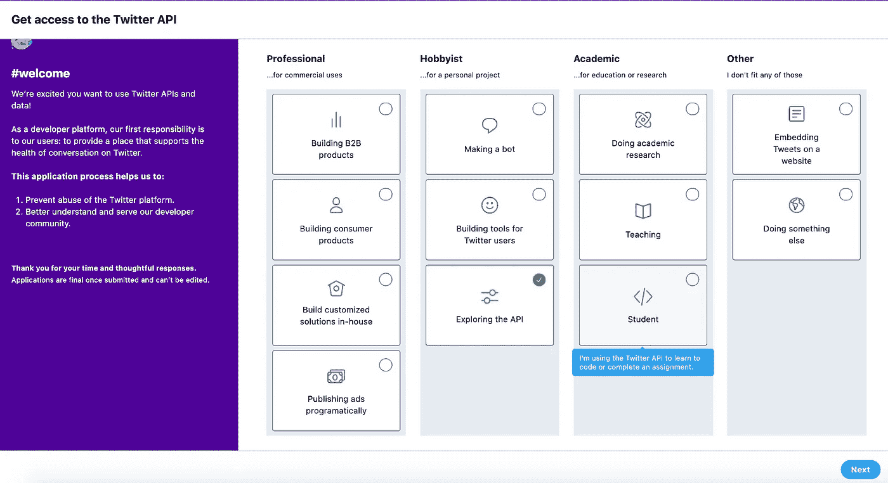
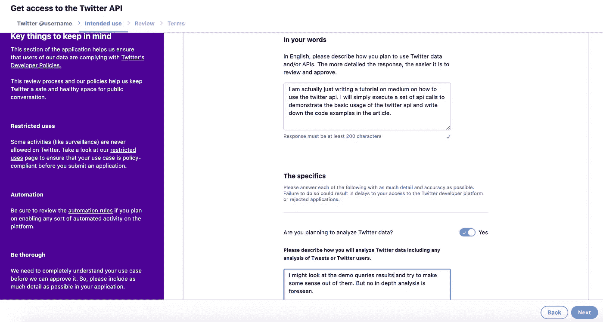
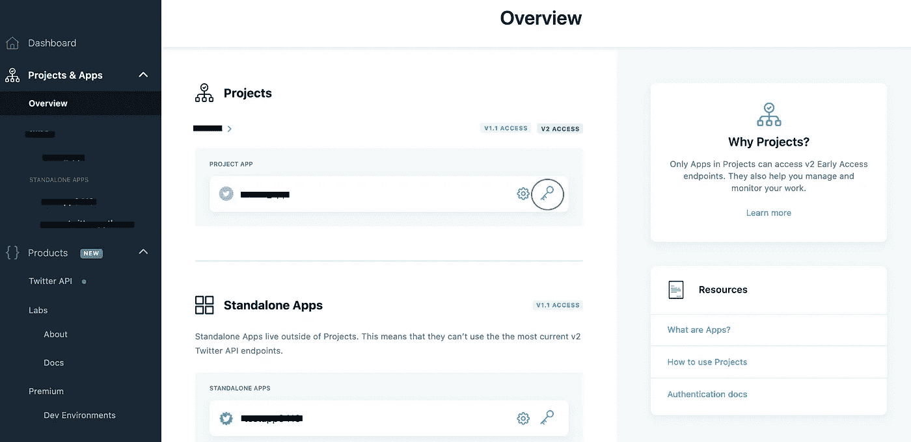
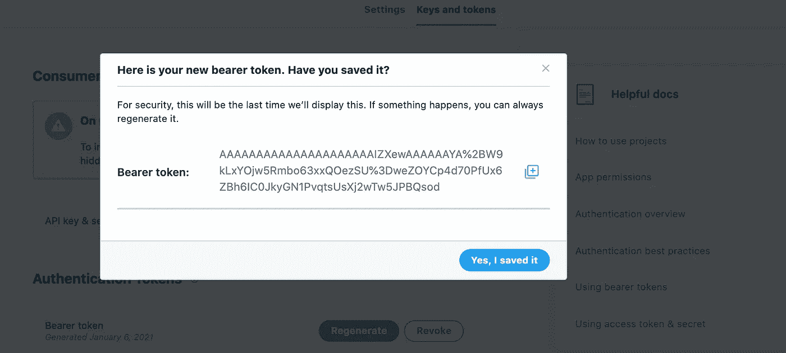

# 使用 Python 搜索推文

> 原文：<https://towardsdatascience.com/searching-for-tweets-with-python-f659144b225f?source=collection_archive---------6----------------------->

## 关于如何使用 Python 中的 Twitter API 的快速演练


Joshua Hoehne 在 [Unsplash](https://unsplash.com?utm_source=medium&utm_medium=referral) 上拍摄的照片

# 你想知道如何用 Python 搜索最近的推文吗？

显然，有一百万种方法和包，比如: [python-twitter](https://python-twitter.readthedocs.io/en/latest/index.html) 、 [search-tweets-python](https://github.com/twitterdev/search-tweets-python) 、[snscreage](https://github.com/JustAnotherArchivist/snscrape)或 [tweepy](http://docs.tweepy.org/en/latest/#) 、**、**但是找到一个直接简单的教程，简单地查询关于我选择的主题的**最近的 tweets** ，而没有任何依赖性，并不容易。这也是我写这篇小教程的原因。因此，如果这适用于你，请继续阅读！

# 第一步:建立你的 twitter 开发者账户

首先，你需要设置你的 Twitter 开发者账户(如果你已经有了，跳到第 2 步)。要创建这样的帐户，请遵循以下说明:

1.  **导航至 https://developer.twitter.com/en/apply-for-access**<https://developer.twitter.com/en/apply-for-access>**并使用您的 twitter 账户登录(如果您已经有一个的话)。如果没有，注册一个新的 Twitter 账户。登录后，您应该会看到以下网页(见下图)。**

****

**Twitter API:申请访问**

****2。**点击**“申请开发者账号”。这将打开一个对话框，询问你想如何使用 Twitter API。在我的例子中，我选择了以下设置:****

****

**Twitter API 访问应用程序**

****3。描述您的预期用途:**随后，您将被转到一个页面，在该页面上，您必须说明您对 Twitter API 作品的预期用途。总的来说，你需要写大约 200-600 个字符，这取决于你打算做什么。简单地说，诚实并尽可能用最好的方式描述你的用例。**

****

**Twitter API 访问应用程序:预期用途描述**

**4.查看您的访问申请并阅读条款。搞定了。**

**5.**建立一个项目和应用程序:**一旦您的访问权限被授予，导航到 https://developer.twitter.com/en/portal/dashboard 的，在那里您可以建立您的 Twitter API **项目**和一个**应用程序**(换句话说就是一个用例)。**

****

**Twitter 开发者仪表板概述**

**6.**复制您的不记名令牌:**完成设置后，复制您的应用程序不记名令牌——您很快就会需要这个令牌。如果您忘记了您的不记名令牌，请导航到“密钥和令牌”并单击“重新生成”。**

****

**重新生成 Twitter API 不记名令牌**

# **步骤 2: Python 环境设置**

**为了用 Python 发送 API 请求并能够使用 Twitter API，我们将不依赖任何 Twitter 包装模块，而只依赖非常方便的**请求**模块，该模块可以通过 pip 安装:**

```
pip install requests
```

# **第三步:准备搜索 Twitter 功能**

**我花了一段时间才找到这个，但是有一个专门的 Github 库，里面有很多语言的代码示例，关于如何使用 Twitter API:[https://github.com/twitterdev/Twitter-API-v2-sample-code](https://github.com/twitterdev/Twitter-API-v2-sample-code)**

**我的功能在很大程度上受到了这个存储库代码的启发，但为了更好地满足我的需求，对其进行了简化:**

```
import requests
import json#its bad practice to place your bearer token directly into the script (this is just done for illustration purposes)
BEARER_TOKEN = "YOUR BEARER TOKEN HERE"#define search twitter function
def search_twitter(query, tweet_fields, bearer_token = BEARER_TOKEN): headers = {"Authorization": "Bearer {}".format(bearer_token)}

    url = "https://api.twitter.com/2/tweets/search/recent?query={}&{}".format(
        query, tweet_fields
    ) response = requests.request("GET", url, headers=headers)

    print(response.status_code)

    if response.status_code != 200:
        raise Exception(response.status_code, response.text)
    return response.json()
```

**如您所见，该函数相当短，需要三个参数:**

*   ****bearer_token [str]:** 您在步骤 1 中复制的无记名令牌。**
*   ****query [str]:** 这是将用于匹配所需 Tweets 的实际字符串。这些查询字符串可以很简单比如**“滑板狗”**也可以很复杂很强大。它们允许你通过标签过滤推文，识别转发，排除某些单词或短语，或者只包含特定语言的推文。**关于如何编写这些查询字符串的专门描述可以在** [**这里找到**](https://developer.twitter.com/en/docs/twitter-api/tweets/search/integrate/build-a-rule) **。****
*   ****tweet_fields [str]:** 查询中返回的字段，如附件、作者 id、文本等。例如，如果您想要 tweet 的 author_id、文本和发布日期，tweet_fields 字符串将如下所示:**

```
tweet.fields=text,author_id,created_at”
```

**非常详细的 API 参考可以在[这里](https://developer.twitter.com/en/docs/twitter-api/tweets/search/api-reference/get-tweets-search-recent)找到。参考资料中描述了可包含在函数中的其他**可选参数**。这里有三个非常有用的:**

*   ****max_results:** 指定应该返回多少条 tweets 的参数:一个介于 10 和系统限制(当前为 100)之间的数字。默认情况下，请求响应将返回 10 个结果。**
*   ****start_time:** 最早的 UTC 时间戳(从最近七天开始)，将从该时间戳开始提供推文。(YYYY-MM-DDTHH:MM:ssZ(ISO 8601/RFC 3339)。)**
*   ****end_time:** 推文将被提供的最新的、最近的 UTC 时间戳。(YYYY-MM-DDTHH:MM:ssZ(ISO 8601/RFC 3339)。**

# **第四步:运行 search_twitter 功能**

****

**照片由 [Gema Saputera](https://unsplash.com/@gemasaputera?utm_source=medium&utm_medium=referral) 在 [Unsplash](https://unsplash.com?utm_source=medium&utm_medium=referral) 上拍摄**

**最后，让我们运行我们的功能，搜索所有关于滑板狗的推文:**

```
#search term
query = "skateboarding dog"#twitter fields to be returned by api call
tweet_fields = "tweet.fields=text,author_id,created_at"

#twitter api call
json_response = search_twitter(query=query, tweet_fields=tweet_fields, bearer_token=BEARER_TOKEN)#pretty printing
print(json.dumps(json_response, indent=4, sort_keys=True))
```

****响应:****

**这是我们的响应:首先，我们可以看到我们获得了 200 状态，这意味着一切运行顺利；其次，我们可以看到我们的响应是一个 json 对象，其中包含返回的 tweets:**

```
200
{
 “data”: [
 {
 “author_id”: “946476703521570816”,
 “created_at”: “2021–01–06T18:08:57.000Z”,
 “id”: “1346881457399197697”,
 “text”: “[@HamillHimself](http://twitter.com/HamillHimself) i see your bobsleigh dog (seasonally sporty) and i raise you a skateboarding…cat? [https://t.co/d7lrCkDIz3](https://t.co/d7lrCkDIz3)”
 },
 { ...
```

**就是这个！我希望这对你们中的一些人有所帮助！请访问下面的进一步材料部分的链接，以获得关于 API 文档的更多见解。**

# **更多材料:**

*   **[1] **Twitter API 参考。**搜索 Tweets:最近搜索:[https://developer . Twitter . com/en/docs/Twitter-API/Tweets/Search/API-reference/get-Tweets-Search-recent](https://developer.twitter.com/en/docs/twitter-api/tweets/search/api-reference/get-tweets-search-recent)**
*   **[2] **Twitter API 参考。**为最近的搜索端点构建查询:[https://developer . Twitter . com/en/docs/Twitter-API/tweets/search/API-reference/get-tweets-search-recent](https://developer.twitter.com/en/docs/twitter-api/tweets/search/integrate/build-a-rule)**
*   **[3] **Twitter API v2 示例代码 Github 资源库。**Python、Ruby、Java、Javascript 的例子:[https://developer . Twitter . com/en/docs/Twitter-API/tweets/search/API-reference/get-tweets-search-recent](https://github.com/twitterdev/Twitter-API-v2-sample-code)**