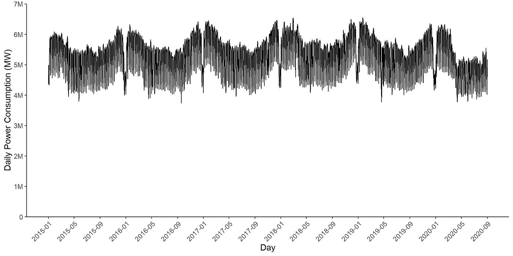
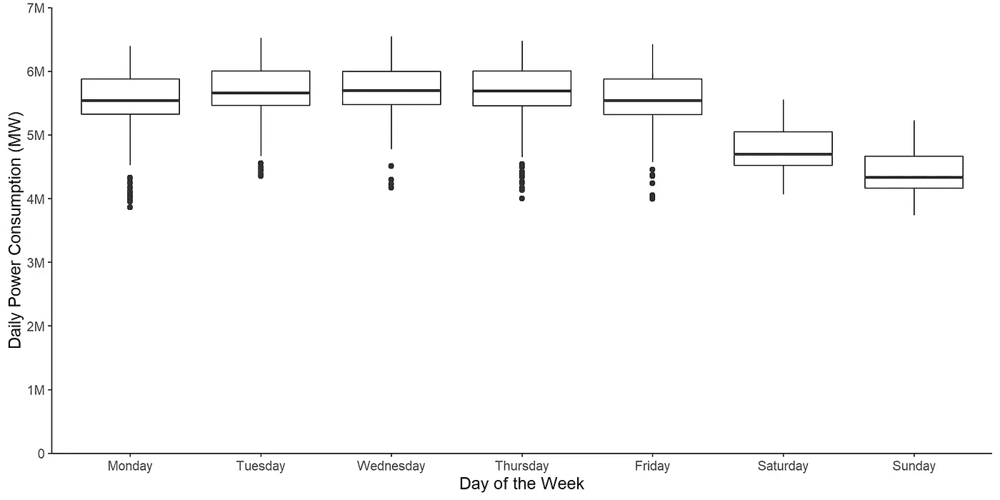
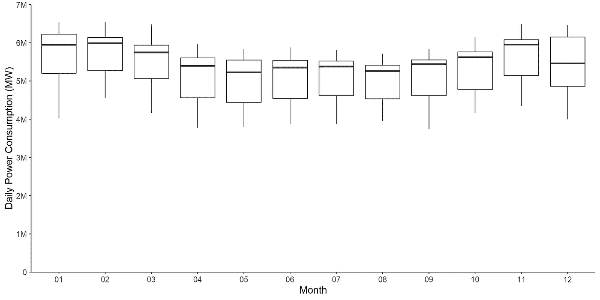
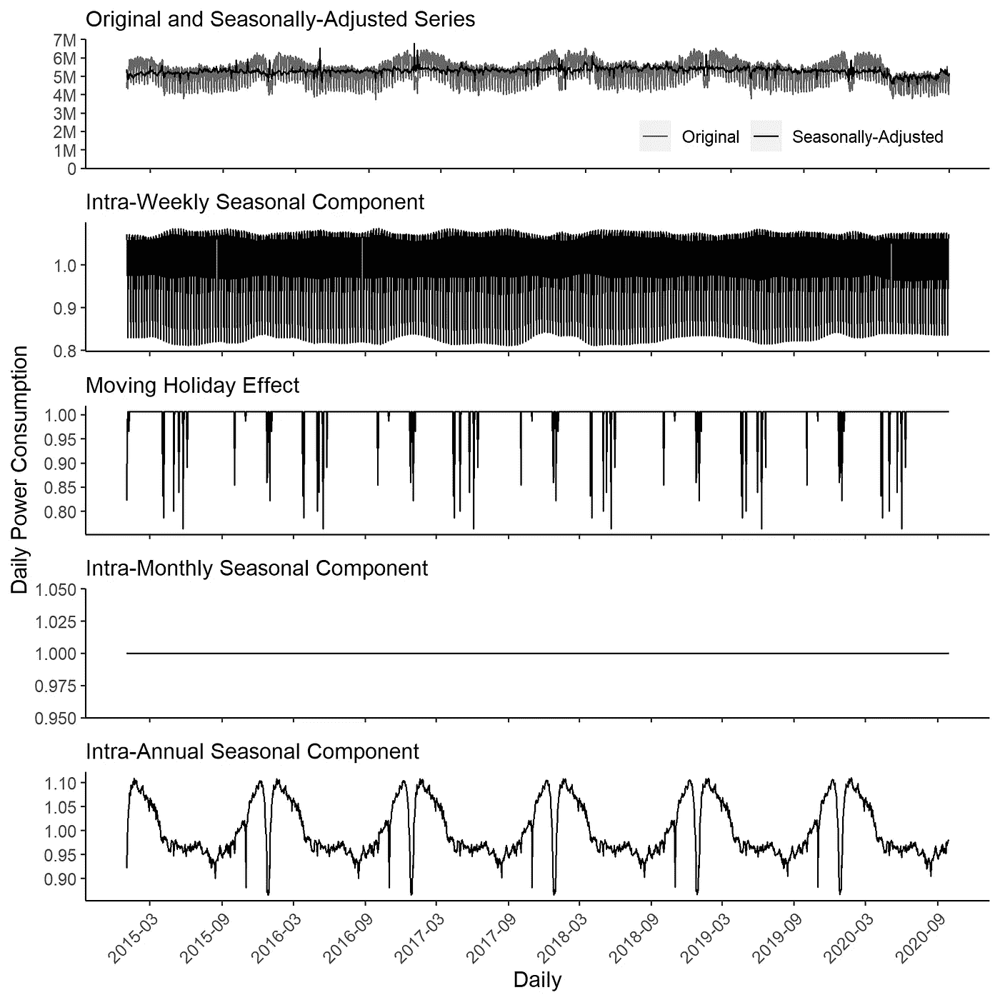

# 每日时间序列的季节性调整

> 原文：<https://towardsdatascience.com/seasonal-adjustment-of-daily-time-series-1bd2aa9b096d?source=collection_archive---------7----------------------->

## 消除季节性因素

## 德国中央银行推出新的每日生活津贴程序

费德里科·贝卡里在 [Unsplash](https://unsplash.com/s/photos/energy?utm_source=unsplash&utm_medium=referral&utm_content=creditCopyText) 上的照片

随着大数据的出现，关于每天可用的时间序列有了相当大的推动。

不幸的是，每日数据往往是嘈杂的。例如，时间序列可能会在周末以及每个月的月初和月末达到峰值。加上每月的偏差，就很难理解到底发生了什么。

长话短说，这些时间序列的季节性成分必须剔除。不过还是先说基本的吧。

# 季节性调整基础

一般来说，时间序列由以下部分组成:趋势周期、季节和不规则波动部分(Chatfield，2000；Hyndman & Athanasopoulos，2021)。这种情况可以表示为

Yₜ =TCₜ + Sₜ + Iₜ

在哪里

*时间 t 的 Yₜ:原始时间序列*

*TCₜ:长期或长期趋势，其周期叠加趋势成分*

*定义为周期性年内运动的 Sₜ:季节成分*

*Iₜ:不规则波动分量，描述时间序列中无法解释的部分。*

此外，一些作者扩展了等式，例如，移动假日效应 HEₜ或工作日效应 WDₜ (Darné等人，2018)。

Yₜ =TCₜ + Sₜ + HEₜ + WDₜ + Iₜ

原始时间序列的问题在于，很难确定这种变化是由哪个部分引起的。是否因为公休日导致成交量下降？还是年年重复的年内效应？例如，一个月的时间序列在冬季可能较高，而夏季月份可能低于正常月份。

如果我们对时间序列的短期或长期变动感兴趣，我们就不会关心各种季节性。我们想知道时间序列的当前状态，以及它是否已经到达一个转折点。了解这些信息具有真正的商业意义。类似地，通过只关注趋势周期和不规则成分，消除了经济变量之间的虚假关系。此外，预测不同的组成部分，并得出最终结果是一个廉价和直接的方法来获得预测(格兰杰，1978)。

因此，在很多情况下，我们只对趋势周期和不规则成分感兴趣。为了收集这两个部分，时间序列必须经过季节和日历调整(欧统局，2015 年)。

针对月度和季度时间序列的直接非季节性方法已经存在很长时间了。统计机构经常将它用于许多官方的经济和社会时间序列。

> 但是日常数据呢？

目前没有官方认可的每日数据去季节化方法。尽管如此，使用每日时间序列进行去季节化可能会比月度或季度数据产生更好的结果，因为它需要更多的观察(欧统局，2015 年)。

# 每日季节调整

Ollech (2021)的每日季节性调整(DSA)程序是一种有希望的季节性和日历调整每日时间序列的替代方法。

该程序将 Cleveland 等人(1990 年)开发的黄土季节趋势分解程序(STL)与带有 ARIMA 误差的回归模型(RegARIMA 模型)相结合。季节性模式和日历效应是按顺序估算的。时间序列按以下顺序调整:

1.  STL 调整周内周期模式。
2.  RegARIMA 估计日历效应、跨季节效应和异常值。
3.  STL 调整月内周期效应。
4.  STL 调整年内效应。

最后，DSA 模型被描述为

yₜ=tcₜ+sₜ^7+sₜ^31+sₜ^365+heₜ+iₜ

其中 t 日的周内、月内和年内周期模式分别表示为 Sₜ^7、Sₜ^31 和 Sₜ^365。原始的时间序列和其他成分保留在经典的成分模型中。

> 但是让我们在每天的时间序列上尝试这种方法，以了解一个典型的过程会是什么样子。

[西欧电力消耗](https://www.kaggle.com/francoisraucent/western-europe-power-consumption/version/1?select=de.csv)数据集包括德国五年来的每日电力消耗(MW)。一旦我们把它画出来，很明显时间序列中存在几个季节性。

德国五年的日耗电量(MW)。图片作者。

例如，在检查日常功耗时，周六和周日的中值、下四分位数和上四分位数明显低于其余工作日。尽管如此，在一周中仍然存在一些异常值，这可能表明由于假期的移动而导致功耗降低。

德国五年来每天的日耗电量(MW)。图片作者。

此外，春季和夏季的功耗中值、下四分位数和上四分位数低于秋季和冬季。

德国五年来每月的日耗电量(MW)。图片作者。

> 让我们开始用 DSA 方法对时间序列进行非季节性分析。

首先，我决定使用功耗的对数来稳定序列的方差。然后，我将 STL 的局部回归中的观察次数设置为 13(相对较低！)以说明经济环境的变化。

第三，RegARIMA 模型中使用了许多移动假日来控制它们的影响。我没有使用所有的移动假期，而是只实施那些在百分之十水平以下或左右显示出显著效果的假期，并放弃其他的移动假期。

基于 DSA 方法的 RegARIMA 的日用电量的估计对数转换移动假日效应。作者生成的结果。

基于上述报告的影响，移动假期始终降低 DSA 程序中的功耗。例如，复活节星期一和圣灵降临节星期一对电力消耗的负面影响最大。

然后，我使用 STL 的稳健版本计算年内效应(也有 13 个观察值来考虑经济变化)。尽管如此，我没有使用 STL 进行月内周期，因为整个月的耗电量不明显。

下图分别描述了功耗时间序列及其组成部分(对数转换)。时间序列具有独特的周内和年内模式，这些模式在一段时间内相当稳定。由于关闭了这种影响，月内部分没有模式。经季节调整的时间序列是每日生活津贴方法的主要结果。

日常功耗组件。图片作者。

与 Ollech (2021 年)类似，我将季节性调整时间序列与其他非季节性方法的结果进行比较，即 Dokumentov 和 Hyndman (2021 年)引入的基于回归的季节性趋势分解程序(STR)和 de Livera 等人(2011 年)得出的 TBATS。

我使用了两个可以检测剩余季节性的测试——QS 测试和弗里德曼测试。年内、月内和周内没有剩余季节性迹象的时间序列已经成功地去季节性化(Ollech，2021)。因此，这种分析的结果应该表明哪种程序产生最好的结果。

QS 检验的零假设是时间序列中季节滞后没有正自相关。同样，弗里德曼检验的零假设是时间序列中特定时期的平均值之间没有显著差异。

QS 和弗里德曼检验的结果——原始时间序列与 DSA、STR 和 TBATS 季节调整程序的比较。由作者生成的结果。

上表显示了 QS 和弗里德曼的测试结果。与原始时间序列相比，TBATS 得出了类似的结果。STR 并没有拒绝月内季节性的零假设，但是现在 QS 和弗瑞德曼检验的假设被拒绝了。只有 DSA 方法才能得出不排除所有季节性假设的结果。因此，我认为 DSA 方法优于 STR 和 TBATS 程序。

# 结论

最终，德国中央银行的 DSA 方法是一个很好的非季节性工具，它考虑了几个季节性频率和假日效应。所得结果可用于定位时间序列的当前状态和识别转折点。

例如，该方法本身已被用于德国联邦统计局(Cox 等人，2020 年)的每日卡车收费里程指数的非季节性，我很高兴看到它将来还会被用于其他地方。虽然它还不是日常数据的去季节化方法，但是它使用 STL 和 RegARIMA 的独特方法具有很大的潜力。

# **想要更多信息？**

本文的主要目的是介绍 DSA 程序，并使其更广为人知。

如果你对我的代码感兴趣，请查看 Github 上的[库。](https://github.com/JRatschat/DSA)

如果你想在你自己的项目中应用这个过程，我想给你介绍一下 [DSA 库的简介](https://cran.microsoft.com/snapshot/2021-09-26/web/packages/dsa/vignettes/dsa-vignette.html)，从中我得到了很好的指导(和代码片段)。此外，Daniel Ollech 发表的论文提供了该方法的详细理论描述。

如果您有任何问题或意见，请在下面留下您的反馈。另外，如果你想和我联系，你可以通过[*LinkedIn*](http://www.linkedin.com/in/jonathan-ratschat)*联系我。*

*敬请期待，下期帖子再见！*

Chatfield，C. (2000 年)。时间序列预测。查普曼&霍尔事务所。

克利夫兰，R. B .，克利夫兰，W. S .，麦克雷，J. E .，&特彭宁，I. (1990)。STL:基于黄土的季节趋势分解过程。官方统计杂志，6(1)，3–73。

考克斯，m .，特里贝尔，j .，林茨，s .，弗里斯，c .，弗洛雷斯，L. F .，洛伦茨，a .，奥勒奇，d .，迪特里希，a .，勒科龙，j .，韦贝尔，K. (2020)。gli cher Lkw-Maut-fahrleistungs 从 Lkw-Maut-Erhebung 的数字项目开始。《经济与统计》, 4，63-76 页。

de Livera，A. M .，Hyndman，R. J .，& Snyder，R. D. (2011 年)。用指数平滑法预测具有复杂季节模式的时间序列。美国统计协会杂志，106(496)，1513–1527。[https://doi.org/10.1198/jasa.2011.tm09771](https://doi.org/10.1198/jasa.2011.tm09771)

达尔内，奥，费拉拉，l .，，拉迪雷，D. (2018)。季节调整方法和软件工具简史。在 G. L. Mazzi、D. Ladiray 和 D. A. Rieser(编辑)，季节性调整手册(第 69–90 页)。欧盟出版办公室。

多库门托夫，a .，，海因德曼，R. J. (2021)。STR:基于回归的季节趋势分解程序(2021 年 4 月 4 日)。

欧盟统计局。(2015).ESS 季节性调整指南。【https://doi.org/10.2785/317290 号

格兰杰(1978 年)。季节性:原因、解释和含义。在阿诺德策尔纳(编辑。)，经济时间序列的季节性分析(第 33–56 页)。NBER。

Hyndman，R. J .，& Athanasopoulos，G. (2021 年)。预测:原理与实践(第三版。).OTexts。【https://otexts.com/fpp3 

奥利奇博士(2021)。每日时间序列的季节性调整。时间序列计量经济学杂志，aop，1–30。[https://doi.org/10.1515/jtse-2020-0028](https://doi.org/10.1515/jtse-2020-0028)

奥利奇博士和韦贝尔，K. (2020 年)。识别最具信息性的季节性测试的随机森林方法。德意志联邦银行第 55/2020 号讨论文件。

美国人口调查局。(2017).X-13ARIMA-SEATS 参考手册:可访问的 HTML 输出版本(版本 1.1)。[http://www.census.gov/srd/www/x13as/](http://www.census.gov/srd/www/x13as/)