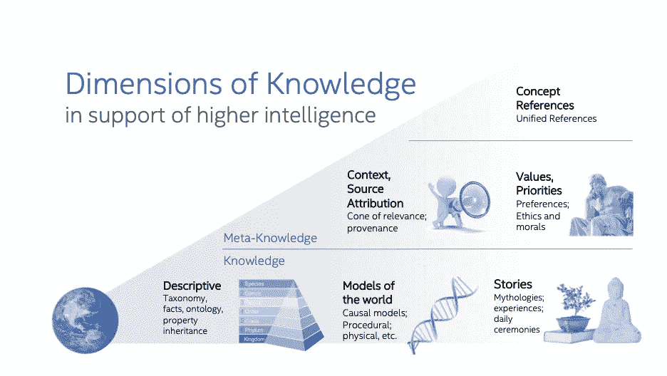
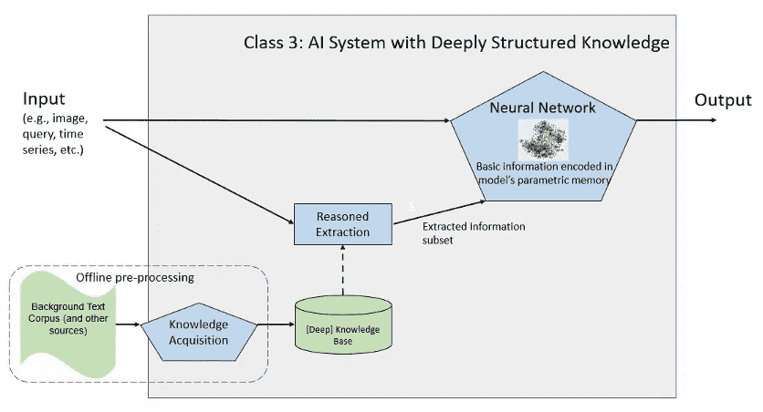
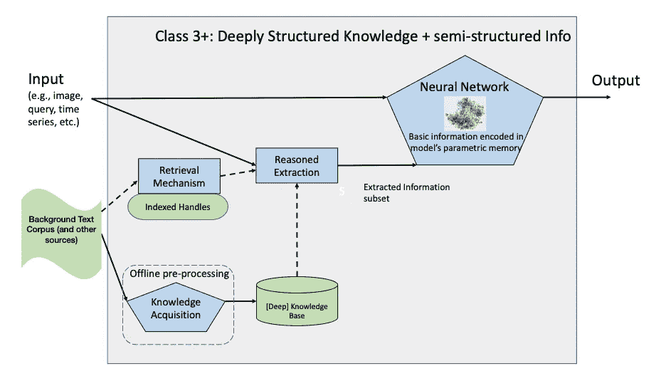
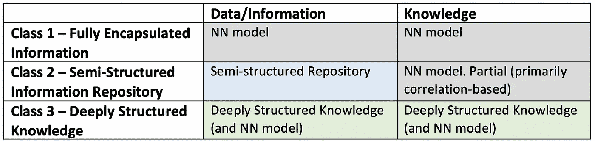

# 知识的所在地:具有深度结构化知识的人工智能系统

> 原文：<https://towardsdatascience.com/seat-of-knowledge-ai-systems-with-deeply-structure-knowledge-37f1a5ab4bc5?source=collection_archive---------33----------------------->

## 以信息为中心的人工智能体系结构分类如何促进任务优化人工智能系统的构建

图像归属:Jae Ryeong Lee[https://www.gettyimages.com/eula](https://www.gettyimages.com/eula)

在一系列关于在人工智能系统中捕获信息和使用知识的选择中，我[介绍了人工智能系统的信息中心分类的概念](https://www.linkedin.com/pulse/seat-knowledge-information-centric-classification-ai-gadi-singer/)，作为对基于处理的分类的补充观点，例如[亨利·考茨的神经符号计算分类法](https://www.cs.rochester.edu/u/kautz/talks/Kautz%20Engelmore%20Lecture%20Directors%20Cut.pdf)。该分类强调与 AI 系统中的信息相关的高层架构选择。本博客将概述这一分类中的第三类，以及它在支持机器理解、基于上下文的决策制定和高级机器智能的其他方面的有前途的作用。

提出的以信息为中心的分类包括三个关键的人工智能系统类别，这些类别基于体系结构划分和推理时信息的动态使用:

**Class 1 —** [**全封装信息**](https://www.linkedin.com/pulse/seat-knowledge-information-centric-classification-ai-gadi-singer/?lipi=urn%3Ali%3Apage%3Ad_flagship3_profile_view_base_post_details%3BU0mGe%2Bf2QG6jhNEc17r4Kg%3D%3D) :将训练数据和关系并入神经网络(NN)的参数存储器中。测试时无法访问附加信息。例子包括最近的端到端深度学习(DL)系统和语言模型(例如，GPT-3)。

**类 2 —** [**半结构化相邻信息**](https://www.linkedin.com/pulse/seat-knowledge-information-centric-classification-ai-gadi-singer-1c/) (在基于检索的系统中):这些系统除了依赖 NN 参数存储器(例如[检索增强生成](https://arxiv.org/pdf/2005.11401.pdf))之外，还依赖于从储存库(例如维基百科)检索信息。

**第 3 类——深度结构化知识**(在基于检索的系统中):基于检索的系统与深度知识库紧密交互，如在[高级智能知识维度](/understanding-of-and-by-deep-knowledge-aac5ede75169)中所定义的。

1 类和 2 类人工智能系统之间的主要区别在于信息放置的选择——封装在神经网络模型(1 类)或辅助知识库(2 类)中。

2 类和 3 类人工智能系统之间的主要区别在于更深层次的知识驻留在哪里——是在 NN 参数存储器中(2 类)还是在知识库中以深度结构化知识的形式(3 类中的知识图)。

**机器智能需要什么高深的知识？**

首先，让我们定义数据、信息和知识:

**数据**是需要处理的[原始的、无组织的事实](https://www.diffen.com/difference/Data_vs_Information)，从中获取信息，例如图像中的像素。

**当[数据在给定的上下文中被处理、组织、结构化或呈现以使其有价值时，信息](https://www.diffen.com/difference/Data_vs_Information)**被创建。信息为数据提供结构和上下文。

**知识**是指通过经验获得的[相关的客观信息。知识使数据可操作化，并使其成为进行预测或决定行动的有用资源。例如，当自动驾驶汽车识别到灯正在变红时，它可以评估安全停车的学习实践，并选择制动动作。](https://keydifferences.com/difference-between-information-and-knowledge.html)

关于被认为是深度和结构化的知识类型的详细讨论可以在文章 [***对深度知识的理解****——知识结构如何将 AI 从表面相关性转变为对世界的理解*](/understanding-of-and-by-deep-knowledge-aac5ede75169) 中找到。本文概述了深度信息的各种类别，并讨论了描述性知识以及世界模型、故事、价值和优先级在获取机器理解和更高机器智能所需的全部知识中的作用。引入概念参考以支持跨模态和维度的歧义消除和统一链接。我将把反映多种类型知识(图 1 中描述的类型)的关系和复杂性的表示称为深度知识。

*图一-支持高智能的知识维度。*

在 2 类系统中，存储库包含信息，但与信息相关的许多复杂关系和见解都封装在神经网络的嵌入空间中。在具有深度结构化知识的系统(3 级系统)中，大多数依赖关系和关系都明确地表示在知识库中。

**类别 3:具有深度结构化知识的人工智能系统**

在具有深度结构化知识(类别 3)的 AI 系统中，NN 具有相邻的知识库，该知识库具有传达构成深度知识的关系和依赖性的显式结构。在训练和推理/测试期间访问辅助知识库。一些深层知识仍然驻留在神经网络参数存储器中，但是在这类系统中，大多数知识驻留在神经网络之外。

大量的努力被用于提取信息并将其存储在结构化的知识库中。[例如，抽象意义表示(AMR)](https://amr.isi.edu/) 用于语义解析，以生成捕捉语义的图形，而不管语法/表示。提取的实体和关系可以被链接和映射到本体上，并存储在结构化知识库中。

[Wikidata](https://www.wikidata.org/wiki/Wikidata:Main_Page) 是一个知识库，拥有深度知识的多个元素。除了分层本体，Wikidata 还提供“特殊”关系或属性，例如关系和实体的时间或空间注释。这些属性在静态数据和改变知识状态的事件之间架起了一座桥梁。它们反映了知识的动态本质，并支持知识库上的专用推理(如时间、空间、因果)。这些属性并不系统地存在于所有知识库中。

维基数据中的大部分知识都是描述性的。不同的知识表示可以将描述性知识与其他知识维度结合起来。具有因果模型的知识库可以支持更强大的推理，并实现反事实探索。添加上下文可以在适当的意图和情况下更好地使用信息。添加来源归属和出处可以允许系统理解数据中的偏差，并通过更知情的视角分析信息(例如，有争议的政治事件)。

利用知识的一个关键方面是知识表示和推理之间的相互作用。知识和推理是连续体上的点，而不是两个完全不同的功能。推理可以梳理出所需的知识或结果，当它们还没有被完全表示并准备好按原样检索时。在显式知识库上应用推理可以作为 NN 的一部分，作为在知识库上执行的单独操作，或者两者的组合来完成。这种体系结构的选择对训练的性质、知识表示和推理/测试期间执行的计算类型有着重要的影响。

在一个只有神经网络的推理系统中，知识库作为一个储存库。一个 3 级系统将在推理过程中使用一个显式知识库；然而，诸如排序、选择、邻居识别等推理功能是由嵌入空间内的神经网络执行的——正如可以在知识图上操作的 [QA 系统的例子中找到的那样。](https://arxiv.org/pdf/1907.09361.pdf)

其他 3 级系统具有在知识库上选择信息或执行部分推理的主动功能。我们将这种机制称为**推理提取**。一个例子是[神经符号问题回答(NSQA)](https://arxiv.org/abs/2012.01707) 。推理提取优于仅 NN 推理的一个关键优势是，系统返回的答案可以随着 KG 的更新而动态变化，而无需重新训练模型。

**3 级系统的关键要素**

图二描述了 3 级系统的高级架构及其关键组件:

*图二-3 级系统的关键要素。*

**知识**是指通过经验获得的[相关的客观信息。**深度知识**描述了具有多个维度的知识，每个领域都有复杂的关系。知识库将结构化的交互式知识实现为特定解决方案中的存储库，主要实现为知识图(例如:](https://keydifferences.com/difference-between-information-and-knowledge.html) [Google 的知识图](https://blog.google/products/search/introducing-knowledge-graph-things-not/))。最后，具有深度结构化知识的 AI 系统是具有知识库的系统，该知识库捕获深度知识并通过提取方案反映其结构。

**神经网络**是 3 类系统的主要功能部分。它可能包括所有的感知元素，如图像识别和场景分割，或用于处理语法的语言模型，基于位置的关系和公共语义的核心。它将可能学习表示输入数据的关键维度的嵌入空间。在多模态系统的情况下，它将反映图像空间和语言空间。与类别 2 类似，具有深度结构化知识的人工智能系统将仅在其中整合一部分数据/信息。然而，与复杂知识结构驻留在 NN 中的类 2 不同，类 3 体系结构依赖于相邻的结构化知识库，用于其语义空间中的许多深层关系。

类似于类 2 系统，类 3 中的神经网络系统可以在推理/测试时间期间与结构化知识库接合，并提取成功完成其任务所需的信息。在这种体系结构中，神经网络的训练需要与提取机制和知识库的某种表示一起完成，以允许神经网络学习如何在推理过程中提取所需的知识。

**知识库**包含未来推理可能需要的事实和信息，以及图 1 中描述的部分或全部深层知识结构。这些包括描述性知识、世界动态模型、故事、背景和来源属性、价值和优先级以及概念参考。

知识库在被利用之前就被填充了，并且可以在训练或推理期间(在在线或连续学习系统中)被进一步增强。它主要基于**知识获取**的功能，从人工智能系统外部的来源提取事实、信息、分类、功能模型和其他知识元素，并以一种适合提取和推理的方式构建它们。当它在训练或推理运行的基础上积累额外的信息时，它可以被视为神经网络的记忆扩展，以构建和保留额外的学习信息和知识。

知识库在培训后可以改变，并且可以包括额外的数据和知识。只要知识和信息的性质与 NN 在训练期间遇到的相似，修改后的知识库在基于其最新体现的推理期间应该是完全可用的。

最后，**推理提取**模块在 NN 和它的外部知识源之间进行调解。在最简单的情况下，它是从嵌入向量通过一些索引链接到知识库的直接映射。然而，在这种情况下，与平面信息存储库相比，知识库结构不会带来任何额外的价值。在更一般的情况下，推理提取将使用基于查询或 API 的库来提取信息。这方面的一个例子是 [AMR](https://amr.isi.edu/) ，它将信息提取并存储为语义图，对原始的语法表达不敏感。一个应用是以后从该表示中检索和解释或总结信息的能力。

由于创建覆盖所有相关信息的充分填充的知识图的复杂性，除了知识库之外，一些 3 类系统还将集成从大型半结构化数据语料库中检索的完整机制。知识库覆盖范围中的一些不足，例如缺失的链接，可以在推理时通过对不完整信息进行推理的方法积极地解决。其他情况可能需要系统访问额外的信息源，我们称之为 3+类，如图三所示。在 3+级系统中，有三个级别的信息可供神经网络使用:

最直接的信息和知识存在于神经网络参数存储器中

知识库中提供了大量的信息以及深度结构化的知识

对于知识库缺乏足够覆盖面的情况，检索机制从最大的可用半结构化信息库中提取信息

*图三- Class 3+:深度结构化知识+半结构化信息。*

**什么样的 AI 系统架构最适合该任务？**

没有一种架构是适合所有用途的。每一类人工智能系统都有明显的优势和相关的挑战。理解系统的特征并把它们与人工智能系统所执行的用例的轮廓相匹配是很重要的。

数据、信息和知识之间的结构关系与以信息为中心的分类相关，如下所示:

*表 I——以信息为中心的人工智能类别中的数据、信息和知识。*

*拥有完全封装信息的 1 级人工智能系统*可能是当今开发的最流行和最有影响力的人工智能解决方案。端到端的深度学习系统在许多领域都具有非凡的有效性。它们可能是所有类型的感知任务(如图像识别和分割、语音识别和许多自然语言处理功能)、序列到序列功能(如语言翻译)、推荐系统、许多问答应用等的最佳解决方案。一般来说，任何可以在连续空间上求解并可以通过潜在流形建模的函数都可以通过神经网络系统有效地处理。

当前 DL 的一些局限性可能会通过该领域的进一步工作得到解决。考虑到时间、成本、可变性、信息可靠性/偏差、较小的数据域等因素，问题不仅在于 1 类系统最终能做什么，还在于这种全封闭系统能做好什么。例如，一个 NN 可以学习做布尔逻辑和一些基本的算术，但它是实际用例的高效解决方案吗？DL 系统不能正确执行高中水平的算术，因为它提供近似值，而不是执行离散代数。神经网络系统在没有答案时也很难识别。另一个例子是获取来源属性和信息来源。如果一个 DL 系统要维护它在训练期间作为模型的一部分所看到的事实的来源，它将需要一个非常不同的 NN 解决方案，这是不太可能可行的。

具有半结构化信息储存库 的第 2 类人工智能系统最有助于解决具有非常大的数据/信息空间的用例:一个负责回答关于维基百科文章的问题的人工智能系统，通过指向外部储存库的检索机制，将比通过 NN 记忆将所有数据合并到参数存储器中更有效。在训练时间和测试/推理时间之间修改存储库中的信息的能力对于域外质询可能很重要，即使相关信息在训练期间不存在。到原始信息的链接为出处挑战提供了部分但有价值的贡献，并提高了可解释性和可解释性。

*具有深度结构化知识的 3 级人工智能系统*可以为增加对世界的理解做出重要贡献，并在人工智能内创建外部世界的多面反映。这种可视性有望[改善认知功能和提高机器智能](/the-rise-of-cognitive-ai-a29d2b724ccc)。第三类系统可以促进其他优势，例如背景的覆盖、知识来源的归属；知识结构中关系的起源，通过利用概念和本体降低模型的脆性；添加价值和优先级以支持基于目标的决策制定，等等。当人工智能系统从执行一项功能(如回答问题)过渡到成为具有一系列目标和行为的持久代理时，类 3 也提供了一个强大的基础。知识库可以被看作是智能代理不断进化的主动存储器。

可以考虑的一个例子是医疗保健辅助人工智能，它可以评估患者感染的可能性。可以训练具有完全封装的信息的 1 类 AI 来分析放射图像，并使用图像识别来识别指示感染的潜在模式。能够访问信息储存库的 2 类系统可以访问医学文献，以通过一些模式进行检索，并支持基于储存库的某种级别的信息 QA。具有深度结构化知识的 3 级系统可能能够在某个时间点处理多种形式的信息(包括放射学、医疗记录、最新研究结果)，提供合理的分析，包括可能的原因，并能够解释信息来源和得出结论的途径。

尽管 3 级系统具有相当大的优势，但它们需要更高的复杂性，因为它们需要创建和更新知识库。他们还改变了学习过程，因为知识现在在神经网络和知识库之间分裂，这将需要新的技术来整合梯度下降统计方法与符号表示和学习。

**根据人工智能目标选择最佳的以信息为中心的架构类别**

赋予 AI 以更高智能水平的理解和操作能力，似乎与深度结构化的知识有着必然的联系。虽然积极的研究试图在参数记忆和 NN 潜在空间的结构的介质内创建这种复杂的知识构造和模型，但是由于其学习和知识表示的随机性质的限制，这种方法似乎面临重大挑战。用知识库增强神经网络的深度结构化知识人工智能架构提供了结合两个世界最佳特性的前景。

基于信息和知识方法的系统类型的正式化和详细说明还处于早期阶段。然而，对每个类的属性的更深入的理解将更好地装备该领域，以基于目标和用例做出 AI 架构选择。

**参考文献**

歌手，加迪。“知识库:人工智能中以信息为中心的分类，1 级—完全封装的信息”。领英，2021 年 2 月 16 日。[https://www . LinkedIn . com/pulse/seat-knowledge-information-centric-class ification-ai-gadi-singer/](https://www.linkedin.com/pulse/seat-knowledge-information-centric-classification-ai-gadi-singer/)

亨利·考茨。《第三个艾的夏天》。AAAI 罗伯特 S. Englemore 纪念讲座，导演剪辑。https://www . cs . rochester . edu/u/ka utz/talks/ka utz % 20 Engel more % 20 lecture % 20 directors % 20 cut . pdf(2021 年 6 月 9 日访问)

歌手，加迪。“知识的所在地:人工智能中以信息为中心的分类，第 2 类——半结构化信息库”。领英，2021 年 3 月 23 日。[https://www . LinkedIn . com/pulse/seat-knowledge-information-centric-class ification-ai-gadi-singer-1c/](https://www.linkedin.com/pulse/seat-knowledge-information-centric-classification-ai-gadi-singer-1c/)

知识密集型自然语言处理任务的检索增强生成。ArXiv，2021 年 4 月 12 日。[https://arxiv.org/pdf/2005.11401.pdf](https://arxiv.org/pdf/2005.11401.pdf)

歌手，加迪。“对深层知识的理解——知识结构如何将人工智能从表面相关性转变为对世界的理解”。走向数据科学，2021 年 5 月 6 日。[https://towards data science . com/understanding-of-and-by-deep-knowledge-aac5 ede 75169](/understanding-of-and-by-deep-knowledge-aac5ede75169)

Chakraborty，n .等人，“基于神经网络的知识图问答方法介绍”ArXiv，2019 年 7 月 22 日。【https://arxiv.org/pdf/1907.09361.pdf 号

利用抽象意义表示进行知识库问题回答。ArXiv，2020 年 12 月 3 日。【https://arxiv.org/abs/2012.01707 

歌手，加迪。《认知 AI 的崛起》。走向数据科学，2021 年 4 月 6 日。[https://towards data science . com/the-rise-of-cognitive-ai-a 29 D2 b 724 CCC](/the-rise-of-cognitive-ai-a29d2b724ccc)