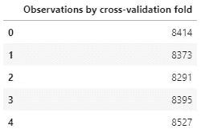
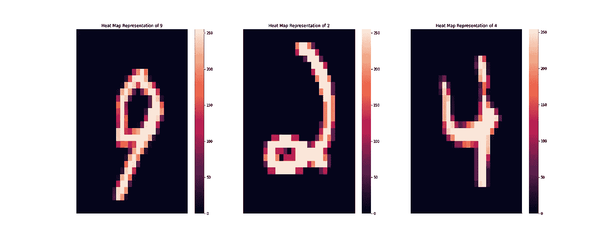
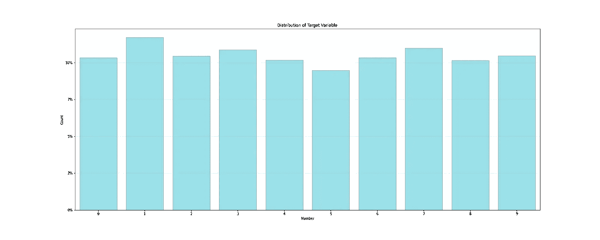
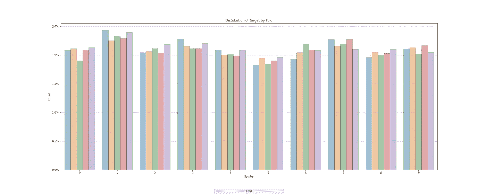
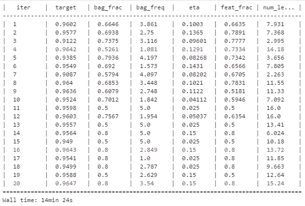

# 看数字:LightGBM 模型的贝叶斯优化

> 原文：<https://towardsdatascience.com/seeing-numbers-bayesian-optimisation-of-a-lightgbm-model-3642228127b3?source=collection_archive---------9----------------------->

## [实践教程](https://towardsdatascience.com/tagged/hands-on-tutorials)

## 使用贝叶斯优化调整`LightGBM`模型的超参数，并与简单特征工程实践的改进进行比较。

由[大卫·特拉维斯](https://unsplash.com/@dtravisphd?utm_source=medium&utm_medium=referral)在 [Unsplash](https://unsplash.com?utm_source=medium&utm_medium=referral) 上拍摄的照片

## **背景**

在“小心搜索”的经典案例中，阅读了几篇关于模型超参数优化的在线文章后，我的新闻订阅受到了操作指南的狂轰滥炸，这些指南保证通过几个简单的步骤“获得可能的最强大的模型”

我当然是在夸大其词。

然而，我确实注意到，很少有文章真正提到超参数调整只是过程的一部分，而不是预测能力的银弹解决方案。更少的文章提到从超参数优化中获得的预测能力是适度的，并且可能比从体面的特征工程中获得的少。

# 被砍伐的树木

`LightGBM`是一个使用基于树的学习算法的梯度推进框架。这是集合技术的一个例子，它将弱的单个模型结合起来形成一个单一的精确模型。

有各种形式的梯度增强的基于树的模型— `LightGBM`和`XGBoost`只是流行的例程的两个例子。

`LightGBM`在速度和内存需求方面具有优势，是我首选的梯度推进模型框架。

# 参数和超参数

当我们谈论调整机器学习模型时，需要做出一个微妙但重要的区别——一个*参数*和一个*超参数之间的区别。*

*   **参数**是指模型本身计算出的值。
*   **超参数**是由用户作为输入提供给模型的值。

例如，如果我们使用 LASSO 回归框架，用户将提供正则化惩罚𝜆(超参数),模型将计算回归系数𝛽(参数)等。

`LightGBM`通过各种超级参数提供大量定制功能。虽然一些超参数有一个建议的“缺省”值，通常可以提供良好的结果，但为手头的任务选择定制的参数可以提高预测精度。

没有硬性的规则来决定每个任务的最佳模型参数。在大多数情况下，建模者通过使用专家判断和经验或者通过使用某种形式的搜索技术来设置参数。

有许多搜索技术旨在将“最佳”超参数集识别为提供最具预测性模型(由用户或用例定义)的集，理想情况下结合交叉验证以提高严格性。

**网格搜索**技术是基本的强力搜索，其中设置每个超参数的可能值，搜索算法全面评估超参数的每个组合。这在时间和计算能力方面都是一种密集的方法，因为搜索空间很快变得很大。

作为基本网格搜索的扩展，**随机网格搜索技术**已经被证明可以提供可靠的结果。该设置类似于基本搜索，因为建模器为每个参数设置搜索空间，然而在每个评估步骤，对于每个参数，算法从搜索空间的边界内(随机地)抽取一个值。

使用**“智能”搜索技术，**建模者为每个超参数设置一个搜索空间。该算法评估从搜索空间提取的一组参数的性能，并使用结果以迭代的方式通知参数的选择。这样，算法以更有效的方式“锁定”最优解。贝叶斯优化——如下所示——是智能搜索技术的一个例子。

# 超参数调谐 v 特征工程

早些时候，我提出了一个未经证实的主张，即超参数调整带来的预测能力的提高可能会被适当的特性工程带来的提高所超越。

不管许多人怎么想(和写)，参数优化在生成高度精确的模型中起着相对较小的作用。参数调整带来的精度增益通常比预期的要小* —我认为 2% — 3%的增益是一个不小的成就，因此应该被视为最后的尝试。

为了获得更大的准确性，建模者应该真正检查他们的模型规格和特征工程过程；更丰富、信息量更大的数据通常会产生更强大的模型。

当我们将超参数调整和特征工程在模型准确性方面的改进与基线准确性度量进行比较时，我们将对这一假设进行测试。

**当然，这并不是在所有情况下都是正确的，例如，使用完全不合适的超参数的模型在选择“最佳”超参数后会有显著的改善。*

# **数据**

我们将使用 MNIST 数据的子集，这是一个大型手写数字数据库，经常用于计算机视觉基准测试。

*   42 000 个手写数字中的每一个都被捕捉到一个 28×28 像素的图像中。
*   每个图像被分解成具有 784 列的单行，每列代表图像的一个像素。像素值在[0，255]的范围内变化，并指示像素的强度(即像素被“照亮”的程度)。
*   除此之外，我们还有可用于预测的真实标签。

*完整的 MNIST 数据库可以在这里找到:* [MNIST 手写数字数据库，Yann LeCun，Corinna Cortes 和 Chris Burges](http://yann.lecun.com/exdb/mnist/)

# **流程**

让我们开始吧—我们将:

1.  导入和处理数据。
2.  为`LightGBM`模型构建一个交叉验证过程，并获得交叉验证模型准确性的基线估计。
3.  建立贝叶斯优化过程，设置参数搜索空间并运行优化器。
4.  设计一个简单的特征，并评估新特征对模型精度的影响。

# 数据导入和处理

## 数据导入

使用`pandas`导入数据后，我们可以非常容易地创建交叉验证折叠:

这导致了相当均匀分布的褶皱:

作者图片

让我们做一些可视化——首先检查一些我们试图通过从数据中重建图像来预测的例子:

作者图片

…然后检查目标值的总体分布(即数字):

作者图片

…最后检查目标在交叉验证折叠中的分布:

作者图片

上面的分布图和统计数据看起来很有希望:褶皱被均匀地创建，褶皱内目标值的分布看起来与整体目标分布一致。我找不到任何不平衡的问题——咻——所以我会继续努力。

## **数据处理:缩放和降维**

我们现在有一个长 42 000 行、宽 784 列的数据集。对这么大的数据集执行交叉验证和超参数优化对我可怜的小笔记本电脑来说是相当沉重的负担。

因此，我热衷于将数据集压缩成更易于管理的东西。我将首先缩放像素数据，然后执行主成分分析(PCA)来减少列数。

`sklearn`有一个很好的 PCA 算法实现，我用它将 784 个特征减少到 87 个，同时保留了数据中 90%的“变化”。

# `LightGBM`的交叉验证功能

开始交叉验证！

幸运的是，`LightGBM`自带交叉验证功能，有助于简化代码:

眼尖的读者会注意到，该函数只接受可用`LightGBM`超参数的子集。这是有目的的，因为这些是我们稍后要调优的超参数。

使用上面的“默认”参数集运行交叉验证，返回 95.8%的基线准确性——不算太差！

# 贝叶斯优化

我们提到贝叶斯优化是一种超参数调整的“智能”方法。

我们将使用 Python 实现`BayesianOptimization`，这是一个基于贝叶斯推理原则的约束全局优化包。

该软件包试图在尽可能少的迭代中找到“黑箱”函数的最大值，特别适合于需要大量计算和/或时间资源的优化问题。

贝叶斯分析方法非常简单:

1.  收集一个 ***先验*假设** —关于过程的初始假设，而不收集或分析任何真实世界的数据。在我们的例子中，我指定的超参数搜索空间是先验的假设。
2.  **通过调查被分析的过程来收集证据**，通常是通过取样或研究现实生活中的事件。“证据”来自使用从搜索空间提取的超参数值的交叉验证的模型准确性。
3.  使用收集的证据，**更新初始假设以形成*后验*信念**；从理论上讲，后验应该比前验更见多识广，更准确。我们的后验信念将是一个狭窄的超参数搜索空间。

在实践中，步骤 2 和 3 将重复多次——有时步骤 3 通知步骤 2——每次迭代创建“最佳”超参数集的更明智的视图。

例如，运行可能类似于 1 → 2 → 3 → 2 → 3→ 2 → 3 → *最终参数*。

`BayesianOptimization`对用户友好，对用户要求相对较少:

*   要最大化的功能的规格。在这种情况下，这是我们交叉验证的精度函数`cross_val`
*   超参数搜索空间的规范。
*   初始勘探和后续优化数量的说明(即重复上述步骤 2 和 3 的次数)。

作者图片

上表显示了优化过程的结果。前 10 次迭代用作初始证据收集，随后是 10 次更新和优化的迭代步骤。新的精度最大值以紫色突出显示。

我们可以看到，在步骤 4、16 和 20 中，准确性有所提高。

*   步骤 4 中的改进来自纯粹的随机选择——类似于我们从随机网格搜索中获得的成功。
*   步骤 16 和 20 中的改进来自收集证据和更新假设的贝叶斯过程。

优化耗时约 14.5 分钟，并将模型精度从 95.8%提高至 96.5%。

# 不如换成一个强大的新功能？

是时候验证我们的假设了，即特征工程比超参数优化更强大。

在这里，我们将创建一个相当简单的 K-均值聚类。因为这是一个相当著名的技术，我不会花太多时间在理论上，除了说:

*   该算法将每一行数据分配给一个集群。
*   聚类特征应该有助于模型区分数字，因此应该将相似的观察结果组合在一起。可能会有一些事情出错的情况(例如，将一些 7 分组为 1，反之亦然)。因此，我将指定创建 10 个集群——每个数字 0-9(含)对应一个集群。
*   我们将对折叠内建模和折叠外预测更加严格。

从这段代码中并不明显，但是执行集群大约需要 30 秒。

使用默认参数和通过聚类增强的数据进行交叉验证的准确率现在为 96.2%。

**所以看起来我错了——超参数调整的性能超过了功能工程！**

嗯，也许不完全是，一旦我们把时间和计算因素考虑进去…

*   超级参数调整使 14.5 分钟的计算时间增加了 0.7 个百分点。每分钟的准确率大约提高了 0.05 个百分点。
*   功能工程在 30 秒的计算时间内增加了 0.4 个百分点。每分钟的准确率大约提高了 0.8 个百分点。

# 最后的想法

…还有一些漫谈。

我们在这张纸条上做了很多！

首先，我们介绍了 MNIST 数据，并了解了**如何以表格形式**表示图像。这有更多的微妙之处，尤其是在处理彩色图像时，但这只是一个开始。

我们讨论了一些理论，包括**提升树、参数和超参数、超参数优化和特征工程、**和**贝叶斯推理方法以及如何将其应用于超参数优化。**

我们**以整洁且可再现的方式手工创建了交叉验证折叠**。我们本可以通过其他方式获得类似的结果，但是这种方法很容易定制，并且可以扩展以确保某些观察总是以相同的方式结束。有用！

一些简洁的**可视化**向我们展示了我们试图建模的内容，并允许我们**检查数据不平衡**和**交叉验证折叠创建的适当性**。

我们简单地提到了**缩放、**和**主成分分析**让我们大幅减少了建模集的规模。我做 PCA 的方式有几个问题:

1.  我将数据缩放到范围[0，1]内；在运行 PCA 之前，确实应该对其进行归一化(即零均值和单位标准偏差)。
2.  为了提高交叉验证的严格性，PCA 组件应该仅在折叠数据上训练。我已经使用了完整的数据集，但是应该将转换构建到一个可以在交叉验证过程中使用的管道中。
3.  根据所用的模型和超参数，PCA 后可能需要一些额外的缩放。例如，神经网络倾向于对位于特定范围(通常为[0，1])的数据执行更好的操作。如果我们要使用一个带有规范化惩罚的`LightGBM`模型，我们将需要再次规范化数据。

**交叉验证**和**贝叶斯优化**功能已经建立——而且非常简单，就像 **K 均值聚类**一样。

我们看到了在这种情况下，尽管两种方法都提高了模型精度，但**超参数调整在绝对意义上胜过特征工程。**然而，一旦将计算时间考虑在内，我们就会发现**功能工程** **带来了更大的效益。**

我认为还可以做进一步的改进来提高模型的准确性:

*   **图像旋转**可以提高模型的概括能力。作为特征工程的一种形式，这将涉及通过稍微旋转像素数据来从现有集合创建“新”观察。该模型将在原始数据和旋转数据的混合上进行训练，并有望对凌乱的作者更加鲁棒。
*   图像的像素之间可能存在非线性关系——想想“关”和“开”的相邻像素之间的阶跃(或非常快速的)变化。**非线性降维技术——t-SNE 或类似技术——在这里可能很有用。**
*   一个**不同的模型规格可以提高性能:**已经注意到神经网络在计算机视觉任务上工作得很好。