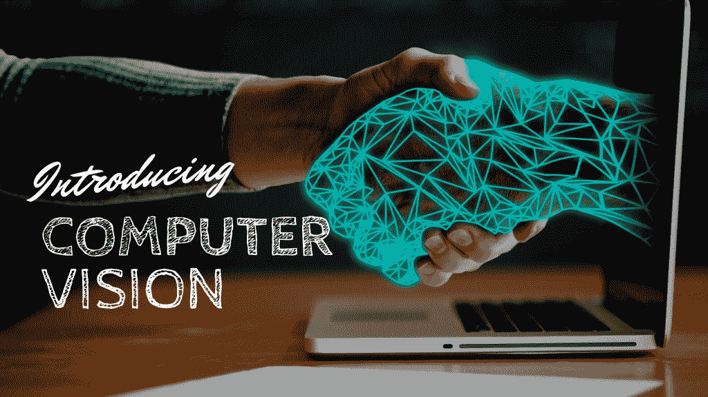
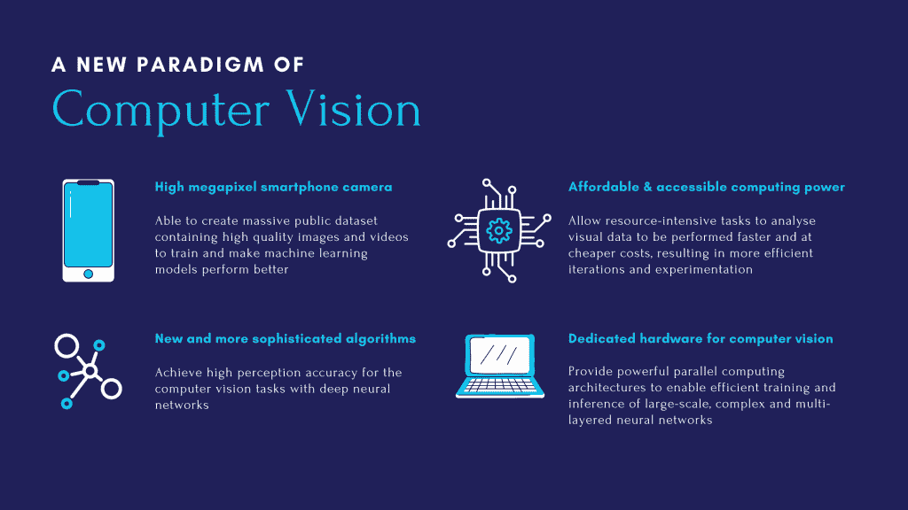
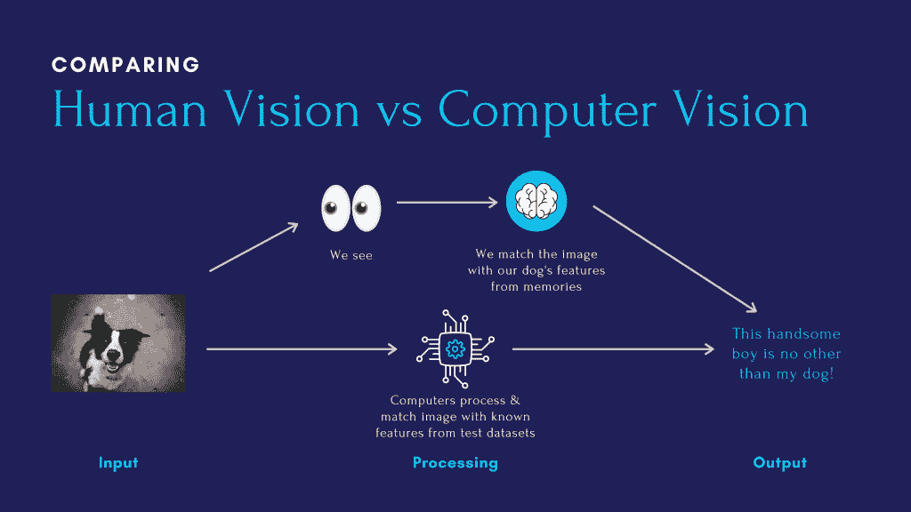
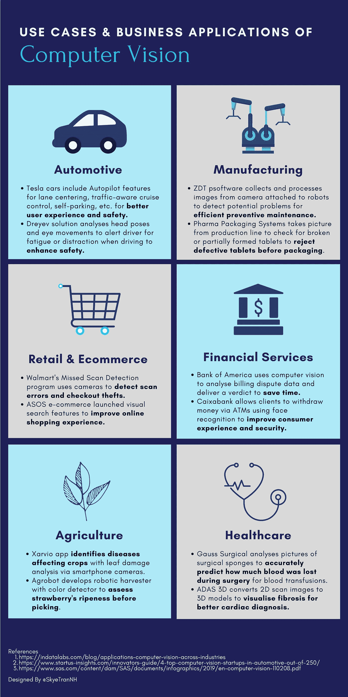
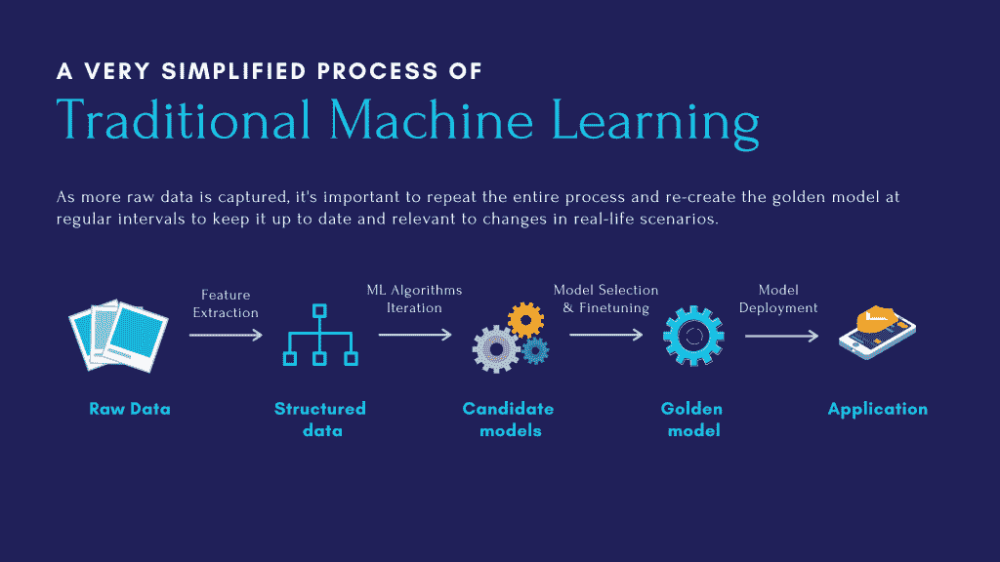

# 通过计算机的眼睛看世界(以及为什么这对你很重要)

> 原文：<https://towardsdatascience.com/seeing-the-world-through-computers-eyes-and-why-it-matters-to-you-40152124d20?source=collection_archive---------43----------------------->

## 计算机视觉具有改善消费者体验、降低成本和增强安全性的潜力。理解计算机视觉的基础是开启关键竞争优势的第一步。你准备好了吗？

作者图片

计算机视觉是人工智能世界最非凡的礼物之一。借助计算机视觉，许多公司试图通过计算机的眼睛来看世界，并在解决复杂的业务问题方面取得了长足的进步，例如实时识别产品缺陷、验证客户身份或自动化保险索赔流程。忽视计算机视觉的这种现实应用可能意味着错过了为企业实现增长、生产力和成本节约的机会。那么什么是计算机视觉，它能有什么帮助呢？

**你将了解:**

*   什么是计算机视觉？
*   计算机视觉在当今世界是如何应用的？
*   我们如何用机器学习实现计算机视觉？

# 什么是计算机视觉？

## 短暂的时间旅行

早在计算机发明之前，科学家们就试图找到方法来理解我们的眼睛和大脑如何共同工作来识别我们看到的东西并做出反应。信不信由你，我们今天所知道的关于视觉的许多东西可以追溯到 20 世纪 50 年代以来大卫·胡贝尔和托尔斯滕·威塞尔对猫进行的神经生理学研究。

在 20 世纪 60 年代，人工智能成为一门学科。正是在这一时期，计算机视觉首次作为[麻省理工学院夏季项目](http://dspace.mit.edu/handle/1721.1/6125)引入，这被视为创造计算机可以执行人类认知功能(如视觉、学习、推理和解决问题)的垫脚石。虽然夏季项目没有成功，**但它标志着计算机视觉作为一个科学领域的正式诞生，该领域旨在使计算机能够自动看到、识别和理解视觉世界，模拟人类视觉的方式。**

是的，这是我们的目标，但在当时，我们的技术还没有准备好。幸运的是，我们不用等太久。在 2000 年，4 个重要因素汇聚在一起，使计算机视觉的全新范式成为现实。

作者图片

今天，我们已经走过了漫长的道路，因为**计算机视觉是人工智能和机器学习的最热门领域之一，具有广泛的商业应用和巨大的潜力。但是在深入现实生活的用例之前，让我们尝试定义计算机视觉，并了解它可以解决什么问题。所以我们开始吧，各位。**

## 人类视觉对计算机视觉

> *计算机视觉是计算机对图像和视频进行自动分析，以获得对世界的一些理解。*
> 
> *——摘自肯尼斯·道森-豪的《OpenCV 计算机视觉实用介绍》*

作者图片

从这张图可以看出，我们试图实现的是确定图像中的狗是否是我们的四条腿的伙伴。在人类的视觉系统中，我们用眼睛看，然后让我们的大脑理解图像，并通过非常复杂的推理过程识别他是否是我们的狗。同样，计算机视觉旨在模仿理解图像的相同过程，将图像与我们狗的已知特征进行匹配，并识别它是否是我们的狗。所以简单地说，**人类视觉和计算机视觉只是两种不同的手段，目的都是为了解读视觉信息。**

## 了解正在解决什么问题

但是，如果我们人类的眼睛和大脑已经拥有如此强大的能力，我们为什么还需要另一种手段呢？

这是因为计算机非常擅长以极快的速度完成一项任务，而不会像人类一样分心。在过去的几十年里，卷积神经网络已经证明了比人类更好或相当的物体识别准确性。例如，2015 年，PReLU-Net 深度网络成为第一个在 ImageNet 2012 数据集上超过人类准确性的计算机模型。

印象深刻！但是它到底为企业解决了什么问题呢？让我解释一下。

*   计算机视觉可以帮助**自动化与分析和解释图像或视频相关的小型重复性视觉任务**，从而**节省成本并腾出时间进行更具战略性的活动。**
*   计算机视觉可以帮助**进行更加一致和准确的视觉评估**，从而**在几秒钟内实现基于数据的决策，以获得更好的消费者体验、安全性或质量改进**。

# 计算机视觉在当今世界是如何应用的？

过去十年中，计算机视觉的出现给各个行业带来了巨大的变化。这里有 7 个与计算机视觉相关的常见任务，我们甚至可能在日常生活中遇到过。

*   ***物体检测:*** 定位图像或视频中特定物体的存在
*   ***图像分类:*** 根据特定的规则对图像进行分类和标注
*   ***图像分割:*** 将单幅图像分割成多个片段，分别处理相关片段
*   ***特征匹配:*** 匹配两幅相似图像或视频的对应特征
*   ***边缘检测:*** 通过识别图像中图像亮度急剧变化的点，找到图像中物体的边界
*   ***模式检测:*** 自动识别图像或视频中的模式和规律
*   ***面部识别:*** 利用一个人的面部特征来识别或验证其身份

值得注意的是，当问题很简单时，计算机视觉的某些用例可能只是为了完成其中一项任务。然而，在现实世界中，事情可能会变得相当复杂，有无数的挑战和环境变化。

例如，机器人收割机可能需要使用物体检测来准确定位每个草莓在其茎和叶中的位置，然后使用图像分类将每个草莓分为成熟和未成熟的类别，以确保它只挑选那些成熟的草莓。因此，**复杂的商业应用必须能够同时执行各种计算机视觉任务，以解释图像或视频。**在下面的图片中，让我们来看看那些正在这里发生的相当复杂的业务应用程序！

作者图片

# 我们如何用机器学习实现计算机视觉？

我们已经谈了很多关于计算机视觉的可能性。机器学习(以神经网络的形式)可以以惊人的准确性创建计算机视觉应用程序，这也不是什么秘密。但这里有一个百万美元的问题需要回答:我们如何通过机器学习来实现这些令人惊叹的计算机视觉能力？

好吧，不可否认，这可能需要一整本书来涵盖这个话题。但是，本着给所有非技术读者一个全面概述的精神，这里有两种主要的方法来用通俗的语言建立一个具有机器学习的计算机视觉模型，以帮助您入门。

## 第一种方法:传统机器学习(ML)

在深度学习成为机器学习领域的一个事物之前很久，许多计算机视觉模型完全建立在传统的 ML 算法上，如决策树、支持向量机或逻辑回归。

简单来说，这些 ML 算法只是可修改的数学函数。基于已知的输入和输出对，计算机学会调整和定制数学函数，以更好地将某些输入与某些输出关联起来。随着时间的推移，如果输入和输出涵盖了现实生活中的足够复杂的各种异常和不寻常的情况，数学函数将被微调以尽可能接近地代表现实，从而实现对物体、植物、动物或人的更准确的检测或分类。多酷啊。

作者图片

上图说明了传统机器学习的一个简化过程。当我们审视这一过程时，记住以下两点至关重要。

首先，即使在部署之后，为业务应用程序构建机器学习模型也是一个迭代过程。**黄金模型应该不断监控、更新，甚至从头开始重新创建，以适应业务变化。**

其次，**传统的机器学习需要一些严肃的人为干预才能成功。**例如，由于我们无法将传统的 ML 算法直接应用于我们的原始数据(例如图像或视频)来执行计算机视觉任务，数据科学家必须执行**一个称为特征提取的额外数据预处理步骤，以将原始数据转化为结构化和成形的数据，转化为相关的特征，这些特征是机器学习算法的基本输入**。不要低估从原始数据中正确提取特征的代价，因为这项耗时的任务通常需要多次迭代，并且需要适当的领域知识。

## 第二种方法:深度学习

当想到深度学习时，我们许多人都会想到一些深刻的黑暗之谜。但这一点也不神秘。首先，理解深度学习是机器学习的一个子集是有帮助的。**在其核心，上述传统的机器学习和计算机视觉的深度学习有着相同的目标:通过检查大量的例子(也就是巨大的训练数据集)，试图找到一个尽可能接近地表达现实(及其所有复杂性和例外)的数学函数。**

那么，我们为什么要考虑深度学习而不是传统的机器学习呢？这里可以说最大的优势是**深度学习不需要人类执行任何特征提取任务**(还记得我们上面说过它很耗时并且需要非常具体的领域知识吗？).

但是等一下！在我们匆忙得出深度学习是解决所有问题的灵丹妙药的结论之前，这里有两个最重要的方面需要注意。

1.  如果你没有足够的数据来训练它，你就不能使用深度学习。我所说的充分，不仅指数量，还指质量(即相关、完整和没有偏见)。
2.  如果你还没有拥有或者不愿意为强大的计算能力付费来处理大量数据和进行复杂的数学计算，深度学习就不会起作用。

与传统的机器学习相比，深度学习需要更多的训练数据和计算能力才能发挥作用。这不是唯一的方法，也不总是最好的方法。该技术本身功能强大，但不如其他传统方法成熟。因此，对计算机视觉进行深度学习的决定绝不能掉以轻心。

# 我们将何去何从？

像生活中的许多其他事情一样，我们认为人类的视觉是理所当然的，直到我们试图用计算机来模仿它。到今天为止，我们还远远没有理解，更不用说模拟我们的眼睛和大脑一起工作的方式来理解我们周围的美丽世界了。**但这并不意味着计算机视觉仍然是一个与商业毫无关联的新想法。**我们已经在手机上、街道上、办公室里，甚至在那些生产我们每天购买的不同产品的工厂里看到了它。

这些与上述用例相关的大牌也不意味着你必须成为特斯拉或沃尔玛才能了解计算机视觉如何帮助我们更有效地工作。市场上有各种基于云的预训练机器学习模型，如谷歌的云视觉、亚马逊 Rekognition、Azure 计算机视觉和其他解决方案，探索和实验计算机视觉的选项真的是无穷无尽的。因此，**如果你的团队目前正在定期处理大量的图像或视频，那么重新想象计算机视觉如何帮助轻松完成工作永远不会太迟。**探索之旅是有代价的，但拒绝尝试、失败、学习和成长也是如此。

感谢您的阅读。如果你觉得这篇文章有用，可以看看我的博客，或者关注我的 LinkedIn 和 Twitter。祝大家一周愉快！

# 参考

1.  [计算机视觉简史](https://hackernoon.com/a-brief-history-of-computer-vision-and-convolutional-neural-networks-8fe8aacc79f3)
2.  [什么是计算机视觉&它是如何工作的？简介](https://xd.adobe.com/ideas/principles/emerging-technology/what-is-computer-vision-how-does-it-work/#:~:text=Computer%20vision%20algorithms%20that%20we,find%20patterns%20in%20those%20objects.&text=In%20short%2C%20machines%20interpret%20images,own%20set%20of%20color%20values.)
3.  [虚拟人的深度学习](https://learning.oreilly.com/library/view/deep-learning-for/9781119543046/c01.xhtml)
4.  [OpenCV 计算机视觉实用介绍](https://learning.oreilly.com/library/view/a-practical-introduction/9781118848739/c01.xhtml)

*原载于 2021 年 2 月 15 日 http://thedigitalskye.com***。**