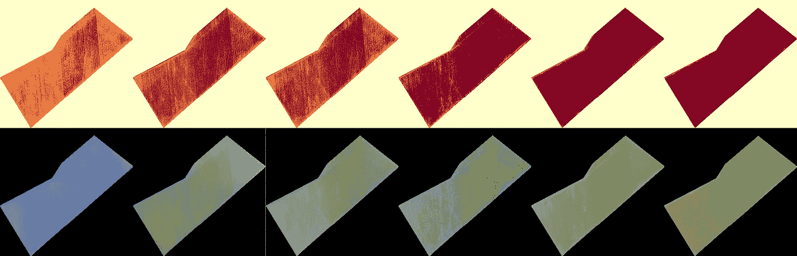
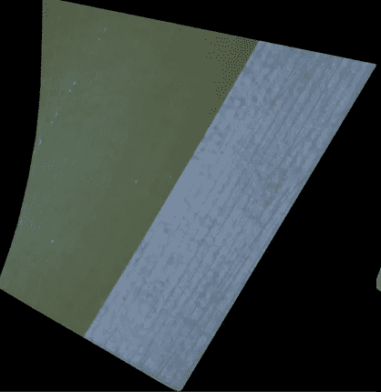
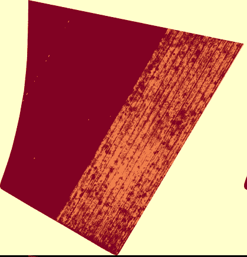
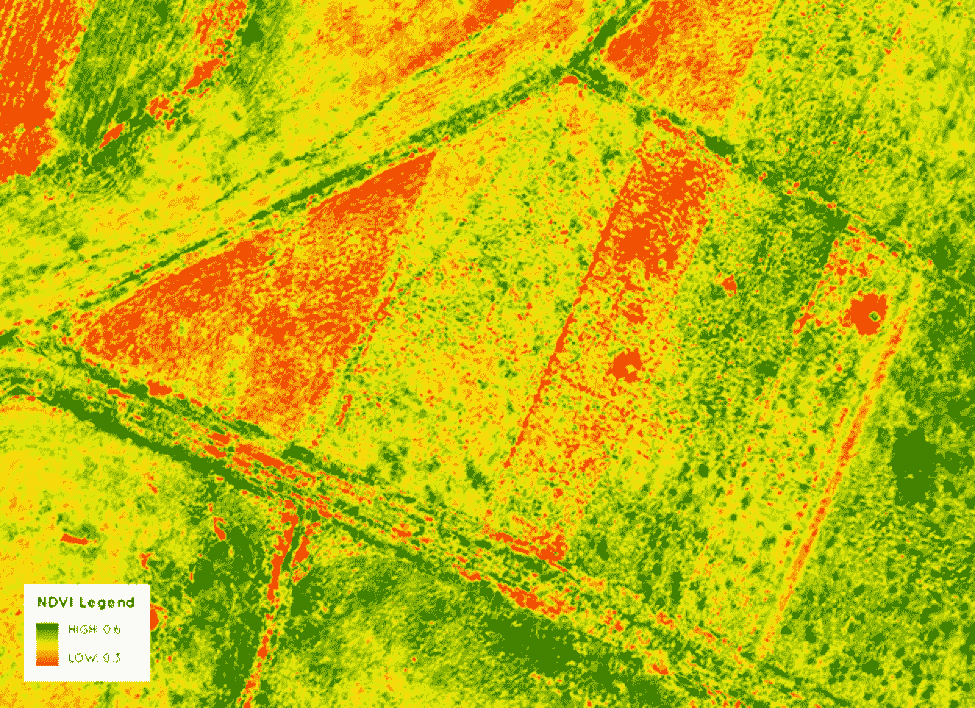
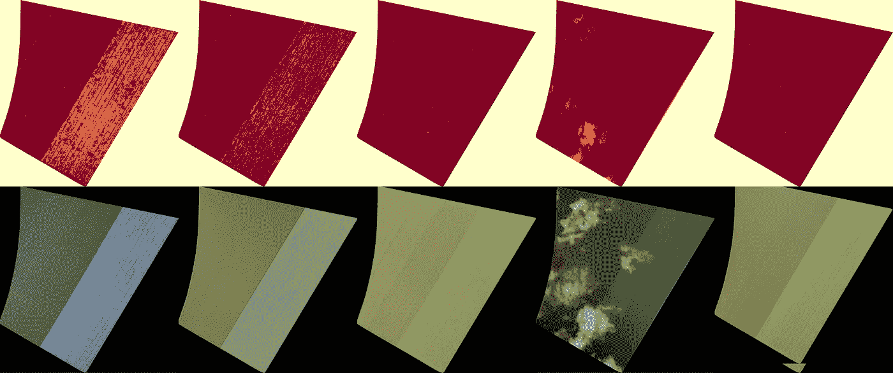

# 使用 NDVI 和 Rasterio 分割卫星影像

> 原文：<https://towardsdatascience.com/segment-satellite-imagery-using-ndvi-and-rasterio-6dcae02a044b?source=collection_archive---------32----------------------->

## 使用 NDVI 和拉斯特里奥轻松分割植被和土壤



作者图片

在本帖中，我们将尝试在卫星图像中分割植被和土壤。

我们将借用[这篇论文](https://journals.plos.org/plosone/article?id=10.1371/journal.pone.0196605)中的观点。我还会利用我在[之前的](/segment-satellite-images-using-rasterio-and-scikit-learn-fc048f465874)博客中关于这个话题的想法。

理想情况下，我们希望从常规的卫星图像中:



作者图片

对此:



作者图片

橘子是土壤。红色的是植物。

# NDVI

正如论文中提到的，我们需要提取归一化植被指数。这是一个有用的植被指数。这里有一个 NDVI 图像的例子:



作者图片

这是公式

下面是我获取 NDVI 图像作为 numpy 数组的代码。

```
def get_ndvi(red_file):

    nir_file = os.path.dirname(red_file) + '/nir.tif'
    band_red = rasterio.open(red_file)
    band_nir = rasterio.open(nir_sfile)
    red = band_red.read(1).astype('float64')
    nir = band_nir.read(1).astype('float64')

    # ndvi calculation, empty cells or nodata cells are reported as 0
    ndvi=np.where( (nir==0.) | (red ==0.), -255 , np.where((nir+red)==0., 0, (nir-red)/(nir+red)))

    return ndvi
```

为感兴趣的特定区域计算 NDVI。这在论文中有定义:

> 对于每个地块，通过选择中间两行人工建立感兴趣区域(ROI ),并提取对应于每个地块的植被指数的平均值。

这在 python 中实现起来非常简单。

```
# get average ndvi of center two rows
  def get_region_of_interest(ndvi, multiplier = 1/2):

    # undo the background adjustment
    region = ndvi.copy()
    region = np.where(region==-255, 0, region)

    # mean of center rows
    center_row1 = np.mean(region[int((multiplier)*len(region))])
    center_row2 = np.mean(region[int((multiplier)*len(region))+1])

    # mean of both rows
    mean = (center_row1.copy()+center_row2.copy())/2

    return mean
```

# 植被覆盖率

该文件还提到了植被覆盖率。我会通过设置一个阈值来计算这个。任何高于该阈值的 NDVI 值都将是植被。下面的任何东西都将是土壤。

```
THRESHOLD = 0.3

def get_fc(ndvi):

    ndvi_copy = ndvi.copy()

    vegetation = np.where(ndvi_copy > THRESHOLD, 1, 0)
    vegetation_count = np.count_nonzero(vegetation)

    total = ndvi_copy.shape[0]*ndvi_copy.shape[1]
    fractional_cover = vegetation_count/total

    return fractional_cover
```

我们稍后需要更改该阈值。

# 图 1 植被覆盖率与 NDVI

现在我们可以重现报纸第 7 页上的情节。我们将为每张图片绘制部分植被覆盖对 NDVI。

我们还要画最小二乘回归线。

这里有一段代码允许我们这样做。

```
def plot_fc_vs_ndvi(fc, ndvi):

    y = np.array(fc).reshape(1, -1)
    x = np.array(ndvi).reshape(1,-1)

    slope, intercept, r_value, p_value, std_err = stats.linregress(x,y)

    x = np.linspace(min(ndvi),max(ndvi),100)
    f, ax = plt.subplots(1,1,figsize=(10,10))
    ax.plot(x, slope*x+intercept, '-r', label='fc='+str(round(slope, 2))+'*ndvi+'+str(round(intercept, 2)), color='black')
    ax.set_title('Fractional Cover vs NDVI at threshold of '+ str(THRESHOLD))

    scatter = ax.scatter(x=ndvi, y=fc, edgecolors='black')

    ax.set_xlabel('Normalized difference vegetation index (NDVI)')
    ax.set_ylabel('Fractional Cover (fc)')

    ax.text(min(ndvi)+0.8*(max(ndvi)-min(ndvi)), min(fc)+0.2*(max(fc)-min(fc)),s='R^2 = {}'.format(round((r_value**2), 4)), fontdict={'fontsize':14, 'fontweight':'bold'})
    f.savefig('fc_vs_ndvi_plots/fc_vs_ndvi_'+str(self.plot_counter)+'.jpg')
    f.show()
```

详见[完整代码](https://github.com/spiyer99/spiyer99.github.io/blob/master/nbs/blog_post_segment_satellite_ndvi.ipynb)。

我们可以更改之前设置的`threshold`值，看看它如何影响回归。文中指出，应选择具有最佳回归模型的`threshold`值。

我们将对所有图像运行此代码，并绘制结果。

由此我们可以看出，最高的 R 与阈值 0.45 相关联。

我们可以将这个阈值应用于所有图像。任何大于 0.45 的 NDVI 值都是植被。低于 0.45 的都是土。

# 创建二进制数组

使用阈值 0.45，我们可以创建一个二进制数组。在数组中，1 表示植被。0 表示土壤。

这段代码正是这样做的。阈值在`__init__`功能中定义。详见[全码](https://github.com/spiyer99/spiyer99.github.io/blob/master/nbs/blog_post_segment_satellite_ndvi.ipynb)。

```
def create_mask(self, red_file):

    nir_file = os.path.dirname(red_file) + '/nir.tif'
    band_red = rasterio.open(red_file)
    band_nir = rasterio.open(nir_file)
    red = band_red.read(1).astype('float64')
    nir = band_nir.read(1).astype('float64')

    # get raw ndvi and save as jpg
    self.raw_ndvi = np.where((nir+red)==0., np.nan, (nir-red)/(nir+red))

    # create canopy cover mask
    self.canopy_cover = np.where(np.isnan(self.raw_ndvi), np.nan, np.where(self.raw_ndvi<self.ndvi_threshold, 0, 1))
    self.canopy_cover = np.ma.masked_where(np.isnan(self.canopy_cover), self.canopy_cover)

    # show ndvi mask and save it as jpg
    print('canopy cover')
    print(np.unique(self.canopy_cover))

    return self.canopy_cover
```

以下是更清晰的输出形式。第一行是有阈值的天篷罩。第二行是 RGB 卫星图像。


作者图片



作者图片

我们可以看到它在分离植被和土壤方面做得相当不错。这比我之前用 K-Means 聚类的[尝试](/segment-satellite-images-using-rasterio-and-scikit-learn-fc048f465874)要好得多。

# 结论

在这篇博文中，我描述了一种使用 NDVI 和拉斯特里奥分割卫星图像的方法。

我为悉尼的一家小型创业公司做这项工作。没有他们的帮助，我不可能做到这一点。我从他们身上学到了很多。

完整代码在 [Github](https://github.com/spiyer99/spiyer99.github.io/blob/master/nbs/blog_post_segment_satellite_ndvi.ipynb) 上。

我希望这能帮助那里的人们。如果我犯了错误，请在推特上联系我。谢谢！

*原载于 2021 年 1 月 31 日*[*https://spiyer 99 . github . io*](https://spiyer99.github.io/Segment-Satellite-Imagery/)*。*