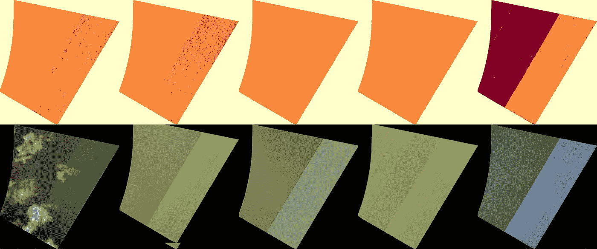
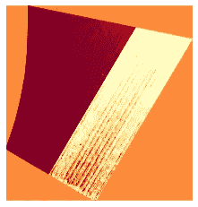
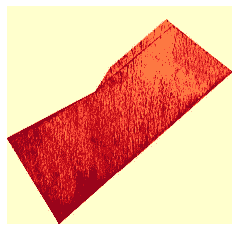
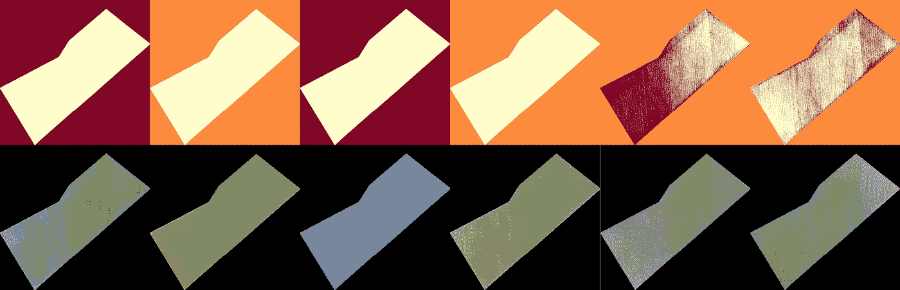

# 使用 Rasterio 和 Scikit-Learn 分割卫星图像

> 原文：<https://towardsdatascience.com/segment-satellite-images-using-rasterio-and-scikit-learn-fc048f465874?source=collection_archive---------37----------------------->

## [实践教程](https://towardsdatascience.com/tagged/hands-on-tutorials)

## 使用 KMeans 聚类按土地覆盖/土地利用对卫星图像进行分割



作者图片

最近，我将 KMeans 聚类应用于卫星图像，结果给我留下了深刻的印象。我把学到的招数告诉你，你就不浪费时间了。

需要注意的事项:

*   使用[光栅](https://rasterio.readthedocs.io/en/latest/)而不是 [gdal](https://gdal.org/) 。拉斯特里奥更[蟒](https://blog.mapbox.com/rasterio-gdal-especially-for-python-programmers-553dabf7dd71)。
*   对于这个例子，我将使用[地形图像](http://www.terravion.com/)。这提供了高分辨率的低空卫星图像。Terravion 图像来自 8 个不同的[波段](https://gsp.humboldt.edu/OLM/Courses/GSP_216_Online/lesson3-1/bands.html)。
*   我要三簇。这些将包括:树冠覆盖(树木，植被等。)，土壤和背景。

# k 含义解释

我制作了一个信息图表，用简单的英语解释知识。在 [reddit](https://www.reddit.com/r/learnmachinelearning/comments/kipra3/i_made_an_infographic_to_summarise_kmeans/) 或 [twitter](https://twitter.com/neeliyer11/status/1341663856783810560) 上查看。

# 堆叠带

每个 Terravion 图像都有以下波段(您的波段可能会有所不同):

*   `red2.tif`
*   `alpha.tif`
*   `tirs.tif`
*   `blue.tif`
*   `nir.tif`
*   `red.tif`
*   `green.tif`
*   `green2.tif`

在做任何事情之前，你需要堆叠所有的带子。下面是一些堆叠波段的代码。取自[这个帖子](https://gis.stackexchange.com/questions/223910/using-rasterio-or-gdal-to-stack-multiple-bands-without-using-subprocess-commands)。

```
def stack_bands(files):
  img_fp = 'sentinel_bands.tif'
  # Read metadata of first file and assume all other bands are the same
  with rasterio.open(files[0]) as src0:
      meta = src0.meta

  # Update metadata to reflect the number of layers
  meta.update(count = len(files))

  # Read each layer and write it to stack
  with rasterio.open(img_fp, 'w', **meta) as dst:
      for id, layer in enumerate(files, start=1):
          with rasterio.open(layer) as srclassifer:
              dst.write_band(id, srclassifer.read(1))

  return img_fp
```

# 安装 KMeans

现在我们需要使 KMeans 分类器适合数据。我发现最有效的方法是在一些图像上安装 KMeans 分类器。理想的图像，树冠覆盖和土壤之间有明显的差异。

`train`函数将接受一个 md5 代码(例如`9bbd67cfb0d660551d74decf916b2df2`)和一个日期字符串(例如`20190223T130237`)。它将在数据集中找到匹配的图像，并在该图像上匹配 KMeans 分类器。

一些重要的事情:

*   我没有使用`alpha`和`blue`频道。他们被证明是无用的。
*   我用的是`red2`和`green2`。`red`和`green`并没有被证明很有用。

这个训练代码改编自这个 [github repo](https://github.com/wathela/Sentinel2-clustering/blob/master/Sentinel2_Image_clustering.ipynb) 。

```
from sklearn.cluster import KMeans
from rasterio.plot import reshape_as_image
import matplotlib.cm as cm
from sklearn import cluster

def get_date_from_text(text):
  text = text.split('/')[-2].split('_')[4]
  datetime_date = datetime.strptime(text, '%Y%m%dT%H%M%S').date()
  return datetime_date

# no alpha and blue imgs
def get_files_from_code(code, date):
  files = glob.glob('/content/canopy_cover_cotton_*'+code+'_'+date+'*TERRAV_PLN/*.tif')
  files = sorted(files, key = lambda x: get_date_from_text(x))
  files = [i for i in files if os.path.basename(i).split('.')[0] in ('red2', 'green2', 'nir', 'tirs')]
  return files

def train(k = 3, classifer = None, date = '20190223T130237', code = '9bbd67cfb0d660551d74decf916b2df2'):

  files = get_files_from_code(code, date)

  img_fp = stack_bands(files)
  img_raster = rasterio.open(img_fp)

  # Read, enhance and show the image
  img_arr = img_raster.read()
  vmin, vmax = np.nanpercentile(img_arr, (5,95))  # 5-95% contrast stretch

  # create an empty array with same dimension and data type
  imgxyb = np.empty((img_raster.height, img_raster.width, img_raster.count), img_raster.meta['dtype'])

  # loop through the raster's bands to fill the empty array
  for band in range(imgxyb.shape[2]):
      imgxyb[:,:,band] = img_raster.read(band+1)

  # convet to 1d array. 4 cause we have 4 bands here.
  img1d = imgxyb[:,:,:4].reshape((imgxyb.shape[0]*imgxyb.shape[1],imgxyb.shape[2]))
  # print(img1d.shape)

  # create an object of the classifier and train it
  if(classifer == None):
    classifer = cluster.KMeans(n_clusters=k)
  # param = cl.fit(img1d[~mask])
  param = classifer.fit(img1d)

  # get the labels of the classes and reshape it x-y-bands shape order (one band only)
  img_cl = classifer.labels_
  img_cl = img_cl.reshape(imgxyb[:,:,0].shape)

  # Show the resulting array and save it as jpg image
  plt.figure()
  plt.imshow(img_cl, cmap=cm.YlOrRd)
  plt.axis('off')
  plt.savefig("kmeans_train_image.jpg", bbox_inches='tight')
  plt.show()

  return classifer# train model
train_dates = ['20190502T113544', '20190502T113205']
train_codes = ['ea36717ca661ca3cca59d5ea43a81afc', '9bbd67cfb0d660551d74decf916b2df2']
model = None

for i in range(min(len(train_codes), len(train_dates))):
  model = train(classifer = model, date = train_dates[i], code = train_codes[i])
```

这是训练输出。



作者图片



作者图片

看起来相当不错！

# 预言；预测；预告

现在我们可以在我们的模型上运行预测，看看效果如何。

该功能将接收堆叠的波段和保存的模型。然后，它将在新的映像上运行 KMeans 模型。预测输出将保存为 jpg 文件。

此保存的 jpg 仅用于可视化目的。不要用它做进一步的计算。我不小心那样做了，弄得很困惑。

```
from tqdm.notebook import tqdm

def get_date_from_orig_image(text):
  text = os.path.basename(text).split('.')[0].split('_')[-1]
  datetime_date = datetime.strptime(text, '%Y%m%dT%H%M%S').date()
  return datetime_date

def get_orig_img_list(code, date):
  original_images = glob.glob('/content/drive/My Drive/flurosat/*'+code+'_'+date+'*.*g')
  original_images = sorted(original_images, key = lambda x: get_date_from_orig_image(x))
  return original_images[0]

# predict using new k means method
def predict(model, img_fp):

  elmanagel = rasterio.open(img_fp)

  # Read, enhance and show the image
  elman_arr = elmanagel.read()
  vmin, vmax = np.nanpercentile(elman_arr, (5,95))  # 5-95% contrast stretch

  # create an empty array with same dimensions and data type 
  elman_xyb = np.empty((elmanagel.height, elmanagel.width,elmanagel.count), elmanagel.meta['dtype'])

  # loop through the raster bands and fill the empty array in x-y-bands order
  for band in range(elman_xyb.shape[2]):
      elman_xyb[:,:,band] = elmanagel.read(band+1)

  # convert to 1d array
  elman_1d = elman_xyb[:,:,:elman_xyb.shape[2]].reshape(elman_xyb.shape[0]*elman_xyb.shape[1], elman_xyb.shape[2])

  # predict the clusters in the image 
  pred = model.predict(elman_1d)

  # reshape the 1d array predictions to x-y-bands shape order (only one band)
  elman_cul = pred
  elman_cul = elman_cul.reshape(elman_xyb[:,:,0].shape)

  return elman_cul

def predictions_driver(code, date, iterations):

  files = get_files_from_code(code, date)
  original_image = get_orig_img_list(code, date)

  # # rasterio stack all bands
  img_fp = stack_bands(files)

  # predict on trained model
  kmeans_predictions = predict(model, img_fp)

  # save kmeans
  plt.imsave('kmeans_output/'+str(code)+'_'+str(iterations)+'_k_means.jpg', kmeans_predictions, cmap=cm.YlOrRd)

  # save original image
  img = PIL.Image.open(original_image)
  img.save('kmeans_output/'+str(code)+'_'+str(iterations)+'_original_image.jpg')

  return

for i,combination in enumerate(tqdm(sorted_combinations)):
  date = combination.split('_')[-1]
  code = combination.split('_')[0]
  predictions_driver(code, date, i)
```

# 创建网格

现在，我们可以从之前获得的保存图像 jpg 中创建一个图像网格。

这就更容易看出 KMeans 是否真的正确。

```
codes = list(set([i.split('_')[0] for i in combinations]))

for code in codes:

  k_means = glob.glob('kmeans_output/*'+str(code)+'*k_means.*g')
  k_means = sorted(k_means, key = lambda x: int(os.path.basename(x).split('.')[0].split('_')[-3]))
  k_means = [PIL.Image.open(i) for i in k_means]

  original_imgs = glob.glob('kmeans_output/*'+str(code)+'*original_image.*g')
  original_imgs = sorted(original_imgs, key = lambda x: int(os.path.basename(x).split('.')[0].split('_')[-3]))
  original_imgs = [PIL.Image.open(i) for i in original_imgs]

  full_list = k_means + original_imgs
  imshow_func(createImageGrid(full_list, rows = 2, scale = 0.1))
```


作者图片



作者图片

KMeans 输出在第一行。RBG 的原始图像在第二行。我们可以看到它在分离植被和土壤方面做得很好。

需要更多的卫星图像来全面评估其性能。但这是一个良好的开端。

# 结论

我为悉尼的一家小公司做这项工作。我从这家初创公司的经验丰富的专业人士那里学到了很多东西。没有他们的帮助，我不可能创造出这个。

我希望这篇文章能帮助一些人。当我开始的时候它肯定会帮助我。完整代码可以在 [Github](https://github.com/spiyer99/spiyer99.github.io/blob/master/nbs/canopy_cover_blog_post.ipynb) 上找到

如果我犯了错误，请在推特上联系我

*原载于 2021 年 1 月 10 日*[*https://spiyer 99 . github . io*](https://spiyer99.github.io/Kmeans-Clustering-Satellite-Imagery/)*。*