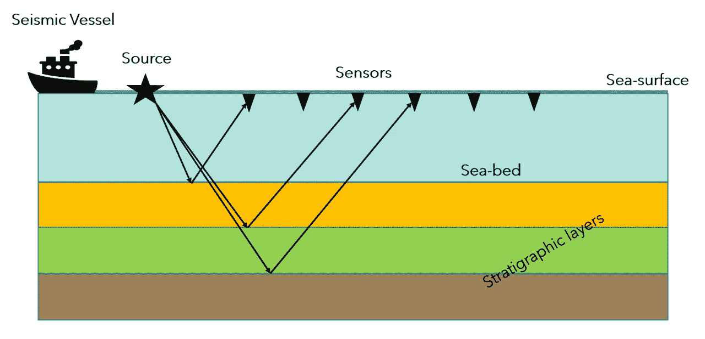
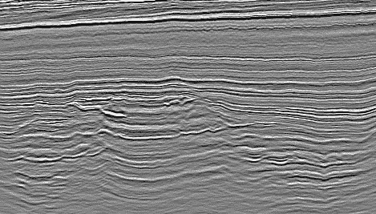
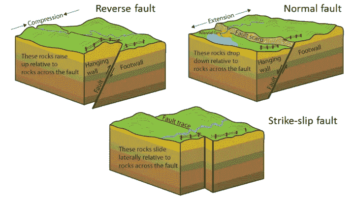
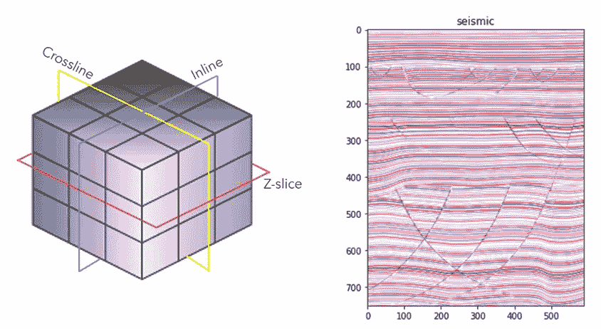
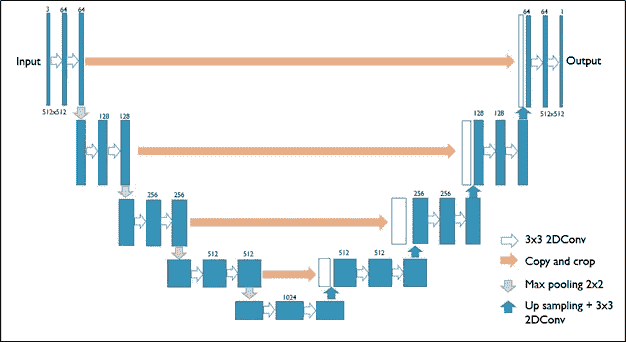
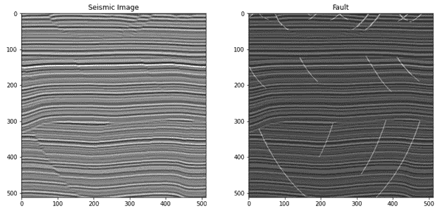
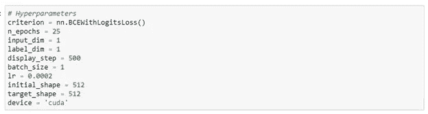
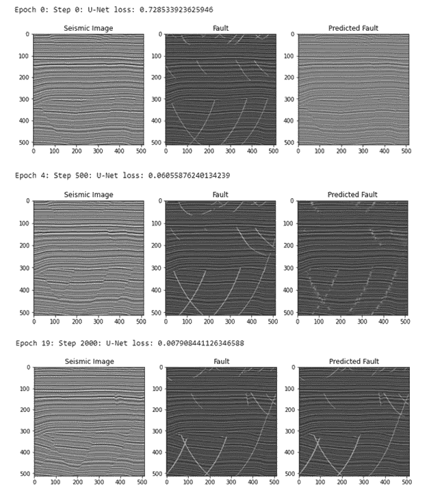
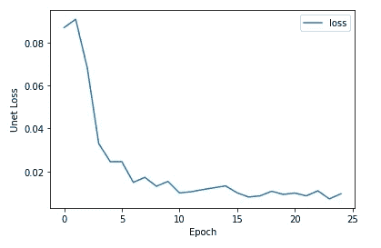

# 基于深度学习的地震断层预测

> 原文：<https://towardsdatascience.com/seismic-fault-prediction-with-deep-learning-2935704c9b48?source=collection_archive---------14----------------------->

## U-Net 的 PyTorch 实现:第一部分

图片由来自 unsplash 的 Jimmy Conover 提供

地震图像给出了一次地球表面下的结构快照。声波从“源”发送到地下，以不同的速度穿过地球的地层，并在途中被反射、折射或衍射。在地震成像中，我们记录从不同地质层反射回来的波，并将它们叠加以创建 2D 或 3D 图像。因为不同的地质层具有不同的物理性质，在层间的边界处，由于密度对比，波被反射。有不同种类的波，但在成像中我们主要集中在 P 波(压缩波)。下面的漫画给你一个地震采集的例子和采集完所有波后的实际图像。

来源:作者

地震图像示例(来源:力竞赛，见参考文献)

## *那么是谁的错呢？*

断层是由众多物理过程(如压力、重力、板块构造等)结合而成的地质结构。这些是岩石块滑过的裂缝或平面。断层有各种大小，从几米到几英里。*圣安地列斯断层*是大规模走滑断层(也称为转换断层)的一个例子。有三种主要类型的故障，如下所示:

[故障类型](https://www.nature.nps.gov/geology/education/images/GRAPHICS/fault_types_2.jpg)由国家公园管理局提供。史蒂文·厄尔改编。公共域([https://opentextbc . ca/physical geology 2 ed/chapter/12-3-fracturing-and-faulting/](https://opentextbc.ca/physicalgeology2ed/chapter/12-3-fracturing-and-faulting/))

## ***地震资料中断层作图的意义***

断层测绘是地震勘探的一个重要方面，因为仔细分析断层有助于了解是否有可能在地下找到石油/天然气储层。在早期勘探阶段，有两点至关重要:

*   断层可以作为油气运移的通道
*   它们可能有助于将石油截留在原地

在石油/天然气开发阶段，断层测绘在进行经济分析时至关重要，因为断层通过改变流体渗透率来影响储层的流体动力学。这将直接影响油气区的体积以及油田开发的机械工程方面。在浅层地下，断层的存在给钻井带来危险。断层的正确识别将允许操纵钻头，使得尽可能避免任何断层区域。

最后，大比例尺断层制图有助于理解地球上发生的区域性地球动力学过程。这对于理解地震、火山爆发、山体滑坡等自然灾害至关重要。

我们可以看到断层识别的许多好处，特别是在油气勘探中。因此，在地震勘探中已经进行了大量的努力来精确地识别和绘制断层。然而，人工绘制断层图是一个繁琐的过程，即使在一个小的勘测区域也要花费数天或数周的时间。

那么，我们是否可以使用机器学习的帮助来加快故障识别呢？

## 断层测绘和预测

随着深度神经网络的发展，有可能训练地震图像来创建能够识别地震数据中的断层的模型。在本文中，我将带您了解一个深度学习框架，它可以根据地震数据预测断层。在这项研究中，我使用了 Force Competition([www . xeek . ai](http://www.xeek.ai))提供的合成地震数据。

## **数据探索**

这项研究的数据采用地震数据行业标准 SEG-Y 格式( *SEG 代表勘探地球物理学家协会*)。这是专门的数据格式，我使用了一个名为“segyio”的 python 库来读取这种类型的数据。由于我使用的是 3D 数据集，segyio 可以很容易地将数据转换成 3D NumPy 数组。下面显示了一个 3D 网格结构的例子，其中也显示了三个平面表面:*线内，交叉线& z 切片。*这些是地震行业中常用于可视化数据的 2D 表面。我的 github 页面的链接将在这篇文章的结尾提供。

一个三维地震网格，带有 2D 地震显示示例，沿直线方向，带有断层叠加(图片由作者提供)

## **深度卷积网络**

断层测绘可以被归类为一种类型的图像分割任务。因为我们希望神经网络的输出是全分辨率图像，所以一个 **U-Net** 框架适合这种类型的任务。U-Net 框架最初是为生物医学技术领域的图像分割任务而开发的。U-Net 框架的一般示意图如下所示:

U-Net 框架(图片由 Rachel Zhiquing Zheng 提供，见参考资料)

U 形网有两条不同的流动路径:

I)包括几个下采样步骤的前向收缩路径。这是 U-Net 的编码器部分，它涉及两个 3×3 卷积，后跟一个 ReLU、一个 2×2 最大池和一个用于下采样的步长 2。最初的 U-Net 实现使用“无填充”卷积，这导致最终输出的尺寸减小。

ii)涉及几个上采样步骤的反向扩展路径。这是解码器部分，包括特征映射的上采样、3×3 卷积和来自前一收缩块的特征映射的级联，其后是每个都具有 ReLU 激活的 3×3 卷积。

这两个步骤的代码片段如下:

*其中，
x:形状的图像张量(批量大小、通道、高度、宽度)
skip_con_x:来自收缩路径的图像张量*

注意:在最初的 U-Net 实现中，输出形状小于输入，这需要跳过连接层大小以与当前层匹配。在这种情况下，应裁剪跳过连接图层，以匹配上采样和卷积后的图层大小。此外，需要将填充设置为 1，以确保最终的输出形状与输入形状匹配。

接下来，我们需要一个最终的代码块，它将输出具有相同输入大小的张量。

总的来说，最终的 U-Net 块在网络的开始和起点具有 4 个收缩块和 4 个扩展块以及特征映射块。

## **训练数据**

我将在这项研究中使用两卷数据:地震立方体和断层立方体，其中地震立方体将是训练数据，断层立方体将是标签数据。断层数据具有一系列手动绘制的表面，这些表面为 0 和 1。左边的图像是一条直线方向上的 2D 地震显示，而右边是覆盖着断层的同一显示。

有断层覆盖的地震实例

*您能注意到左图中故障的实际外观吗？*

所提供的原始输入数据具有(101，589，751)的形状。这意味着有 101 条内线、589 条交叉线和 751 个样本。注意，地震图像不是 RGB 图像，因此它们可以被视为单通道灰度图像。内联的数量可以被视为批量大小，沿着内联我们将得到形状为 589 x 751 像素的 2D 图像。

所需的输入张量大小为:(批量大小、通道、高度、宽度)。
因此，我们的输入张量的形状为(101，1，589，751)，其中 1 表示单通道。然而，奇数大小最初会引起一些问题，这导致我裁剪输入体积以得到(101，1，512，512)的形状

## **模特培训**

下面列出了一般的训练参数。到目前为止，我只训练了最大历元数为 25 的模型，但我们将看到，对于这个数据集，模型在大约 10 个历元时开始非常有效地挑选故障。我在 NVIDIA GeForce RTX 2060 Super 上运行该模型，内存为 8GB，每次批量为 1。

## **结果**

下面的图片是在 3 个不同的时期随机收集的。请注意，在纪元 4 时，模型已经开始感觉到断层，到纪元 19 时，它已经设法非常精确地绘制出断层。

如果我们观察模型性能，损失函数在 5 个时期内急剧下降，并在大约 15 个时期内保持稳定。模型丢失的快速下降可能是因为用于训练的干净的合成数据。

# 摘要

这个小实验展示了深度学习的力量，以及在输入数据没有噪声的情况下，如何能够相对快速地映射故障。然而，在现实世界中，地震数据非常杂乱，充满了噪声，这可能会对模型的准确性造成重大障碍。如果我们使用来自世界各地不同盆地的各种各样的地震数据集来训练该模型，该模型可以很好地概括。在下一部分中，我将重点介绍在 Schlumberger 为本次比赛提供的真实数据集上实现该模型。

敬请期待！

**Github 链接:**【https://github.com/sgautam666 

## 参考

鲍曼，奥桑德，迪里布，迪辛顿，曼拉尔，2020。2020 原力机器学习大赛。[https://github . com/bolgebrygg/Force-2020-机器学习-竞赛](https://github.com/bolgebrygg/Force-2020-Machine-Learning-competition)

初期数据探索:[https://www . LinkedIn . com/pulse/force-fault-mapping-competition-exploring-Data-Ben-lass cock/？trk = public _ profile _ article _ view](https://www.linkedin.com/pulse/force-fault-mapping-competition-exploring-data-ben-lasscock/?trk=public_profile_article_view)

郑志清，图像分割:用 Carvana 数据预测图像掩模，走向数据科学