# 利用连续的人在回路中的搜索空间修改来选择超参数值

> 原文：<https://towardsdatascience.com/selecting-hyperparameter-values-with-sequential-human-in-the-loop-search-space-modification-766d272ed061?source=collection_archive---------21----------------------->

照片由[丹尼斯·莱昂](https://unsplash.com/@denisseleon?utm_source=medium&utm_medium=referral)在 [Unsplash](https://unsplash.com?utm_source=medium&utm_medium=referral) 上拍摄

## [思想与理论](https://towardsdatascience.com/tagged/thoughts-and-theory)，超参数优化

## 使用人在回路中的迭代方法进行超参数优化，让您对超参数值的选择充满信心

*大声喊出来* [Zeev Waks](https://medium.com/u/77e58abfa6f5?source=post_page-----766d272ed061--------------------------------) *谁参与了这个项目和这篇文章的写作。*

# 介绍

搜索一组好的超参数，也称为超参数调整或超参数优化(HPO)，通常是机器学习模型开发中最耗时和最昂贵的方面之一。这是因为超参数搜索空间随着每个附加参数的组合增长而变得巨大，数据科学家倾向于测试许多组合以寻找好的结果。因为评估每个超参数集需要训练模型(并计算验证集的评估度量)，所以搜索最佳超参数组合会导致数百、数千甚至数百万个单独模型的训练。因此，制定 HPO 战略非常重要，因为它会对成本、开发时间，当然还有预测性能产生重大影响。

HPO 的传统方法试图一次找到一组好的超参数，通常使用网格、随机或[贝叶斯搜索方法](/a-conceptual-explanation-of-bayesian-model-based-hyperparameter-optimization-for-machine-learning-b8172278050f)(点击阅读更多关于贝叶斯优化[)。事实上，](https://distill.pub/2020/bayesian-optimization/) [auto-ml](https://www.automl.org/) 方法通常基于一次性贝叶斯搜索方法，如基于序列模型的优化(SMBO)及其扩展版本[1，2]。贝叶斯方法的巨大优势在于，它们使用来自历史运行的结果，或以超参数值/目标函数得分对的形式逐渐增加的先验知识，来通知选择下一个要评估的超参数值。这导致更快地获得好的目标函数分数，从而节省时间和计算成本。事实上，在大多数情况下，使用贝叶斯方法可能是最好的选择。

然而，你怎么能相信贝叶斯方法，比如流行的树结构 Parzen 估计器(TPE ),没有解决一个次优的局部最小值，而是充分探索了超参数搜索空间？如果初始搜索空间不包含一个或多个超参数的理想范围，您该怎么办？

在这篇博客中，我们介绍了一种替代单次 HPO 的方法，在这种方法中，我们进行了一系列的探索运行，以在进行最终的 HPO 运行之前迭代地修改搜索空间。我们的目标是双重的:更好地理解超参数搜索空间，并获得信心，我们选择的超参数值确实是好的，而不是次优的局部最小值。

我们的用例是公寓租金预测，我们使用的是由 Preferred Networks 公司开发的相对较新的开源框架 [Optuna](https://optuna.readthedocs.io/en/stable/) 。

# 用例:租金预测

在 Skyline AI，我们从大量来源收集数据，并构建机器学习模型，帮助做出明智的投资决策。数据和模型预测显示在一个基于网络的平台上，供房地产专业人士使用。

我们的一个模型旨在预测一套公寓的月租金，给出它的特征，例如卧室的数量、便利设施的存在以及它的位置。为了做到这一点，我们使用了多户住宅中成千上万套公寓的数据。每个公寓都有一个包含几十个特征的特征向量。因此，这是一个监督回归问题，我们使用平均绝对百分比误差(MAPE)来衡量预测性能。

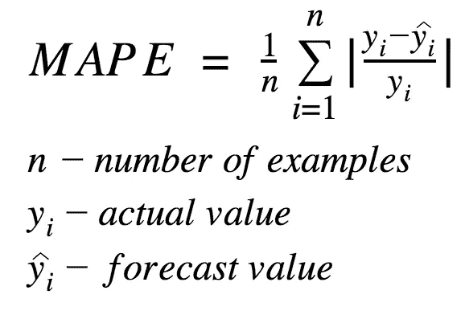

作者图片

还有一些其他的预测租金的方法，有明显的区别，比如单户和多户，不同的地理位置，甚至不同的目标，但是深入探讨这些已经超出了这篇博客的范围。以下是感兴趣者的简短列表:

*   基于联合模型的房租预测[3]
*   使用大型数据集进行公寓租金价格预测的比较:克里金法与 DNN 法[4]
*   使用文本信息和深度学习对亚特兰大大都市区的房屋租金进行建模[5]
*   [租 Zestimate (Zillow)](https://zillow.zendesk.com/hc/en-us/articles/203340274-What-is-a-Rent-Zestimate-)

# 奥普图纳

有许多针对 HPO 的框架，也有一些很棒的博客和评论对它们进行了比较( [10 个超参数优化框架](/10-hyperparameter-optimization-frameworks-8bc87bc8b7e3)、 [Optuna vs Hyperopt](/optuna-vs-hyperopt-which-hyperparameter-optimization-library-should-you-choose-ed8564618151) 、[使用 Optuna 获得精确的 Scikit 学习模型:一个超参数框架](/exploring-optuna-a-hyper-parameter-framework-using-logistic-regression-84bd622cd3a5))。在评估了几个选项之后，我们选择使用 Optuna，这是一个由 Preferred Networks，Inc .开发的相对较新的 Pythonic 开源框架。

Optuna 有几个不错的特性，包括:

*   易用性，本质上是 Pythonic 式的。
*   良好的[文档](https://optuna.readthedocs.io/en/stable/index.html)有许多[代码示例](https://github.com/optuna/optuna/tree/master/tutorial)
*   选择保存并[恢复](https://optuna.readthedocs.io/en/stable/reference/generated/optuna.study.load_study.html)搜索过程
*   允许定义定制的超参数，例如是否使用特定的预处理步骤
*   自定义目标函数和[用户属性](https://optuna.readthedocs.io/en/v1.0.0/tutorial/attributes.html)
*   几个超参数搜索空间[采样器](https://optuna.readthedocs.io/en/stable/reference/samplers.html)的实现，包括使用 [TPE](https://optuna.readthedocs.io/en/stable/reference/generated/optuna.samplers.TPESampler.html#optuna.samplers.TPESampler) (树形结构 Parzen 估计器)算法的贝叶斯采样器
*   好的[可视化](https://optuna.readthedocs.io/en/stable/reference/visualization/index.html)套件
*   独特的功能，如[修剪](https://optuna.readthedocs.io/en/stable/reference/pruners.html)、[多目标优化](https://optuna.readthedocs.io/en/stable/reference/multi_objective/study.html#)、回调和异常处理
*   支持跨机器运行的[分布式](https://optuna.readthedocs.io/en/stable/reference/storages.html)，以及支持单个机器内的并行性(在不同的内核上同时运行多个试验)，尽管目前后者并未达到最佳工作状态([已知问题](https://github.com/optuna/optuna/issues/1480))。
*   支持在单次运行中评估特定的超参数值，可用于测试您的代码( [FixedTrial](https://optuna.readthedocs.io/en/stable/reference/generated/optuna.trial.FixedTrial.html#optuna.trial.FixedTrial) )

# 搜索空间

我们的超参数搜索空间包含 9 个不同的超参数，跨越模型开发的不同领域，包括预处理(训练数据选择，PCA)、特征工程(分类编码)、模型选择( [RandomForest](https://scikit-learn.org/stable/modules/generated/sklearn.ensemble.RandomForestRegressor.html) 、 [XGBoost](https://xgboost.readthedocs.io/en/latest/) )、模型参数选择(树的数量、树的深度)和标签变换(自然对数或无变换)。我们决定只从离散分布中采样，因为这样我们将能够量化超参数搜索空间的大小并测量采样覆盖范围。

顺便提一下，对于分类编码器，我们使用了一个叫做״category_encoders״的伟大的 Python 库([源代码](https://github.com/scikit-learn-contrib/category_encoders)，[阅读更多](/beyond-one-hot-17-ways-of-transforming-categorical-features-into-numeric-features-57f54f199ea4))。

总的来说，我们的起始搜索空间包含 5 x 29 x 6 x 2 x2 x 9 x 16 = 501，120 个组合。

初始搜索空间

# 基线结果

我们使用手动选择的超参数值构建了一个模型，以便获得一个基线结果来进行后续比较。我们获得了 **9.53%** 的 MAPE。所选择的超参数值是 5%的最大当前差异、无 PCA、序数编码、具有 100 个估计量的 XGBoost、无最大树深度限制和标签原样(无对数变换)。

# 贝叶斯一次性 HPO

我们首先使用 Optuna 的 TPE 实现( [TPESampler](https://optuna.readthedocs.io/en/stable/reference/generated/optuna.samplers.TPESampler.html#optuna.samplers.TPESampler) )执行经典的一次性 HPO 方法，这是一种基于贝叶斯概率的搜索空间搜索优化算法。在 21，900 次试验后，我们获得了 8.80%的最小 MAPE**，**，这在仅仅 1，114 次试验后就已经达到了。这比没有 HPO 获得的 9.53%的基线结果好得多，但是我们注意到一些有趣的事情。

重复评估相同的超参数值非常普遍，这是一个已知的问题(参见[讨论](https://stackoverflow.com/questions/64836142/optuna-suggests-the-same-parameter-values-in-a-lot-of-trials-duplicate-trials-t))。在 21，900 次试验中，只有 940 个不同的超参数组合，而最佳超参数组合被评估了 8，200 多次，几乎每 5 次试验中就有 2 次！

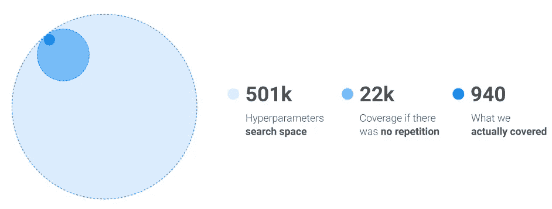

作者图片

事实上，我们只采样了 0.19%，而不是我们搜索空间的近 5%。这使我们怀疑 TPESampler 是否达到了次优的局部最小值，因为目标函数很可能不是凸的。虽然在我们的情况下不太可能，但在高维度的情况下，低采样覆盖率可能会更成问题，因为贝叶斯优化方法在超参数空间的维度非常大的情况下类似于随机搜索[6，7]。

覆盖率低的另一个问题是，我们不知道如何修改我们的搜索空间，以便在后续的 HPO 运行中寻找更好的 MAPE。我们将减少哪些超参数范围，应该增加哪些范围，以及在特定范围内应该在哪里减少区间步长(或者甚至使范围连续)？

# 使用搜索空间修剪的顺序 HPO

接下来，我们决定尝试顺序 HPO 随机搜索，以便更加确信我们确实选定了一个好的搜索空间(包含具有理想结果的超参数组合)，并且这将使我们获得目标函数的一个好的局部，甚至全局最小值。

这个想法非常简单，类似于计算贝叶斯方法，只是它涉及到人工判断。我们随机采样(使用 [RandomSampler](https://optuna.readthedocs.io/en/stable/reference/generated/optuna.samplers.RandomSampler.html#optuna.samplers.RandomSampler) )我们的搜索空间，找到产生差结果的超参数值范围，并删除它们。我们还可以在我们最初的直觉错误的地方扩大搜索空间(范围太小)。无偏采样是随机搜索的一个固有方面，如果需要额外的彻底性，它可以统计量化移除良好超参数值的可能性，但有一个很大的警告，它需要假设超参数之间的独立性。因为通常不是这样，所以实际值很可能是不正确的，但是它可能被用作一个大概的数字。

从理论上讲，可能存在这样一种情况，即搜索空间的减少可能已经移除了最佳超参数组合，因为超参数可以相互作用，然而在我们的情况下，并且可能在许多其他情况下，这似乎不是一个大的风险。

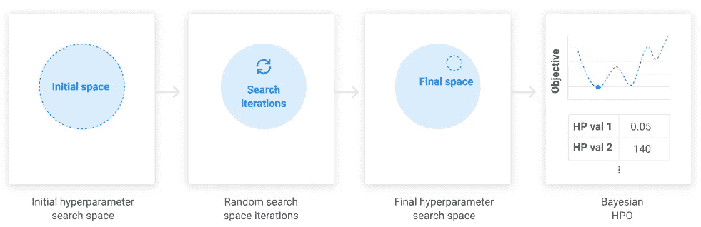

使用搜索空间剪枝流程的顺序 HPO。作者图片

为了避免混淆，请注意 Optuna 的[修剪](https://optuna.readthedocs.io/en/stable/reference/pruners.html)功能引用了其他功能。Optuna 的修剪能够停止表现不佳的训练过程以节省时间，这类似于模型训练中的早期停止，而我们描述的顺序 HPO 修剪是修改(增加或减少)超参数搜索空间的过程。

## 顺序修剪—第一次迭代

我们对 25，056 次试验进行了第一次修剪研究，覆盖了大约 5%的超参数搜索空间。我们在与单次 HPO 相同的搜索空间上运行它(参见“搜索空间”一节)。如上所述，我们使用随机搜索( [RandomSampler](https://optuna.readthedocs.io/en/stable/reference/generated/optuna.samplers.RandomSampler.html#optuna.samplers.RandomSampler) )来以不偏不倚的方式探索搜索空间。最佳模型获得了 **8.77%** 的 MAPE。**令人惊讶的是，这甚至比我们在相同搜索空间(21，900 次尝试)上的贝叶斯搜索还要好一点，结果是 8.80%！**

看一下目标函数结果(验证集上的 MAPE)如何随着单个试验而变化，就像通过 [Optuna 的可视化套件](https://optuna.readthedocs.io/en/stable/reference/visualization/)所可视化的那样，很明显搜索空间可以被修整。

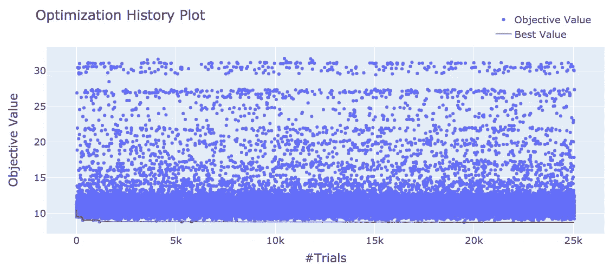

作者图片

为了缩小搜索空间，我们使用 Optuna 的切片图可视化来查看九个单独的超参数。下面是我们修改了范围的四个超参数的切片图。

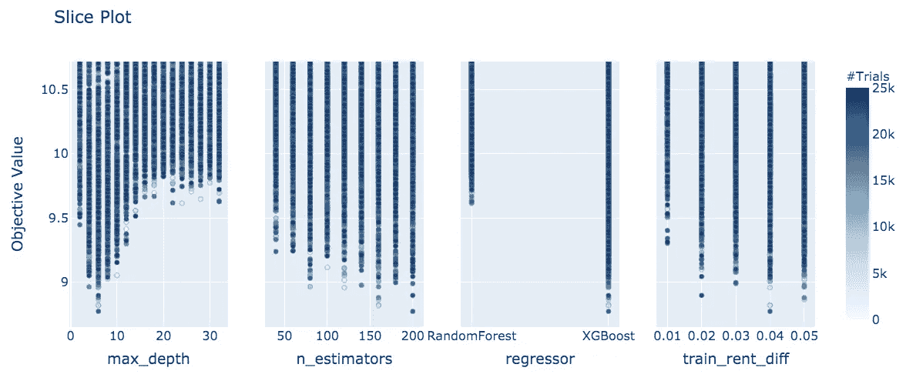

作者图片

基于这些，我们决定移除以下超参数值:train_rent_diff = 0.01，regressor = "RandomForest "，n_estimators = {40，60}，max_depth = {2，16–32(step = 2)}。这导致搜索空间减少了 88%,从 501，120 减少到 58，464，从而使我们能够使用更少的尝试更自信地搜索良好的局部最小值，并获得更高的搜索空间覆盖。

对于额外的严格性，假设我们使用随机搜索，如果我们假设超参数值是独立的，则可以统计量化我们不正确移除超参数值的可能性。例如，前 708 个结果是使用 XGBoost 作为模型获得的，尽管随机森林的试验数量(10，401)与 XGBoost (10，425)相似。请注意 10425+10401< 25,056 since there were 4,230 duplicated trials (17%).

Not surprisingly, 3 of the 4 hyperparameters whose search space we modified were of the highest importance as quantified by Optuna. The plot is also a built-in capability of the package.

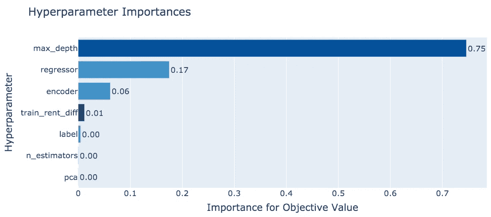

Image by author

## Sequential pruning — 2nd iteration

We continued by running a second random search iteration covering 20% of the search space (4 x 29 x 6 x 2 x 1 x 7 x 6 = 58,464 combinations), this time with less trials, 11,693\. Again, we obtained an improvement in MAPE compared to the last iteration, although not too substantial this time, **8.74%**vs 8.77%。

搜索空间修剪的一个很好的效果是，我们删除了所有以大的目标函数分数结束的试验，其中在第一次迭代中有许多(参见上面的三个图)。

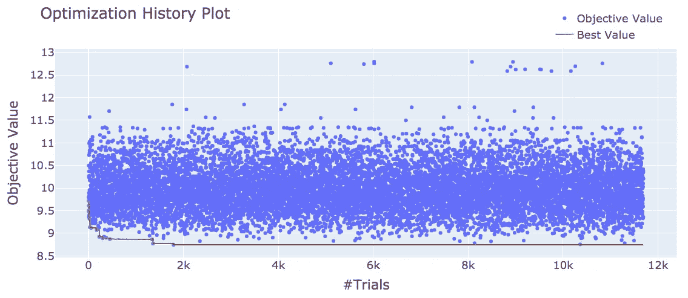

作者图片

在分析单个超参数值后，我们决定减少一些超参数的搜索空间(删除 train_rent_diff=0.02，删除 PCA 选项，删除 n_estimators=80，仅保留目标编码器选项)，增加一些超参数的分辨率(max_depth 值以 1 而不是 2 的较小增量，范围 4-11)，甚至扩大目标编码器超参数的范围(te_min_samples_leaf 和 te_smoothing 以 2 的增量增加到 1-11)。下面是我们用来做这些决定的图表。

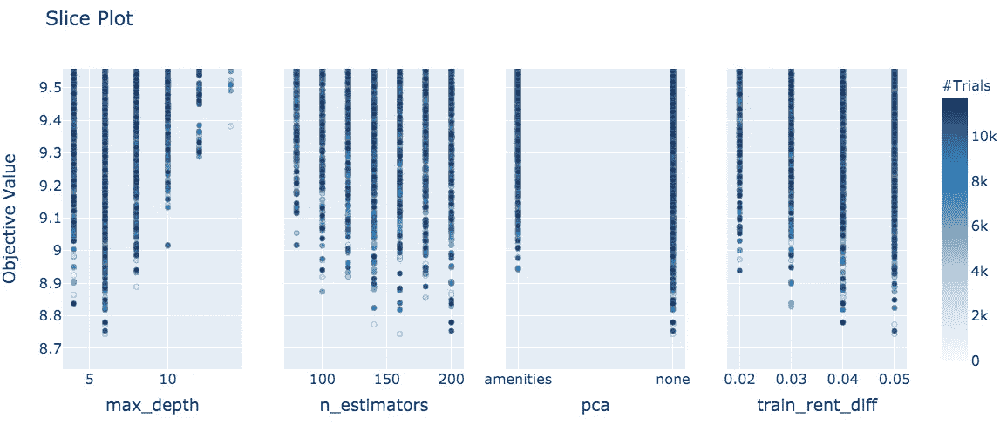

作者图片

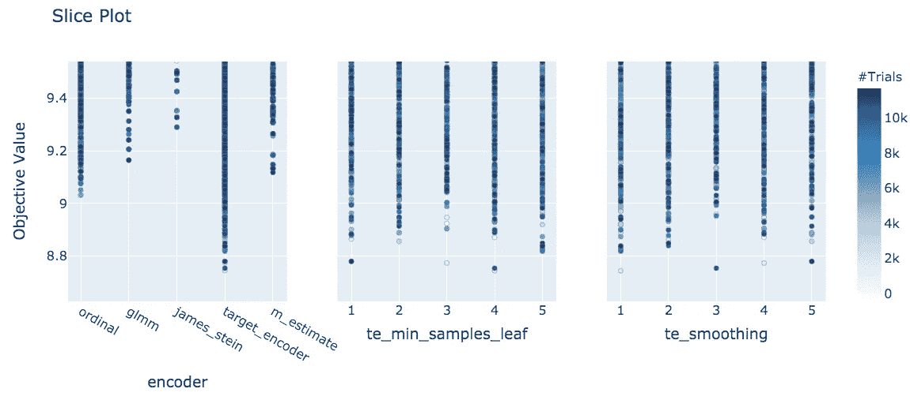

作者图片

调整之后，新的搜索空间**自信地**比我们的起点 501120 种可能性**减少了 96%** ！以下是结果搜索空间(3 x 36 x 1 x 2 x 1 x 11 x 8 = 19，008 个组合)。

最终搜索空间

## 顺序修剪—最后一次运行

我们现在已经准备好最后一次跑步了。我们使用贝叶斯搜索( [TPESampler](https://optuna.readthedocs.io/en/stable/reference/generated/optuna.samplers.TPESampler.html#optuna.samplers.TPESampler) )，因为我们不再需要修改搜索空间，因此不再需要无偏采样。相反，我们希望有好的结果，并且很少尝试。

我们只对 HPO 的研究进行了 500 次试验，发现最好的结果是之后的****只有 49 次试验**，MAPE 为 **8.55%** 。事实证明，这是全局最小值，通过网格搜索( [GridSampler](https://optuna.readthedocs.io/en/stable/reference/generated/optuna.samplers.GridSampler.html) )得到了验证。重要的是，这比我们在初始搜索空间使用贝叶斯抽样得到的 8.80%的 MAPE 要好得多。**

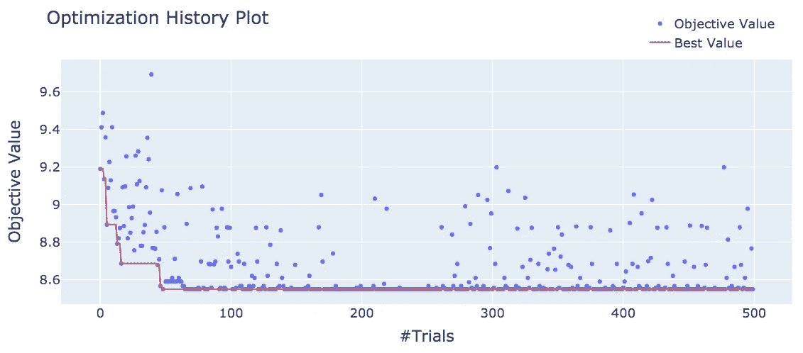

作者图片

最佳模型超参数值为:最大租金差异 4%，无 PCA，平滑=1 且 min_sample_leaf=11 的目标编码，具有 280 个估计器的 XGBoost，最大树深度 5，以及自然对数转换标签。请注意，这些超参数值中的一些不在我们的初始搜索空间中！这突出了迭代的另一个优势——它们可以**发现由于错误的直觉而导致的太小的搜索空间**。

## 附加可视化

Optuna 使我们能够通过绘制试验中获得的目标函数得分的经验累积分布函数(即 [eCDF](https://en.wikipedia.org/wiki/Empirical_distribution_function) )来比较不同的 HPO 研究。它是“经验的”，因为 eCDF 是累积分布函数的估计值(即 [CDF](https://en.wikipedia.org/wiki/Cumulative_distribution_function) ),但出于分析目的，它本质上是相同的。利用这一点，我们可以很容易地看到，在每一个连续的剪枝迭代中，个体试验达到目标函数分数的几率显著增加。

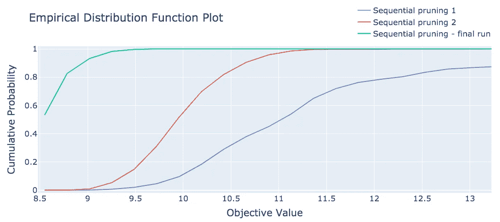

我们可以看到，在每次连续修剪中，单个试验获得低 MAPEs 的几率增加。例如，对于前两次修剪迭代，获得小于 9.5 的 MAPE 值的概率分别是 2%和 15%，而对于最后的贝叶斯运行，它跳到 99.6%。图片作者。

# 再次与贝叶斯进行比较

我们从 501k 个组合的搜索空间开始，但是，这个空间不包含我们的最佳结果。我们所有连续 HPO 运行的搜索空间的联合实际上比这个起点大 7 倍，或者大约 3.5M 个组合，因为除了修剪之外，我们还扩展了一些超参数值范围并减小了范围内的步长。

因此，为了公平比较，我们在 3.5M 的组合搜索空间上运行了一次性贝叶斯搜索(TPESampler)。最佳运行的 MAPE 为 **8.56%** (在 3362 次试验后发现，总试验运行为 26500 次)——非常接近全球最小值 **8.55%** 。这里有一个重要的教训要吸取。

# 结论

那么，除了 Optuna 是一个很棒的产品包之外，我们还能传达什么信息呢？贝叶斯方法可能是惊人的，然而，人类的直觉并不完美。最初的贝叶斯 HPO 运行是在一个次优的搜索空间，因此产生了一个较差的结果。不正确地估计搜索空间似乎在现实世界中经常发生。此外，贝叶斯搜索可能会陷入局部最小值，使它们有时比随机搜索更糟(就像我们在初始搜索空间的情况一样——第一次迭代随机搜索与贝叶斯搜索)。

顺序运行加上手动分析，正如这里所示，可以帮助**更好地理解搜索空间**，以确保我们得到一个好的结果，同样重要的是，一个**我们将在**中充满信心的结果。

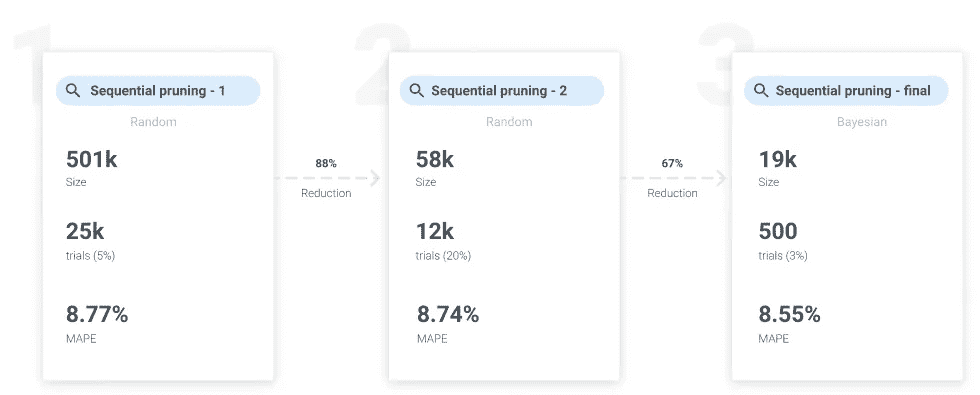

通过使用我们的使用搜索空间修剪的顺序 HPO，我们能够将我们的 MAPE 减少 10%，从 9.53%减少到 8.55%。在我们的初始搜索空间(大小 501k，试验 22k)和搜索空间的联合(大小 3.5M，试验 26.5k)上使用贝叶斯一次性 HPO，我们分别得到 8.80%和 8.56%的 MAPE 值。图片作者。

Hai Rozencwajg *是天际线 AI*<https://www.skyline.ai/>**公司的高级数据科学家，该公司打造了人工智能解决方案。**

# *参考*

*[1] M. Wistuba，N. Schilling 和 L. Schmidt-Thieme，[超参数搜索空间修剪——基于序列模型的超参数优化的新组件](https://link.springer.com/chapter/10.1007/978-3-319-23525-7_7) (2015)，计算机科学丛书[讲义的一部分(LNCS，第 9285 卷)](https://link.springer.com/bookseries/558)*

*[2] A. Lacoste，H. Larochelle，F. Laviolette 和 M. Marchand，[基于序列模型的集成优化](https://arxiv.org/abs/1402.0796) (2014)， [arXiv](https://arxiv.org/)*

*[3] Z. Kun，S. LingCong，L. Ninging，[基于联合模型的房屋租金预测](https://dl.acm.org/doi/abs/10.1145/3373509.3373578) (2019)，2019 年第八届国际计算与模式识别会议论文集，ICCPR '19*

*[4] H .王斯瑶和 d .希罗伊，[利用大数据集进行公寓租金价格预测的比较:克里金法与 DNN](https://arxiv.org/abs/1906.11099) (2019)， [arXiv](https://arxiv.org/)*

*[5] X. Zhou，W. Tong 和 D. Li，[使用文本信息和深度学习对亚特兰大大都市地区的房屋租金进行建模](https://www.researchgate.net/publication/334904455_Modeling_Housing_Rent_in_the_Atlanta_Metropolitan_Area_Using_Textual_Information_and_Deep_Learning) (2019)，ISPRS 国际地理信息杂志*

*[6] Z. Wang，M. Zoghi，F. Hutter，D. Matheson，和 N. De Freitas，[通过随机嵌入的高维贝叶斯优化](https://dl.acm.org/doi/10.5555/2540128.2540383) (2013)，第二十三届国际人工智能联合会议论文集，IJCAI '13*

*[7] L. Li，K. Jamieson，G. DeSalvo，A. Rostamizadeh 和 A. Talwalkar， [Hyperband:一种新的基于 Bandit 的超参数优化方法](https://arxiv.org/abs/1603.06560) (2018)， [arXiv](https://arxiv.org/)*