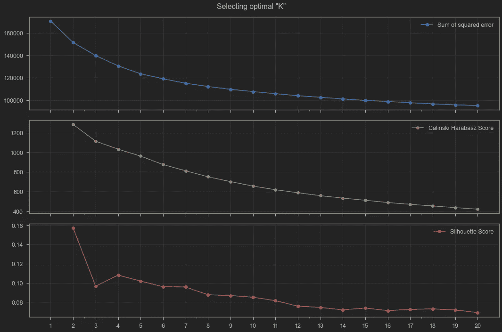
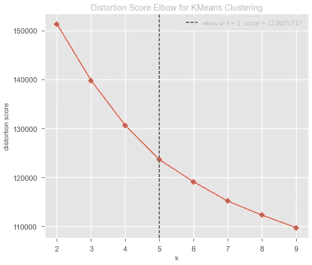
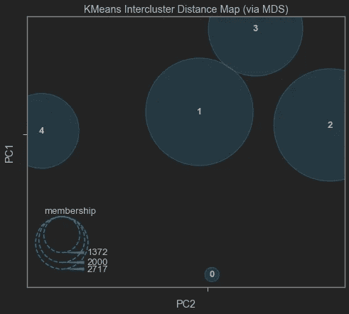
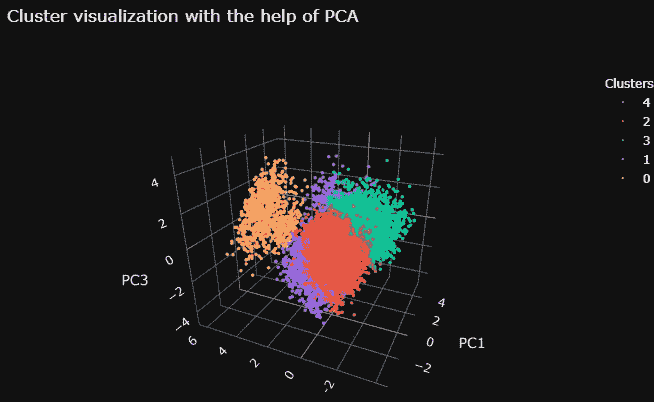
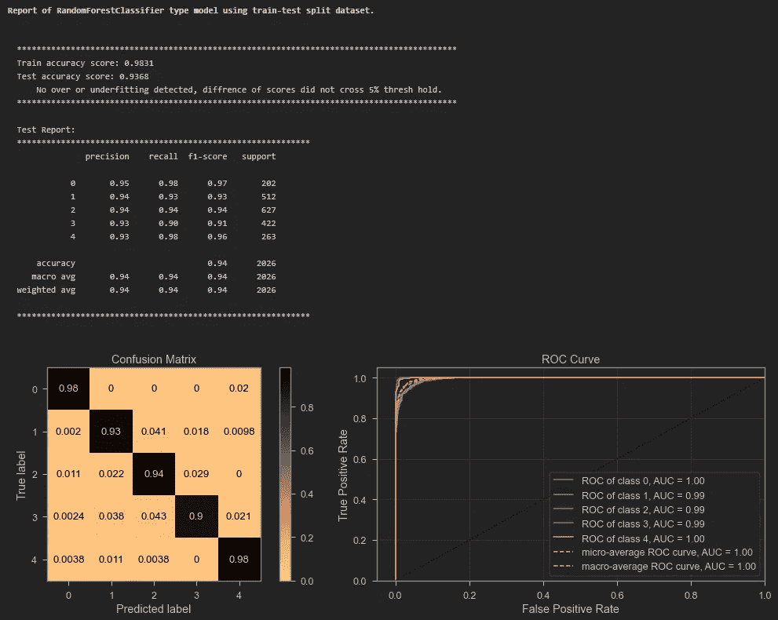
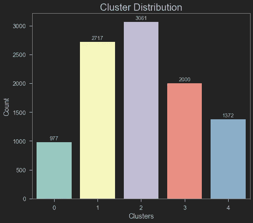

# 为 K-均值聚类选择最佳 K

> 原文：<https://towardsdatascience.com/selecting-optimal-k-for-k-means-clustering-c7579fd2e926?source=collection_archive---------14----------------------->

## 以有监督的方式使用无监督聚类。

`K-means clustering`是矢量量化的一种方式，最初来自信号处理，旨在根据平均值对观察值进行聚类。让我们首先阐明这里探讨的集群案例的前提；对客户进行细分**。客户细分**是将组织的客户划分为反映每个分组中客户相似性的集群的方法。这种客户剖析的目的是确定如何识别每个片段中的客户，以增加每个客户对企业的价值。

其中一种流行的机器学习技术是`K-means`聚类，这是一种最简单、最流行的无监督机器学习算法。通常，无监督算法仅使用输入向量从数据集进行推断，而不参考已知或标记的结果。

> 在[史蒂夫·乔布斯:沃尔特·伊萨克森独家传记](https://www.amazon.com/Steve-Jobs-Walter-Isaacson/dp/1451648537)中，尽管经常被曲解，乔布斯说:
> 
> “有些人说，‘给顾客他们想要的东西。’但这不是我的方法。我们的工作是在他们行动之前找出他们想要什么。我想亨利·福特曾经说过，‘如果我问顾客他们想要什么，他们会告诉我，‘一匹更快的马！’。人们不知道他们想要什么，直到你给他们看。这就是我从不依赖市场调查的原因。我们的任务是阅读页面上还没有的东西。"


[AB](https://unsplash.com/@applefanboy?utm_source=medium&utm_medium=referral) 在 [Unsplash](https://unsplash.com?utm_source=medium&utm_medium=referral) 上拍照

这让一些人相信，在他看来，市场研究并不重要，但实际上，乔布斯的意思是超越典型的市场研究，提前解读和发现客户需求。为此，市场细分是一个很好的方法，并对每个集群进行有针对性的市场研究。例如，大学新生的需求与中年户主购买金融服务的需求不同，他们的营销方式也不应该相同。

对于营销人员和政策制定者来说，了解不同类别的客户以满足他们更好地服务的需求是至关重要的。吸引新客户不再是成熟企业的好策略，因为帮助现有客户的成本要低得多。哪些属性应该用于此细分？那要看情况了。

***四类客户细分:***

*   行为细分:关注客户的习惯。例如基于使用的分段。
*   心理细分:基于不明显特征的细分。例如价值观或观点。
*   基于粗略的特征。例如职业、婚姻状况。
*   地理分割:基于位置。例如城市、国家。

通过做客户细分，你会发现每个客户的行为和需求都有相似的特征。然后，这些被归纳成组，这些组可以用来满足具有无数策略的特定需求。此外，这些策略可以是以下内容的输入:

*   目标营销
*   引入符合客户需求的功能
*   产品路线图的开发


照片由[艾米丽·莫特](https://unsplash.com/@emilymorter?utm_source=medium&utm_medium=referral)在 [Unsplash](https://unsplash.com?utm_source=medium&utm_medium=referral) 上拍摄

使用无监督聚类也提出了一个问题，要创建多少个聚类？这是一个很难直接回答的问题。通常，时间经理或 CEO 会根据特定的业务目标对集群的数量有特定的要求。但是，当数据泄露时，您如何决定是否应该得出集群的数量呢？在这篇博文中，我将描述获得这个数字的技术。话虽如此，但重要的是要知道算法所建议的可能不是最佳的聚类数。分析师应该用商业判断来证明她的选择。这与其说是科学，不如说是一门艺术，选择聚类的数量对于根据分析制定的策略的成功是有害的，因为无意义的输入数据导致无意义的输出。

对于本演示，使用了来自 [LEAPS Analyttica](https://leaps.analyttica.com/sample_cases/11) 的数据集。对数据集进行最小程度的清理，然后使用`StandardScaler` 对数值数据进行缩放，使用`OneHotEncoder`对分类变量进行一次热编码，以便在使用 [scikit-learn](https://scikit-learn.org/stable/index.html) API 的机器学习算法中使用。所有转换都是使用 scikit-learn 管道和转换器来执行的。

**方法 1:使用** `**K-means++**` **和不同的“K”的**

总共创建了 20 个模型，并绘制了`inertia`、`Silhouette Score`和`Calinski Harabasz Score`的分数。这方面的代码如下:

这产生了以下情节:



按作者选择最佳“k”图像

较高的`Silhouette Coefficient score`与具有更好定义的聚类的模型相关。而更高的`Calinski-Harabasz score`涉及具有更好定义的聚类的模型。

虽然通过观察视觉，没有明显的最佳 K 可以被发现。

基于`Silhouette Score`和`Sum of squared error`(又名肘图)，5 个分段似乎是初始模型的最佳选择。`Calinski Harabasz Score`也支持这种分割。

**方法二:使用** [**黄砖**](https://www.scikit-yb.org/en/latest/) **包**

测试 K-意味着模型的 K 值为 2 到 10，使用随机状态进行再现性测试，并且不显示模型拟合的时间。使用的代码:



作者图片

该图建议将`K=5`作为最佳集群数。

现在使用主成分分析来使用[黄砖](https://www.scikit-yb.org/en/latest/)在二维空间中可视化聚类。



作者图片

检测到簇之间的明显分离。

**方法三:使用** `**MeanShfit**` **发现集群**

均值漂移聚类旨在发现样本的平滑密度中的“斑点”。这是一种基于质心的算法，其工作原理是将候选质心更新为给定区域内点的平均值。然后，在后处理阶段过滤这些候选对象，以消除近似重复，从而形成最终的质心集。[(来自 scikit-learn 文档)](https://scikit-learn.org/stable/modules/generated/sklearn.cluster.MeanShift.html)

使用的代码:

代码的输出是:

```
Number of estimated clusters : 5
```

`MeanShift`建议 5 为最佳聚类数。

现在我用`K=5`创建了一个`K-means++`模型用于我的分析。PCA 为 3 时，这些聚类是可见的。那些 3 的主成分分析可以解释 40%的数据集。观察到集群之间的适当区别。



PCA3 群集，按作者分类的图像

很好看的聚类，不是吗？

*监督无监督聚类:*

接下来，我使用随机 Forrest 分类模型验证了我的聚类。在将训练测试中的数据集按 80%–20%的比率拆分后，我使用聚类模型的预测作为随机森林分类模型的因变量。并检验了模型的预测能力。如果聚类有意义，随机森林模型将能够更准确地预测聚类。该模型在测试集上达到了 0.93 的模型精度。然后，利用来自随机森林模型的特征重要性和置换重要性的组合的洞察力，探索聚类以识别特征，用于进一步探索聚类内和聚类间的特征。`K-means`模型能够根据观察到的聚类属性进行很好的聚类。

随机森林分类器的模型报告:



随机森林分类器模型报告，图片由作者提供

集群的分布:



图片作者。

探索每个集群后，它们被标记为:

*   集群 0:低价值服务的频繁用户。
*   群组 1:高风险客户细分。
*   第二组:普通客户。
*   第三类:最忠诚的客户。(主要由老客户组成)
*   集群 4:高价值客户。

此工作流是为无监督聚类模型决定最佳 K 的一个很好的选择，并使用监督分类模型验证选择。

所有这些都可以在 GitHub 上找到，点击[这个链接](https://github.com/tamjid-ahsan/Selecting-optimal-K-for-K-means-clustering)。这种分析通过客户流失分析进行了扩展，可以在 GitHub 上使用[这个链接](https://github.com/tamjid-ahsan/capstone_customer_churn)找到。

今天到此为止。下次见！