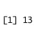
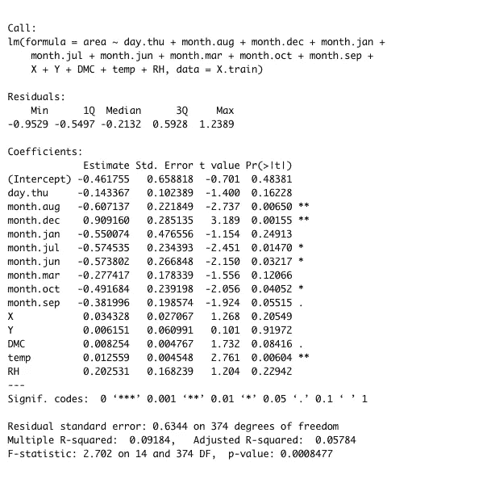

# 选择 R 中线性回归的最佳预测值

> 原文：<https://towardsdatascience.com/selecting-the-best-predictors-for-linear-regression-in-r-f385bf3d93e9?source=collection_archive---------2----------------------->

## 使用 R 中的 leaps 软件包选择线性回归的最显著因变量


萨法尔·萨法罗夫在 [Unsplash](https://unsplash.com?utm_source=medium&utm_medium=referral) 上拍摄的照片

为了获得多元回归模型的最佳拟合，包含数据集中最重要的预测子集非常重要。然而，在一大组预测因子中，要了解哪些预测因子对我们的目标变量有重大影响是相当具有挑战性的。考虑到每个变量的 p 值是针对模型中的其他项进行调整的，这可能会特别麻烦。

在这篇文章中，我将演示如何使用 R 的 leaps 包来获得最好的回归模型。

# 什么是飞跃？

Leaps 是一个回归子集选择工具，它执行详尽的搜索，以确定对我们的模型 [(Lumley，2020)](https://cran.r-project.org/web/packages/leaps/leaps.pdf) 最有影响的预测因子。通过评估导致最佳[调整 r](https://www.statisticshowto.com/probability-and-statistics/statistics-definitions/adjusted-r2/#:~:text=R2%20shows%20how%20well,adjusted%20r%2Dsquared%20will%20decrease.&text=N%20is%20the%20number%20of%20points%20in%20your%20data%20sample.) 和 [Mallow 的 CP 的组合来选择最佳预测器。](https://blog.minitab.com/en/statistics-and-quality-data-analysis/cp-and-cpk-two-process-perspectives-one-process-reality#:~:text=Cp%20is%20a%20ratio%20of,indicate%20a%20more%20capable%20process.&text=When%20the%20specification%20spread%20is%20less,process%20spread%2C%20Cp%20is%20low.)

我们将使用 Cortez 和莫莱斯 2007 年[森林火灾](https://data.world/uci/forest-fires)数据集上的 regsubsets()函数，来预测葡萄牙 Montesinho 自然公园的过火面积(ha)。

# 跳跃变量选择


照片由[Landon parentau](https://unsplash.com/@landonparenteau?utm_source=medium&utm_medium=referral)在 [Unsplash](https://unsplash.com?utm_source=medium&utm_medium=referral) 上拍摄

## 关于数据的一点点..

森林火灾数据集包含葡萄牙 Montesinho 自然公园 517 起森林火灾的信息。数据集中有 12 个属性。

在 EDA 过程中，我注意到几个因变量之间的多重共线性，因此该数据集是特征选择的良好候选。

在建模之前，原始数据集也被转换以满足线性回归的[假设。还添加了额外的虚拟变量，因为我们对时间上的相互作用感兴趣。](https://www.statology.org/linear-regression-assumptions/)

现在，我们已经准备好数据集，让我们开始建模。

**1。用所有预测值进行线性回归**

在为我们的回归选择预测因子的最佳子集之前，让我们使用所有预测因子对数据集运行一个简单的线性回归，以设置用于比较的基本调整 r。

```
 lm1 <- lm(fires.clean1,formula=area ~.)
summary(lm1) 
```


我们可以看到，在模型中包含所有变量的情况下，基础调整后的 r 为 0.02，剩余标准误差为 0.6454。然而，这种关系在 P <.05 level.=""/>

**2 并不显著。安装并加载 leaps 库**

安装 leaps 包加载后，库使用以下命令:

```
library(leaps)
```

**3。Regsubsets()**

对所有变量运行 regsubsets()函数。

```
Best_Subset <-
    regsubsets(area~.,
               data =fires.clean1,
               nbest = 1,      # 1 best model for each number of predictors
               nvmax = NULL,    # NULL for no limit on number of variables
               force.in = NULL, force.out = NULL,
               method = "exhaustive")summary_best_subset <- summary(regsubsets.out)
as.data.frame(summary_best_subset$outmat)
```

**4。预测器数量**

现在，我们已经在我们的数据集上运行了 leaps，让我们看看软件包在数据集使用的预测因子数量方面有什么建议。

```
 which.max(summary_best_subset$adjr2) 
```



似乎我们必须使用 13 个预测器来获得最佳模型。

**5。最好的预测因素是什么？**

下面的汇总表提供了模型使用的预测因子的详细信息。最佳预测值用“真”表示。

```
summary_best_subset$which[13,]
```


看起来仅包含以下预测值将为我们的线性回归模型提供最佳模型拟合:day.thu、month.aug、month.dec、month.jan、month.jul、month.jun、month.mar、month.oct、month.sep、X、DMC、temp 和 RH

**6。使用最佳预测值运行回归模型**

```
best.model <- lm(area ~ day.thu + month.aug + month.dec + month.jan + month.jul+ month.jun+month.mar+month.oct+month.sep+X+Y+DMC+temp+RH, data = fires.clean1)
summary(best.model)
```
```



我们可以看到，与步骤 1 中的模型相比，我们调整后的 r 显著提高(从 0.02 提高到 0.05)，非常显著。

# 后续步骤

下一步将是通过查看诊断图来进一步评估该模型。如果数据集被分为训练集和测试集，我们还可以使用 predict()函数在测试数据集上运行该模型，然后评估这些结果以全面了解我们的模型性能。

需要注意的一点是，我们调整后的 r 仍然很低。最好的模型只能解释数据中 5%的可变性。这可能意味着我们需要进一步转换数据集，或者尝试不同的转换方法。这也意味着我们的数据集可能不是线性回归的最佳候选。

# 结论

这篇文章的目的是演示如何使用 leaps 包为线性回归模型选择变量。欢迎对变量选择的方法或替代(高级)方法提出意见和建议。请查看下面的参考资料，了解更多关于使用 leaps 进行变量选择的信息。

# 参考

(2018 年 4 月 27 日)。于 2021 年 5 月 23 日从[https://www.youtube.com/watch?v=3HKMjEK02Cs](https://www.youtube.com/watch?v=3HKMjEK02Cs)检索

托马斯·拉姆利(2020 年 1 月 16 日)。包装飞跃。https://cran.r-project.org/web/packages/leaps/leaps.pdf

Kassambara (2018 年 11 月 3 日)。*用于高通量数据分析的统计工具。*[http://www . sthda . com/English/articles/37-model-selection-essentials-in-r/155-best-subsets-regression-essentials-in-r/](http://www.sthda.com/english/articles/37-model-selection-essentials-in-r/155-best-subsets-regression-essentials-in-r/)

leaps、bestglm、glmulti 和 meifly 的所有子集回归。2021 年 5 月 23 日检索自[https://r studio-pubs-static . S3 . amazonaws . com/2897 _ 9220 b 21 CFC 0 c 43 a 396 ff 9 abf 122 bb 351 . html](https://rstudio-pubs-static.s3.amazonaws.com/2897_9220b21cfc0c43a396ff9abf122bb351.html)

Minitab (2017 年 6 月 29 日)。Cp 和 Cpk:两种过程视角，一种过程现实。 *Minitab。*[https://blog . minitab . com/en/statistics-and-quality-data-analysis/Cp-and-cpk-two-process-perspectives-one-process-reality #:~:text = Cp % 20 is % 20a % 20 ratio % 20 of，表示% 20a % 20 more % 20 capable % 20 process。&text =当% 20 规格% 20 展开% 20 无，过程% 20 展开% 20 为% 20 低](https://blog.minitab.com/en/statistics-and-quality-data-analysis/cp-and-cpk-two-process-perspectives-one-process-reality#:~:text=Cp%20is%20a%20ratio%20of,indicate%20a%20more%20capable%20process.&text=When%20the%20specification%20spread%20is%20less,process%20spread,%20Cp%20is%20low)。

斯蒂芬妮·格伦(2021)。调整后的 R2 /调整后的 R 平方:它是做什么用的？[*StatisticsHowTo.com*](https://www.statisticshowto.com/):我们其他人的基本统计！[https://www . statistics show to . com/probability-and-statistics/statistics-definitions/adjusted-R2/](https://www.statisticshowto.com/probability-and-statistics/statistics-definitions/adjusted-r2/)

页（page 的缩写）科尔特斯和莫莱斯(2007 年 12 月 1 日)。利用气象数据预测森林火灾的数据挖掘方法。*第十三届 EPIA 2007 —葡萄牙人工智能会议论文集，2007 年 12 月*。(http://www.dsi.uminho.pt/~pcortez/fires.pdf)

扎克(2020，08 年 1 月)。*线性回归的四个假设。*静态学。[https://www . statology . org/linear-regression-assumptions/https://www . statology . org/linear-regression-assumptions/](https://www.statology.org/linear-regression-assumptions/)

<http://www.sthda.com/english/articles/37-model-selection-essentials-in-r/155-best-subsets-regression-essentials-in-r/> 