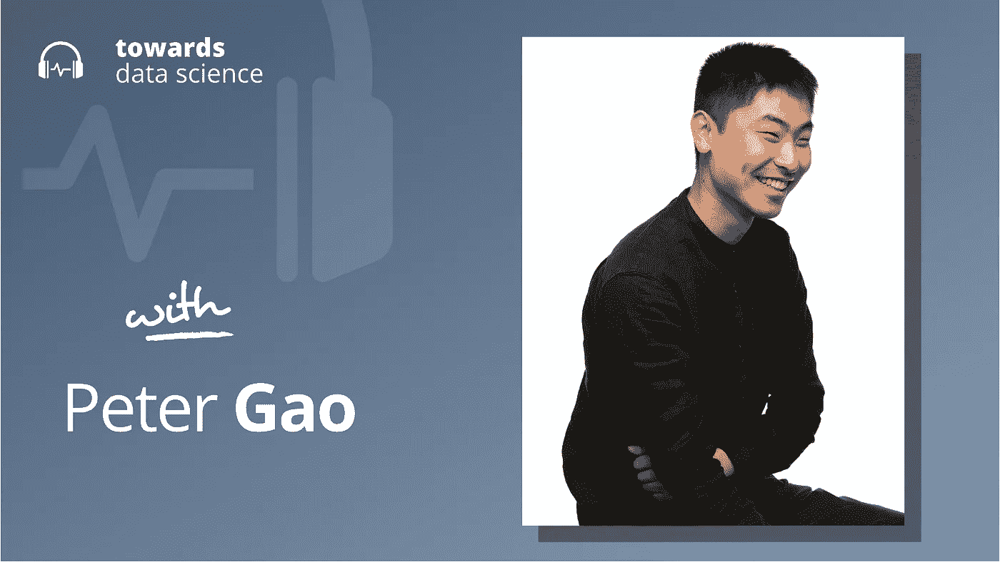

# 自动驾驶汽车:过去、现在和未来

> 原文：<https://towardsdatascience.com/self-driving-cars-past-present-and-future-71532430346?source=collection_archive---------22----------------------->

## [播客](https://towardsdatascience.com/tagged/tds-podcast)

## 彼得·高谈自动驾驶的核心挑战和创新

[苹果](https://podcasts.apple.com/ca/podcast/towards-data-science/id1470952338?mt=2) | [谷歌](https://www.google.com/podcasts?feed=aHR0cHM6Ly9hbmNob3IuZm0vcy8zNmI0ODQ0L3BvZGNhc3QvcnNz) | [SPOTIFY](https://open.spotify.com/show/63diy2DtpHzQfeNVxAPZgU) | [其他](https://anchor.fm/towardsdatascience)

*编者按:这一集是我们关于数据科学和机器学习新兴问题的播客系列的一部分*，*由 Jeremie Harris 主持。除了主持播客，Jeremie 还帮助运营一家名为*[*sharpes minds*](http://sharpestminds.com)*的数据科学导师初创公司。*

Cruise 是一家成立于 2013 年的自动驾驶汽车初创公司，当时大多数人都认为自动驾驶汽车是科幻小说中的东西。然而，仅仅三年后，该公司被通用汽车以超过 10 亿美元的价格收购，表明自己是让自动驾驶成为现实的竞赛中的真正参与者。一路走来，该公司不得不导航并适应快速变化的技术格局，将机器人和软件工程的旧思想与深度学习等前沿技术相结合。

本期播客的嘉宾是克鲁斯最早的员工之一。彼得·高(Peter Gao)是一位在自动驾驶汽车行业拥有丰富经验的机器学习专家，也是 Y Combinator 支持的初创公司[水族馆学习](https://www.aquariumlearning.com/)的联合创始人，该公司专门通过修复机器学习模型训练数据的问题来提高机器学习模型的性能。我们讨论了彼得在自动驾驶汽车行业的经历，包括自动驾驶汽车技术的创新，以及一些需要克服的技术和道德挑战，以使自动驾驶汽车在世界各地成为主流。

以下是我最喜欢的一些外卖食品:

*   无人驾驶汽车的历史比大多数人想象的要久远得多。早在 20 世纪中期，就有人提出了无人驾驶交通的第一个建议，但鉴于当时的技术水平，实现这一目标的唯一现实方法是大力限制这一问题。即使在理论上，也需要专门建造的轨道、安装在道路下引导车辆的磁铁以及其他定制的基础设施。但随着时间的推移和技术的进步，限制可能会放松:到 20 世纪 90 年代，基本的计算机视觉算法允许自动驾驶汽车在高速公路上行驶得相当好。但是这些更现代的技术要求自动车辆装满服务器机架，并且对于城市驾驶来说适应性不够。只是随着深度学习的出现，日常使用所需的感知和规划能力已经足够好，可以用于主流用途:由于计算机视觉，汽车现在可以解释它们周围的基础设施，而不需要在建造时就考虑到它们。尽管如此，即使是现代自动驾驶汽车也是深度学习、三维几何重建的经典算法、硬编码规则结构和机器人技术的弗兰肯斯坦怪物。
*   制造完全自动驾驶汽车的主要瓶颈是分布外采样问题，这是一个当汽车遇到它在训练中没有遇到的场景时出现的问题。例如，彼得引用了在万圣节识别穿着精心制作的服装的行人的挑战——如果模特在训练中没有遇到穿着变形服装的人，就不太可能正确地将他们归类为要避免的东西。这个采样问题本质上使得在旧金山开发的自动驾驶汽车技术在不同街道大小和路况的城市使用很危险，如凤凰城或蒙特利尔，这就是为什么自动驾驶汽车技术的推广可能会在一个城市接一个城市的基础上进行。每一个新环境都是一个全新的问题。
*   对于许多有商业价值的应用程序来说，完全自治实际上并不必要。一些问题设置自然比其他问题设置更受约束——彼得引用洗碗机作为例子:从技术上讲，它们是机器人的自主应用，但这只有在它们被设置在精心约束的环境中的事实下才有可能。比洗碗机更少约束，但比日常驾驶问题更受约束的是像沿着船坞移动货物或使用自主无人机检查电力线这样的问题。虽然这些应用可能不总是看起来像自动驾驶汽车，但它们是使自动驾驶汽车成为可能的同一技术的分支。
*   随着我们将更多的决策权交给机器，我们开始面临一些棘手的道德问题——这些问题在无人驾驶汽车技术领域最为棘手。当撞车事故发生时，谁或什么是罪魁祸首？答案当然取决于具体情况。由于自动驾驶汽车通常会有一些人为监督——以负责多辆车的操作员的形式，他们可以在模糊的情况下进行干预——所以会有操作员疏忽可能是一个因素的情况。尽管如此，还是有人工智能决策导致糟糕结果的场景。当这种情况发生时，责任是属于构建人工智能的公司、部署人工智能的公司，还是负责算法开发或管理汽车训练数据的个人？
*   Peter 强调，通常情况下，人工智能性能的问题实际上来自训练数据的问题，而不是算法架构的问题。他遇到了一系列相对一致的问题，并使用令人惊讶的一般化技术来解决它们。

你可以在这里的 Twitter 上关注彼得，或者在这里的 Twitter 上关注我[。](https://twitter.com/jeremiecharris)

## 章节:

*   0:00 介绍
*   彼得的背景
*   4:15 早期项目
*   8:00 感知如何为自动驾驶汽车服务
*   18:30 主要限制
*   自动驾驶汽车技术的 22:50 时间线
*   26:40 自动驾驶汽车技术的激动人心的应用
*   34:50 自动化其他领域
*   42:35 通过事故和错误进行推理
*   47:10 数据集之间最常见的挑战
*   56:00 不同种类的错误以及如何处理它们
*   1:00:10 总结