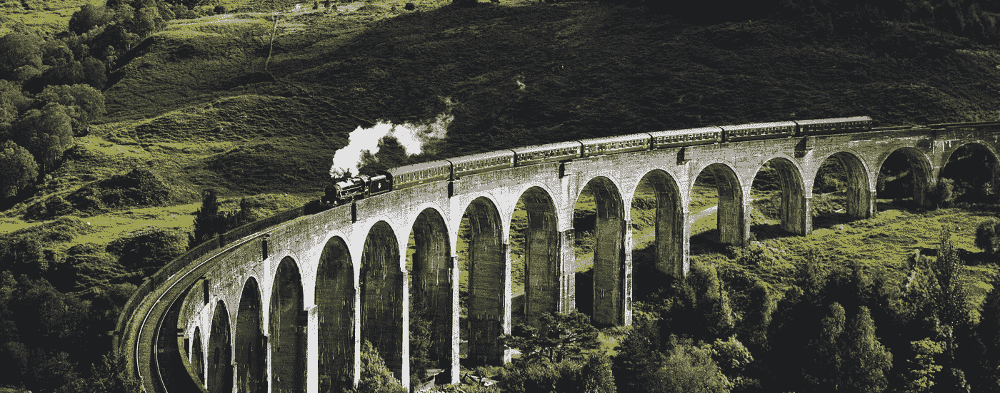
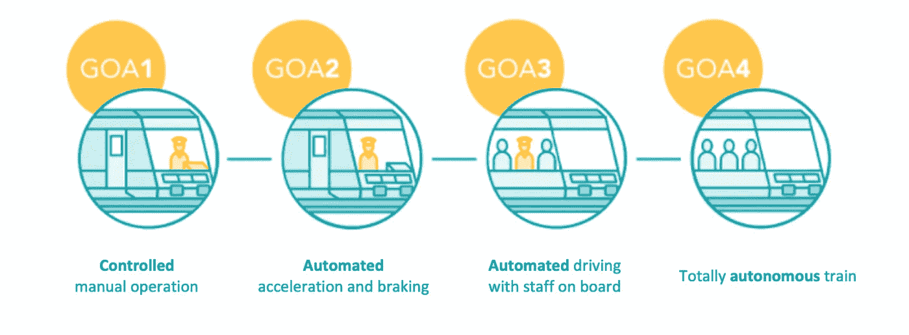
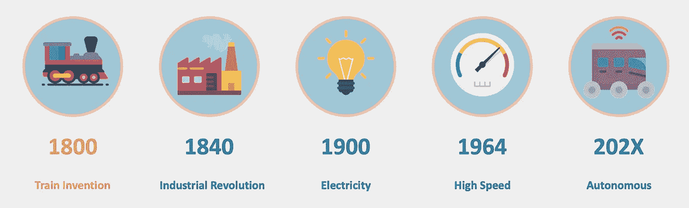

# 2021 年的自动驾驶火车

> 原文：<https://towardsdatascience.com/self-driving-train-in-2021-1f1586113e01?source=collection_archive---------40----------------------->

图 1——杰克·安斯蒂在 [Unsplash](https://unsplash.com/s/photos/steam-train?utm_source=unsplash&utm_medium=referral&utm_content=creditCopyText) 上拍摄的照片

## 继电气化和高速之后，随着人工智能、云计算和大数据的兴起，第四次铁路革命即将到来

# 介绍

我们听到很多关于电动汽车、自动驾驶汽车、移动性、交通工具的说法，但很少听说自动驾驶火车。而且有充分的理由，他们还不真的存在！但是，严肃的项目正在进行中，它们肯定会比你想象的要快得多！这是对这种在全世界超过 100 万公里的铁路上运行的车辆的未来的概述。

# 自动化和自主性

首先，什么是自主列车？我们可以将它定义为一列火车，它可以看到、了解其环境、交流并适应意外事件。今天，一些非常复杂的地铁系统提供了高度的自动化。自主列车不仅是自动的，而且能够独立地做出反应和决策。然后，它可以在任何情况下确保网络上乘客的安全，无需人工干预。

为了鉴定列车的技术进步和性能水平，将自动化分为 4 个等级(GoA)

*   **GoA 1** : **受控手动驾驶**。司机开车，自动装置控制速度。
*   **GoA 2** : **自动** **加速和制动**。是免提驾驶。速度是自动计算和应用的。司机监控障碍物。正是从这一层开始，网络上的容量可以增加(见下一段)。
*   **GoA 3** : **自动驾驶**载人。自动化是试验性的，但列车驾驶员仍在场管理非正常情况。
*   **果阿 4** :全**自主**列车。能够在没有任何人工干预的情况下运行。

图 2——自动化等级——SNCF

今天，超过 99%的列车仍在 GoA 1 模式下运行，地铁经常在 GoA 2，有时在 GoA 3 或 GoA4(主要是机场班车)。在澳大利亚，无人驾驶火车(GoA 4)的试验已经证明了它们的价值，可以在没有司机的情况下，在矿山和港口之间运输超过 280 公里的矿石。

下一步是将这些技术应用到客运列车上。首先，在封闭的电路上，然后在更大的区域上。风险一点也不高，因为在一个国家网络中，几列火车同时在同一条轨道上运行，这大大增加了复杂性，并需要更高水平的能力。在法国，SNCF 正在研究自动列车原型，并计划从 2023 年开始将其产业化。

# 自主列车的优势

你可以想象，设计这种火车的投资是巨大的。但是，你为什么要换成自动列车呢？

## 容量增加

通过系统地优化速度，更容易在车站(尤其是城市列车)和路线(所有列车在相同路段以不同速度行驶)上削减利润。从运营的角度来说，这是最重要的。世界上饱和的大都市可以有更好的车站访问频率，承载更多的乘客和更好的服务质量。

## 更好的规律性

自主列车和互联列车对危险具有更强的响应能力和恢复能力。列车之间的通信允许在网络出现问题时减慢服务速度，而不会完全停止服务。而当一列列列车停运，重新启动时，出于安全考虑，每次发车前都需要等待。通过实时定位和通信，所有列车将能够更快地重新启动。

## 更加生态

消费被规范和优化，这是更生态的方式。不合时宜的刹车白白消耗了很多能量。在这里，列车之间的实时通信也将带来改善。

## 经济成果

更生态，因此在消费方面更经济。但不仅如此。更多的火车也意味着更多的座位出售，因此利润更高。最后，通过优化流程,(过于昂贵的)生产线将会更加高效。建设线路，以及车站，将因此变得更加稀缺，这也是一个胜利。

## 更具竞争力

在这个人工智能和自动化的时代，能够设计或制造一辆自动驾驶的火车可以让它的制造商和买家站在国际舞台的最前沿。最后，更好的服务有助于吸引更多的顾客，并应对竞争的流动性(汽车共享，廉价航空，公共汽车等)。).

# 技术挑战

像汽车一样，火车必须配备系统，使其能够管理现在由司机管理的东西。这包括远见和决策。自动驾驶汽车中开发和部署的技术，如传感器和数据处理模块，可以适用于铁路网络。

就其本身而言，火车的导航比汽车简单得多。旅行只有一个维度:没有交叉路口、交通圈或多条轨道的复杂道路。而路上的自行车就更少了，或者同样环境下的行人。不，简单多了。火车在铁轨上，它只能前进，唯一的问题是速度有多快。在某个地方，自动列车只需要做出一个关键的决定:我应该加速还是减速？事实上，由于路线是已知的，速度是预先编程的，列车必须问自己的基本问题如下:

> 紧急情况下该不该刹车？

另一方面，考虑到火车的重量和速度，必须提前做好紧急制动的准备。所有的复杂性都来自于此。幸运的是，在火车上，已经有很多电，还有空间。这使得计算机和大量的计算能力可用。采集模块很经典:相机、声纳、激光雷达等。如果基础设施很旧(最初没有为自动列车规划)，他们还必须能够在所有类型的天气下读取信号。在更现代的基础设施的情况下，信号元素可以直接传输到列车。

图 3 —铁路革命(图片由作者提供)

因此，风险和复杂性与自动驾驶汽车非常不同。然而，一些技术挑战是跨领域的。这些措施尤其包括

## 计算能力

使用人工智能的技术通常需要大量的计算。谁说计算量大，谁说热量大。但是多亏了汽车工业，高效的高性能处理器即将问世。

## 互联网网络容量

自动列车将需要通信。与车站以及同一轨道上的其他列车进行通信。交流大量数据。大量的数据意味着高效的网络。还是那句话，5G 的到来，最多也就是几年的事情。

## 人工智能模型可解释性

自主列车将能够自己做出决定。这很好，但不足以让乘客或当局放心。人工智能通常被认为是一个“黑匣子”，这是正确的。在不知道为什么会做出这样那样的决定的情况下，进入一辆时速数百公里的汽车是不可想象的。这一点在所有与人工智能相关的领域都是成立的。这就是为什么，连同数据保护的概念，可解释性是今天世界范围内研究的先锋。

# 结论

自动列车为乘客和运营商提供了多种好处，现在它正处于梦想和现实之间。除了一些不允许持续存在的技术障碍，这是一个正在高速发展的项目，继承了在自动驾驶汽车背景下进行的所有研究。

毫无疑问，它将在未来十年改变铁路部门。事实上，凭借其安全和准时的承诺，自动列车有着光明的未来。

对你有什么好处？你准备好在没有司机的情况下乘火车去度假吗？

> 希望你喜欢&回头见🤠