# <500 Lines of Code

> 原文：<https://towardsdatascience.com/self-parking-car-in-500-lines-of-code-c1b2a57455af?source=collection_archive---------3----------------------->

## [动手教程](https://towardsdatascience.com/tagged/hands-on-tutorials)中的自动泊车车

## 使用遗传算法训练汽车自动泊车

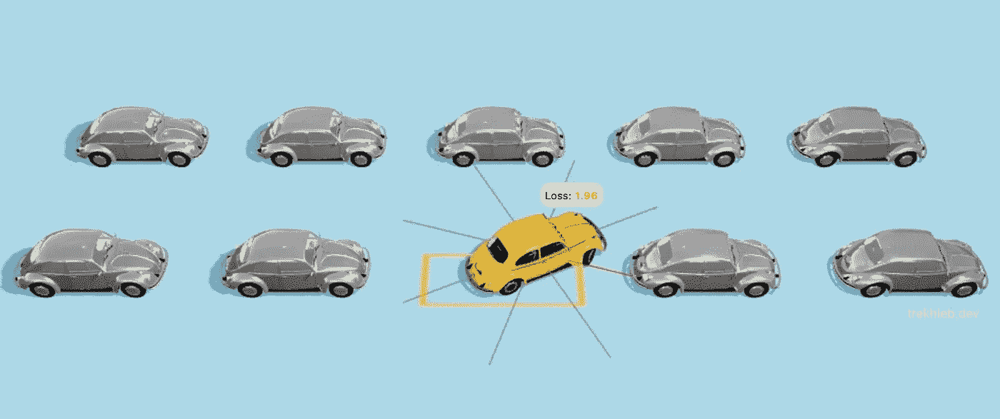

作者插图

# TL；速度三角形定位法(dead reckoning)

在本文中，我们将使用[遗传算法](https://en.wikipedia.org/wiki/Genetic_algorithm)来训练汽车进行自主泊车。

我们将用随机基因组创造出第一代汽车**,其行为如下:**


第一代汽车。作者制作的动画

**在第 40 代**上，汽车开始学习什么是自动泊车，并开始靠近泊车点:

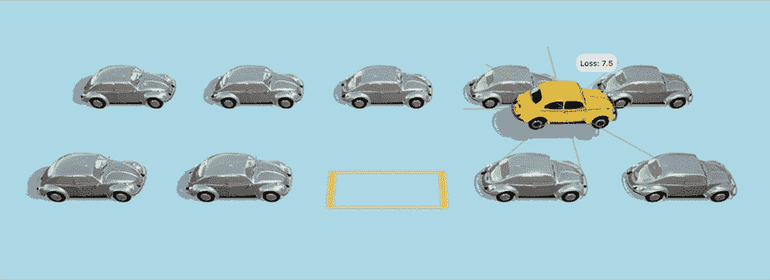

第 40 代车。作者制作的动画

另一个例子更具挑战性:


第 40 代车。作者制作的动画

> 是啊，是啊，这些车在路上撞上了其他车，也不完全适合停车，但这只是自世界创造以来他们的第 40 代，所以请仁慈一点，给这些车一些空间让:D 成长

您可以启动🚕[自动泊车汽车进化模拟器](https://trekhleb.dev/self-parking-car-evolution)直接在浏览器中查看进化过程。模拟器为您提供了以下机会:

*   您可以[从头开始训练汽车](https://trekhleb.dev/self-parking-car-evolution?parking=evolution#/)并自行调整遗传参数
*   你可以[看到训练过的自动泊车车在运行](https://trekhleb.dev/self-parking-car-evolution?parking=automatic#/)
*   您也可以[尝试手动泊车](https://trekhleb.dev/self-parking-car-evolution?parking=manual#/)

这个项目的遗传算法是用 TypeScript 实现的。完整的遗传源代码将在本文中展示，但你也可以在[进化模拟器资源库](https://github.com/trekhleb/self-parking-car-evolution)中找到最终的代码示例。

> 我们将使用遗传算法来完成进化汽车基因组的特殊任务。然而，这篇文章仅仅触及了算法的基础，并不是遗传算法主题的完整指南。

话虽如此，让我们深入了解更多细节…

# 这个计划

一步一步地，我们将把创建自动泊车汽车的高级任务分解为寻找`180`位的最佳组合(寻找最佳汽车基因组)的简单低级优化问题。

这是我们要做的:

1.  💪🏻将**肌肉**(发动机、方向盘)给汽车，使其能够向停车点移动。
2.  👀给汽车装上**眼睛**(传感器)，这样它就能看到周围的障碍物。
3.  🧠给汽车配备了大脑，它将根据汽车看到的东西(通过传感器看到的障碍物)来控制肌肉(运动)。大脑将只是一个纯粹的功能。
4.  🧬 **进化大脑**根据传感器的输入做出正确的动作。这就是我们将应用遗传算法的地方。一代又一代，我们的大脑功能`movements = f(sensors)`将学习如何将汽车驶向停车位。

# 赋予汽车肌肉

为了能够移动，汽车需要“肌肉”。让我们给汽车两种类型的肌肉:

1.  **发动机肌肉** —允许汽车移动 *↓后退*、 *↑前进*或 *◎立钢*(空挡)
2.  **方向盘肌肉**——允许汽车在行驶中向左 *←转*、 *→向右*或 *◎直行*

有了这两块肌肉，汽车可以完成以下动作:

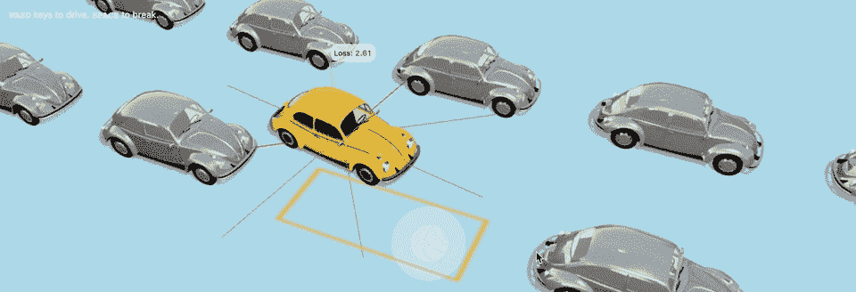

汽车肌肉。作者制作的动画

在我们的例子中，肌肉是来自大脑的信号的接收器，每隔`100ms`(毫秒)一次。根据大脑信号的价值，肌肉会做出不同的反应。我们将在下面讨论“大脑”部分，但现在，假设我们的大脑可能只向每块肌肉发送 3 种可能的信号:`-1`、`0`或`+1`。

```
type MuscleSignal = -1 | 0 | 1;
```

例如，大脑可能会向引擎肌肉发送值为`+1`的信号，它将开始向前移动汽车。给引擎的信号`-1`使汽车向后移动。同时，如果大脑将信号`-1`发送给方向盘肌肉，它会将车转向左侧等。

在我们的例子中，大脑信号值是如何映射到肌肉动作的:

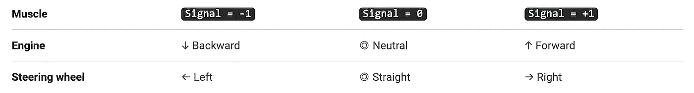

> 你可以[使用进化模拟器](https://trekhleb.dev/self-parking-car-evolution?parking=manual#/)尝试手动停车，看看汽车肌肉是如何工作的。每当你按下`WASD`键盘上的一个键(或使用触摸屏操纵杆)，你就向引擎和方向盘肌肉发送这些`-1`、`0`或`+1`信号。

# 给汽车一双眼睛

在我们的汽车学会如何使用肌肉自动停车之前，它需要能够“看到”周围的环境。让我们以距离传感器的形式给它一双`8`眼睛:

*   每个传感器可以在`0-4m`(米)的距离范围内探测障碍物。
*   每个传感器每隔`100ms`都会向汽车的“大脑”报告它“看到”的障碍物的最新信息。
*   只要传感器没有发现任何障碍物，它就会报告`0`的值。相反，如果传感器的值很小但不为零(即`0.01m`)，则意味着障碍物很近。

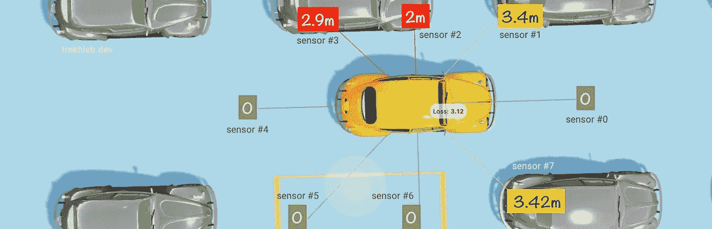

车眼。作者插图

> 你可以使用进化模拟器，看看每个传感器的颜色是如何根据障碍物的远近而变化的。

```
type Sensors = number[];
```

# 给汽车赋予大脑

此时此刻，我们的汽车可以“看见”和“移动”，但没有“协调器”，将“眼睛”的信号转换为“肌肉”的适当运动。我们需要给汽车一个“大脑”。

# 大脑输入

作为来自传感器的输入，大脑每隔`100ms`就会得到`8`个浮点数，每个都在`[0...4]`的范围内。例如，输入可能如下所示:

```
const sensors: Sensors = [s0, s1, s2, s3, s4, s5, s6, s7];
// i.e. 🧠 ← [0, 0.5, 4, 0.002, 0, 3.76, 0, 1.245]
```

# 大脑输出

每一个`100ms`大脑都应该产生两个整数作为输出:

1.  一个数字作为发动机的信号:`engineSignal`
2.  一个数字作为方向盘的信号:`wheelSignal`

每个数字都应该是类型`MuscleSignal`，并且可以取三个值之一:`-1`、`0`或`+1`。

# 大脑公式/功能

记住上面提到的大脑的输入和输出，我们可以说大脑只是一种功能:

```
const { engineSignal, wheelSignal } = brainToMuscleSignal(
  brainFunction(sensors)
);
// i.e. { engineSignal: 0, wheelSignal: -1 } ← 🧠 ← [0, 0.5, 4, 0.002, 0, 3.76, 0, 1.245]
```

其中`brainToMuscleSignal()`是一个将原始脑信号(任何浮点数)转换为肌肉信号(转换为`-1`、`0`或`+1`数)以便肌肉能够理解的函数。我们将在下面实现这个转换器函数。

现在的主要问题是`brainFunction()`是一个什么样的函数。

为了让汽车更智能，让它的运动更复杂，我们可以用一个[多层感知机](https://en.wikipedia.org/wiki/Multilayer_perceptron)。这个名字有点吓人，但这是一个简单的神经网络，有一个基本的架构(把它想象成一个有许多参数/系数的大公式)。

> 在我的[自制机器学习](https://github.com/trekhleb/homemade-machine-learning#-multilayer-perceptron-mlp)、[机器学习实验](https://github.com/trekhleb/machine-learning-experiments#multilayer-perceptron-mlp-or-simple-neural-network-nn)和[纳米神经元](https://github.com/trekhleb/nano-neuron)项目中，我已经详细介绍了多层感知器。你甚至可以挑战那个简单的网络[来识别你写的数字](https://trekhleb.dev/machine-learning-experiments/#/experiments/DigitsRecognitionMLP)。

然而，为了避免引入全新的神经网络概念，我们将采用一种更简单的方法，我们将使用两个具有多个变量的线性多项式(更准确地说，每个多项式将正好有`8`个变量，因为我们有`8`个传感器)，如下所示:

```
engineSignal = brainToMuscleSignal(
  (e0 * s0) + (e1 * s1) + ... + (e7 * s7) + e8 // <- brainFunction
)wheelSignal = brainToMuscleSignal(
  (w0 * s0) + (w1 * s1) + ... + (w7 * s7) + w8 // <- brainFunction
)
```

其中:

*   `[s0, s1, ..., s7]`-`8`变量，即`8`传感器值。这些是动态的。
*   `[e0, e1, ..., e8]` -发动机多项式的`9`系数。这些是汽车需要学习的，它们是静态的。
*   `[w0, w1, ..., w8]` -方向盘多项式的`9`系数。这些是汽车需要学习的，它们是静态的

为大脑使用更简单的功能的代价是，汽车将无法学习一些复杂的动作，也无法很好地概括和适应未知的环境。但是对于我们这个特殊的停车场来说，为了展示遗传算法的工作，这已经足够了。

我们可以用下面的方式实现通用多项式函数([查看这篇文章的这个版本以获得更好的源代码格式](https://trekhleb.dev/blog/2021/self-parking-car-evolution/)):

```
type Coefficients = number[];// Calculates the value of a linear polynomial based on the coefficients and variables.
const linearPolynomial = (coefficients: Coefficients, variables: number[]): number => {
  if (coefficients.length !== (variables.length + 1)) {
    throw new Error('Incompatible number of polynomial coefficients and variables');
  }
  let result = 0;
  coefficients.forEach((coefficient: number, coefficientIndex: number) => {
    if (coefficientIndex < variables.length) {
      result += coefficient * variables[coefficientIndex];
    } else {
      // The last coefficient needs to be added up without multiplication.
      result += coefficient
    }
  });
  return result;
};
```

在这种情况下，汽车的大脑将由两个多项式组成，看起来像这样:

```
const engineSignal: MuscleSignal = brainToMuscleSignal(
  linearPolynomial(engineCoefficients, sensors)
);const wheelSignal: MuscleSignal = brainToMuscleSignal(
  linearPolynomial(wheelCoefficients, sensors)
);
```

`linearPolynomial()`函数的输出是一个浮点数。`brainToMuscleSignal()`函数需要将大量的浮点数转换成三个特定的整数，它将分两步完成:

1.  将大范围浮动(即`0.456`或`3673.45`或`-280`)转换为`(0...1)`(即`0.05`或`0.86`)范围内的浮动
2.  将`(0...1)`范围内的浮点值转换为`-1`、`0`或`+1`三个整数值之一。比如靠近`0`的浮动会转换成`-1`，靠近`0.5`的浮动会转换成`0`，靠近`1`的浮动会转换成`1`。

为了完成转换的第一部分，我们需要引入一个实现以下公式的 [Sigmoid 函数](https://en.wikipedia.org/wiki/Sigmoid_function):


Sigmoid 公式

它将宽范围的浮点数(`x`轴)转换为有限范围的浮点数(`(0...1)``y`轴)。这正是我们所需要的。

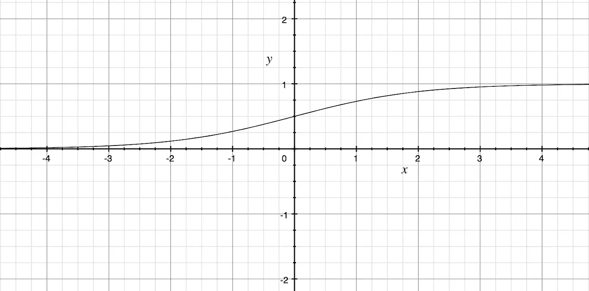

Sigmoid 函数

这是转换步骤在 Sigmoid 图上的样子。

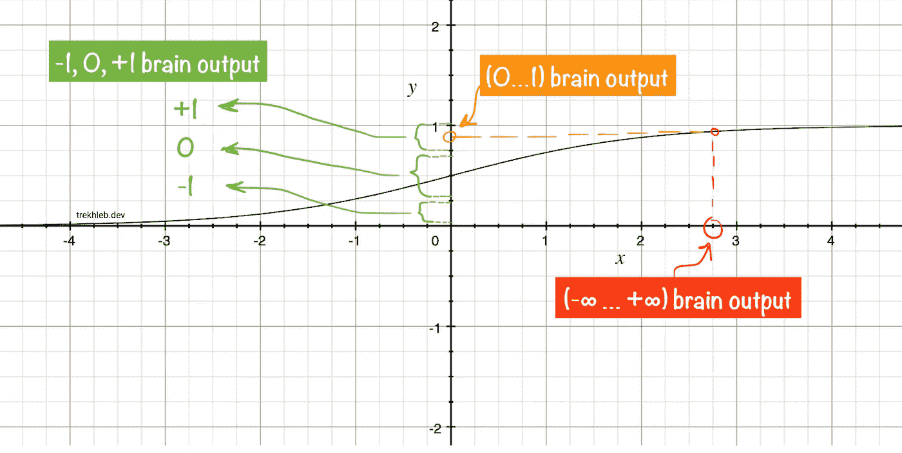

作者插图

上面提到的两个转换步骤的实现如下所示:

```
// Calculates the sigmoid value for a given number.
const sigmoid = (x: number): number => {
  return 1 / (1 + Math.E ** -x);
};// Converts sigmoid value (0...1) to the muscle signals (-1, 0, +1)
// The margin parameter is a value between 0 and 0.5:
// [0 ... (0.5 - margin) ... 0.5 ... (0.5 + margin) ... 1]
const sigmoidToMuscleSignal = (sigmoidValue: number, margin: number = 0.4): MuscleSignal => {
  if (sigmoidValue < (0.5 - margin)) {
    return -1;
  }
  if (sigmoidValue > (0.5 + margin)) {
    return 1;
  }
  return 0;
};// Converts raw brain signal to the muscle signal.
const brainToMuscleSignal = (rawBrainSignal: number): MuscleSignal => {
  const normalizedBrainSignal = sigmoid(rawBrainSignal);
  return sigmoidToMuscleSignal(normalizedBrainSignal);
}
```

# 汽车的基因组

> 从上面的“眼睛”、“肌肉”和“大脑”部分得出的主要结论应该是:系数`[e0, e1, ..., e8]`和`[w0, w1, ..., w8]`定义了汽车的行为。这些数字共同构成了独特的汽车基因组(或汽车的 DNA)。

# 十进制形式的汽车基因组

让我们将`[e0, e1, ..., e8]`和`[w0, w1, ..., w8]`大脑系数连接在一起，以十进制形式构成一辆汽车的基因组:

```
// Car genome as a list of decimal numbers (coefficients).
const carGenomeBase10 = [e0, e1, ..., e8, w0, w1, ..., w8];// i.e. carGenomeBase10 = [17.5, 0.059, -46, 25, 156, -0.085, -0.207, -0.546, 0.071, -58, 41, 0.011, 252, -3.5, -0.017, 1.532, -360, 0.157]
```

# 二进制形式的汽车基因组

让我们再深入一步(到基因的层面)，将汽车基因组的十进制数字转换成二进制格式(转换成普通的`1` s 和`0` s)。

> 我已经在浮点数的二进制表示的文章[中详细描述了将浮点数转换成二进制数的过程。如果本节中的代码不清楚，您可能想查看一下。](https://trekhleb.dev/blog/2021/binary-floating-point/)

下面是一个如何将浮点数转换成二进制数的简单例子(如果这个例子令人困惑，请随意阅读第一个):

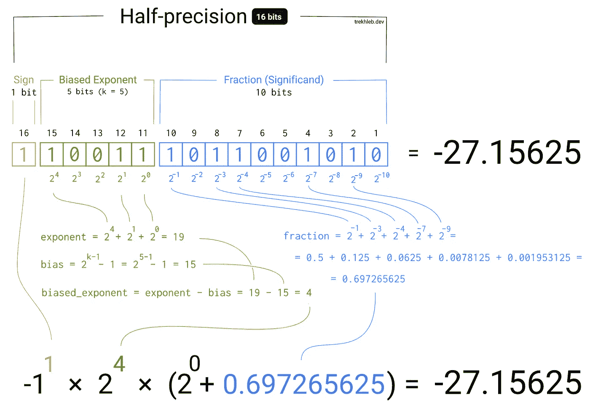

浮点数的“十进制到二进制”转换示例。作者插图。

在我们的例子中，为了减少基因组长度，我们将把每个浮点系数转换成非标准的`10 bits`二进制数(`1`符号位、`4`指数位、`5`分数位)。

我们总共有`18`个系数，每个系数都会被转换成`10`位数。这意味着汽车的基因组将是一个长度为`18 * 10 = 180 bits`的`0`和`1`的数组。

例如，对于上面提到的十进制格式的基因组，其二进制表示如下:

在我们的例子中，为了减少基因组长度，我们将把每个浮点系数转换成非标准的`10 bits`二进制数(`1`符号位、`4`指数位、`5`分数位)。

我们总共有`18`个系数，每个系数将被转换成`10`位数。这意味着汽车的基因组将是一个长度为`18 * 10 = 180 bits`的`0`和`1`的数组。

例如，对于上面提到的十进制格式的基因组，其二进制表示如下:

```
type Gene = 0 | 1;

type Genome = Gene[];

const genome: Genome = [
  // Engine coefficients.
  0, 1, 0, 1, 1, 0, 0, 0, 1, 1, // <- 17.5
  0, 0, 0, 1, 0, 1, 1, 1, 0, 0, // <- 0.059
  1, 1, 1, 0, 0, 0, 1, 1, 1, 0, // <- -46
  0, 1, 0, 1, 1, 1, 0, 0, 1, 0, // <- 25
  0, 1, 1, 1, 0, 0, 0, 1, 1, 1, // <- 156
  1, 0, 0, 1, 1, 0, 1, 1, 0, 0, // <- -0.085
  1, 0, 1, 0, 0, 1, 0, 1, 0, 1, // <- -0.207
  1, 0, 1, 1, 0, 0, 0, 0, 1, 1, // <- -0.546
  0, 0, 0, 1, 1, 0, 0, 1, 0, 0, // <- 0.071

  // Wheels coefficients.
  1, 1, 1, 0, 0, 1, 1, 0, 1, 0, // <- -58
  0, 1, 1, 0, 0, 0, 1, 0, 0, 1, // <- 41
  0, 0, 0, 0, 0, 0, 1, 0, 1, 0, // <- 0.011
  0, 1, 1, 1, 0, 1, 1, 1, 1, 1, // <- 252
  1, 1, 0, 0, 0, 1, 1, 0, 0, 0, // <- -3.5
  1, 0, 0, 0, 1, 0, 0, 1, 0, 0, // <- -0.017
  0, 0, 1, 1, 1, 1, 0, 0, 0, 1, // <- 1.532
  1, 1, 1, 1, 1, 0, 1, 1, 0, 1, // <- -360
  0, 0, 1, 0, 0, 0, 1, 0, 0, 0, // <- 0.157
];
```

我的天啊。二元基因组看起来如此神秘。但是你能想象吗，仅仅这些 0 和 1 就定义了汽车在停车场的行为！就像你黑了某人的 DNA，知道每个基因的确切含义。太神奇了！

顺便说一下，你可以在[进化模拟器](https://trekhleb.dev/self-parking-car-evolution?parking=evolution#/)仪表盘上看到性能最好的汽车的基因组和系数的准确值:

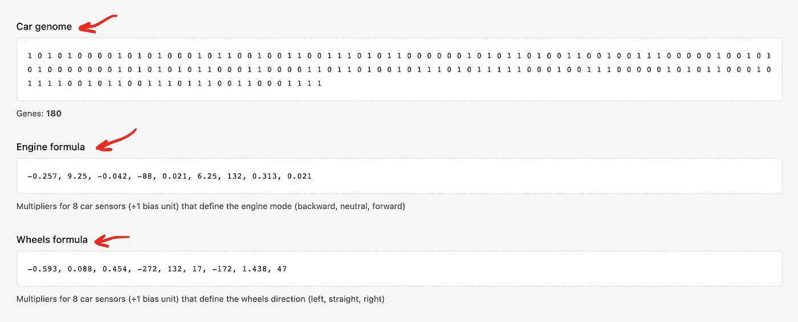

进化模拟器仪表板截图

下面是执行浮点数从二进制到十进制格式转换的源代码(大脑需要它来解码基因组并根据基因组数据产生肌肉信号):

```
type Bit = 0 | 1;type Bits = Bit[];type PrecisionConfig = {
  signBitsCount: number,
  exponentBitsCount: number,
  fractionBitsCount: number,
  totalBitsCount: number,
};type PrecisionConfigs = {
  custom: PrecisionConfig,
};const precisionConfigs: PrecisionConfigs = {
  // Custom-made 10-bits precision for faster evolution progress.
  custom: {
    signBitsCount: 1,
    exponentBitsCount: 4,
    fractionBitsCount: 5,
    totalBitsCount: 10,
  },
};// Converts the binary representation of the floating-point number to decimal float number.
function bitsToFloat(bits: Bits, precisionConfig: PrecisionConfig): number {
  const { signBitsCount, exponentBitsCount } = precisionConfig; // Figuring out the sign.
  const sign = (-1) ** bits[0]; // -1^1 = -1, -1^0 = 1 // Calculating the exponent value.
  const exponentBias = 2 ** (exponentBitsCount - 1) - 1;
  const exponentBits = bits.slice(signBitsCount, signBitsCount + exponentBitsCount);
  const exponentUnbiased = exponentBits.reduce(
    (exponentSoFar: number, currentBit: Bit, bitIndex: number) => {
      const bitPowerOfTwo = 2 ** (exponentBitsCount - bitIndex - 1);
      return exponentSoFar + currentBit * bitPowerOfTwo;
    },
    0,
  );
  const exponent = exponentUnbiased - exponentBias; // Calculating the fraction value.
  const fractionBits = bits.slice(signBitsCount + exponentBitsCount);
  const fraction = fractionBits.reduce(
    (fractionSoFar: number, currentBit: Bit, bitIndex: number) => {
      const bitPowerOfTwo = 2 ** -(bitIndex + 1);
      return fractionSoFar + currentBit * bitPowerOfTwo;
    },
    0,
  ); // Putting all parts together to calculate the final number.
  return sign * (2 ** exponent) * (1 + fraction);
}// Converts the 8-bit binary representation of the floating-point number to decimal float number.
function bitsToFloat10(bits: Bits): number {
  return bitsToFloat(bits, precisionConfigs.custom);
}
```

# 大脑功能与二元基因组一起工作

以前，我们的大脑功能是直接处理十进制形式的`engineCoefficients`和`wheelCoefficients`多项式系数。然而，这些系数现在是以基因组的二进制形式编码的。让我们添加一个`decodeGenome()`功能，从基因组中提取系数，让我们重写我们的大脑功能:

```
// Car has 16 distance sensors.
const CAR_SENSORS_NUM = 8;

// Additional formula coefficient that is not connected to a sensor.
const BIAS_UNITS = 1;

// How many genes do we need to encode each numeric parameter for the formulas.
const GENES_PER_NUMBER = precisionConfigs.custom.totalBitsCount;

// Based on 8 distance sensors we need to provide two formulas that would define car's behavior:
// 1\. Engine formula (input: 8 sensors; output: -1 (backward), 0 (neutral), +1 (forward))
// 2\. Wheels formula (input: 8 sensors; output: -1 (left), 0 (straight), +1 (right))
const ENGINE_FORMULA_GENES_NUM = (CAR_SENSORS_NUM + BIAS_UNITS) * GENES_PER_NUMBER;
const WHEELS_FORMULA_GENES_NUM = (CAR_SENSORS_NUM + BIAS_UNITS) * GENES_PER_NUMBER;

// The length of the binary genome of the car.
const GENOME_LENGTH = ENGINE_FORMULA_GENES_NUM + WHEELS_FORMULA_GENES_NUM;

type DecodedGenome = {
  engineFormulaCoefficients: Coefficients,
  wheelsFormulaCoefficients: Coefficients,
}

// Converts the genome from a binary form to the decimal form.
const genomeToNumbers = (genome: Genome, genesPerNumber: number): number[] => {
  if (genome.length % genesPerNumber !== 0) {
    throw new Error('Wrong number of genes in the numbers genome');
  }
  const numbers: number[] = [];
  for (let numberIndex = 0; numberIndex < genome.length; numberIndex += genesPerNumber) {
    const number: number = bitsToFloat10(genome.slice(numberIndex, numberIndex + genesPerNumber));
    numbers.push(number);
  }
  return numbers;
};

// Converts the genome from a binary form to the decimal form
// and splits the genome into two sets of coefficients (one set for each muscle).
const decodeGenome = (genome: Genome): DecodedGenome => {
  const engineGenes: Gene[] = genome.slice(0, ENGINE_FORMULA_GENES_NUM);
  const wheelsGenes: Gene[] = genome.slice(
    ENGINE_FORMULA_GENES_NUM,
    ENGINE_FORMULA_GENES_NUM + WHEELS_FORMULA_GENES_NUM,
  );

  const engineFormulaCoefficients: Coefficients = genomeToNumbers(engineGenes, GENES_PER_NUMBER);
  const wheelsFormulaCoefficients: Coefficients = genomeToNumbers(wheelsGenes, GENES_PER_NUMBER);

  return {
    engineFormulaCoefficients,
    wheelsFormulaCoefficients,
  };
};

// Update brain function for the engine muscle.
export const getEngineMuscleSignal = (genome: Genome, sensors: Sensors): MuscleSignal => {
  const {engineFormulaCoefficients: coefficients} = decodeGenome(genome);
  const rawBrainSignal = linearPolynomial(coefficients, sensors);
  return brainToMuscleSignal(rawBrainSignal);
};

// Update brain function for the wheels muscle.
export const getWheelsMuscleSignal = (genome: Genome, sensors: Sensors): MuscleSignal => {
  const {wheelsFormulaCoefficients: coefficients} = decodeGenome(genome);
  const rawBrainSignal = linearPolynomial(coefficients, sensors);
  return brainToMuscleSignal(rawBrainSignal);
};
```

# 自动驾驶汽车问题声明

> ☝🏻所以，最后，我们已经到了让汽车成为自动泊车汽车的高层次问题被分解为寻找`180`1 和 0 的最佳组合(寻找“足够好”的汽车基因组)的简单优化问题的地步。听起来很简单，不是吗？

# 天真的方法

我们可以用一种简单的方法来解决寻找“足够好”的基因组的问题，并尝试所有可能的基因组合:

1.  `[0, ..., 0, 0]`，然后...
2.  `[0, ..., 0, 1]`，然后...
3.  `[0, ..., 1, 0]`，然后...
4.  `[0, ..., 1, 1]`，然后...
5.  …

但是，让我们做一些数学计算。使用`180`位，并且每个位等于`0`或`1`，我们将有`2^180`(或`1.53 * 10^54`)种可能的组合。假设我们需要给每辆车一个`15s`,看看它是否能成功停车。我们还可以说，我们可能马上对`10`汽车进行模拟。那么我们将需要`15 * (1.53 * 10^54) / 10 = 2.29 * 10^54 [seconds]`，也就是`7.36 * 10^46 [years]`。相当长的等待时间。就像一个侧面的想法，它只是在基督诞生后已经过去了。

# 遗传学方法

我们需要一个更快的算法来寻找基因组的最优值。这就是遗传算法的救援之处。我们可能找不到基因组的最佳价值，但有可能找到它的最佳价值。更重要的是，我们不需要等那么久。有了进化模拟器，我能够在`24 [hours]`中找到一个非常好的基因组。

# 遗传算法基础

一种[遗传算法](https://en.wikipedia.org/wiki/Genetic_algorithm) (GA)，受自然选择过程的启发，通常用于依靠生物启发算子生成优化问题的高质量解决方案，如*交叉*、*变异*和*选择*。

为汽车找到“足够好”的基因组合的问题看起来像一个优化问题，所以 GA 很有可能在这里帮助我们。

我们不会涵盖遗传算法的所有细节，但在高层次上，这里是我们需要做的基本步骤:

1.  **创建** —第一代汽车[不可能无中生有](https://en.wikipedia.org/wiki/Laws_of_thermodynamics)，所以我们会在最开始生成一组随机的汽车基因组(长度为`180`的一组二进制数组)。例如，我们可以制造`~1000`汽车。随着人口的增加，找到最优解(并且更快地找到)的机会也增加了。
2.  选择——我们需要从这一代中选择最合适的个体进行进一步的交配(见下一步)。每个个体的适应度将基于适应度函数来定义，在我们的情况下，适应度函数将显示汽车有多接近目标停车位。车离停车点越近越合适。
3.  **与**交配——简单地说，我们将允许被选中的 *"♂父车"*"与被选中的 *"♀母车"*有*"性别"*，这样它们的基因组就可以按`~50/50`比例混合，产生*"♀♀子车"*基因组。这个想法是，通过从父母那里获取最好(或最差)的部分，儿童汽车在自动停车方面可能会变得更好(或更差)。
4.  **突变**——在交配过程中，一些基因可能会随机突变(子基因组中的`1` s 和`0` s 可能会翻转)。这可能会带来更广泛的儿童基因组，因此，更广泛的儿童汽车行为。想象一下，对于所有的`~1000`汽车，第 1 位被意外设置为`0`。第一位设置为`1`时，测试汽车的唯一方法是通过随机突变。同时，广泛的突变可能会破坏健康的基因组。
5.  除非代的数量已经达到极限(即`100`代已经过去)或者除非表现最好的个体已经达到预期的适应度函数值(即最好的汽车已经比`1 meter`更接近停车点)，否则转到“步骤 2”。否则，退出。

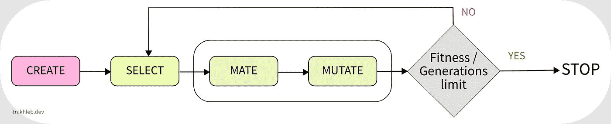

遗传算法流程。作者插图

# 用遗传算法进化汽车大脑

在启动遗传算法之前，让我们为算法的“创建”、“选择”、“交配”和“变异”步骤创建函数。

# 创建步骤的函数

`createGeneration()`函数将创建一个随机基因组数组(也称为群体或世代),并将接受两个参数:

*   `generationSize` -定义代的大小。这一代人的规模将一代一代地保持下去。
*   `genomeLength` -定义 cars 群体中每个个体的基因组长度。在我们的例子中，基因组的长度将是`180`。

基因组中的每个基因都有`50/50`的机会成为`0`或`1`。

```
type Generation = Genome[];

type GenerationParams = {
  generationSize: number,
  genomeLength: number,
};

function createGenome(length: number): Genome {
  return new Array(length)
    .fill(null)
    .map(() => (Math.random() < 0.5 ? 0 : 1));
}

function createGeneration(params: GenerationParams): Generation {
  const { generationSize, genomeLength } = params;
  return new Array(generationSize)
    .fill(null)
    .map(() => createGenome(genomeLength));
}
```

# 变异步骤的函数

`mutate()`函数会根据`mutationProbability`值随机变异一些基因。

例如，如果`mutationProbability = 0.1`那么每个基因组都有`10%`的机会发生突变。比方说，如果我们有一个长度为`10`的基因组，看起来像`[0, 0, 0, 0, 0, 0 ,0 ,0 ,0 ,0]`，那么在突变之后，有可能 1 个基因会发生突变，我们可能会得到一个看起来像`[0, 0, 0, 1, 0, 0 ,0 ,0 ,0 ,0]`的基因组。

```
// The number between 0 and 1.
type Probability = number;// @see: https://en.wikipedia.org/wiki/Mutation_(genetic_algorithm)
function mutate(genome: Genome, mutationProbability: Probability): Genome {
  for (let geneIndex = 0; geneIndex < genome.length; geneIndex += 1) {
    const gene: Gene = genome[geneIndex];
    const mutatedGene: Gene = gene === 0 ? 1 : 0;
    genome[geneIndex] = Math.random() < mutationProbability ? mutatedGene : gene;
  }
  return genome;
}
```

# 配对步骤的功能

`mate()`函数将接受`father`和`mother`基因组，并将产生两个子代。我们将模仿真实世界的场景，并在交配过程中进行变异。

孩子基因组的每一位都将根据父亲或母亲基因组相应位的值来定义。孩子有可能继承父亲或母亲的一部分。例如，假设我们有长度为`4`的基因组(为了简单起见):

```
Father's genome: [0, 0, 1, 1]
Mother's genome: [0, 1, 0, 1]
                  ↓  ↓  ↓  ↓
Possible kid #1: [0, 1, 1, 1]
Possible kid #2: [0, 0, 1, 1]
```

在上面的例子中，突变没有考虑在内。

下面是该函数的实现:

```
// Performs Uniform Crossover: each bit is chosen from either parent with equal probability.
// @see: https://en.wikipedia.org/wiki/Crossover_(genetic_algorithm)
function mate(
  father: Genome,
  mother: Genome,
  mutationProbability: Probability,
): [Genome, Genome] {
  if (father.length !== mother.length) {
    throw new Error('Cannot mate different species');
  } const firstChild: Genome = [];
  const secondChild: Genome = []; // Conceive children.
  for (let geneIndex = 0; geneIndex < father.length; geneIndex += 1) {
    firstChild.push(
      Math.random() < 0.5 ? father[geneIndex] : mother[geneIndex]
    );
    secondChild.push(
      Math.random() < 0.5 ? father[geneIndex] : mother[geneIndex]
    );
  } return [
    mutate(firstChild, mutationProbability),
    mutate(secondChild, mutationProbability),
  ];
}
```

# 选择步骤的功能

为了选择最适合的个体进行进一步交配，我们需要一种方法来找出每个基因组的适合度。为此，我们将使用所谓的适应度函数。

适应度函数总是与我们试图解决的特定任务相关，它不是通用的。在我们的例子中，适应度函数将测量汽车和停车点之间的距离。车离停车点越近越合适。稍后我们将实现健身功能，但现在，让我们介绍它的接口:

```
type FitnessFunction = (genome: Genome) => number;
```

现在，假设我们有每个个体的适应值。我们还可以说，我们根据个体的健康值对所有个体进行了分类，因此第一个个体是最强壮的。我们应该如何从这个数组中选择父亲和母亲呢？我们需要以某种方式进行选择，个体的适应值越高，这个个体被选择交配的机会就越高。`weightedRandom()`函数将在这方面帮助我们。

```
// Picks the random item based on its weight.
// The items with a higher weight will be picked more often.
const weightedRandom = <T>(items: T[], weights: number[]): { item: T, index: number } => {
  if (items.length !== weights.length) {
    throw new Error('Items and weights must be of the same size');
  } // Preparing the cumulative weights array.
  // For example:
  // - weights = [1, 4, 3]
  // - cumulativeWeights = [1, 5, 8]
  const cumulativeWeights: number[] = [];
  for (let i = 0; i < weights.length; i += 1) {
    cumulativeWeights[i] = weights[i] + (cumulativeWeights[i - 1] || 0);
  } // Getting the random number in a range [0...sum(weights)]
  // For example:
  // - weights = [1, 4, 3]
  // - maxCumulativeWeight = 8
  // - range for the random number is [0...8]
  const maxCumulativeWeight = cumulativeWeights[cumulativeWeights.length - 1];
  const randomNumber = maxCumulativeWeight * Math.random(); // Picking the random item based on its weight.
  // The items with higher weight will be picked more often.
  for (let i = 0; i < items.length; i += 1) {
    if (cumulativeWeights[i] >= randomNumber) {
      return {
        item: items[i],
        index: i,
      };
    }
  }
  return {
    item: items[items.length - 1],
    index: items.length - 1,
  };
};
```

这个函数的用法非常简单。假设你真的很喜欢香蕉，想比草莓更常吃香蕉。然后你可以调用`const fruit = weightedRandom(['banana', 'strawberry'], [9, 1])`，并且在`10`之外的`≈9`情况下`fruit`变量将等于`banana`，并且只有在`10`之外的`≈1`时间内它将等于`strawberry`。

为了避免在交配过程中失去最好的个体(姑且称之为冠军),我们也可以引入一个所谓的`longLivingChampionsPercentage`参数。例如，如果是`longLivingChampionsPercentage = 10`，那么上一代最好的车中的`10%`将被带到新一代。你可以这样想，因为有些长寿的个体可以长寿，可以看到他们的孩子甚至孙子。

下面是`select()`功能的实际实现:

```
// The number between 0 and 100.
type Percentage = number;type SelectionOptions = {
  mutationProbability: Probability,
  longLivingChampionsPercentage: Percentage,
};// @see: https://en.wikipedia.org/wiki/Selection_(genetic_algorithm)
function select(
  generation: Generation,
  fitness: FitnessFunction,
  options: SelectionOptions,
) {
  const {
    mutationProbability,
    longLivingChampionsPercentage,
  } = options; const newGeneration: Generation = []; const oldGeneration = [...generation];
  // First one - the fittest one.
  oldGeneration.sort((genomeA: Genome, genomeB: Genome): number => {
    const fitnessA = fitness(genomeA);
    const fitnessB = fitness(genomeB);
    if (fitnessA < fitnessB) {
      return 1;
    }
    if (fitnessA > fitnessB) {
      return -1;
    }
    return 0;
  }); // Let long-liver champions continue living in the new generation.
  const longLiversCount = Math.floor(longLivingChampionsPercentage * oldGeneration.length / 100);
  if (longLiversCount) {
    oldGeneration.slice(0, longLiversCount).forEach((longLivingGenome: Genome) => {
      newGeneration.push(longLivingGenome);
    });
  } // Get the data about he fitness of each individuum.
  const fitnessPerOldGenome: number[] = oldGeneration.map((genome: Genome) => fitness(genome)); // Populate the next generation until it becomes the same size as a old generation.
  while (newGeneration.length < generation.length) {
    // Select random father and mother from the population.
    // The fittest individuums have higher chances to be selected.
    let father: Genome | null = null;
    let fatherGenomeIndex: number | null = null;
    let mother: Genome | null = null;
    let matherGenomeIndex: number | null = null; // To produce children the father and mother need each other.
    // It must be two different individuums.
    while (!father || !mother || fatherGenomeIndex === matherGenomeIndex) {
      const {
        item: randomFather,
        index: randomFatherGenomeIndex,
      } = weightedRandom<Genome>(generation, fitnessPerOldGenome); const {
        item: randomMother,
        index: randomMotherGenomeIndex,
      } = weightedRandom<Genome>(generation, fitnessPerOldGenome); father = randomFather;
      fatherGenomeIndex = randomFatherGenomeIndex; mother = randomMother;
      matherGenomeIndex = randomMotherGenomeIndex;
    } // Let father and mother produce two children.
    const [firstChild, secondChild] = mate(father, mother, mutationProbability); newGeneration.push(firstChild); // Depending on the number of long-living champions it is possible that
    // there will be the place for only one child, sorry.
    if (newGeneration.length < generation.length) {
      newGeneration.push(secondChild);
    }
  } return newGeneration;
}
```

# 适应度函数

汽车的适应性将由从汽车到停车点的距离来定义。距离越高，适合度越低。

我们将计算的最终距离是从`4`车轮到停车场相应的`4`角落的平均距离。这个距离我们称之为`loss`，它与`fitness`成反比。

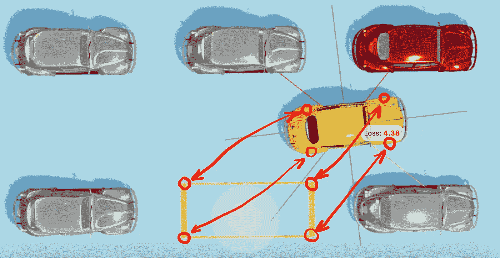

测量汽车的适应性。作者插图。

单独计算每个车轮和每个拐角之间的距离(而不是只计算从汽车中心到停车点中心的距离)将使汽车保持相对于停车点的正确方向。

空间中两点之间的距离将根据[勾股定理](https://en.wikipedia.org/wiki/Pythagorean_theorem)计算，如下所示:

```
type NumVec3 = [number, number, number];// Calculates the XZ distance between two points in space.
// The vertical Y distance is not being taken into account.
const euclideanDistance = (from: NumVec3, to: NumVec3) => {
  const fromX = from[0];
  const fromZ = from[2];
  const toX = to[0];
  const toZ = to[2];
  return Math.sqrt((fromX - toX) ** 2 + (fromZ - toZ) ** 2);
};
```

汽车和停车位之间的距离(T0)将这样计算:

```
type RectanglePoints = {
  fl: NumVec3, // Front-left
  fr: NumVec3, // Front-right
  bl: NumVec3, // Back-left
  br: NumVec3, // Back-right
};type GeometricParams = {
  wheelsPosition: RectanglePoints,
  parkingLotCorners: RectanglePoints,
};const carLoss = (params: GeometricParams): number => {
  const { wheelsPosition, parkingLotCorners } = params; const {
    fl: flWheel,
    fr: frWheel,
    br: brWheel,
    bl: blWheel,
  } = wheelsPosition; const {
    fl: flCorner,
    fr: frCorner,
    br: brCorner,
    bl: blCorner,
  } = parkingLotCorners; const flDistance = euclideanDistance(flWheel, flCorner);
  const frDistance = euclideanDistance(frWheel, frCorner);
  const brDistance = euclideanDistance(brWheel, brCorner);
  const blDistance = euclideanDistance(blWheel, blCorner); return (flDistance + frDistance + brDistance + blDistance) / 4;
};
```

由于`fitness`应该与`loss`成反比，我们将这样计算:

```
const carFitness = (params: GeometricParams): number => {
  const loss = carLoss(params);
  // Adding +1 to avoid a division by zero.
  return 1 / (loss + 1);
};
```

您可以在[进化模拟器](https://trekhleb.dev/self-parking-car-evolution?parking=evolution#/)仪表盘上看到特定基因组和当前汽车位置的`fitness`和`loss`值:

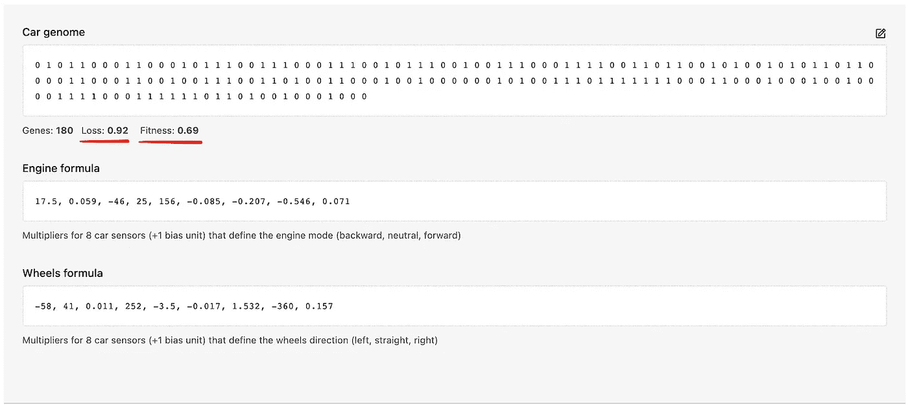

进化模拟器仪表板截图

# 启动进化

让我们把进化函数放在一起。我们将“创造世界”，启动进化循环，让时间前进，让一代人进化，让汽车学会如何停车。

为了获得每辆车的适应值，我们需要在虚拟的 3D 世界中运行汽车行为的模拟。[进化模拟器](https://trekhleb.dev/self-parking-car-evolution)就是这么做的——它在模拟器中运行下面的代码，模拟器是用 Three.js 制作的[:](https://github.com/trekhleb/self-parking-car-evolution)

```
// Evolution setup example.
// Configurable via the Evolution Simulator.
const GENERATION_SIZE = 1000;
const LONG_LIVING_CHAMPIONS_PERCENTAGE = 6;
const MUTATION_PROBABILITY = 0.04;
const MAX_GENERATIONS_NUM = 40;// Fitness function.
// It is like an annual doctor's checkup for the cars.
const carFitnessFunction = (genome: Genome): number => {
  // The evolution simulator calculates and stores the fitness values for each car in the fitnessValues map.
  // Here we will just fetch the pre-calculated fitness value for the car in current generation.
  const genomeKey = genome.join('');
  return fitnessValues[genomeKey];
};// Creating the "world" with the very first cars generation.
let generationIndex = 0;
let generation: Generation = createGeneration({
  generationSize: GENERATION_SIZE,
  genomeLength: GENOME_LENGTH, // <- 180 genes
});// Starting the "time".
while(generationIndex < MAX_GENERATIONS_NUM) {
  // SIMULATION IS NEEDED HERE to pre-calculate the fitness values. // Selecting, mating, and mutating the current generation.
  generation = select(
    generation,
    carFitnessFunction,
    {
      mutationProbability: MUTATION_PROBABILITY,
      longLivingChampionsPercentage: LONG_LIVING_CHAMPIONS_PERCENTAGE,
    },
  ); // Make the "time" go by.
  generationIndex += 1;
}// Here we may check the fittest individuum of the latest generation.
const fittestCar = generation[0];
```

运行`select()`函数后，`generation`数组按照适合度值降序排序。因此，最合适的车将永远是数组中的第一辆车。

**拥有随机基因组的第一代**汽车将会有如下表现:


第一代汽车。作者制作的动画

**在第 40 代车型上**汽车开始学习什么是自动泊车，并开始靠近泊车点:


第 40 代车。作者制作的动画

另一个例子更具挑战性:


第 40 代车。作者制作的动画

这些车一路上撞上了其他一些车，也不完全适合停车点，但这只是自世界诞生以来它们的第 40 代，所以你可以给这些车一些时间来学习。

一代又一代，我们可能会看到损失值是如何下降的(这意味着适应值在上升)。`P50 Avg Loss`显示最合适的`50%`辆汽车的平均损失值(从汽车到停车位的平均距离)。`Min Loss`显示每一代最适合的汽车的损失值。

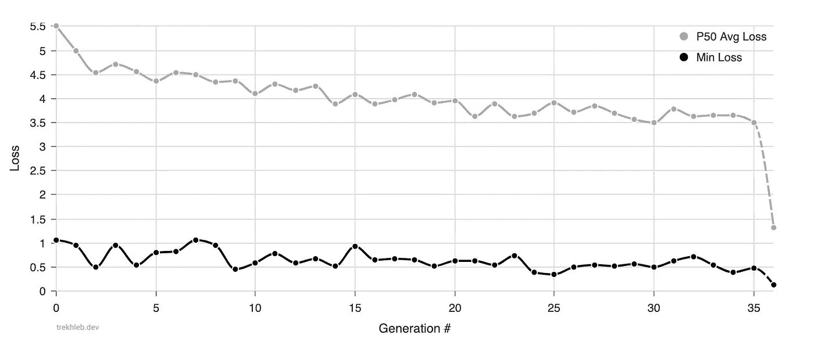

损失历史。作者插图。

你可能会看到，平均而言，这一代最健康的汽车中的`50%`正在学习更靠近停车位(从远离停车位的`5.5m`到 35 代中的`3.5m`)。`Min Loss`值的趋势不太明显(从`1m`到`0.5m`有一些噪声信号)，但是从上面的动画中你可以看到汽车已经学会了一些基本的停车动作。

# 结论

在本文中，我们将创建自动泊车汽车的高级任务分解为寻找`180`1 和 0 的最佳组合(寻找最佳汽车基因组)的简单低级任务。

然后我们应用遗传算法来寻找最佳的汽车基因组。它允许我们在几个小时的模拟中获得相当好的结果(而不是多年来运行这种幼稚的方法)。

您可以启动🚕[自动泊车汽车进化模拟器](https://trekhleb.dev/self-parking-car-evolution)直接在浏览器中查看进化过程。模拟器为您提供了以下机会:

*   您可以[从头开始训练汽车](https://trekhleb.dev/self-parking-car-evolution?parking=evolution#/)并自行调整遗传参数
*   你可以[看到训练过的自动泊车车在运行](https://trekhleb.dev/self-parking-car-evolution?parking=automatic#/)
*   您也可以[尝试手动泊车](https://trekhleb.dev/self-parking-car-evolution?parking=manual#/)

本文中展示的完整遗传源代码也可以在[进化模拟库](https://github.com/trekhleb/self-parking-car-evolution)中找到。如果你是那些真正会数并检查行数以确保少于 500 行(不包括测试)的人之一，请随意检查这里的代码[🥸.](https://github.com/trekhleb/self-parking-car-evolution/tree/master/src/libs)

代码和模拟器仍有一些未解决的问题:

*   汽车的大脑过于简单，它使用线性方程，而不是神经网络。这使得汽车不能适应新的环境或新的停车场类型。
*   当一辆车撞上另一辆车时，我们不会降低它的适应值。因此，汽车在制造交通事故时没有“感觉”到任何罪恶感。
*   进化模拟器不稳定。这意味着相同的汽车基因组可能产生不同的适应值，这使得进化效率更低。
*   evolution 模拟器在性能方面也非常笨重，因为我们无法一次性训练 1000 辆汽车，所以会减慢进化进度。
*   此外，Evolution Simulator 要求浏览器选项卡处于打开和活动状态，以执行模拟。
*   还有[更](https://github.com/trekhleb/self-parking-car-evolution/issues) …

然而，本文的目的是在学习遗传算法如何工作的同时获得一些乐趣，而不是构建一个生产就绪的自动停车特斯拉。所以，即使有上面提到的问题，我还是希望您能愉快地阅读这篇文章。

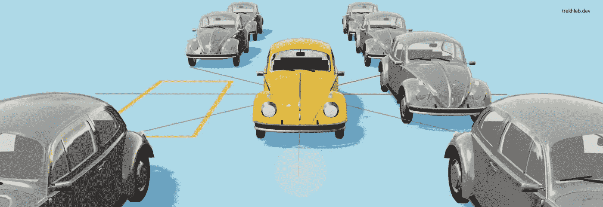

作者插图