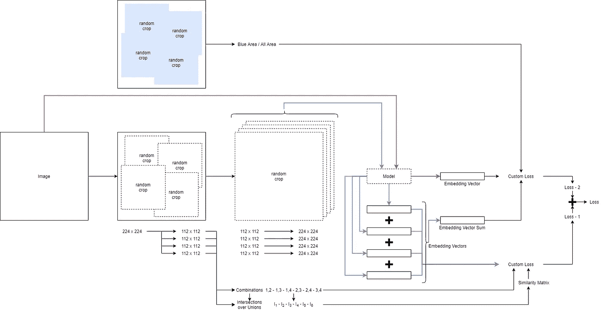
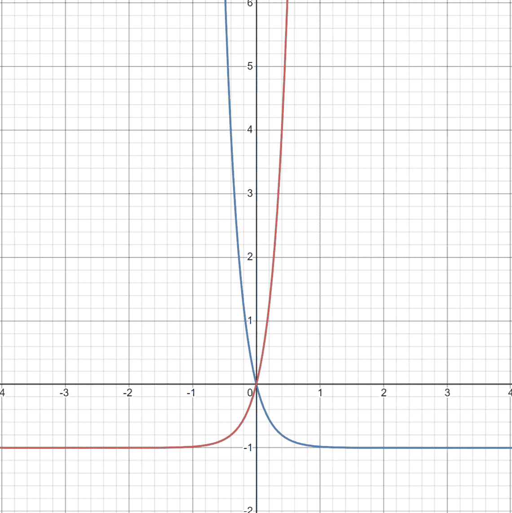
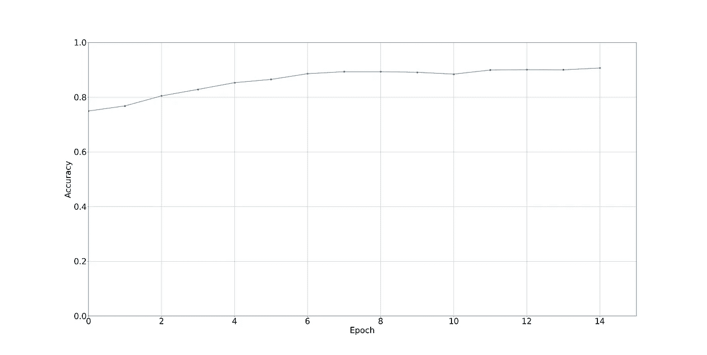

# 自监督学习算法:带 IOUs 的矢量差和矢量和(VDVS)

> 原文：<https://towardsdatascience.com/self-supervised-learning-algorithm-vector-difference-and-vector-sum-with-ious-vdvs-d8d4ecbdecfb?source=collection_archive---------42----------------------->

## 一种使用嵌入向量的和与差的自监督学习算法

***链接到 GitHub 中的资源库:***[***【https://github.com/evrimozmermer/vectorsum_vectordifference】***](https://github.com/evrimozmermer/vectorsum_vectordifference)

# 介绍

自我监督学习是深度学习模型的学习方法，它试图在没有人类监督的情况下捕捉有意义的特征，从而迫使模型将输入数据映射到特定的标签。 [**10L —计算机视觉中的自监督学习**](https://www.youtube.com/watch?v=8L10w1KoOU8&list=PLLHTzKZzVU9e6xUfG10TkTWApKSZCzuBI&index=21) **中提到了几种自监督学习方法。**

在这篇文章里，我分享一个我做的方法(据我所知)。

# 提议的方法

所提出的方法使用在 [**VeriMedi:使用基于代理的深度度量学习和精确解的药丸识别**](https://arxiv.org/ftp/arxiv/papers/2104/2104.11231.pdf) **的未来研究部分中所述的向量和逻辑。**



作者提供的图片-建议方法的图表

步骤:

1.  在图像的左上角定义随机坐标。
2.  用定义的随机坐标和输入图像的一半大小裁剪随机片段。将裁剪的图像调整到输入图像大小。计算裁剪图像组合的并集交集(IOU)。
3.  将裁剪后的图像提供给模型，并生成嵌入向量。(Ic:裁剪图像，Ec:裁剪图像的嵌入向量)
4.  计算嵌入向量(Ec)组合的余弦相似度。(C:组合如[(0，1)，(0，2)，(1，2)])。
5.  计算 loss 1，其中 as-is 参数为 Ec，to-be 参数为 IOUs。
6.  将输入图像提供给模型，并生成嵌入向量。(Ei:输入图像的嵌入向量)
7.  对裁剪图像的嵌入向量求和，并计算 Ei 和 Sum(Ec)之间的余弦相似度。
8.  根据输入图像上裁剪图像的遮罩总和计算 IOU。
9.  计算损耗 2，其中现状参数是上一步中的 IOU，目标参数是 Ei 与 Sum(Ec)之间的余弦相似性。
10.  合计损失并反向传播损失。

# 损失函数

为了计算损失，我使用了欧拉数，因为它的图形。计算损耗时，我从现有参数(D)中减去未来值。然后，我把 D 的欧拉数的幂加上一个系数。然后，我从总函数中减去 1，将图形下移。红线表示正损失，蓝线表示负损失。

## Python 中的损失

```
def criterion(to_be, as_is):
    diff = as_is-to_be
    res = torch.where(diff>0,
                torch.abs((torch.exp(4*(diff))-1)).sum(),
                torch.abs((torch.exp(4*(-diff))-1)).sum())
    return res.sum()
```



作者图片-损失函数的图表(x 轴上方的区域)

# 实验和结果

我使用了在 [**VeriMedi:使用基于代理的深度度量学习和精确解的药丸识别**](https://arxiv.org/ftp/arxiv/papers/2104/2104.11231.pdf) **中提到的 ShakeNet 数据集。**对于模型，我使用了预训练的(使用 ImageNet 数据集)ResNet-34。我在模型的末尾添加了一个嵌入层。

首先，我在没有任何培训的情况下测试了这个模型。我有 74.96%的准确率。然后，我对模型进行了 15 个纪元的训练。准确率上升到 90.69%。这说明该方法有助于模型提取更好、更有意义的特征。



作者图片