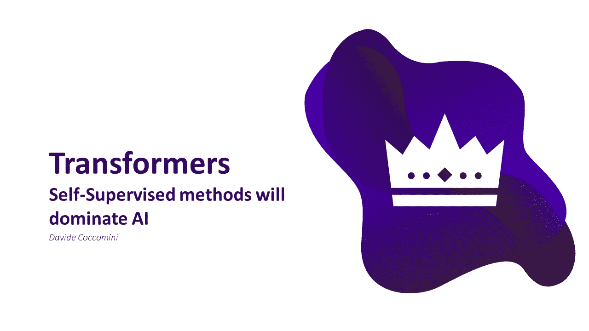
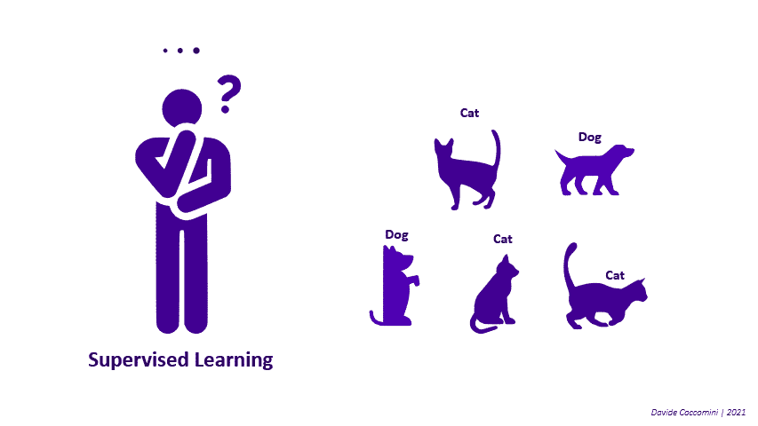
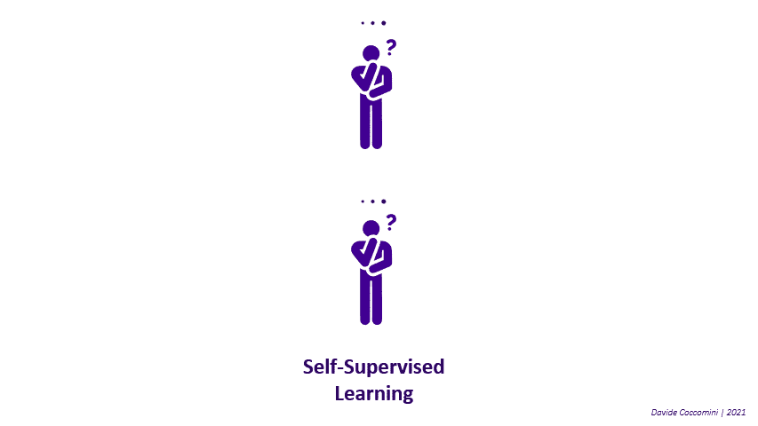
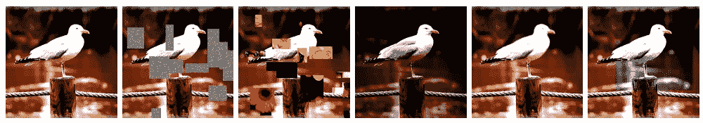
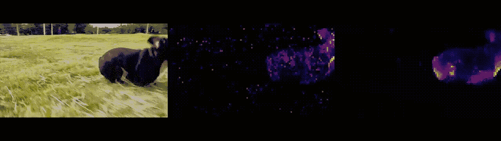
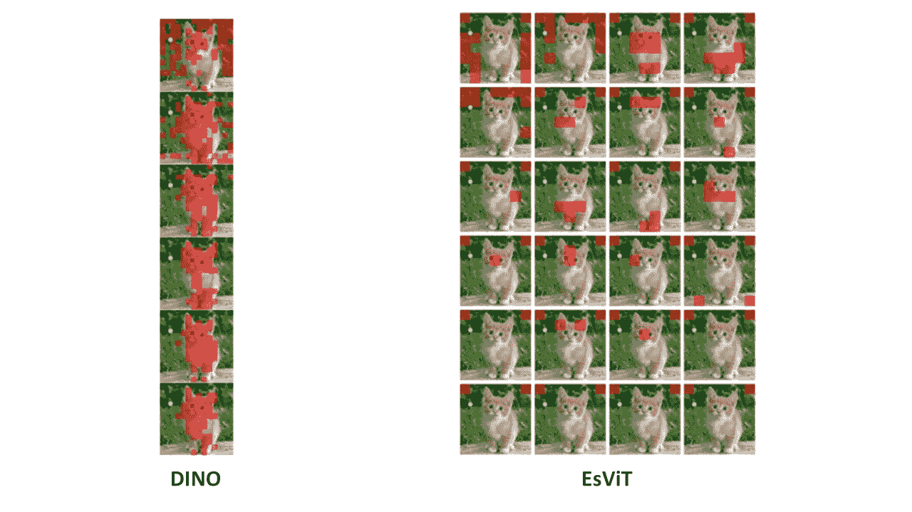

# 视觉变形器中的自我监督学习

> 原文：<https://towardsdatascience.com/self-supervised-learning-in-vision-transformers-30ff9be928c?source=collection_archive---------6----------------------->

## 什么是自我监督学习，它是如何应用于视觉变形金刚的？

任何曾经接触过机器学习世界的人肯定听说过监督学习和非监督学习。事实上，这是机器学习的两种重要的可能方法，已经被广泛使用了多年。然而，直到最近才出现了一个新术语，自我监督学习！但是让我们一步一步来，一个一个地看各种方法，试图找到与人脑的类比。

**监督学习**就像“基于标签化例子的学习”。该模型使用标记的数据进行训练，因此它们已经以这样的方式被仔细标记，即每个示例都与特定的类相关联。通过研究每个类别的各种示例的特征，模型学会了归纳，甚至能够对它从未见过的数据进行分类。因此，为了应用这种方法，需要标记良好的数据，但这些数据并不总是可用的，而且模型可能会因标记方式的不同而产生偏差。

作者图片

*与人脑的类比:研究一本书，这本书通过向你展示大量有标签的例子，明确地告诉你什么是狗，什么是猫。*

**相反，无监督学习**包括在未标记的数据中搜索具有共同特征的样本组。在大多数情况下，这些方法与聚类相关。无监督方法不需要对数据集进行标记，但需要许多示例、计算资源和一个函数来描述它们之间的差异，这并不总是容易的。

作者图片

*与人脑的类比:观察许多跑来跑去的狗和猫，分辨出哪些是狗，哪些是猫，把它们分成两组。*

**自我监督学习**是一种创新的无监督方法，正在享受巨大的成功，现在被许多人认为是机器学习的未来[1，3，6]。

主要方法是在数据集上进行训练，例如图像数据集，但是这些数据集的每一个都以其原始形式和转换版本作为输入提供。这些变换可以是任何类型的，例如裁剪或旋转。
模型必须设法最小化内部网络和接收转换图像的网络之间的预测差异，内部网络将原始图像作为输入，因此具有完整且不变的输入视觉。

作者图片

使用这种方法，可以看到生成的模型可以学习以一种出色的方式进行概括，并且不需要标签，从而生成输入的高质量表示，在某些情况下甚至比监督方法更好！用这种方法训练的模型随后将学习自己的表示系统，在该系统中，从相似对象获得的变换图像将是接近的。

*与人脑的类比:*想象你正在观察的事物中不存在的东西。比如想象一只笔看到它滚向桌子边缘就会掉下来，或者想象一只猫的尾巴末端虽然藏在树后面。

# 为什么要在《视觉变形金刚》中进行自我监督学习？

虽然视觉变压器可以实现比其他传统架构更好的结果，但它们的成功取决于对数据的大量需求。因此，以监督的方式训练这些模型需要大量的标记工作，这并不总是可能或可持续的。因此，实现视觉变压器的自我监督方法可能是一种可能的方式，使这些模型不仅强大，而且更容易应用于更广泛的问题。

为了理解这种方法有多强大，让我们先来看看自然语言处理领域，在这个领域中，自我监督的方法已经使得实现不可思议的结果成为可能。

GPT-3 是迄今为止最大的语言模型之一，拥有 1750 亿个参数，被认为是迈向人工通用智能(AGI)的第一步[7]，能够翻译文本，总结文本，回答问题，甚至根据文字描述编写代码！但要训练这样一个大型模型，它也是基于变形金刚的，你需要大量的数据，特别是 GPT 3 号，它是通过抓取互联网收集的 570GB 文本信息来训练的。假设我们想以监督的方式训练这个模型，这将意味着手动标记所有这些数据，这简直是疯了！

作者图片

也可以用其他更经典的无监督方法来克服这一障碍，但有必要定义一个合适的相似性度量(如果我们转向计算机视觉，想想这对图像意味着什么)，并消耗更多的计算资源，然后可能最终得到一个较差的模型！

[在下面的段落中，视觉变形金刚的一些基本方面将被认为是理所当然的，如果你想更深入地了解这个主题，我建议你阅读我以前对这个架构的概述。](/transformers-an-exciting-revolution-from-text-to-videos-dc70a15e617b)

# SiT:自我监督的视觉转换器

鉴于以自我监督的方式训练模型具有无可置疑的优势，提出的一种可能的方法是自我监督视觉转换器(SiT) [4]。这种方法的基本假设是，通过基于来自整个视野的上下文从未损坏部分恢复图像的损坏部分，网络将隐含地学习视觉完整性的概念。

在这种方法中，根据可用的可能策略之一，输入图像被破坏:随机丢弃、随机替换、颜色失真等。

图片来自 [SiT:自监督视觉转换器](https://arxiv.org/abs/2104.03602)

然后，图像被分成小块，并与两个附加标记(用于旋转预测的旋转标记和用于对比学习的对比标记)一起通过经典视觉转换器机制。

图片由作者根据 [SiT:自监督视觉转换器](https://arxiv.org/abs/2104.03602)制作

然后，来自变换器编码器的结果表示被变换回小块，并被重组以获得重建的图像。该模型应试图减少重建图像和原始图像之间的差异。

然后，用这种方法训练的网络的权重可以用作另一个任务的起点，例如图像分类、对象检测、分割等。

# 迪诺:无标签自行蒸馏

取得最惊人结果的方法之一当然是 DINO [2]，它通过一系列的数据扩充和使用知识提炼技术，已经能够以惊人的方式进行图像分割！

原始视频(左)、由监督模型获得的分割(中)和由 DINO 生成的分割(右)之间的比较。图片来自[脸书艾](https://ai.facebook.com/blog/dino-paws-computer-vision-with-self-supervised-transformers-and-10x-more-efficient-training/)。

关于 DINO 及其架构的详细概述可以在我之前关于这种方法的文章中找到，点击这里阅读更多内容。

这是目前提出的最有前途的方法之一，能够突出视觉变压器和自我监督相结合的可能性。

# EsViT:高效的自我监督视觉转换器

DINO 最近被用作一种新的更先进的视觉变压器的基础，称为高效自监督视觉变压器(EsViT) [8]。EsViT 还通过固定的教师网络和不断更新的学生网络来利用知识蒸馏，以尽量减少损失函数。在这种情况下，一个有趣的特点是，它采用了多级转换器而不是单片转换器，并利用稀疏注意力来减少计算。整个模型的损失函数由两个不同损失的组合给出，一个区域损失和一个视图损失。

EsViT 全局和局部令牌可视化。图片由作者基于[高效的自我监督视觉转换器进行表征学习](https://arxiv.org/abs/2104.14294?fbclid=IwAR1Tzadc3aLFTm8ck7StRkqDyCX9wLNhED__1a2BaRqe1Hll2pHVd7DVDAM)

给定输入图像，一组不同的视图确实是使用不同的数据增强技术生成的。这些结果视图被配对以获得一组对。然后，每一对都被转换成令牌，并用于构成损失的第一部分，即视图损失。

作者强调:“在 DINO 中，损失函数只在粗略的水平上鼓励“局部到全局”的对应:大作物和小作物在视图水平上匹配，留下未指定的区域到区域的对应”[8]。EsViT 解决这一问题的一个重要特性是，当移动到区域级别时，可以看到它。事实上，所考虑的图像对的两幅图像都被分成小块，然后通过一种特殊的密集自我监督学习方法来利用这些小块，该方法考虑到它们的对应关系，直接在局部特征的级别上工作。

查看注意图可以看出，DINO 倾向于自动学习导致前景对象分割的类特定注意图，而不管它的查询位于前景还是背景，而 EsViT 的各个头学习的注意图更加多样化。

迪诺(左)和埃斯维特(右)不同头部的注意力图。图片由作者基于[高效的自我监督视觉转换器进行表征学习](https://arxiv.org/abs/2104.14294?fbclid=IwAR1Tzadc3aLFTm8ck7StRkqDyCX9wLNhED__1a2BaRqe1Hll2pHVd7DVDAM)

这种不同的方法使 EsViT 在 ImageNet 上取得了非常好的结果，并推出了更轻、更高效的模型！

# 结论

人类产生的数据量惊人且史无前例。据估计，每天产生 2.5 万亿字节，而且这个数字还在上升[11]。物联网系统正变得越来越普遍，传感器在任何给定的时间收集数据，社交网络的大规模使用及其可访问性允许任何人在几分钟内在网络上输入信息，卫星收集我们星球上的各种数据。

想想看，仅在过去的两年里，世界上 90%的数据都是由我们生成的！

这些数据是机器学习的黄金，是任何模型的燃料，其丰富程度可以打开无数应用的大门，这是我们今天甚至无法想象的。然而，难以想象的是，相信这些模型可以在监督下进行训练，因为这将需要耗费精力和不可持续的人工标记。因此，无人监督的方法，尤其是自我监督的方法，将在该领域变得越来越重要，并且与视觉转换器等新架构相结合，它们将成为机器学习未来的主要参与者。

# 参考资料和见解

[1]《脸书艾》。"自我监督学习:智能的暗物质"

[2]《大卫·柯考米尼》。"迪诺上的[，无标签自行蒸馏](/on-dino-self-distillation-with-no-labels-c29e9365e382)"

[3]《尼勒什·维杰拉尼亚》。"[计算机视觉的自监督学习方法](/self-supervised-learning-methods-for-computer-vision-c25ec10a91bd)"

[4]“萨拉·阿蒂托等人”。" [SiT:自监督视觉转换器](https://arxiv.org/abs/2104.03602)"

[5]《大卫·柯考米尼》。"[关于变压器、定时器和注意事项](/transformers-an-exciting-revolution-from-text-to-videos-dc70a15e617b)"

[6]《马特维科夫通》。"自我监督学习，人工智能的未来"

[7]《open ai》。" [GPT-3 驱动下一代应用](https://openai.com/blog/gpt-3-apps/)"

[8]《李春燕等人》。"[用于表示学习的高效自监督视觉转换器](https://arxiv.org/abs/2106.09785)"

[9]《大卫·柯考米尼》。"[注意力是你在《变形金刚》中真正需要的吗？](/is-attention-what-you-really-need-in-transformers-6c161c2fca83)

[10]《大卫·柯考米尼》。"[视觉变压器还是卷积神经网络？都是！](/vision-transformers-or-convolutional-neural-networks-both-de1a2c3c62e4)

[11]《伯纳德·马尔》。"[我们每天创造多少数据？每个人都应该阅读的令人兴奋的统计数据](https://bernardmarr.com/how-much-data-do-we-create-every-day-the-mind-blowing-stats-everyone-should-read/)

[12]《德瓦尔·沙阿和阿布舍克·贾》。"[自我监督学习及其应用](https://neptune.ai/blog/self-supervised-learning)"