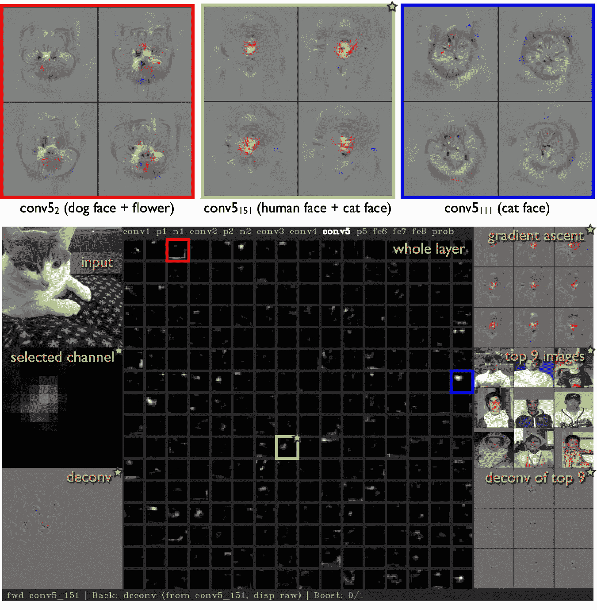
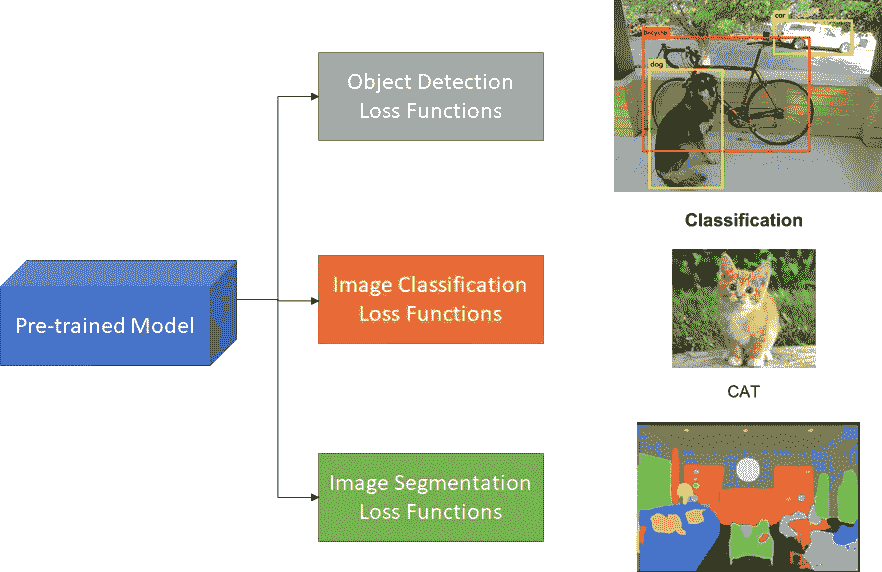

# (自我)监督的预培训？自我训练？从哪个开始？

> 原文：<https://towardsdatascience.com/self-supervised-pre-training-self-training-which-one-to-use-8c796be3779e?source=collection_archive---------14----------------------->

## 自我监督的职前培训的现状如何？我们真的需要预培训吗？自我训练怎么样？

最近，预训练一直是计算机视觉(也是 NLP)的热门话题，特别是 NLP 的突破之一— [BERT](https://arxiv.org/pdf/1810.04805.pdf) ，他提出了一种通过使用“自我监督”信号来训练 NLP 模型的方法。

简而言之，我们提出了一种算法，它可以自己生成一个“伪标签”(意思是对于特定任务为真的标签)，然后我们将学习任务视为一个有监督的学习任务，并生成伪标签。它通常被称为“托词任务”。例如，BERT 使用掩码词预测来训练模型(我们可以在它被训练后说它是预训练的模型)，然后用我们想要的任务(通常称为“下游任务”)来微调模型，例如评论评论分类。屏蔽词预测是随机屏蔽句子中的一个词，并要求模型预测给定句子中的那个词是什么。

因此，我们可以通过使用大量的**未标记的**训练数据(例如来自互联网的数百万个句子)来训练它，从而获得非常好的性能 NLP 模型，这节省了大量标记数据的时间。

在 NLP 中，我们可以很容易地从互联网上获得一个句子，因为该句子是离散的，并且通常是合法的(例如，从维基百科获得一个句子，该句子是错误的和不可读的是不常见的)。因此，在 NLP 中定义一个托词任务是相当容易的。然而，图像要困难得多，因为信号是连续的，像素的范围是[0，255]，我们人类很难解释一堆像素值，任何像素的移动对人类来说都不是问题，但对计算机来说则完全不同。

在这篇文章中，我将介绍什么是预训练模型，下游任务，计算机视觉的自我监督学习的现状，如何定义计算机从图像中学习**有意义的**和**不变的**特征的借口任务，以及总是应用预训练是否好，是否有预训练的替代解决方案。我假设读者对 CNN 和深度学习有一些基本的了解。

## 计算机视觉项目深度学习的一般流程

在谈论具体术语之前，我们先来看看深度学习项目的全貌(专门针对计算机视觉项目，但应该适用于所有其他项目)

```
from torchvision.models import alexnetmodel = alexnet(pretrained=True) # set pretrained=True
custom_task_model = prepare_custom_model()
dataset = load_dataset()
dataloader = DataLoader(dataset)for epoch in range(epochs):
  for data, label in dataloader:
    # representation could be feature maps or vector
    representation = model(data) 
    # compute specific outputs such as object detection outputs
    output = custom_task_model(representation) 
    # compute specific task loss
    loss = criterion(output, label) 
    loss.backward()
    # update model and/or custom_task_model
    optimizer.step()
```

对于所有几乎开源的研究项目，你都会看到上面的伪代码。常见的差异是*如何加载数据集、不同的模型架构、不同的任务和不同的损失函数(“标准”)。*

正如你从上面的伪代码中注意到的，“表示”是任何特定任务(例如分类任务)中最重要的部分，它有很多名称，例如“嵌入”、“向量”、“特征”。字面意思是，这个实值向量是描述数据的“表示”，尽管它很难被人类解释，但它实际上对计算机理解数据是有意义的。这是因为我们希望计算机对输入的数据进行分类，但数据的像素太复杂，因此我们希望从数据的像素中提取“特征”，即**，以找出哪些像素的组合实际上能够描述数据。**因此，让计算机学会如何组合这些像素以便对它们进行分类是很重要的。

## 预训练模型

由 **torchvision.models** 提供的预训练模型通过监督学习(交叉熵损失)在 ImageNet1000 上进行训练。获得预训练模型的最简单方法是，当您从这个包中构造任何模型时，设置关键字“pretrained=True”(参见上面的伪代码)。

在计算机视觉的深度学习社区中，我们总是从 ImageNet 预训练模型开始，并针对特定数据集的特定任务对模型进行微调，这是非常常见的。因为预训练模型有助于节省从零开始训练模型的时间，因为它已经学习的表示已经适合于(或者容易转移)特定的任务，例如图像分类或者对象检测。



图来自 Yosinki 的“[通过深度可视化理解神经网络”。](https://arxiv.org/abs/1506.06579)

例如，上图是一个经过训练的 AlexNet 上的深度可视化。特征图(那些黑色背景但带有一些白色点的)是一些特征的“激活”，意味着卷积层中的特定通道已经找到了*如何组合像素来表示一些有意义的内容*，(例如猫头)。所有预先训练的模型都有能力做到这一点(这是必须的！如果不是，这是一个坏的预训练模型哈哈…)，因此用一个预训练模型开始你的项目绝对是一个好的选择。

## 下游任务



作者编辑的图像。(附赠: [YOLO](https://pjreddie.com/darknet/yolo/) 、 [ImageNet](https://www.image-net.org/) 和 [CSAILVision](https://github.com/CSAILVision/semantic-segmentation-pytorch) )

当研究论文提到“下游任务”(我初学的时候很困惑)时，字面意思是指预先训练好的模型在图像分类、物体检测、图像分割等方面能做什么。所有这些任务被称为“下游任务”，这实际上是大多数表征学习论文使用的一个技术术语。

简而言之，我们使用预先训练的模型权重作为初始化来微调模型以执行特定的任务。因为某些领域(如医疗领域)很难获得数据，而且获取数据的成本很高，所以用预先训练好的模型进行初始化非常重要，如果有计算限制，这也会减少训练时间。

## 我所知道的自我监督学习方法列表(到 2021 年 6 月)

据我所知，二语习得可以分为基于任务的，基于对比学习的，基于聚类学习的。注意，有些论文会把自我监督学习说成无监督学习。此外，请注意，两种生成模型— AutoEncoder 和 GAN 也可以学习没有标签的表示，例如，您可以使用 AE 的编码器或 GAN 的鉴别器作为预训练模型(两者都将图像作为输入)，但我没有在此列出它们，因为它们中的一些在任务上过于具体，因此我认为它不足以成为预训练模型。

## 手工制作的借口任务

一些研究人员建议让模型学习对不需要标记数据的人类设计的任务进行分类，但我们可以利用这些数据来生成标签。

[上下文预测(预测位置关系)](https://arxiv.org/pdf/1505.05192.pdf)
[拼图](https://arxiv.org/pdf/1603.09246)
[预测旋转](https://arxiv.org/abs/1803.07728) [着色](https://arxiv.org/pdf/1603.06668.pdf)
[图像修复](https://openaccess.thecvf.com/content_cvpr_2018/papers/Yu_Generative_Image_Inpainting_CVPR_2018_paper.pdf)(学习填充图像中的空白区域)

总而言之，这些任务使用算法来生成伪标签，以便模型可以通过交叉熵损失等监督学习来学习表示。关于算法的细节，你可以阅读我在列表中放了链接的论文。

## 对比学习

术语“对比”意味着区分，因此对比学习意味着学习在正样本和负样本之间进行比较。

[sim clr](https://arxiv.org/abs/2002.05709)
[sim clr v2](https://arxiv.org/abs/2006.10029)
[Moco](https://arxiv.org/abs/1911.05722)
[Moco v2](https://sci-hub.do/https://arxiv.org/abs/2003.04297)
[PIRL](https://openaccess.thecvf.com/content_CVPR_2020/html/Misra_Self-Supervised_Learning_of_Pretext-Invariant_Representations_CVPR_2020_paper.html)

这些方法有时也被称为“实例辨别”，因为它们利用实例的特征进行学习。简而言之，核心概念是**最大化相似特征向量之间的点积，最小化不相似特征向量之间的点积。**这些方法都有自己定义相似和相异的方法。并且它们中的大多数利用“数据增强”，即，正对是具有不同种类增强的相同图像，而负对只是不同的图像(也具有不同种类的增强)。

这些方法是自我监督学习的当前趋势，因为这些论文声称对比学习可以学习更加**不变**的特征(例如，我之前展示的猫头的特征图，猫头在图像中的位置并不重要，只要猫头出现，它就会激活)，因为它可以“比较”并找出两幅增强图像中的共同特征。

## 聚类学习

我将基于最近邻的学习称为聚类学习，因为我将每个数据点视为一个中心，并将最近邻视为一个聚类。

[深度聚类](https://openaccess.thecvf.com/content_ECCV_2018/html/Mathilde_Caron_Deep_Clustering_for_ECCV_2018_paper.html)
[SeLA](https://arxiv.org/pdf/1911.05371.pdf)
[扫描](https://arxiv.org/abs/2005.12320)
[SwAV](https://arxiv.org/abs/2006.09882)

这些方法更容易理解，我用深度聚类来解释，因为我认为这很简单。我们首先对特征(质心的数量是一个超参数)进行聚类，然后将聚类结果的预测标签作为伪标签，然后将其视为图像分类问题，并使用交叉熵损失进行学习。同样，不同的方法有它们自己的寻找伪标签的版本。

我个人推荐基于聚类的学习，因为它更直观，但我个人认为其中两个大问题是如何高效准确地执行在线聚类(意味着不需要遍历所有数据，而只需遍历批处理本身)和如何正确定义质心的数量。(尽管如此，SwAV 说，只要质心的数量“足够多”，学习应该不是问题)。

## 反思职前培训和自我培训

嗯，题目其实和一篇叫“[反思预训和自训](https://arxiv.org/abs/2006.06882)”的论文一样。本文发现，在某些情况下，预训练不如自我训练。

概括来说，自我训练法有如下几个常见步骤:

1.  学习带有标记数据的(教师)模型(通常有很强的扩充)
2.  为来自(教师)模型的未标记数据生成软/硬伪标签
3.  使用标记数据和伪标记的未标记数据重新训练(学生)模型。
4.  重复步骤 1 2 和 3。(通过用学生模型初始化教师模型)

它实际上是一种半监督学习方法。“自我”一词是指模型先用一些数据进行学习(并且模型是随机初始化的)，然后用自己的知识对新的看不见的数据进行分类，把高度自信的预测结果作为新数据，用它们进行学习。因此，术语“自我”意味着模型在自我学习。

这篇文章说，虽然自我训练比预训练慢得多，但它实际上有很多好处，例如**能够为特定任务**学习更多特定功能，**即使在预训练失败**时也能很好地工作，**在有更多数据的情况下甚至能很好地工作**。在论文中，他们展示了利用对象检测和语义分割进行自我训练的好处，这实际上是有意义的，因为来自预训练模型的特征是从分类任务中学习的，但是使其适应定位任务(即，对象检测)可能需要时间来调整(或者可能由于局部最小值而无法准确调整)。虽然从零开始训练会有所帮助，因为特性是从随机调整到特定的本地化任务，只是训练需要更多的时间。

尽管如此，我仍然认为预先训练在实践中是很好的，因为我们可以节省很多训练模型的时间，特别是对于快速的演示或者模型部署。但是如果你想在你的研究领域打败 SOTA，你可以试试自我训练。

## 结论

希望这篇文章可以帮助你更多地了解预培训模式，自我监督学习方法，并且能够探索一个新的领域，这就是所谓的“自我培训”(虽然它对社区来说不是新的，但对我来说是新的)。

基于自动编码器也可以被认为是自监督学习，因为它正在重构输入(标签是输入)，但是一些论文说自动编码器(具体来说是基于重构的)将试图记住输入的每个细节，因此它不够“不变”。有一个**判别**的特征是好的，即使我们丢失了信息，只要这些信息对图像中的主要内容是重要的，并且我们可以将这些信息用于下游任务，那么它就被认为是*判别*和*不变*。

如果你想了解更多关于自我监督学习的知识，我推荐你阅读这些调查， [1](https://ieeexplore.ieee.org/abstract/document/9086055) ， [2](https://www.mdpi.com/2227-7080/9/1/2) ， [3](https://arxiv.org/abs/2006.08218) 。你也可以在谷歌学术搜索关键词“自我监督学习调查”。还有另一篇论文叫做“[自我监督预训练对于视觉任务有多大用处？](https://openaccess.thecvf.com/content_CVPR_2020/papers/Newell_How_Useful_Is_Self-Supervised_Pretraining_for_Visual_Tasks_CVPR_2020_paper.pdf)”，解释了如何在视觉任务中获得自我监督预训练的帮助，如果你对自我监督学习感兴趣，我推荐你阅读。