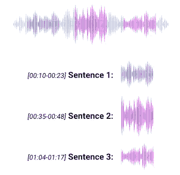
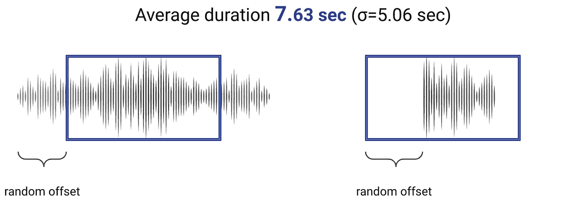
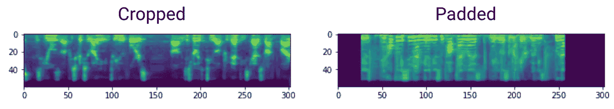
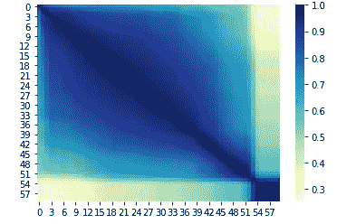
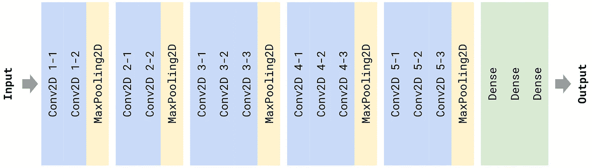
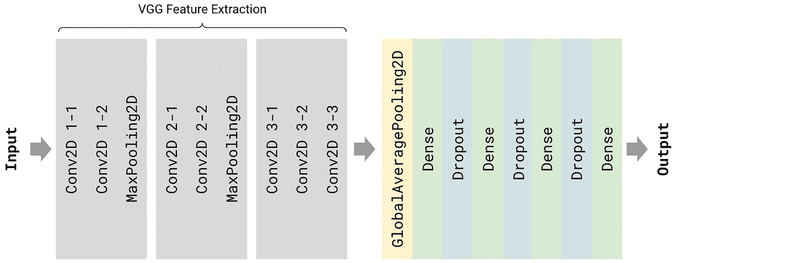
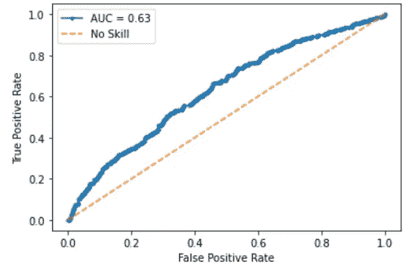

# 基于迁移学习的自监督语音情感识别

> 原文：<https://towardsdatascience.com/self-supervised-voice-emotion-recognition-using-transfer-learning-d21ef7750a10?source=collection_archive---------19----------------------->

## [实践教程](https://towardsdatascience.com/tagged/hands-on-tutorials)

## 从语音音频构建自我监督的二元情感分类器

由[paweczerwi ski](https://unsplash.com/@pawel_czerwinski?utm_source=medium&utm_medium=referral)在 [Unsplash](https://unsplash.com?utm_source=medium&utm_medium=referral) 上拍摄的照片

你有没有注意到当听到有人用快乐的语调说一些非常可怕的事情时的不安感？我们习惯于听到声音的情感与演讲的内容相匹配。可以利用这种现象来自动生成用于训练语音情感分类器的弱标记数据。

我在 Metis 数据科学训练营的最终项目的目标是从语音音频中构建一个自我监督的二进制情感分类器。情绪是复杂的多维概念，但在这个项目中，我建立了一个模型，给定一个音频剪辑，预测声音的情绪是积极还是消极。

从声音中进行情感分类最困难的事情之一是标签数据的可用性，它非常稀缺。即使标记的数据是可用的，它要么被表现出来，听起来可能不同于真实的情绪，要么被独立地标记，这是非常耗时和/或主观的。

在我们说什么和我们怎么说相关的假设下，我使用了一种自我监督的方法来使用音频抄本生成弱标记数据。

## 方法学

下图显示了构建分类器所需的处理步骤。

构建分类器的解决方案架构

使用上述解决方案架构，构建模型所需的唯一数据是转录的音频文件，没有任何情感标签。左侧是处理音频文件所需的步骤，右侧是使用预先构建的情感分析库从脚本数据生成标签的步骤。

在这个项目中，我使用了[卡内基梅隆大学的多模态意见情绪和情感强度数据集](http://multicomp.cs.cmu.edu/resources/cmu-mosei-dataset/)。这可以说是关于这个主题的最全面的数据集，涵盖了语言、视觉和听觉形态。该数据集由超过 1000 名在线 YouTube 发言人的超过 23，500 个句子话语视频组成。这是完全转录和适当的标点符号。虽然这种方法不需要任何情绪标签，但我使用这个数据集的原因是为了让我在未来对结果进行基准测试和比较。

## 数据预处理

数据集中的音频文件非常大，包含多个句子和非语音音频，如音乐。因此，第一个预处理步骤是从完整的音频文件中提取每个句子的音频片段。为了提取音频剪辑，我使用了抄本的时间戳。

使用抄本时间戳按句子分割音频文件

我使用的建模技术需要相同长度的特征，在我的例子中是相同长度的音频剪辑。因此，我决定根据数据中剪辑的平均持续时间，将我的音频文件裁剪或填充到 7 秒。

长于 7 秒的音频剪辑是我用随机偏移剪辑的。对于较短的剪辑，我也用随机偏移填充了静音(零)。

将音频文件裁剪或填充到固定长度

在分割和填充我的音频文件后，我使用了 [Librosa](https://librosa.org/doc/latest/index.html) 库将音频转换成 Mel 比例光谱图。这些是信号频谱随时间变化的直观表示，广泛用于音频分类。

下面你可以看到数据集中两个随机音频文件的 Mel 光谱图。右边图两边的黑色区域是我用来填充音频剪辑的静音，因为它短于 7 秒。

来自数据集的两个随机音频文件的 Mel 光谱图

对于文字记录，我使用了两个不同的现成文本情感分析库——[text blob](https://textblob.readthedocs.io/en/dev/quickstart.html)和 [Vader](https://pypi.org/project/vaderSentiment/) ，来测量句子的二元情感。我对每次观察的情绪得分进行了平均，并在此基础上对我的观察进行了二元分类——积极的和消极的。我排除了平均情绪绝对值非常低的观察结果。

## 情感识别建模

在数据预处理步骤之后，我将数据集分成 80%的训练集、10%的验证集和 10%的测试集。

我使用 [ROC AUC](https://developers.google.com/machine-learning/crash-course/classification/roc-and-auc#:~:text=An%20ROC%20curve%20(receiver%20operating,False%20Positive%20Rate) 作为我的二元分类器的主要性能指标。这是一种通常用于具有不平衡类的二元分类器的性能度量。它的值范围从 0 到 1，无信息分类器产生 0.5，完美分类器产生 1。

由于我的训练集只有略多于 11，000 个观察值，为了减少特征的数量，我对跨时间戳的 Mel 谱图值进行了平均。正如所料，许多谱图特征彼此高度相关。

特征之间的相关性

我建立的一些经典机器学习模型产生了以下 ROC AUC 分数:随机森林 0.51，K-最近邻 0.54，深度神经网络 0.6。

为了使用我的光谱图中的全部数据，而不求平均值，我决定使用迁移学习从我的光谱图中提取低维特征。为此，我使用了 [VGG16](https://keras.io/api/applications/vgg/) Keras 预训练网络。

VGG16 是由 K. Simonyan 和 A. Zisserman 提出的卷积神经网络

作为 DNN 输入的低维特征

我用这些提取的特征用 Keras 训练了一个模型。该模型在验证集上的性能为 0.61，在测试集上的性能为 0.63。这不是一个显著的改进，但由于它使用了整个光谱图，随着更多的观察，它有最大的改进潜力。

DNN 用 VGG16 提取特征测试集 ROC 曲线

## 用我自己的声音测试

作为一个有趣的实验，我决定测试这个模型是否可以推广到其他语言。我录下了 8 段话语:我说的四种语言——英语、法语、俄语和亚美尼亚语——各有一段正面和一段负面的话语。然后我从这些声音片段中预测了情绪。

结果值非常接近，因此我使用最小最大缩放在 0 和 1 之间缩放它们。基于这些极其有限的数据，似乎语言起了很大的作用。然而，在每种语言中，积极的情绪记录比消极的情绪记录得分高，这是一个很好的结果。下一步将是用适当的统计严谨性来研究这一现象。

回放录制的话语

## 结论

总之，我已经创建了一个自我监督的机器学习分类器，它使用转移学习从语音中预测情感，并根据音频转录本生成的标签进行训练。

像任何其他方法一样，这也有它的优点和缺点。优点主要归结为大量未标记数据的可用性和推广到其他语言的潜力。缺点大多与这样一个事实有关:我们所说的和我们所说的方式并不总是一致，这导致了大量不准确的标签。

这种类型的模型可以有各种业务应用，其中之一是在呼叫中心使用它来衡量和提高代理提供的服务质量。

请访问我的 [Github](https://github.com/SatenikS) 帐户，看看这个和我的其他项目的代码。也可以随时通过 [LinkedIn](https://www.linkedin.com/in/satenik-safaryan/) 联系我。