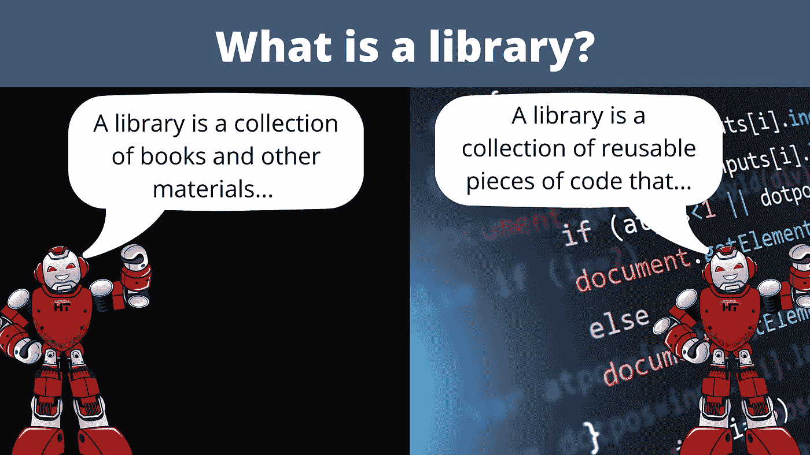

# 自言自语:从文本生成转换器模型中获取知识

> 原文：<https://towardsdatascience.com/self-talk-obtain-knowledge-from-text-generation-transformer-models-918277dbfc8b?source=collection_archive---------19----------------------->


作者图片

## 有了变形金刚模型，谁还需要字典？

文本生成转换器模型确实令人印象深刻。当 OpenAI 认为其名为 GPT-2 的模型过于危险而不能发布时，它们首次引起了公众的注意。他们不可避免地发布了这个模型，包括它的最大版本，你现在只需要几行代码就可以使用。从那以后，这些型号在尺寸和性能方面都有了很大的发展。现在，OpenAI 的最新模型，称为 GPT-3，可以[执行基本运算](https://arxiv.org/abs/2005.14165)并生成[现实新闻文章](https://www.theguardian.com/commentisfree/2020/sep/08/robot-wrote-this-article-gpt-3)。

本文将关注文本生成转换模型的最新应用之一——知识生成。从高层次来看，这些模型相当简单；他们试图继续你提供给他们的文本。现在，如果你向模型提出一个问题呢？嗯，模型将继续文本，因此，通常会尝试回答问题。通过这样做，他们将利用他们在培训中学到的知识来产生信息。到本文结束时，您将知道如何用最少的 Python 代码实现最先进的人工智能模型来执行这项任务。


作者图片

# 发现

艾伦人工智能研究所(AI2)第一个发现了变形金刚模型的这种应用，并将其命名为自言自语。我的本科顶点项目团队独立发现了一种方法，与 AI2 在得知他们的论文之前提出的方法非常相似。因此，我从我的顶点项目和 AI2 的论文中得到了一些见解来分享。

# 基本实现

在本教程中，我们将实现一个稍微简化的自言自语版本。我们将使用我自己的[快乐变形金刚](https://github.com/EricFillion/happy-transformer) Python 包，它是在[拥抱脸的变形金刚库](https://github.com/huggingface/transformers)之上的一个包装器。Happy Transformer 允许您用几行代码实现和训练 Transformer 模型——包括我们将在本教程中使用的文本生成模型。

# 装置

首先，PyPI 上提供了 Happy Transformer，因此我们可以用一行代码来安装它。

```
pip install happytransformer
```

# 下载模型

现在，我们将从 Happy Transformer 中导入一个名为 HappyGeneration 的类来下载一个文本生成模型。

```
from happytransformer import HappyGeneration
```

从这里，我们可以加载一个名为 GPT-尼奥的 GPT-3 的完全开源版本。目前有三种不同尺寸的 GPT-尼奥模型可以在拥抱脸的模型分销网络上买到。我们将使用第二大(或者第二小，如果你感到悲观)模型，它有 1.3B 个参数。这里有一个[链接](https://huggingface.co/EleutherAI)到其他型号，如果你想使用它们。

要创建 HappyGeneration 对象，我们必须为其第一个位置参数提供模型类型，为其第二个位置参数提供模型名称。在这种情况下，型号类型为“GPT-尼奥”，型号名称为“EleutherAI/gpt-neo-1.3B”，如型号的[网页](https://huggingface.co/EleutherAI/gpt-neo-1.3B)左上方所示。

```
happy_gen = HappyGeneration("GPT-NEO", "EleutherAI/gpt-neo-1.3B")
```

# 文本生成算法

您可以使用不同的文本生成算法来生成文本。现在，本文的目的不是深入解释不同的文本生成算法，而是描述如何实现自言自语。在我的团队测试的四种不同的文本生成算法中，我们发现“波束搜索”算法是最有效的。这个算法是确定性的，这意味着每次运行它，都会得到相同的结果。

要修改设置，我们必须导入一个名为 GENSettings 的类。然后，我们可以修改各种参数来选择和修改我们希望使用的算法。

```
from happytransformer import GENSettingsbeam_settings = GENSettings(num_beams=5, max_length=50, no_repeat_ngram_size=3)
```

AI2 使用了一种叫做 top-p 抽样的算法，p 值为 0.5 来生成答案。与波束搜索不同，该算法是不确定的，这意味着每次运行它时，它都会产生不同的文本。

```
top_p_settings = GENSettings(do_sample=True, top_k=0, top_p=0.5, max_length=50)
```

# 获取知识

我们现在可以开始创造知识了！让我们创建一个问题，然后使用文本生成模型来回答它。为此，我们将调用 happy_gen 的 generate()方法。

```
question = "What is a dog?" result = happy_gen.generate_text(question, args=beam_settings) print(result.text)
```

*结果:狗是犬科动物的一员，包括狗、狼、郊狼、狐狸和豺。狗已经被驯化了一万多年。他们首先被驯化*

还不错！现在，如果您使用 top-p 设置来代替，那么每次您执行推理时，都会得到一个原始的结果。这里有一个使用 top-p 算法的例子。

```
result = happy_gen.generate_text(question, args=top_p_settings) print(result.text)
```

*结果:狗是一种驯养的动物，被饲养来作为伴侣，通常是为了狩猎、守卫或工作。狗通常被称为“宠物”或“伙伴”,因为它们通常是为“T7”而饲养的*

# 包括上下文



作者图片

如果可能的话，我建议你在你的输入中添加额外的上下文。例如，假设您要求模型定义一个恰好是同音异义词的单词。然后，该模型可能会产生一个不适合您的上下文的单词含义的定义。下面是在问题前添加和不添加上下文的情况下生成知识的两个示例。

```
input_no_context = "What is a library?" result_no_context = happy_gen.generate_text(input_no_context, args=beam_settings) print(result_no_context.text)
```

结果:图书馆是书籍和其他材料的集合，可用于各种目的，如研究、教学或娱乐。图书馆和书店的区别是什么？书店是一个

```
input_with_context = "Happy Transformer is an open-souce Python package. What is a library?" result_with_context = happy_gen.generate_text(input_with_context, args=beam_settings) print(result_with_context.text)
```

*结果:库是可重用代码片段的集合，它们可以一起用来解决一个共同的问题。例如，一个库可以是一组在程序中一起使用来执行特定任务的函数。*

如您所见，通过提供上下文，我们帮助模型缩小了“库”的含义所以，我建议你在进行自我对话时，在你的输入中加入上下文。现在，我们来讨论一下如何自动生成问题。

# 自动生成问题

假设给你一段文字，你希望通过问语言模型问题来自动生成额外的背景知识。你必须理解潜在的文本，才能提出语法正确且相关的质量问题。可以应用文本生成转换器模型来解决这个问题。

我的顶点项目团队使用命名实体识别来识别上下文中的名词，然后为每个名词创建一个问题。例如，如果单词“香蕉”在文本中，那么问题“什么是香蕉？”会产生。我们发现这种方法是有效的，但 AI2 的团队提出了一种更复杂的方法，使用文本生成模型来生成问题。

我们将讨论如何使用 AI2 提出的方法来生成问题。他们精心制作了提示，然后使用文本生成模型来继续提示以生成问题。例如，他们将自言自语应用于一项名为 Winograd Schema Challenge 的挑战，简单来说，就是预测一个模糊代词所指的名词。因此，例如，给定句子“锤子不适合工具箱，因为**它**太大了”，模型必须确定**它**是指“锤子”还是“工具箱”以下是 AI2 在挑战中使用的部分提示。[1]

然后，他们将提示附加到上下文中，并让模型产生文本。通过产生文本，模型将潜在地产生与上下文相关的可行问题。下面是这个过程的代码示例。我们将使用 p 值为 0.2 的 top-p 采样，最多生成 6 个令牌——正如 AI2 在论文中所建议的那样。

```
question_generation_settings = GENSettings(do_sample=True, top_k=0, top_p=0.2, max_length=6)context = "The hammer did not fit into the toolbox because it is too big"prompt = "What is the definition of"input = context + promptq_g_result = happy_gen.generate_text(input, args=question_generation_settings)print(q_g_result.text)
```

*结果:一个工具箱？答:*

现在，我们可以用下面一行代码隔离生成的问题。

```
# Get the location of the question mark if it exists.
# Results in -1 if not present 
q_m_location = q_g_result.text.find("?")full_question= ""question_ending = ""if q_m_location != -1:
   question_ending = q_g_result.text[:q_m_location+1]
   full_question = question_prompt + question_ending
   print(full_question)

else:
  print("question not generated. Try a different prompt.")
```

*结果:奖杯的定义是什么？*

# 应答前缀

AI2 为每个问题前缀手动创建了一个答案前缀，以帮助模型回答问题。下面的图表显示了问题和答案前缀的各种组合。[1]

请注意，每个回答提示都有一个下划线来表示其主题。我们可以用下面的代码很容易地提取出主语，因为主语只是问题的结尾而不是问号。

```
subject = question_ending[:-1] print(subject)
```

*结果:一个工具箱*

提示可以分为三个部分:主题前的文本、主题和主题后的文本。因此，这些组件可以按如下所示进行组合。

```
answer_prefix = " The definition of" + subject + " is" print(answer_prefix)
```

*结果:工具箱的定义是*

# 把所有东西放在一起

我们现在已经了解了为任意文本生成背景信息所需的一切。下面是将我们创建的各种组件组合起来形成文本生成模型的最终输入的最后一个例子。

```
final_input = context + full_question + answer_prefix print(final_input)
```

*结果:*锤子太大，放不进工具箱。工具箱的定义是什么？工具箱的定义是

AI2 建议使用 p 值为 0.5 的 top-p 采样来生成 10 个令牌。让我们来定义这些设置。

```
answer_generation_settings = GENSettings(do_sample=True, top_k=0, top_p=0.5, max_length=10)
```

我们现在拥有了生成最终结果所需的一切。

```
answer_suffix = happy_gen.generate_text(final_input, args=answer_generation_settings).textprint(answer_suffix)
```

*结果:一个存放和运输工具的盒子。是*

最后一步是结合我们的前缀和后缀的答案。

```
final_result = answer_prefix + answer_suffix print(final_result)
```

*结果:工具箱的定义是存放和运输工具的盒子。是*

那挺好的！

*注:您可能希望应用基础数据后处理，以便仅提取第一句话。*

# 差异

本文概述的方法和 AI2 概述的方法之间的主要区别是每个上下文生成的背景信息量。对于每个语境，他们至少使用了 5 个问题前缀。然后，对于每个问题前缀，他们生成 5 个问题。最后，对于每个问题，他们都有 10 个答案。这意味着，对于每一个语境，他们至少产生了 250 个答案——这是大量的背景信息！

# 结论

就是这样！您刚刚学习了如何使用 Transformer 模型生成背景信息。我相信这项技术可以进一步改进并应用于其他任务。例如，在生成问题和答案时，也许可以应用微调来帮助提高模型的性能。此外，我最近发表了一篇文章,概述了一个你可以自由追求的与自我对话相关的研究想法。我期待着阅读 NLP 研究人员如何改进和应用自言自语！

# 资源

[订阅](https://www.youtube.com/channel/UC7-EWrr8YdcQgPPk76OiUVw?sub_confirmation=1)我的 YouTube 频道或注册我的[时事通讯](https://www.vennify.ai/)以获取更多关于自言自语的内容！

本教程中使用的[代码](https://colab.research.google.com/drive/1_JfIY1xkks3v0-9mx0CbB27oeaFDk7ye?usp=sharing)

# 参考

[1] V. Shwartz，P. West，R. Bras，C. Bhagavatula1 和 Y. Choi，[用自言自语进行无监督常识性问题回答](https://arxiv.org/abs/2004.05483) (2020)，EMNLP 2020

# 归因

[Ted Brownlow](https://www.linkedin.com/in/ted-brownlow-7043ab168/) 、 [Will Macdonald](https://www.linkedin.com/in/will-macdonald-211923175/) 和 [Ryley Wells](https://www.linkedin.com/in/ryleywells78rs88/) 都是我的顶点项目团队的成员。

*原载于 2021 年 8 月 7 日*[*https://www . vennify . ai*](https://www.vennify.ai/self-talk-transformer-model/)*。*