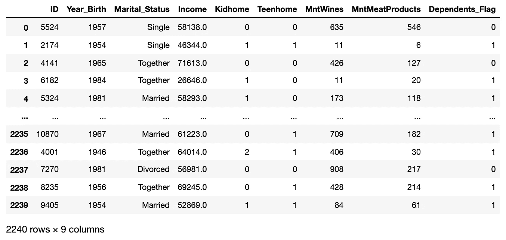
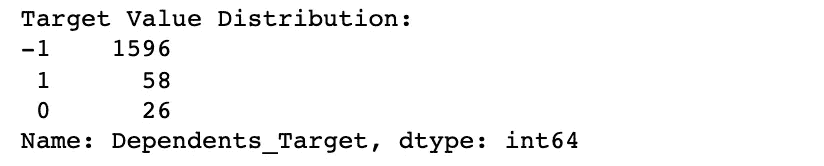

# 自训练分类器:如何使任何算法的行为像一个半监督的

> 原文：<https://towardsdatascience.com/self-training-classifier-how-to-make-any-algorithm-behave-like-a-semi-supervised-one-2958e7b54ab7?source=collection_archive---------0----------------------->

## 机器学习

## 使用 Sklearn 库中的标准分类算法进行自我训练的简单 Python 实现

自训练分类器:在每次迭代中添加伪标签。图片由[作者](https://solclover.com/)提供。

# 介绍

半监督学习结合了已标记和未标记的示例，以扩展用于模型训练的可用数据池。因此，我们可以提高模型性能，并节省大量的时间和金钱，而不必手动标记成千上万的例子。

如果你有你最喜欢的**监督的**机器学习算法，你会很高兴地听到你可以通过一种叫做**自我训练**的技术，快速适应它使用**半监督的**方法。

# 内容

*   自我训练在机器学习算法的宇宙中处于什么位置？
*   自我训练是如何进行的？
*   Python 中如何利用自我训练建立模型？

# 机器学习算法领域内的自我训练

在我们的数据科学生涯中，可用的机器学习算法比我们任何人都要多。然而，理解最常用的方法是有益的，我在下面对它们进行了分类。旭日图是**交互式**，所以一定要点击👇在不同类别的**上放大并展示更多的**。

如简介部分所述，自训练属于机器学习算法的半监督分支，因为它使用标记和未标记数据的组合来训练模型。

机器学习算法分类。由[作者](https://solclover.com/)创建的互动图表。

***如果你喜欢数据科学和机器学习*** *，请* [*订阅*](https://solclover.com/subscribe) *每当我发布一个新故事时，你都会收到一封电子邮件。*

# 自我训练是如何进行的？

你可能认为自我训练包含一些魔法或者使用一种非常复杂的方法。然而实际上，自我训练背后的想法非常简单，可以用以下步骤来解释:

1.  首先，我们收集所有标记和未标记的数据，但是我们只使用标记的观察来训练我们的第一个监督模型。
2.  然后我们用这个模型来预测未标记数据的类别。
3.  在第三步中，我们选择满足我们的预定义标准的观察值(例如，预测概率> 90%或属于具有最高预测概率的前 10 个观察值),并且**将这些伪标签**与带标签的数据相结合。
4.  我们通过使用带有标签和伪标签的观察值**训练**一个新的监督模型**来重复这个过程。然后，我们再次进行预测，并将新选择的观测值添加到伪标记池中。**
5.  我们**迭代这些步骤，直到**我们完成所有数据的标记，没有额外的未标记的观察值满足我们的伪标记标准，或者我们达到指定的最大迭代次数。

下面的插图总结了我刚才描述的所有步骤:

自我训练的迭代过程。图片由[作者](https://solclover.com/)提供。

# **如何在 Python 中使用自我训练？**

现在，让我们通过一个 Python 示例，在真实数据上使用自我训练分类器。

## 设置

我们将使用以下数据和库:

*   [来自 Kaggle 的营销活动数据](https://www.kaggle.com/rodsaldanha/arketing-campaign)
*   [Scikit-learn 库](https://scikit-learn.org/stable/index.html)用于
    1)将数据拆分成训练和测试样本([train _ test _ split](https://scikit-learn.org/stable/modules/generated/sklearn.model_selection.train_test_split.html))
    2)执行半监督学习([self training classifier](https://scikit-learn.org/stable/modules/generated/sklearn.semi_supervised.SelfTrainingClassifier.html))；
    3)模型评估([分类 _ 报告](https://scikit-learn.org/stable/modules/generated/sklearn.metrics.classification_report.html))
*   [Plotly](https://plotly.com/python/) 用于数据可视化
*   [熊猫](https://pandas.pydata.org/docs/)进行数据操作

首先，让我们导入上面列出的库。

接下来，我们下载并摄取营销活动数据(来源: [Kaggle](https://www.kaggle.com/rodsaldanha/arketing-campaign) )。我们将文件接收限制在几个关键列，因为我们将只使用两个特性来训练我们的示例模型。

如您所见，我们还派生了一个“Dependents _ Flag”，我们将使用它作为预测目标。换句话说，我们的目标是预测我们的超市购物者在家里是否有任何家属(孩子/青少年)。

这是数据的样子:

来自 [Kaggle](https://www.kaggle.com/rodsaldanha/arketing-campaign) 的营销活动数据片段。图片由[作者](https://solclover.com/)提供。

在开始训练模型之前，我们还需要做一些事情。由于我们的目标是评估自训练分类器的性能，这是一种半监督技术，我们将按照下面的设置分割数据。

为半监督学习准备数据。图片由[作者](https://solclover.com/)提供。

测试数据将用于评估模型性能，而标记和未标记的数据将用于训练我们的模型。

因此，让我们将数据分成训练和测试样本，并打印形状以检查大小是否正确:

训练测试数据大小。图片由[作者](https://solclover.com/)提供。

现在，让我们屏蔽训练数据中 95%的标签，并创建一个使用'-1 '来表示未标记(屏蔽)数据的目标变量:

目标值分布。图片作者[作者](https://solclover.com/)。

最后，让我们在 2D 散点图上绘制训练数据，看看观察值是如何分布的。

半监督学习中标记和未标记数据的组合。图片由[作者](https://solclover.com/)提供。

如您所见，我们将使用“MntMeatProducts”(购物者每年在肉制品上的花费)和“MntWines”(购物者每年在葡萄酒上的花费)作为两个特征来预测购物者在家中是否有任何受抚养人。

## 模特培训

现在，数据已经准备好了，我们将在标记的数据上训练有监督的支持向量机分类模型(SVC ),以建立模型性能基准。它将使我们能够判断来自后面步骤的半监督方法比标准监督模型更好还是更差。

支持向量机分类模型性能。图片由[作者](https://solclover.com/)提供。

来自监督 SVC 模型的结果已经很好了，准确率为 82.85%。请注意，由于类别不平衡，label=1(有受抚养人的购物者)的 f1 得分较高。

现在，让我们使用 Sklearn 的自训练分类器遵循半监督方法，同时使用相同的 SVC 模型作为基本估计器。**注意，你可以选择几乎任何监督分类算法在自训练分类器中使用。**

自训练分类模型结果。图片由[作者](https://solclover.com/)提供。

结果出来了！我们已经提高了模型性能，虽然只是略微提高了 83.57%的准确率。在精度提高的推动下，label=0 的 F1 得分也略有提高。

正如本文前面提到的，我们可以选择如何选择伪标签进行训练。我们可以基于前 k_best 预测或指定特定的概率阈值。

这一次，我们使用了 0.7 的概率阈值。这意味着任何类别概率为 0.7 或更高的观察值都将被添加到伪标记数据池中，并用于在下一次迭代中训练模型。

请记住，使用不同的超参数探索这两种方法(threshold 和 k_best)总是值得的，以查看哪种方法产生的结果最好(在本例中我没有这样做)。

# 结论

现在你知道如何以半监督的方式使用任何监督分类算法。如果您有大量未标记的数据，我建议在进行昂贵的数据标记练习之前，探索半监督学习的好处。

我真诚地希望你喜欢阅读这篇文章。然而，当我试图让我的文章对我的读者更有用时，如果你能让我知道是什么驱使你阅读这篇文章，以及它是否给了你想要的答案，我将不胜感激。如果不是，缺少什么？

干杯！👏
**索尔·多比拉斯**

***如果你已经花光了这个月的学习预算，下次请记得我。*** *我的个性化链接加入媒介是:*

<https://solclover.com/membership>  

您可能感兴趣的其他文章:

</semi-supervised-learning-how-to-assign-labels-with-label-propagation-algorithm-9f1683f4d0eb>  </how-to-benefit-from-the-semi-supervised-learning-with-label-spreading-algorithm-2f373ae5de96> 