# 卖出预测中的销售

> 原文：<https://towardsdatascience.com/sell-out-sell-in-forecasting-45637005d6ee?source=collection_archive---------4----------------------->

## 雀巢公司销售预测的机器学习

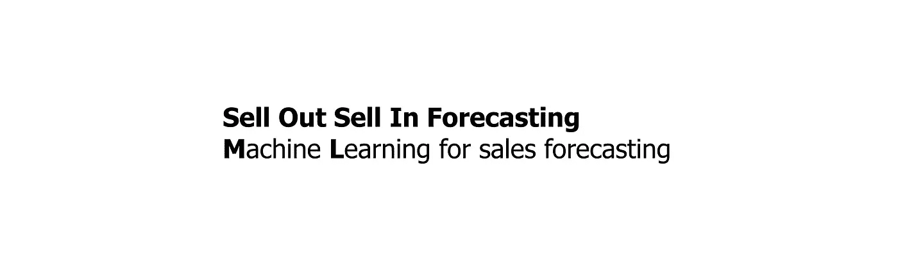

售罄预测中的销售，作者提供的图像

我想从雀巢公司的角度告诉大家销售预测。我将向您展示我们方法的理念/方法。然而，如果你想使用其中的一些东西，我邀请你去 [GitHub](https://github.com/BartoszSzablowski/Sell_Out_Sell_In_Forecasting) ，在那里我们展示了这个项目的 Python 实现。我们的方法在[数据科学峰会](https://dssconf.pl/)上提出。这些例子是基于真实数据的，当然，它们是匿名的。我在**数据科学中心**的**雀巢**工作。使用 Python 或 R，我实现机器学习模型来支持业务决策过程。**数据科学中心**是雀巢公司支持欧洲、北非和中东的分析团队。

# 议程

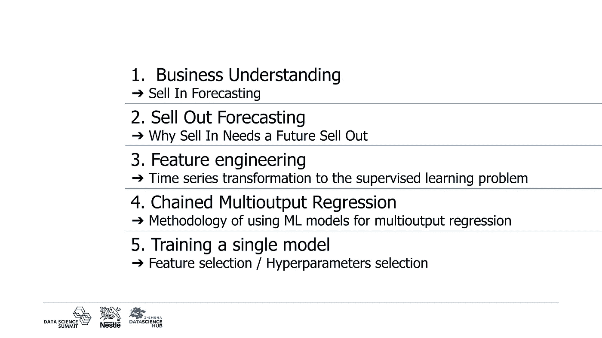

议程，作者图片

本文的议程是从**业务问题**开始，然后**理解数据**，转换它(**特征工程**，我将从**模型培训**方面结束。

如果您想查看评估，即在测试集上评估模型，将预测值与真实值进行比较，那么这部分在 [GitHub](https://github.com/BartoszSzablowski/Sell_Out_Sell_In_Forecasting) 的解决方案中。

# 商业理解

## ➔在预测中出售

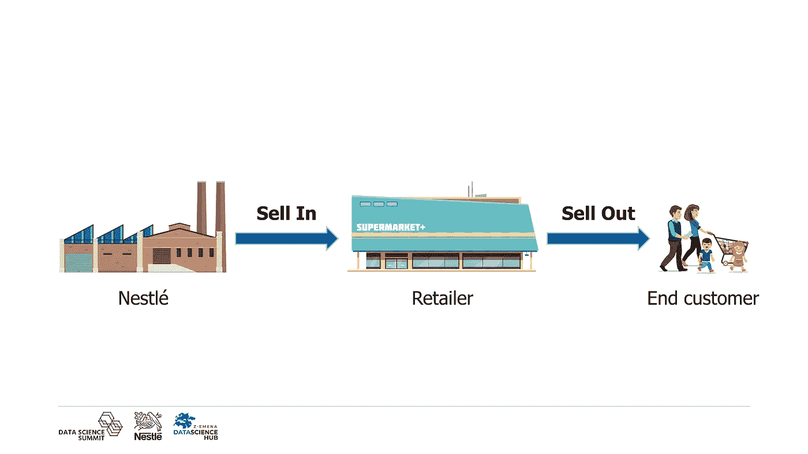

商业理解，作者图片

从商业角度来看，正确的预测很重要。如果我们的预测假设销售的产品少于实际需求，那么我们就会损失利润。另一方面，如果我们的预测被高估，那么我们实际销售的产品会减少，我们也会亏损，我们会产生产品库存成本，或者更糟，我们的产品会过期。一个糟糕的预测会给商业、生产和物流带来后果。

销售可分为**卖进**和**卖出**。

**销售入**是制造商(在我们的例子中是雀巢)销售给零售商的产品数量，而**销售出**是零售商销售给最终客户的产品数量。作为制造商，我们对在销售**感兴趣。这里你已经可以看到**卖入**和**卖出**的关系。如果我们不供货，零售商就不会出售产品。此外，如果他们因为计划促销我们的产品而想卖出更多，他们也必须从我们这里订购更多的产品。**

业务和生产条件要求**每周预测最长 3 个月**或平均未来 12 周的销售情况。预测应该是每周的，因为生产或物流是每周计划的。

# 售罄预测

## ➔为什么卖出去需要一个未来的卖出去

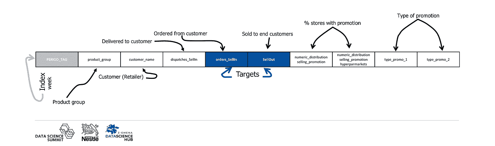

使用的数据集，按作者分类的图像

我们已经知道为什么一个企业需要一个好的预测，让我们看看数据，做一个 **E** 探索 **D** ata **A** 分析来更好地理解它。

销售额按周进行汇总，即 **PERIOD_TAG** 列，它告诉我们一年中某个特定的周。

接下来的两列告诉我们该观察是关于哪个**产品**和哪个**客户**。从我们的角度来看,**客户**是**零售商**。您可以在不同的商店看到我们的许多产品，因此我们需要对每个产品/零售商组合进行预测。

**销售可分为:
-**-**-实际销售，即**交付**给零售商的产品数量。
- **订单**-实际需求，客户向订购的**产品数量。有时可能会发生我已经提到的情况，即订购产品的数量高于实际销售产品的数量。除其他因素外，这可能是由于低估了预测。****

**下一个变量是**销售出去**，这是从零售到最终客户的产品销售数量，我们作为一个社会在商店购买了多少。**

**接下来的变量与我们在商店看到的**促销**有关。其中的前 2 个与促销的**分布**有关，这是该商店中所有商店和大卖场进行促销的百分比。在促销周，不一定所有的商店都有促销活动。
最后 2 个变量是**类型的促销**，这是一个二元变量，表示一周内是否有给定类型的促销。促销的类型肯定不止两种，然而，为了本文的目的，我只分离了两种。实际上，它可能是，例如，降价，报纸上的产品信息，商店里我们产品的单独位置，等等。**

> **随着时间推移销售产品不过是一个时间序列。为不同的零售商销售多种产品是多个时间序列。**

**让我们看一个为零售商之一销售一种产品的例子。**

**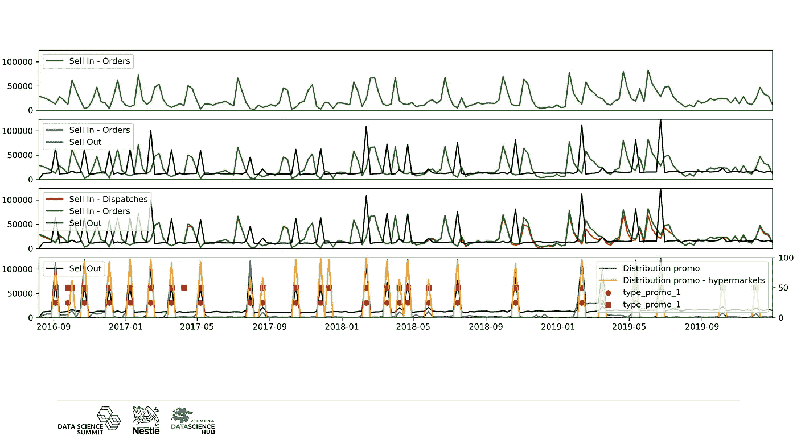**

**一段时间内销售一种产品，图片由作者提供**

****在第一张图表**上，您可以看到**订购产品的数量**。正如你所看到的，时间上的移动平均线是恒定的，但在某些周它是相关的——因此显著增加。**

****在下一张图表**上，我们添加了**卖出**，我们可以看到它落后于卖出。如果我们看到客户的产品订单数量显著增加，那么我们可以预计，在接下来的平均 3-4 周内，该客户的商店将比平时销售更多的产品。这种脱销与滞销的时间长短因零售商而异。**

****在第三张图表**上，我们添加了**交付产品的数量**，正如我之前所说，它并不总是等于订购产品的数量。但是在这里，我们可以看到其他依赖因素，例如，如果我们交付的数量没有订购的那么多，那么在接下来的几周内，我们的客户可能会重复订购。**

****在最后一幅图**中，只有**售罄**和**促销数据**，该售罄明显依赖于这些数据。**

> **因此我们的**结论**在**雀巢**。首先，我们应该预测**卖出**，在此基础上，我们将预测**卖出**。**

# **特征工程**

## **监督学习问题的➔时间序列变换**

**我们的方法基于**机器学习**，因此我们使用**一个模型来预测多个产品**。**

**[**吴恩达**](https://en.wikipedia.org/wiki/Andrew_Ng) 曾经说过:**

> **应用机器学习基本上是特征工程。**

**人们常说，数据是机器学习的燃料。然而在现实中，这并不完全正确。如果我们简单地把现有的数据作为输入，在大多数情况下我们不会准备好模型。不如说数据如油。所以必须首先将原油转化为燃料。在我们的例子中，这个转换是**特征工程**。**

**我们在现有功能的基础上创建新功能，使机器学习算法能够工作。获得正确的数据会大大提高数据的质量，因为我们将原始数据转化为信息，模型会将这些信息转化为知识。那么模型可以更好地理解世界，并且将给出更高质量的预测。**

**如今，我们可以看到使用 XGBoost 或神经网络等模型的趋势。当然，有时我们别无选择，一个例子就是使用卷积神经网络对照片中的物体进行分类。然而，在我看来，我们应该始终做好数据分析工作，并将结论转化为数据转换。当我教分类的时候，我喜欢展示一个例子，逻辑回归对转换好的数据比 XGBoost 对原始数据更准确。此外，如果模型不太复杂，它也更容易理解，这对商业来说也很重要。这样我们就知道并能解释变量如何影响我们模型的预测。**

**然而，让我们回到我们的项目。在我们可以使用机器学习算法之前，**我们的时间序列必须转化为一个监督学习问题**。在时间序列中，没有 ***X*** 和 ***y*** 变量的概念。所以我们需要选择我们将要预测的( ***y*** )并使用**特征工程**来创建所有将用于进行预测的*变量。***

***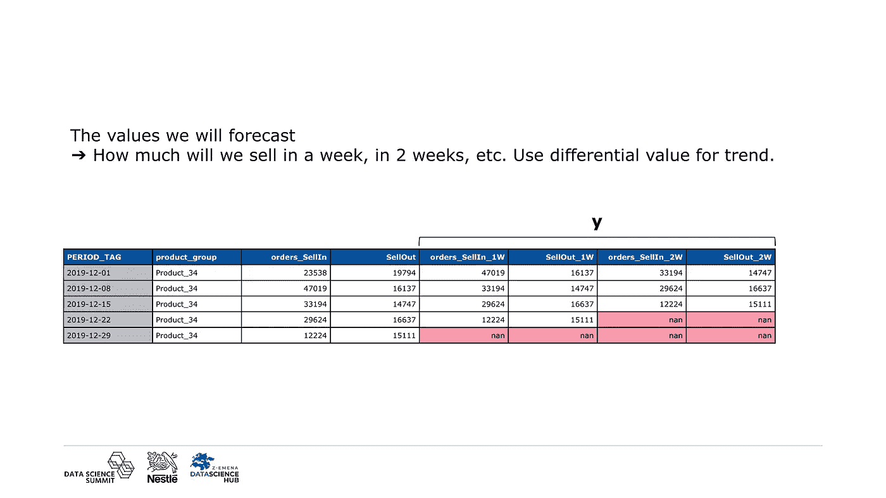***

***创建 y 变量，图片作者***

***第一步，我们创建我们的**目标**，模型将预测的**值。这些值是客户将在一周、两周内销售的数量，等等，以及客户将在一周、两周内从我们这里订购的数量，等等。*****

> ***➞这将是我们的 ***y*** 。***

***对于我们分析的产品，我们看不到趋势，但情况并非总是如此。所以，**我们不需要只预测原始值**，而是比如说**微分值**，这是一个流行的、广泛使用的**数据变换**使得**时间序列**数据**平稳**。我们也可以用当前值预测未来值的对数比。通过使用这些转换中的任何一种来创建新值，我们可以预测动态，并且可以预测训练数据范围之外的原始值。***

***对于最后的日期，我们无法创建未来的值，因为我们不知道它们。然而，我们并不因此而消除所产生的缺失。这些失踪可能会出现在最后的日期。也就是说，对于倒数第二个日期，12 月 22 日，我们只能提前一周进行预测，以便与真实值进行比较。然而，我们不能预测未来 2 周。根据预测范围，我们将测试数据的窗口移动到同一时期的预测值，例如 2019 年。***

***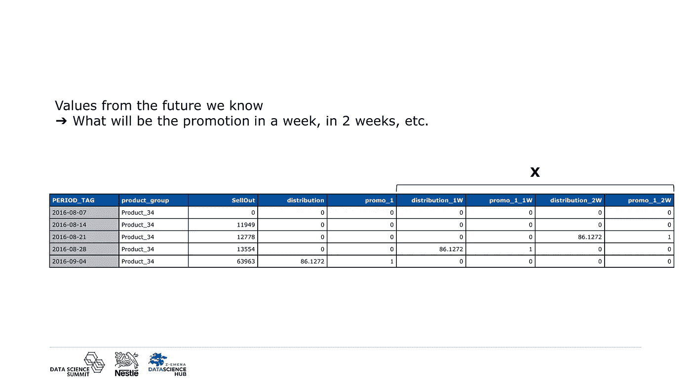***

***从未来创造 X 个变量，图片作者***

*****接下来，我们创建 X 个变量**,**的特征**，在此基础上模型将**拟合**，然后**做出预测**。这些值可以是在进行预测时已知的未来特征，在我们的例子中，这些只是**促销变量**，下周、两周内的促销活动等等。***

> ***➞它将是我们的 ***X*** 。***

***这些是我们使用的唯一的未来特征，并且在执行预测时是已知的。没有**数据泄露**。这一点很重要，从业者都知道，但经常被研究人员或利益相关者忽略。**数据泄漏**发生在模型可以访问实际上不可用的信息时。***

***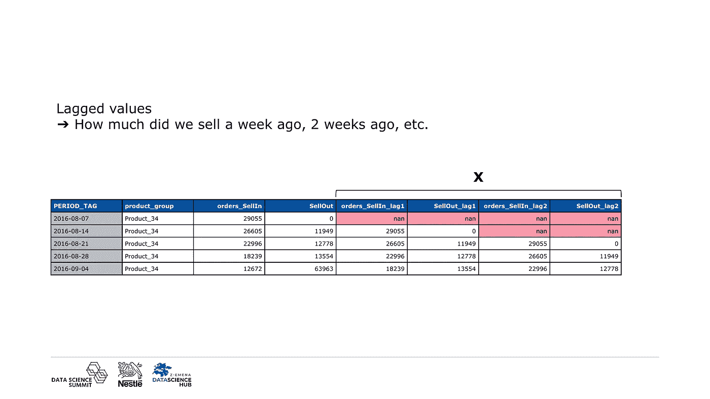***

***根据滞后值创建 X 变量，按作者排序***

*****滞后值**，一周前、两周前我们卖了多少，等等。这是一个**简单的办法**把**变**一个**时间序列**变成**监督学习**的问题。另一方面，在这里，我们没有第一行的这些特性，因为没有从中获取它们的数据。***

> ***➞这将是我们的 ***X*** 。***

***这里我们看到了一个类似的情况，缺少值，但是这些缺少的特性将第一次出现在索引中。我们需要所有的 X 变量，我们不打算用另一个值来代替它们。因此，我们**删除那些以这种方式**创建的带有缺失值的观察值。***

***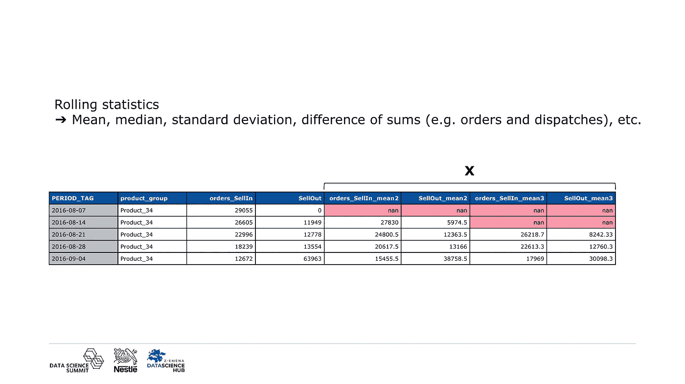***

***基于滚动统计数据创建 X 变量，按作者分类的图像***

*****添加原始滞后值后的下一步是添加滚动统计**，也就是说，对于滑动窗口，我们计算各种统计。这可以是平均值、中间值、标准偏差、总和，或者至少是不同值之间的差值。最后可以是订购和交付产品之和的**差额**。这样一个变量告诉模型，零售商可能会再次订购，因为它没有收到过去订购的那么多。我们计算不同宽度窗口的统计数据，例如，前 2 个值、前 3 个值的移动平均值，等等。***

> ***➞这将是我们的 ***X*** 。***

***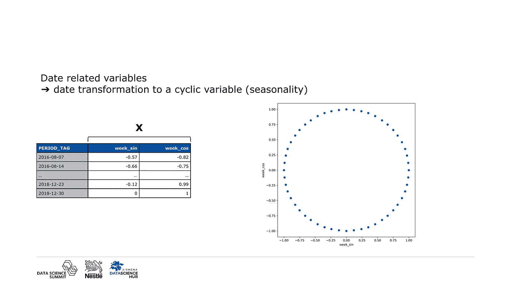***

***基于循环变量创建 X 变量，图片由作者提供***

***在时间序列中，除了趋势之外，还可能有**季节性**，这意味着一年中某个特定时期的销售额比另一个时期多。为了使用星期数作为信息，我**将星期转换成一个循环变量**，它是正弦和余弦。因此，我把一个变量转换成两个变量。这里我转换的是周数，但是我们可以对其他循环变量使用相同的方法，比如一个小时或一周中的一天。以星期几为例，我将说明为什么这种转换可能比其他转换更好。***

***如果我们将星期几转换成一个**数字变量**，星期一的值可能是 1，而星期天的值可能是 7。因此，对于这个模型来说，这两天会相隔很远，但实际上，星期天之后是星期一。***

***另一个转换可以是 **OneHotEncoder** ，但是我们会创建多个二进制变量。***

> ***➞这些变量也将是我们的 ***X*** 。***

***这些是数据转换的例子，我会说是基本的。我们会根据问题找到其他的。**我们还应该转换分类变量**，它们是**客户**和**产品**。***

# ***链式多输出回归***

## ***使用 ML 模型进行多输出回归的➔方法***

***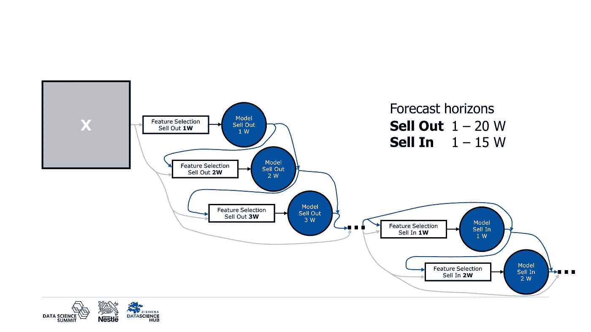***

***用于训练多个卖出和买进模型的方法，按作者分类的图像***

*****我们已经为 ***X*** 和 **y** 创建了一组新的特征**，所以问题变成了——你如何在雀巢公司找到合适的模特？**标准的机器学习算法**(我说的不是神经网络)是为了**预测单个数值**而设计的，所以我们需要对每个视界有一个单独的模型。我们作为模型使用**随机森林**。此外，正如我前面提到的，我们希望**先进行卖出预测，然后再进行卖出预测**。提醒一下,“卖出”是零售商卖给最终客户的产品数量，这里的“卖出”是零售商从雀巢订购的产品数量。我们**首先**预测下一个 **20 周卖出**，**然后下一个 15 周卖出**。**售罄**的时间跨度更长，因为**售罄**需要预测未来售罄值，我们从探索性分析中得知**售罄最多比**售罄晚 3-4 周。出于理性的原因，我们选择了多一周。***

***作为模型学习方法，我们使用**链式多输出回归**，它是模型的**线性序列。**的第一个模型**是**提前 1 周**售罄的模型，它使用我们创建的变量。下一款**车型**将在**前 2 周**售罄，其功能和预测与上一款车型相同。**一旦我们将所有销售模型拟合好，我们就在**中拟合销售模型。每个模型都可以访问以前模型的相同功能和预测。此外，每个模型都有功能选择，我会写一秒钟。*****

# ***训练单个模型***

## ***➔特征选择/超参数选择***

***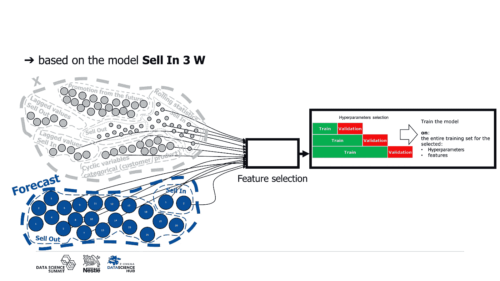***

***训练单个模型，由作者生成图像***

*****现在，我将展示基于 3 周前模型销售的单个模型学习**。***

***我从**特征选择**开始。使用**特征工程**我们**已经创建了许多特征**，由此我们面临**维度诅咒**的问题，并且碰巧特征之间**相关**，因此它们中的许多携带相同的信息，由此我们可以发现模型认为一个信息更重要，即使它在现实中并非如此。另一个原因是我们不想教授模型**噪音**。**因此需要使用特征选择**。**我们可以将其分为在特征工程和先前模型预测过程中创建的变量**。***

***我将**从预测**开始，这是我们在底部看到的。我们的模型使用以前模型的销售预测，但不使用所有销售预测。我们仅选择接下来的 5 个售罄预测，它们是售罄 4W、售罄 5W、售罄 6W、售罄 7W 和售罄 8W。这是由于我们的探索性数据分析和业务关系。零售商现在会从我们这里订购更多的产品，因为他们打算通过促销在 3 周内卖出更多的产品。***

***在我们创建的**特性中，主要是我们没有选择那些与售完相关的特性，例如售完的滞后、售完的滚动统计、促销数据，因为这些变量已经减少到预测。在某种程度上，在这种情况下，**我们通过基于数据的预测来减少数据的多维性**。*****

***我们只使用与销售相关的特征以及循环和分类变量。然而，我们并不采取所有的，只有相关的。然而，不同窗口宽度的移动平均值可能被认为是相关的。我们不应该把它们都拿走，只拿最相关或最相关的一个。***

***因为我所说的，实际上**每个型号都使用不同的功能**。***

***我们已经选择了特性，那么**训练**本身是什么样子的呢？这个过程尽可能标准化。但是，我想简单地谈谈超参数的**选择。我们使用的数据是**时间序列**，所以**观察值是相互依赖的**。**分割训练/测试集时不能使用随机化**，也不能使用交叉验证。在这种情况下，会有数据泄漏。因此，在每个分割中，**测试或验证指标必须高于训练指标**。*****

******

***由 [Mehrad Vosoughi](https://unsplash.com/@mehrad_vosoughi?utm_source=medium&utm_medium=referral) 在 [Unsplash](https://unsplash.com?utm_source=medium&utm_medium=referral) 上拍摄的照片***

***谢谢您们。我希望我没有让你感到厌烦，我所展示的一切都符合数据科学的艺术。从外面看起来可能很复杂，但当我们深入细节时，你可以看到它包含了机器学习中使用的许多基本方法。首先，它是有效的，我展示了如何使用机器学习来处理时间序列，我们至少不必使用蒙特卡罗树搜索(开玩笑)。此外，您还看到了我们如何将业务问题转化为机器学习解决方案。***

***😎***