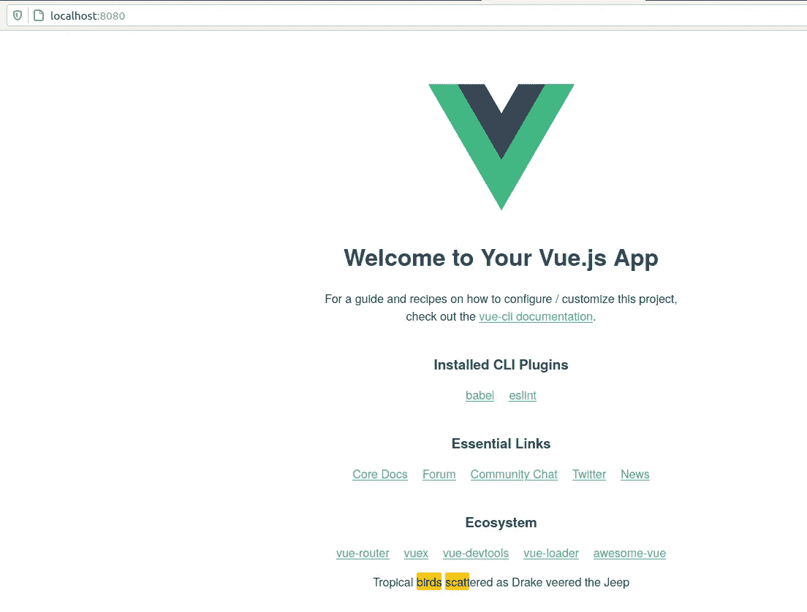

# 语义突出显示

> 原文：<https://towardsdatascience.com/semantic-highlighting-d2fba3da2822?source=collection_archive---------19----------------------->

## [从零开始逐个任务地进行数据科学](https://towardsdatascience.com/tagged/dofromscratch)

## 为 NLP 构建和添加用户界面


由[埃德·皮里彭科](https://unsplash.com/@edpylypenko?utm_source=medium&utm_medium=referral)在 [Unsplash](https://unsplash.com?utm_source=medium&utm_medium=referral) 上拍摄

自从我写了上一篇文章[使用 NLP 改善你的简历](/ai-is-working-against-your-job-application-bec65d496d22)，我们的读者反应非常好。阅读一些评论令人鼓舞，并为下一阶段提供了急需的动力。如果我们真的想使用 NLP 来改善我们的简历，我们需要一个用户界面，就像那张由 Ed Pylypenko 在 Unsplash 上拍摄的照片一样，我们的用户会在他们的手机上使用这项服务。

***考虑你外出的用例*** 。你最好的朋友在 LinkedIn 上给你发了一个工作链接。把这个链接传给一个应用程序，然后在你的手机上就能得到你的机会分析，这不是很酷吗？我想那应该是 ***零下的凉爽*** 。有些人会说 LinkedIn premium 已经有这个功能了，但这对我们的读者来说没什么意思。

现在，不可否认的是， ***使用 JavaScript*** 构建原型可能不会吸引每个读者。尽管如此，我一直对开发解决方案感兴趣，围绕 API 调用包装机器学习，并提供友好的用户界面。让我向您展示如何使用 Vue.js 创建一个 ***原型用户界面*** 并进行一些 NLP 处理。

## 从命令行创建新的 UI 应用程序

为您的项目创建一个新目录，并确保安装了 vue 命令行工具。

```
mkdir semantic
cd semantic
npm install -g @vue/cli
```

现在我们准备搭建一个 Vue 应用程序。

```
vue create semantic
```

一般来说，对于我的文章，我只是使用默认的 vue。对于生产工作负载，您可能希望采用不同的方法。图 1 显示了我的终端窗口的最终输出。我们现在可以使用 NPM 命令运行初学者应用程序，图 2 显示了最终的终端消息。

```
npm run serve.
```


图 vue create semantic 完成后终端的一个小截图。图片作者。


图 2:运行开发服务器，我们看到了 URL 地址。作者图片

如果您导航到 localhost:8080/


图 3:新的 web 应用程序启动并运行。

如果您遵循以上说明，您将最终拥有一个为您的项目开发和添加功能的基本框架。接下来，让我们添加一个文本高亮特性。

## 添加文本突出显示功能

这些天我主要使用视觉代码。接下来，我们需要用 npm 安装 vue 文本高亮模块

```
npm install --save vue-text-highlight
```

我们需要对 main.js 进行一些修改，如图 4 所示。


图 vue 应用程序的 main.js。图片由作者提供。在文本中添加高亮

然后添加一个新的 vue 组件。我使用包所有者提供的基本插图来引导我的项目。*从小处着手，从最基本的真理开始构建你的代码。新组件如图 5 所示。*

**

*图 5 —添加新的 vue 组件。图片作者。*

*现在我们需要将组件集成到主 vue.app 文件中。我的代码如图 6 所示。*

**

*图 6:向应用程序添加文本高亮组件。图片作者。*

*所有的编码完成后，我们现在应该 ***祈祷应用程序将编译并运行*** 。继续发布*

```
*npm run serve*
```

*检查并修复 npm run 命令报告的任何问题。
一切顺利；当你访问你的网站时，你会看到一些高亮的文字。我的如图 7 所示。当德雷克转向吉普车时，我们期望看到文本“*热带鸟类分散”，并且单词“**鸟类**和“**分散**”应该被突出显示。**

**

*图 7 —显示了带有文本特性的修改后的应用程序。图片由作者提供。*

*使用检查器检查页面，如图 8 所示。*

**

*图 8:检查应用程序并注意使用的 html 标签。图片由作者提供。*

*查看图 8，我们可以看到 vue 应用程序由两部分组成，文本使用 span 标记和 mark 标记突出显示。我们可以从组件中删除一些样板 HTML，得到一个友好的原型页面。我的如图 9 所示。*

**

*图 9:文本突出显示的初始原型页面。图片由作者提供。*

*我已经向你展示了如何创建一个原型用户界面，并在一些基本的自然语言处理。使用预先选择的关键字，我们演示了如何在屏幕上的文本中突出显示这些关键字。*

## *后续步骤*

*多年前我创建了一个 NLP 类，所以我有这个项目所需的后端代码。我最近用 Vue.js 做了很多实验，也有大量可重用技术的代码库。大致来说，接下来的步骤是*

*   *为简历改进项目设计一个用户界面*
*   *使用 Python 添加后端服务，并集成 NLP 类*
*   *向前端添加一些 API 调用，以收集简历、职位描述并执行分析。*
*   *更新代码库并测试*

*回来拿下一期吧，我会把它们都接好的！同时，如果你对开发过程感兴趣，想看我演示如何从零开始制作*产品的视频，你可能会喜欢我的 YouTube 系列。构建 web 服务、API 调用、用户界面都有详细的讨论。**

**该技术的一个嵌入式链接是人类创新行动系列。**

## **链接**

*   **创建新的 [Vue.app](https://cli.vuejs.org/guide/creating-a-project.html)**
*   **[文本高亮显示](https://www.npmjs.com/package/vue-text-highlight) vue 模块**
*   **链接到一个 [github repo](https://docs.cloudera.com/machine-learning/1.1/projects/topics/ml-linking-an-existing-project-to-a-git-remote.html)**
*   **生成并将 SSH 添加到 github**
*   **我的 [github 回购](https://github.com/CognitiveDave/semantic/tree/master)**