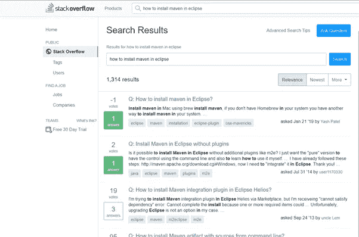

# 语义搜索引擎

> 原文：<https://towardsdatascience.com/semantic-search-engine-ca03b0a835d5?source=collection_archive---------17----------------------->

## 堆栈溢出问答案例研究

艾莉娜·格鲁布尼亚克在 [Unsplash](https://unsplash.com?utm_source=medium&utm_medium=referral) 上的照片

1.  介绍
2.  商业问题
3.  映射到 ML/DL 问题
4.  理解数据
5.  数据处理
6.  探索性数据分析
7.  搜索问题的解决方法
8.  先决条件
9.  结构
10.  部署
11.  结论和未来工作
12.  轮廓
13.  参考

## 1.介绍

*本体论(信息科学)*

在[计算机科学](https://en.wikipedia.org/wiki/Computer_science)和[信息科学](https://en.wikipedia.org/wiki/Information_science)中，**本体**包含概念、数据和实体之间的类别、属性和关系的表示、正式命名和定义，这些概念、数据和实体实现了一个、多个或所有[话语领域](https://en.wikipedia.org/wiki/Domain_of_discourse)。更简单地说，本体是通过定义一组代表主题的概念和类别来显示主题领域的属性以及它们之间的关系的一种方式[维基百科]

*语义搜索*

属于本体论的这个分支。它基于蜂鸟算法。该算法更加强调自然语言查询，考虑更多的上下文和含义，而不是单个关键字。

语义技术是以意义为中心的。它们包括以下内容[维基百科]

语义表示的编码/解码

知识图嵌入关系

主题和概念的自动识别

信息和意义提取

语义数据集成，以及

分类法/分类

因此，给定任何问题，他们直接搜索跨越各种资源的主题、概念和关联。

## **2。**商业问题

栈溢出搜索网页截图

栈溢出是一个问答论坛。这是一个面向专业和热情的程序员的软件编程网站。

对于任何像 stack overflow 这样拥有海量数据的公司来说，关键的挑战是在有限的周转时间内，以最佳的资源利用率在整个数据档案中搜索类似的问题。

> 业务问题是，给定一个来自 stack overflow 的问题和答案的存储库，在 7 个工作日内快速构建和部署一个数据驱动的应用程序，该应用程序能够在不到 500 毫秒的时间内搜索和检索(top k)与搜索字符串相似的问题，并且计算/服务器成本较低

## 3.映射到机器学习问题

上述业务问题可以在机器学习中映射为 k 近邻搜索问题。给定一个查询向量(Qk)，我们需要在给定的问题集{Q1，Q2，Q3，Q4，…Qn-1，Qn}中找到 k 个最近邻。

我们可以使用距离度量来计算最近的邻居。要计算的最简单的距离度量是查询向量和给定问题集中的每个数据点之间的欧几里德距离。这也被称为矢量的 L2 范数

欧几里得距离

还有另一种用于查找相似性的度量，称为余弦距离和余弦相似性。两个向量之间的余弦相似性。值的范围在[-1，1]之间。随着距离的增加，余弦相似性降低，反之亦然。

## 4.理解数据

突出显示 posts_questions 表中字段的屏幕截图

截图突出帖子 _ 答案

让我们分析一下堆栈溢出网页，它通常是后端数据对最终用户的表示。仔细探索堆栈溢出档案中的可用数据。

为了试验最简单的方法，我们首先需要获取数据。堆栈溢出数据有多种来源。在这个案例研究中，我们从谷歌云平台公开可用的数据集中提取了数据。

为了便于理解，让我们以这种方式将感兴趣的关键部分联系起来。

Stackoverflow:模式

帖子 _ 问题:表格

帖子 _ 答案:表格

在该表中，有称为字段的单个列

因此，问题表中的关键字段是:id、标题、标签、正文

类似地，答案表包含:id、body 和 parentid

首先在 GCP 上创建了我们的凭证，然后我们可以在谷歌云平台上访问 BigQuery 平台。

我们可以使用在编辑器中运行 SQL 命令的大型查询编辑器来检索数据。这是来自 google 的[博客【1】](http://Authenticating with a service account key file  |  BigQuery (google.com))关于使用存储为 JSON 的凭证连接到 big query 并以 JSON 或 CSV 文件下载数据。

BigQuery 编辑器

使用 BigQuery SQL，我们将从 posts_questions 和 posts_answers 表中检索 100k 条记录，结果由 posts_questions 表中的 accepted_answer_id 和 posts_answers 表中的 answer_id 连接。因此，这个设计很简单，我们获取的行中一个问题有一个对应的答案(一对一映射)。

配置大查询客户机后提取堆栈溢出数据的示例 SQL。这个结果首先存储在一个 JSON 文件中，然后我们使用 python 库将 JSON 转换为 CSV，以便于准确地迁移数据。

**5。数据预处理**

在数据预处理中，我们需要清理和格式化文本，以便在机器学习模型中使用它们。这些是我们使用 BigQuery 从 StackOverflow 数据集中提取的前 5 行数据

questionbody、answerbody 数据需要清理和格式化。在这种情况下，我们需要删除 HTML 标签，特殊字符，合同文本。

类似地，使用 pandas `pd.datetime '将 answercreateddt 转换为 datetime，这样我们就可以只提取答案的年份来进行数据分析。

之前，当我们讨论 posts_questions 表中的不同列时，我们遇到了 tags 字段。该数据以“|”分隔值的形式存储在数据库中。因此，在预处理步骤中，我们删除“|”并将其连接成一个字符串。将问题的标题标签与问题 id 连接起来后，最终的预处理数据存储在 CSV 文件中。

最终预处理 CSV 文件

**6。探索性数据分析**

预处理后，我们对结果数据集进行探索性数据分析。从 posts_answers 表中，我们提取了 answer_created_dt 和 answer_score。我们提取了 2008 年到 2010 年的数据。条形图显示，2009 年回答的答案数量最多，总计为 answer_score，而 2010 年创建的答案数量最少。

绘制了 answer_id 对 answer_score 的散点图。从图中可以清楚地看出，在 1000k 到 2000k 范围内的 id 具有高于 80 的最高答案分数分布，而超过 3000k 的 id 具有低于 20 的最低分数分布。

**7。搜索问题的方法**

问题集中的问题气是由一系列的词组成的。

这是一个搜索问题，我们可以使用哈希表在数据语料库中搜索查询 Q*，因为它具有 O(1)搜索。我们需要设计一个包含键和值的字典。基于标准散列的技术在这种搜索中可能不太适用。

我们必须使用倒排索引的方法来进行搜索[【3】](https://www.youtube.com/watch?v=FpMmpKIvsnQ&t=1144s)。如果查询 Q*中有 k 个单词，我们可以在 O(k)中搜索结果。这被称为倒排索引，因为我们正在构建一个以单词为关键字、以文档编号和单词在这些文档中出现的频率为值的索引。我们只是在这里做一个基于关键字的搜索。

Elastic search 是一个开源软件，它实现了倒排索引、评分(TF-IDF)、分布式和实时性。在这种情况下，这是一个简单的使用倒排索引的关键字搜索。

在语义搜索中，我们构建句子的向量表示，并在给定的语料库中找到查询向量和向量之间的相似性。

在早期的方法中已经观察到，语义搜索在弹性搜索的脚本分数中使用余弦相似性，并且对于非常大的数据集是不可扩展的。

## 8.先决条件

本文的读者应该熟悉 Python 编程、机器学习和构建数据驱动应用程序的基础知识。

## 9.结构

以下架构在配备 i5 处理器和 8 Gb RAM 的低端笔记本电脑上对 100k 数据集进行了实验

*   使用带有手套向量和快速文本嵌入的 K-means 聚类数据点
*   费斯
*   磁盘近似最近邻

a.使用带有手套向量嵌入的 K-均值聚类数据点

为了使用 K-Means 聚类算法，我们使用肘图来确定适当的聚类数目值。在 30k 的简化数据集上，由肘图确定的聚类数目的值是 200。

在这种情况下，简单的关键字搜索在 0.07 秒内返回搜索结果。

但是当使用语义搜索不在 glove_vectors 中的单词时，返回 0 和余弦相似性分数失败。

使用快速文本来获得在手套向量中找不到的单词的嵌入。使用这种方法，测量 30k 数据集的轮廓得分为 0.05。

由于剪影分数接近于零，样本与相邻聚类的决策边界非常接近。因此，在集群内部进行搜索可能无法很好地处理这些数据点，从而转移到下一个架构失败。

b.费斯

这是脸书研究所在十亿规模数据集上构建的最近邻搜索，据报道比之前的 SOTA 最近邻搜索方法快 8.5 倍。

对于相似性搜索，我们需要对数十亿个向量进行以下操作

1)给定一个查询向量，我们需要使用欧几里德距离找到与该向量最近的邻居的向量列表

2)给定一个查询向量，找出返回最高点积的向量列表。

语义相似性搜索基本上包括两个操作。

a)索引

b)搜索

a)索引:FAISS 库是围绕索引对象构建的。首先对向量列表进行预处理，以加快搜索速度。向量的维数由我们为编码向量而选择的句子向量转换器模型来选择。在我们的例子中，我们选择了句子转换器模型，这是对预训练的 BERT 网络的修改，它使用连体和三元网络结构来导出语义上有意义的句子嵌入，可以使用余弦相似度来进行比较。GitHub 上提供了创建索引的详细代码。

我们可以对索引进行序列化和反序列化，以便通过网络传输。

在从 pickle 文件中读取序列化索引之前，先对其进行反序列化，然后从文件中读取字节。

有两种生成索引的方法。CPU 索引和 GPU 索引。区别在于执行索引生成代码时使用的资源。前者使用 CPU 资源，后者使用 GPU 资源。

b)搜索:可以对构造的索引执行的基本操作是 k-最近邻搜索。对于查询向量，在语料库中找到 k 个最近邻。

*1。GPU 上的普通暴力搜索*

在 GPU 上调用 query_vector 和 encoded_document 向量上的 knn 函数在 0.1 秒内返回结果。在这种情况下，索引是使用 IndexFlatL2 构造的，这是一种简单的 L2 距离计算，在这种情况下它不能很好地工作。

*2。使用纯内积构建指数*

该索引是使用 IndexFlatIP 构建的，IndexFlatIP 是余弦相似性计算，并被发现在该数据集上给出了良好的结果。

在 CPU 资源和 GPU 资源上进行了实验(使用 collaboratory)。代码的搜索部分在所有资源中保持不变。

*3。位置敏感哈希*

通过传递维度和位数作为参数来构建索引，在这种情况下，研究使用 d =768 和 nbits =1024。选择 nbits < 1024, affected the returned results. Therefore a minimum of 128 bytes was required to represent the document vectors. Instead of projections being calculated here, the calculations are optimized using random rotations of the vectors. This is an exhaustive search too and returns the knn in 0.01s.

If we want to reduce the memory footprint of the index and store, then we would need to perform a lossy compression called Product Quantization.

The trade-off for memory would be accuracy.

After experimenting with ProductQuantizer using inverted list(IVF) on the vectors, the index vector constructed for the big dataset 10 Million was close to 3GB and unable to load the dataset in RAM and the colaboratory session crashed. In addition to that from the IVF form of indexing, we could retrieve only approximate distances.

The index on which Product Quantizer is applied is of very low accuracy, therefore a re-ranking needs to be performed with accurate distance computations which is a costly operation on limited RAM.

Comparison of latency across different architectures

*比较各种搜索结果*

对于查询字符串:“事件的 jQuery 插件”，在使用 k-means++初始化使用聚类构建的模型 1 的情况下，query_vector 被预测为属于聚类[52]。在该集群中搜索 5 个最近的邻居得到以下结果。

显然，我们的聚类模型在这种情况下失败了，这反映在先前计算的轮廓得分中，其中包含点的重叠决策边界。为了验证聚类模型是否失败，我们绘制了两个聚类(比如 52 和 54)的散点图。这些点本质上是高度重叠的。

*观察结果*

模型 3:在代码的单元测试过程中，磁盘近似最近邻，给定样本节点输入，用有限的节点列表得到修剪后的节点输出。请参考下一节末尾的示例输出。

从上面的查询结果中，我们发现与暴力破解或 LSH 相比，IndexFlatIP 在我们的案例研究中表现良好。尽管 LSH 在 0.01 秒内返回结果，但 IndexFlatIP 的结果更类似于查询。因此，我们在 Streamlit 上部署了带有 IndexFlatIP 的 FAISS 的 CPU 版本，应用程序演示可在部署部分获得。

c.DISKANN:在单个节点上进行快速、精确的十亿点最近邻搜索

这是一个近似的最近邻搜索。这种方法的主要优点是，该方法可以在 64 Gb RAM 和 SSD 上索引、存储和搜索十亿点数据集。

我们修改了用于早期方法的数据集。我们没有使用一个问题对一个被接受的答案的映射，而是使用一个问题对多个答案来构建有向无环图，如研究论文中所详述的。

这是微软研究团队在 NeurIPS 会议[【8】](http://harsha-simhadri.org/pubs/DiskANN19.pdf)上发表的论文。该算法具有更快的内存搜索速度、更快的索引速度和更好的可扩展性。

Vamana 算法首先结合了贪婪搜索，然后是节点的健壮修剪。

这个算法的代码是用 Python 实现的，完整的代码可以在 GitHub 链接中找到。

它已经在样本节点上进行了测试。对 greedy_search 和 robust prune 函数进行了简单的单元测试。在 Python 中，并行作业库被用来利用多重处理。

## 10.部署

Streamlit 是一个轻量级框架，用于创建数据应用程序。streamlit 库完全是用 Python 编写的。它建立在三个简单的原则之上。1.Python 脚本 2.Widget/Component 互动 3。立即部署。

FAISS CPU 语义搜索模型用于构建 streamlit 中的数据驱动应用程序。下面是用来构建 app 的数据集的 EDA 和 Word Cloud。

## **数据集上的探索性数据分析**

词云

请在 streamlit 上找到简单应用的网络广播链接

 [## self _ case _ study1 _ 录音. mp4

### 编辑描述

drive.google.com](https://drive.google.com/file/d/1i5VnSBbBmjMMSHPPItkULKIJVBgkYMs2/view?usp=sharing) 

## 11.结论和未来工作

我们可以得出结论，对于≤ 100k 的大型数据集，FAISS 工作良好，但 RAM 再次成为限制。毫无疑问，对于非常大的数据集，在索引构建、SSD 存储和搜索方面，Disk ANN 优于这些架构。

我正在研究以下想法

*   DISKANN 算法代码的超参数调整。
*   使用数据集中的其他字段进行搜索并计算指标进行比较

## 12.轮廓

完整的源代码可以在 [GitHub 链接](https://github.com/jayaBalaR/casestudy1.git)上找到

如果您对以上任何一项有任何问题或建议，请通过 [LinkedIn](http://www.linkedin.com/in/mypage1) 与我联系

## 13.参考

*   【appliedaicourse.com 应用课程
*   [使用服务帐户密钥文件进行身份验证| big query(google.com)](https://cloud.google.com/bigquery/docs/authentication/service-account-file#python)
*   [LIVE:语义搜索 Q & A【设计+代码】— —第 1/4 部分——YouTube](https://www.youtube.com/watch?v=FpMmpKIvsnQ&t=1144s)
*   [FAISS:高效相似性搜索库——fb.com 脸书工程](https://engineering.fb.com/2017/03/29/data-infrastructure/faiss-a-library-for-efficient-similarity-search/)
*   [兰德-NSG:在单个节点上快速精确的十亿点最近邻搜索(harsha-simhadri.org)](http://harsha-simhadri.org/pubs/DiskANN19.pdf)