# 语义搜索:从雅克卡到伯特的意义测量

> 原文：<https://towardsdatascience.com/semantic-search-measuring-meaning-from-jaccard-to-bert-a5aca61fc325?source=collection_archive---------11----------------------->

## 使用这些一流技术增强搜索能力

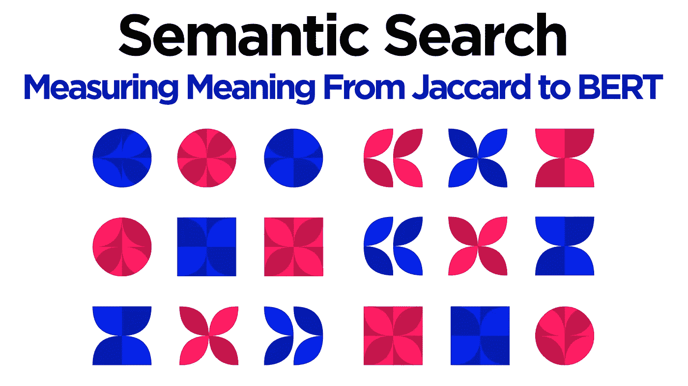

作者图片—关于[松果. io](https://www.pinecone.io/learn/semantic-search/) 的原创文章

相似性搜索是人工智能和机器学习领域中发展最快的领域之一。其核心是将相关信息匹配在一起的过程。

你很有可能是通过搜索引擎找到这篇文章的——最有可能是谷歌。也许你搜索了类似“什么是相似性搜索？”或者“传统 vs 向量相似性搜索”。

Google 处理了您的查询，并使用了许多相同的相似性搜索要素，我们将在本文中了解这些要素，将您带到—这篇文章。

如果相似性搜索是一家市值 1.65 万亿美元的公司——全球第五大最有价值公司[1]的成功核心，那么很有可能*值得进一步了解。*

[相似性搜索](https://www.pinecone.io/learn/what-is-similarity-search/)是一个复杂的话题，有无数种技术可以用来构建有效的搜索引擎。

在本文中，我们将讨论这些技术中最有趣也是最强大的一些，特别关注语义搜索。我们将了解它们是如何工作的，它们擅长什么，以及我们如何自己实现它们。

# 传统搜索

我们在传统阵营中开始了我们的搜索之旅，在这里我们找到了几个关键角色，例如:

*   **Jaccard 相似度**
*   **w-收缩**
*   皮尔逊相似性
*   **Levenshtein 距离**
*   归一化谷歌距离

所有这些都是用于相似性搜索的很好的指标——其中我们将讨论三个最流行的指标，Jaccard 相似性、w-shingling 和 Levenshtein 距离。

视频演练涵盖相同的三种传统相似性方法。

## 雅克卡相似性

Jaccard 相似性是一个简单但有时很强大的相似性度量。给定两个序列， **A** 和 **B** —我们找出两者之间共有元素的数量，并将其除以两个序列中元素的总数。

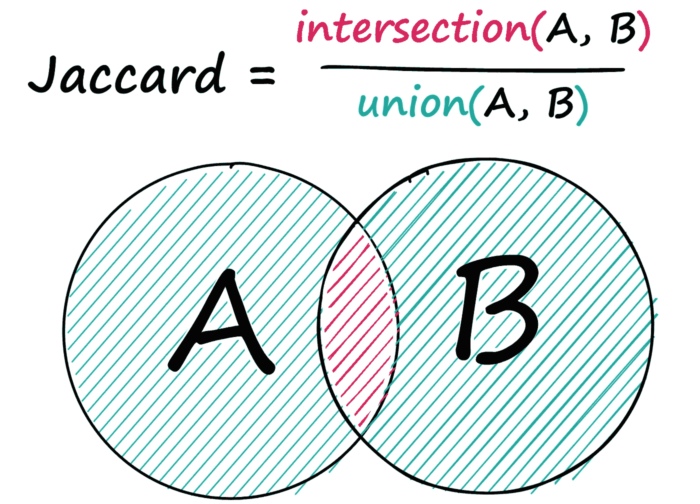

Jaccard 相似性度量两个序列之间的交集超过两个序列之间的并集。

给定两个整数序列，我们将写出:

这里我们确定了**两个**共有的*唯一的*整数`3`和`4`——两个序列共有十个整数，其中**八个**是唯一的值— `2/8`给出了我们的 Jaccard 相似性得分`0.25`。

我们也可以对文本数据执行同样的操作，我们所做的就是用*标记*替换*整数*。

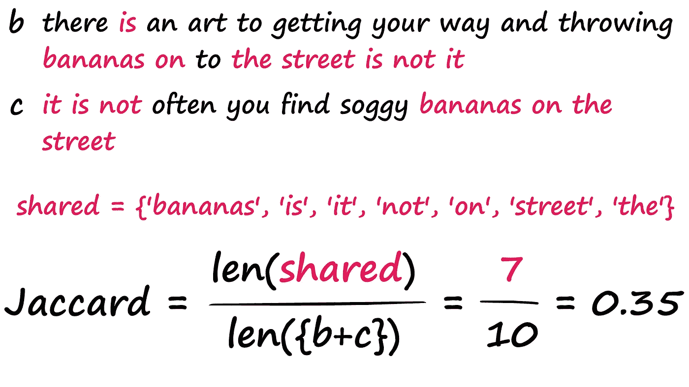

计算两个句子 **a** 和 **b** 之间的 Jaccard 相似度。

正如我们所料，我们发现句子`b`和`c`得分更高。现在，它并不完美——两个句子除了像*、*、*、【a】、*、*、*这样的词之外什么都不共享，尽管语义不同，但可以返回高的 Jaccard 分数。

这些缺点可以通过使用预处理技术部分解决，如停用词移除、词干化/词汇化等。然而，正如我们很快会看到的，一些方法完全避免了这些问题。

## w-收缩

另一个类似的技术是**w-shringing**。w-shingling 使用了与*交集/并集*完全相同的逻辑，但是使用了“瓦片区”。句子 **a** 的两个重叠部分看起来像这样:

```
a = {'his thought', 'thought process', 'process is', ...} 
```

然后，我们将在我们的*和*重叠的句子之间使用同样的`intersection / union`计算，如下所示:

使用 2 瓦片区，我们在句子 **b** 和 **c** 之间找到三个匹配瓦片区，导致相似度为 **0.125** 。

## 莱文斯坦距离

比较两个字符串的另一个流行度量是 Levenshtein 距离。它的计算方法是将一个字符串转换为另一个字符串所需的操作次数，计算公式如下:

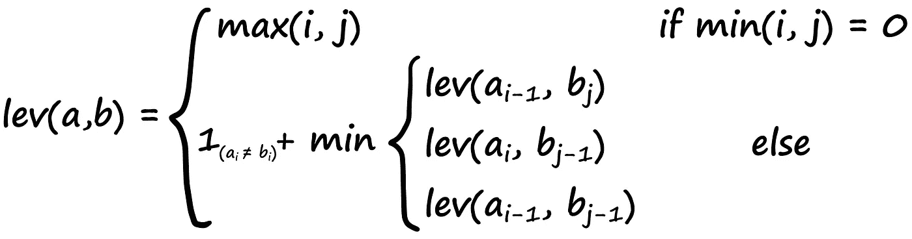

莱文斯坦距离公式。

现在，这是一个看起来相当复杂的公式——如果你理解它，太好了！如果没有，不要担心，我们会分解它。

变量`a`和`b`代表我们的两个字符串，`i`和`j`分别代表`a`和`b`中的字符位置。所以给定琴弦:

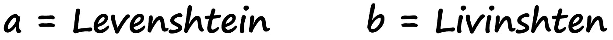

“Levenshtein”和一个混淆的“Livinshten”。

我们会发现:

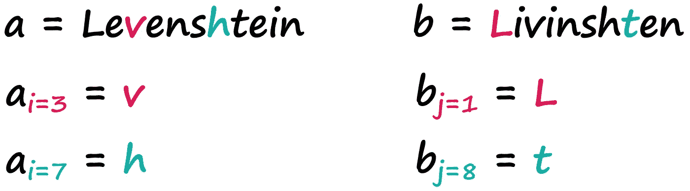

我们从 1 到单词的长度对单词本身进行索引，第零个索引确实作为一个 **none** 字符存在(下一步将详细介绍)。

轻松点。现在，掌握这个公式背后的逻辑的一个很好的方法是通过可视化 Wagner-Fischer 算法——它使用一个简单的矩阵来计算我们的 Levenshtein 距离。

我们将两个单词`a`和`b`放在矩阵的任意一个轴上——我们将 *none* 字符作为一个空格。

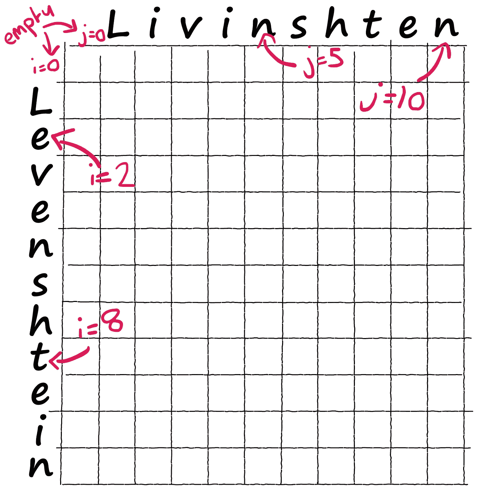

我们的空 Wagner-Fischer 矩阵——我们将用它来计算**‘Levenshtein’**和**‘livinhten’**之间的 Levenshtein 距离。

用代码初始化我们的空瓦格纳菲舍尔矩阵。

然后，我们遍历矩阵中的每个位置，并应用我们之前看到的复杂公式。

我们公式的第一步是`if min(i, j) = 0`——我们在这里说的是，在我们的两个位置`i`和`j`中，要么是`0`？如果是，我们转到`max(i, j)`，它告诉我们将矩阵中的当前位置分配给两个位置`i`和`j`中较高的一个:

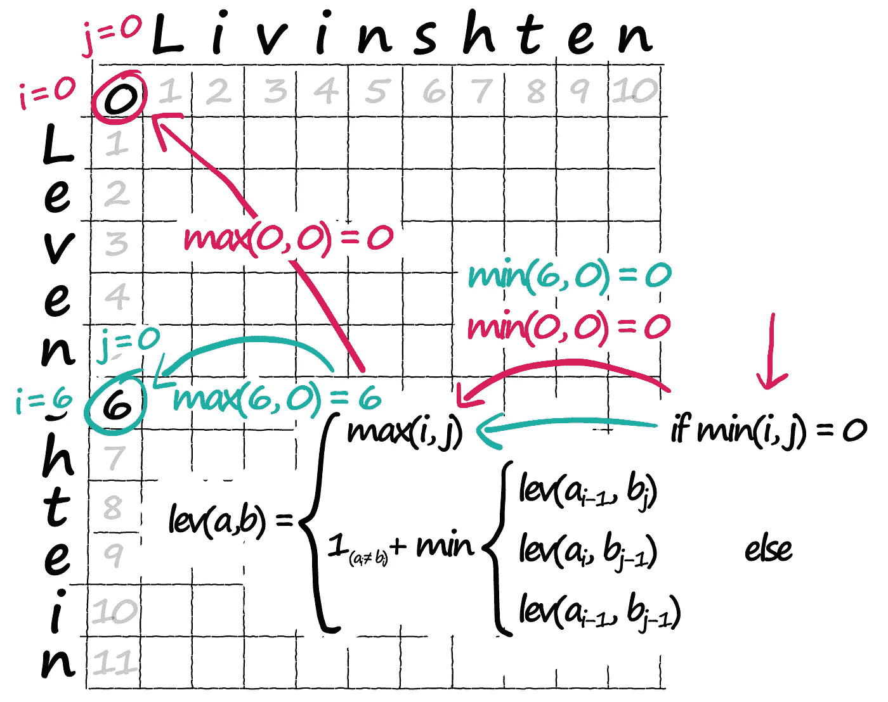

我们从右边开始，沿着边缘在 **i** 和/或 **j** *为 0 的地方，矩阵位置将用* ***max(i，j)*** *填充。*

上面可视化的 **min(i，j) == 0** 后接 **max(i，j)** 运算—转换成代码。

现在，我们已经处理了矩阵的外部边缘——但我们仍然需要计算内部值——这是我们的最佳路径所在。

回到`if min(i, j) = 0` —如果`0`都不是呢？然后，我们进入`min {`部分的复杂部分。我们需要为每一行计算一个值，然后我们取 **min** imum 值。

现在，我们已经知道了这些值，它们在我们的矩阵中:

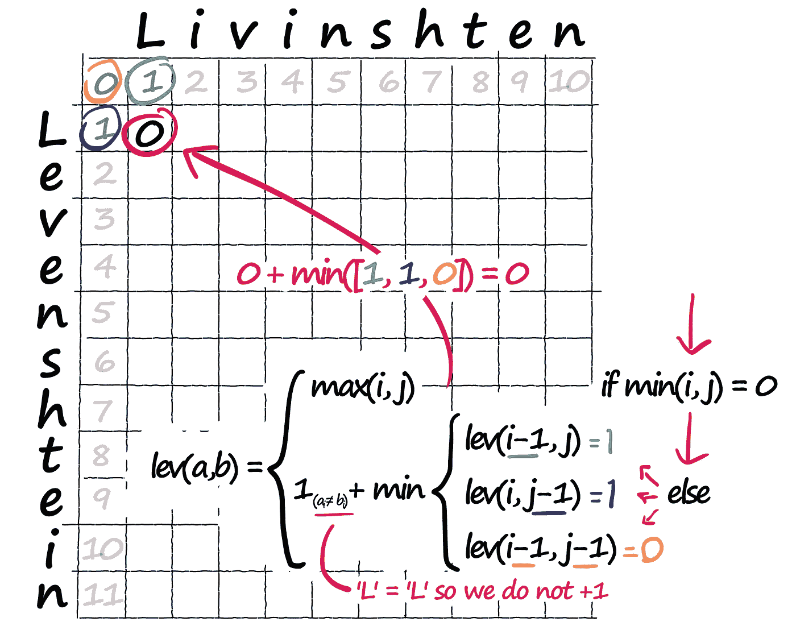

对于矩阵中的每个新位置，我们从三个相邻的位置(左上方的圆圈)中取最小值。

`lev(i-1, j)`其他操作都是索引操作——我们提取那个位置的值。然后我们取三个中的最小值。

只剩下一个操作了。只有在`a[i] != b[i]`的情况下，左侧的`+1`才应适用——这是对不匹配字符的惩罚。

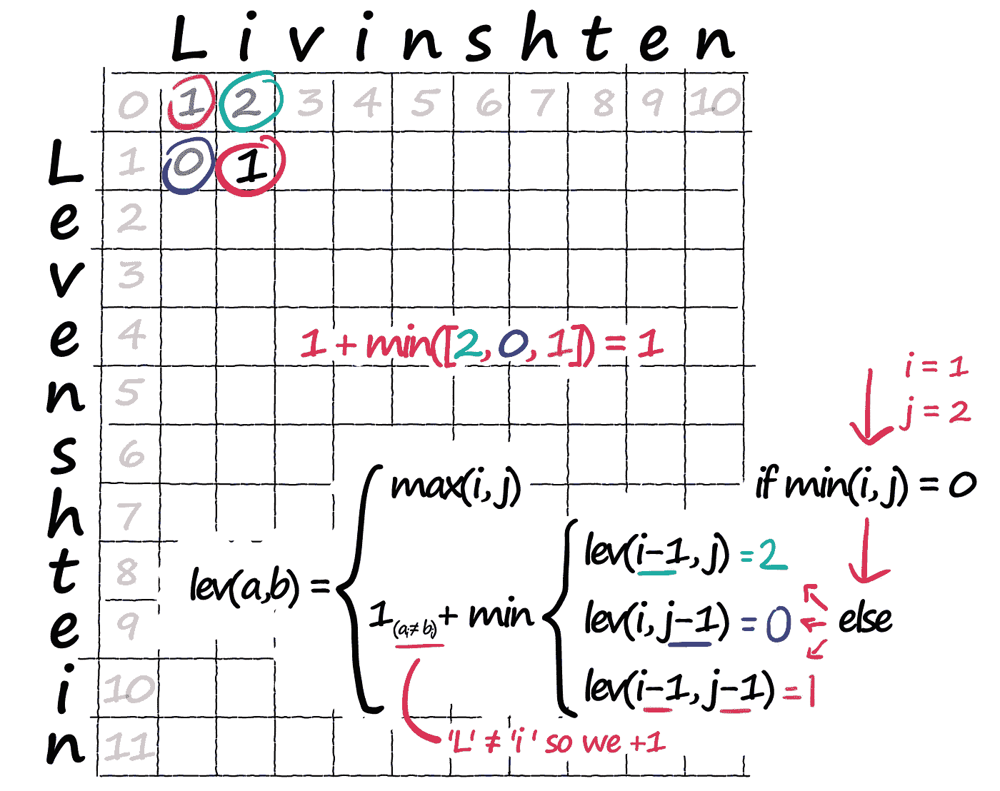

如果一个[我]！= b[j]我们将 **1** 加到最小值上——这是对不匹配字符的惩罚。

将所有这些放入一个贯穿整个矩阵的迭代循环中，看起来像这样:

使用瓦格纳-费歇尔矩阵的全 Levenshtein 距离计算。

我们现在已经计算了矩阵中的每个值——这些值代表了从字符串`a`到位置`i`再到字符串`b`到位置`j`的转换所需的操作数。

我们正在寻找将`a`转换为`b`的操作数——所以我们在`lev[-1, -1]`取数组右下角的值。

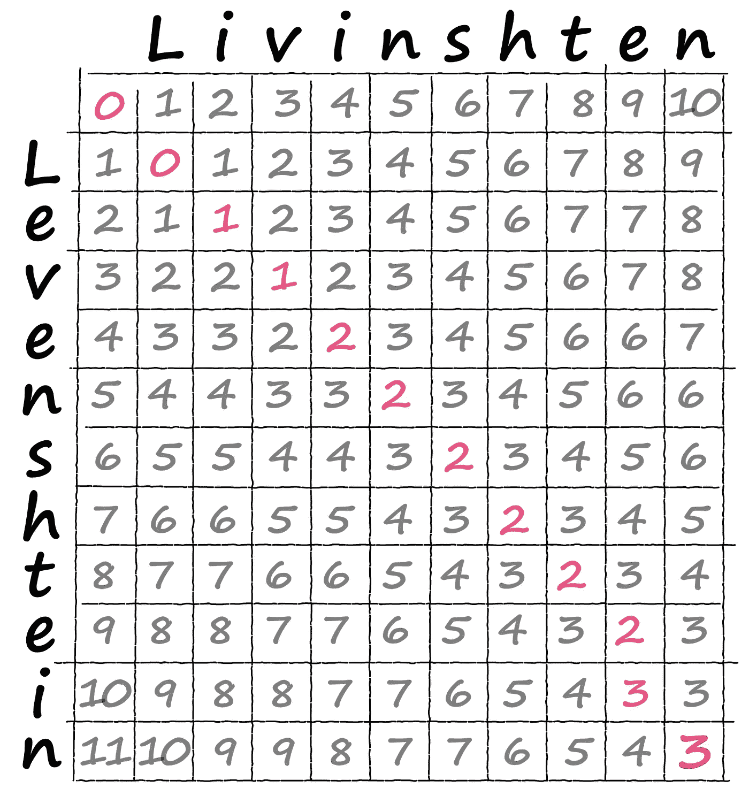

通过矩阵的最佳路径——在右下角的[-1，-1]位置，我们有两个字符串之间的 Levenshtein 距离。

# 向量相似性搜索

对于基于向量的搜索，我们通常会找到几种向量构建方法中的一种:

*   **TF-IDF**
*   **BM25**
*   word2vec/doc2vec
*   **伯特**
*   使用

与*近似*最近邻(ANN)的一些实现相结合，这些基于向量的方法是相似性搜索领域中的 MVP。

我们将讨论 TF-IDF、BM25 和基于 BERT 的方法——因为这些方法很容易成为最常见的方法，并且涵盖了稀疏和密集的[矢量表示](https://www.pinecone.io/learn/vector-embeddings/)。

视频演练涵盖相同的三种基于向量的相似性方法。

1。**TF-IDF**——向量相似性搜索的鼻祖，诞生于 20 世纪 70 年代。它由两部分组成，即 **T** erm **F** 频率(TF)和 **I** 反向 **D** 文件 **F** 频率(IDF)。

TF 组件计算一个术语在一个文档中出现的次数，并将其除以同一文档中的术语总数。

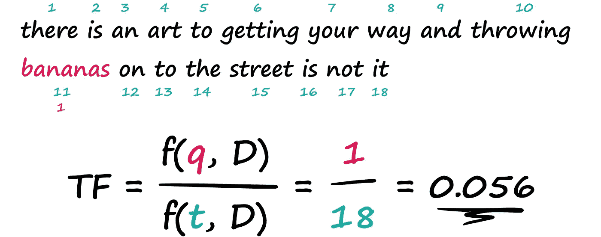

TF-IDF 的术语频率(TF)组件计算我们的查询(“香蕉”)的频率，并除以所有标记的频率。

这是我们计算的前半部分，我们有当前 **D** 文件`f(q,D)`内我们 **q** 查询的 **f** 频率—超过当前 **D** 文件`f(t,D)`内所有**t**erm 的 **f** 频率。

频率是一个很好的衡量标准，但是不能让我们区分常用词和不常用词。如果我们要搜索单词“the”——只使用 TF，我们会赋予这个句子与搜索“香蕉”相同的相关性。

这很好，直到我们开始比较文档或使用更长的查询进行搜索。我们不希望像*、*、*、*、*、【it】、*这样的词被排在和*、【香蕉】、*、*、【街道】、*一样高的位置。

理想情况下，我们希望更罕见的单词之间的匹配得分更高。为此，我们可以将 TF 乘以第二项——IDF。文档频率衡量一个单词在我们所有文档中出现的频率。

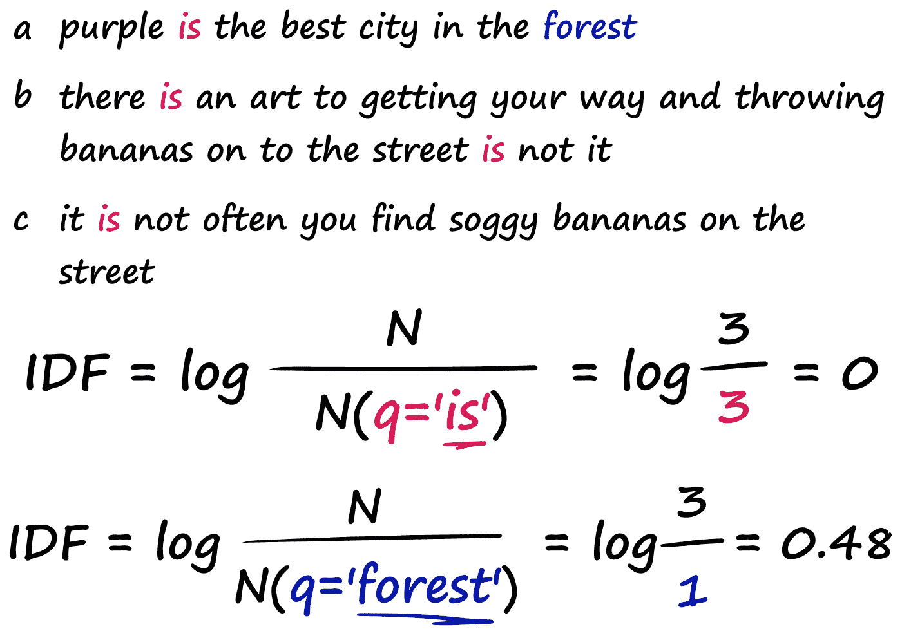

TF-IDF 的逆文档频率(IDF)组件计算包含我们的查询的文档的数量。

在这个例子中，我们有三个句子。当我们计算常用词*是*的 IDF 时，我们返回的数字要比更罕见的词*“森林”*的 IDF 低得多。

如果我们要同时搜索单词*‘is’*和*‘forest’*，我们会像这样合并 TF 和 IDF:

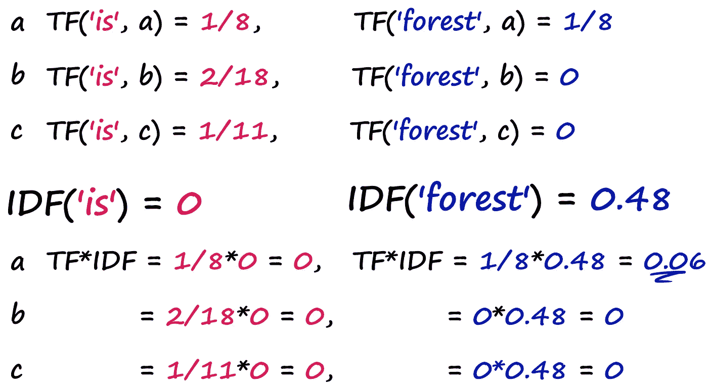

我们计算文档 **a** 、 **b** 和 **c** 的 **TF('is '，D)** 和 **TF('forest '，D)** 得分。IDF 值跨所有文档—因此我们只计算一次 **IDF('is')** 和 **IDF('forest')** 。然后，我们通过将**乘以 **TF** 和 **IDF** 分量来获得每个文档中两个单词的 TF-IDF 值。句子 **a** 得分最高为**‘森林’**，**‘是’**总得分 **0** 为**IDF(‘是’)**得分为 **0** 。**

这很好，但是*向量*相似性搜索在这里起什么作用呢？好吧，我们使用我们的词汇表(我们数据集中所有单词的大列表)，并计算每个单词的 TF-IDF。

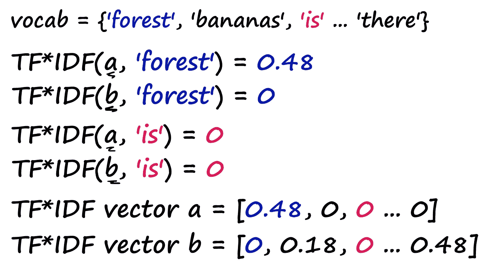

我们计算词汇表中每个单词的 TF-IDF 值，以创建一个 TF-IDF 向量。对每个文档重复这一过程。

我们可以将所有这些放在一起创建 TF-IDF 向量，如下所示:

从那里我们得到了 TF-IDF 向量。值得注意的是，vocab 的大小很容易在 20K+的范围内，因此使用这种方法产生的向量非常稀疏，这意味着我们无法编码任何语义意义。

2。 **BM25** —作为 TF-IDF 的继任者，Okapi BM25 是优化 TF-IDF 的结果，主要是为了根据文档长度规范化结果。

TF-IDF 很棒，但当我们开始比较几个提及时，可能会返回可疑的结果

如果我们拿了两篇 500 字的文章，发现文章 A 提到了‘丘吉尔’6 次，而文章 B 提到了‘丘吉尔’12 次——我们应该认为文章 A 只有一半相关吗？不太可能。

BM25 通过修改 TF-IDF 解决了这个问题:

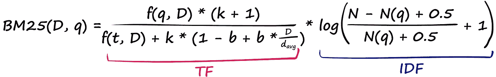

BM25 配方。

这是一个看起来相当糟糕的等式——但它只不过是我们的 TF-IDF 公式加上一些新参数而已！让我们比较两个 TF 组件:

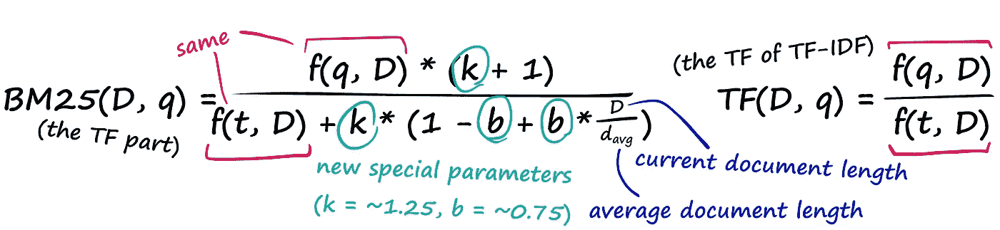

BM25 的 TF 部分(左)对比 TF-IDF 的 TF(右)。

然后我们有 IDF 部分，它甚至没有引入任何新的参数—它只是从 TF-IDF 重新安排了我们的旧 IDF。

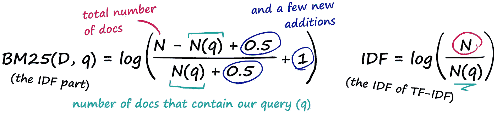

BM25 的 IDF 部分(左)对比 TF-IDF 的 IDF(右)。

现在，这个修改的结果是什么？如果我们取一个包含 12 个标记的序列，并逐渐输入越来越多的“匹配”标记，我们会得到以下分数:

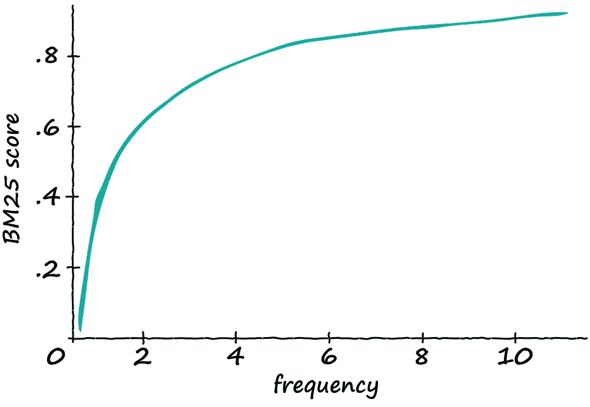

TF-IDF(左)和 BM25(右)算法的比较，使用 12 个标记的句子和相关标记的递增数量(x 轴)。

TF-IDF 分数随着相关令牌的数量线性增加。因此，如果频率翻倍，TF-IDF 得分也会翻倍。

BM25 抑制分数增加，当相关令牌从两个增加到四个时，我们看到一个 *x1.25* 的增加，当我们再次从四个增加到八个时，我们看到一个 *x1.13* 的增加。

听起来很酷！但是我们如何用 Python 实现呢？同样，我们会像 TF-IDF 实现一样保持简洁明了。

我们已经为`k`和`b`使用了默认参数——我们的输出看起来很有希望。查询`'purple'`只匹配句子`a`，而`'bananas'`对`b`和`c`的得分都是合理的——但由于字数较少，`c`的得分略高。

为了从中构建向量，我们做了与 TF-IDF 完全相同的事情。

同样，就像我们的 TF-IDF 向量一样，这些是*稀疏*向量。我们将无法对语义进行编码——而是专注于语法。让我们看看如何开始考虑语义。

3。**BERT**——或者来自 Transformers 的双向编码器表示——是一个非常流行的 transformer 模型，用于 NLP 中的几乎所有东西。

通过 12 层左右的编码器，BERT 将大量信息编码成一组密集的 T21 向量。每个密集向量通常包含 768 个值——我们通常为 BERT 编码的每个句子提供 512 个这样的向量。

这些向量包含了我们所能看到的语言的数字表示。如果需要，我们还可以从不同的层提取这些向量，但通常是从最后一层提取。

现在，有了两个正确编码的密集向量，我们可以使用类似余弦相似性的相似性度量来计算它们的语义相似性。对齐程度越高的向量语义越相似，反之亦然。

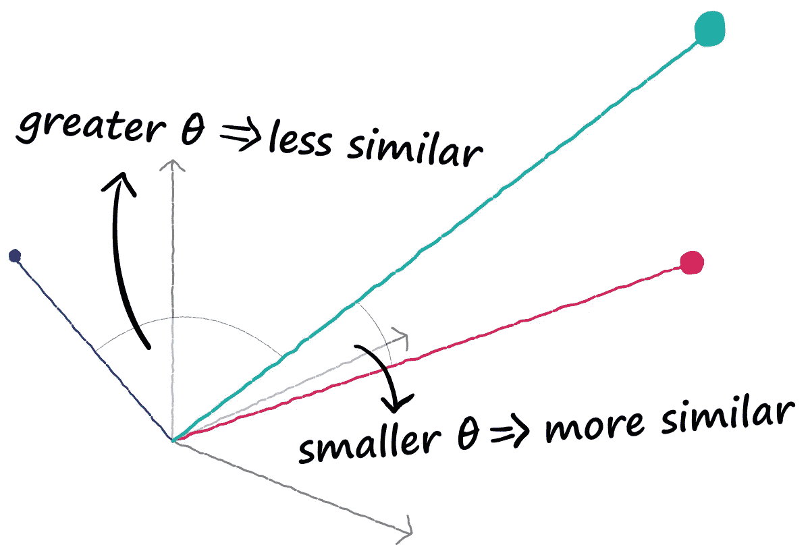

向量之间的角度越小(用余弦相似度计算),意味着它们越对齐。对于密集向量，这与更大的语义相似性相关。

但有一个问题，每个序列由 512 个向量表示，而不是一个向量。

所以，这是伯特的另一个精彩改编的地方。Sentence-BERT 允许我们创建一个单一的向量来代表我们的完整序列，也称为*句子向量* [2]。

我们有两种实现 SBERT 的方法——使用`sentence-tranformers`库的简单方法，或者使用`transformers` *和* PyTorch 的稍微不太简单的方法。

我们将涉及这两个方面，从 PyTorch 方法的`transformers`开始，这样我们可以直观地了解这些向量是如何构建的。

如果你用过 HF transformers 库，前几个步骤看起来会很熟悉。我们初始化我们的 SBERT 模型和标记器，标记我们的文本，并通过模型处理我们的标记。

我们在这里添加了一个新句子，句子 **g** 具有与 **b** 相同的*语义*含义，但没有相同的关键字。由于缺乏共有词，我们以前的所有方法都很难找到这两个序列之间的相似性——记住这一点，以后再说。

我们有长度为 *768 —* 的向量，但这些是**而不是** *句子向量*，因为我们对序列中的每个标记都有一个向量表示(这里是 128，因为我们使用 SBERT —对于 BERT-base 是 512)。我们需要执行一个 **mean pooling** 操作来创建句子向量。

我们做的第一件事是将我们的`embeddings`张量中的每个值乘以它各自的`attention_mask`值。`attention_mask`包含**1**，这里我们有‘实令牌’(例如不是填充令牌)，而**0**在别处——这个操作允许我们忽略非实令牌。

这些是我们的句子向量，利用它们，我们可以通过计算它们之间的余弦相似度来衡量相似度。

如果我们可视化我们的阵列，我们可以很容易地识别更高相似性的句子:

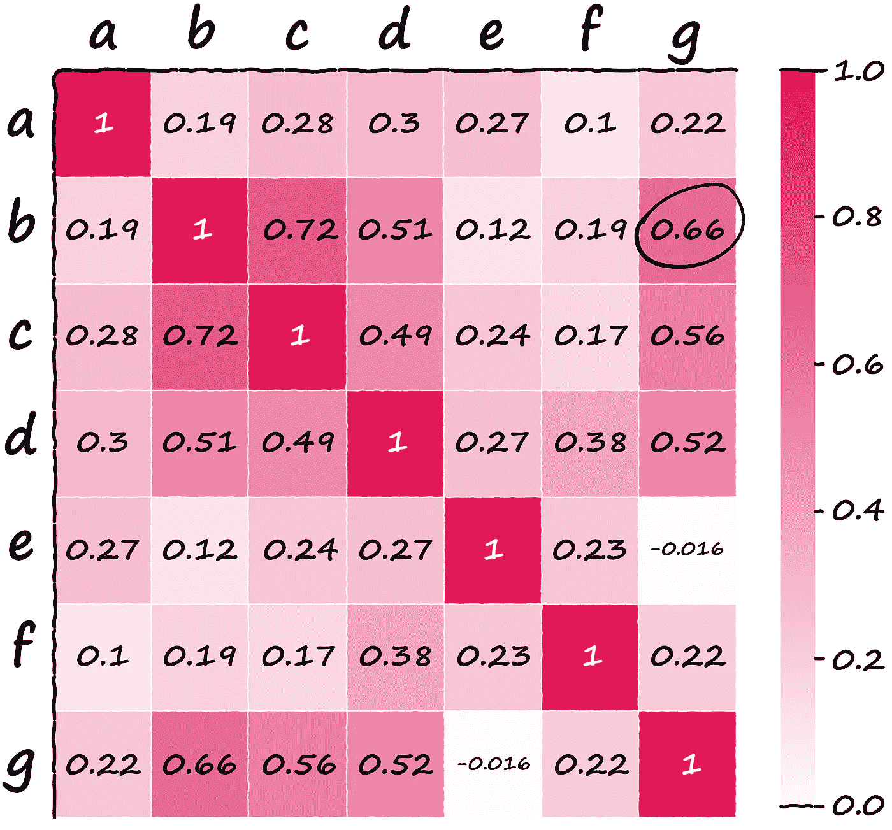

热图显示了我们的 SBERT 句子向量之间的余弦相似性——句子 **b** 和 **g** 之间的得分被圈起来。

现在，回想一下之前的笔记，关于句子 **b** 和 **g** 具有基本相同的意思，而**没有**共享*任何*相同的关键字。

我们希望 SBERT 及其卓越的语言语义表示能够确定这两个句子是相似的——令人惊讶的是，这两个句子之间的相似性是我们第二高的分数，为 0.66(上面画了圈)。

现在，**另一种(简单的)方法是使用句子变形器**。为了获得与上面完全相同的输出，我们编写:

当然，这要容易得多。

这就是 Jaccard，Levenshtein 和 Bert 的历史之旅！

我们总共讨论了五种不同的技术，从简单的 Jaccard 相似性和 Levenshtein 距离开始。然后使用稀疏矢量进行搜索——TF-IDF 和 BM25，最后使用 SBERT 完成最新的密集矢量表示。

我希望你喜欢这篇文章。如果您有任何问题或建议，请通过推特[或在下面的评论中告诉我。如果你对更多类似的内容感兴趣，我也会在 YouTube 上发布。](https://twitter.com/jamescalam)

感谢阅读！

[📚在 Pinecone.io 了解有关可扩展搜索的更多信息](https://www.pinecone.io/learn/)

# 参考

[1][Alphabet(谷歌)](https://companiesmarketcap.com/alphabet-google/marketcap/)市值，公司市值

[2] N. Reimers，I. Gurevych，[句子-BERT:使用连体 BERT 网络的句子嵌入](https://arxiv.org/abs/1908.10084) (2019)，2019 年实证方法 2019 年会议录

[笔记本回购](https://github.com/pinecone-io/examples/tree/master/semantic_search_intro)

colab for[JAC card](https://colab.research.google.com/github/pinecone-io/examples/blob/master/semantic_search_intro/jaccard.ipynb)|[Levenshtein](https://colab.research.google.com/github/pinecone-io/examples/blob/master/semantic_search_intro/levenshtein.ipynb)|[TF-IDF](https://colab.research.google.com/github/pinecone-io/examples/blob/master/semantic_search_intro/tfidf.ipynb)|[BM25](https://colab.research.google.com/github/pinecone-io/examples/blob/master/semantic_search_intro/bm25.ipynb)|[SBERT](https://colab.research.google.com/github/pinecone-io/examples/blob/master/semantic_search_intro/sbert.ipynb)

[🤖《变形金刚》课程 NLP 的 70%折扣](https://bit.ly/nlp-transformers)

**除非另有说明，所有图片均出自作者之手*