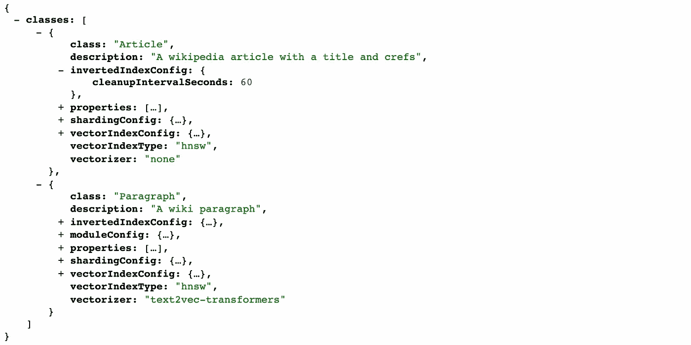
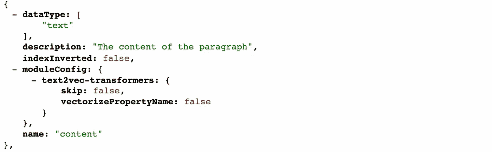
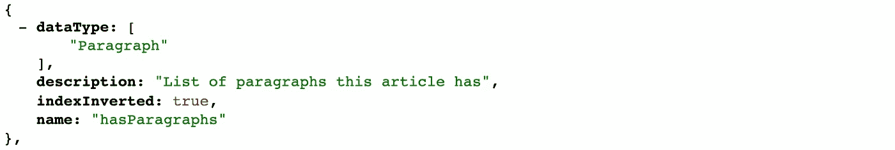
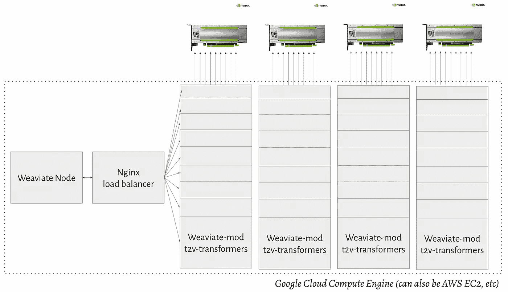
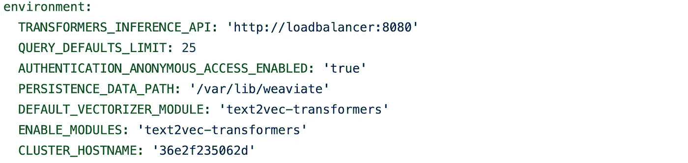

# 使用 Weaviate 在维基百科中进行语义搜索(GraphQL、Sentence-BERT 和 BERT Q&A)

> 原文：<https://towardsdatascience.com/semantic-search-through-wikipedia-with-weaviate-graphql-sentence-bert-and-bert-q-a-3c8a5edeacf6?source=collection_archive---------11----------------------->

## 使用 Weaviate 矢量搜索引擎在整个维基百科中进行语义搜索

Gulnaz Sh 拍摄的照片。

为了进行大规模的语义搜索查询，需要向量搜索引擎来搜索表示数据的大量向量表示。为了向你展示如何做到这一点，我们[在](https://github.com/semi-technologies/semantic-search-through-wikipedia-with-weaviate) [Weaviate](https://github.com/semi-technologies/weaviate) 开源了完整的英语维基百科语料库。在本文中，我将概述我们如何创建数据集，向您展示如何自己运行数据集，并介绍如何在您自己的项目中实现类似的矢量和语义搜索解决方案以及如何将它们投入生产的搜索策略。

使用的维基百科数据集是 2021 年 10 月 9 日的“truthy”版本。处理后，它包含 11.348.257 条、27.377.159 段和 125.447.595 图表交叉引用。虽然导入数据需要更大的机器(见下文)，但服务是在 12 个 CPU、100 GB RAM、250Gb SSD Google Cloud VM 和 1 个 NVIDIA Tesla P4 上完成的。所用的 ML 型号为"[multi-QA-MiniLM-L6-cos-v1](https://huggingface.co/sentence-transformers/multi-qa-MiniLM-L6-cos-v1)"和"[Bert-large-un cased-whole-word-masking-fine tuned-squad](https://huggingface.co/bert-large-uncased-whole-word-masking-finetuned-squad)",两者均可作为 Weaviate 中的[预建模块](https://www.semi.technology/developers/weaviate/current/modules/text2vec-transformers.html#pre-built-images)。

📄完整的数据集和代码在 Github [这里](https://github.com/semi-technologies/semantic-search-through-wikipedia-with-weaviate)是开源的。

Weaviate 的 GraphQL 界面中的语义搜索查询示例—作者 GIF

# 分两步导入数据

> 您也可以直接将备份导入 Weaviate，而不需要像这里的[所描述的那样自己导入。](https://github.com/semi-technologies/semantic-search-through-wikipedia-with-weaviate/tree/main#step-3-load-from-backup)

为了导入数据，我们使用两种不同的方法。第一个是清理数据集，第二个是导入数据。

## 步骤 1–清理数据

第一步非常简单，我们将清理数据并创建一个 [JSON Lines](https://jsonlines.org/) 文件，以便在导入过程中迭代。您可以自己运行该流程，或者通过[该](https://github.com/semi-technologies/semantic-search-through-wikipedia-with-weaviate#step-1-process-the-wikipedia-dump)链接下载 proceed 文件。

## 步骤 2 —导入数据

这就是繁重工作发生的地方，因为所有段落都需要矢量化。我们将使用 Weaviate 的模块化设置来使用多个 GPU，我们将在其中填充模型，但在此之前，我们需要创建一个代表我们用例的 Weaviate 模式。

## 步骤 2.1 —创建一个弱化模式

在 Weaviate 中，我们将使用一个模式来决定如何查询 GraphQL 中的数据，以及我们希望对哪些部分进行矢量化。在一个模式中，您可以设置不同的矢量化工具，并在类级别上对指令进行矢量化。

首先，因为我们的用例是在维基百科上进行语义搜索，所以我们将把数据集分成段落，并使用 Weaviate 的图表将它们链接回文章。因此，我们需要两个类；*条*和*款*。

弱化阶级结构——作者的形象

接下来，我们要确保段落的内容得到正确的矢量化，SentenceBERT 转换器生成的矢量表示将用于我们所有的语义搜索查询。

被矢量化的单一数据类型——按作者分类的图像

最后，我们希望建立图表关系，在第一步的数据集中，我们将提取我们可以引用的文章之间的所有图表关系，如下所示:

段落交叉引用—作者图片

我们使用 [Python 客户端](https://www.semi.technology/developers/weaviate/current/client-libraries/python.html)导入的完整模式可以在[这里](https://github.com/semi-technologies/semantic-search-through-wikipedia-with-weaviate/blob/main/step-2/import.py#L19-L120)找到。

## 步骤 2.2 —导入数据

因为我们要对*大量*数据进行矢量化。我们将使用与开篇中提到的相同的机器，但使用 4 个而不是 1 个 GPU。

带有弱负载平衡器的谷歌云 GPU 设置——图片由作者提供

负载均衡器会将流量重定向到可用的 Weaviate transformer 模块，从而显著提高导入速度。在以下章节:*实施策略——将语义搜索应用到生产中*,您将找到更多关于如何在生产中运行语义搜索的信息。

最重要的是，我们将在 Docker Compose 文件中设置一个外部卷，以确保我们将数据存储在容器之外。这将允许我们打包备份，并在最后一步中直接从备份运行 Weaviate。

在环境变量中，我们设置了一个 CLUSTER_HOSTNAME，这是一个可以用来标识集群的任意名称。

Docker 环境设置—按作者分类的图像

我们还将在 Weaviate 外部设置卷的位置，在这种情况下，数据将存储在/var/weaviate 文件夹中

备份卷—按作者分类的图像

你可以在这里找到我们使用过的完整的 docker-compose 文件。

# 查询数据

当前的 Weaviate 设置启用了两个模块:语义搜索和问答。这些模块可以用于不同类型的查询。所使用的查询语言是 GraphQL，可以与各种不同编程语言的[客户端库](https://www.semi.technology/developers/weaviate/current/client-libraries/)一起使用。

## 示例 1 —自然语言问题

在这个例子中，我们提出一个自然语言问题，我们将假设第一个结果包含答案(因此限制被设置为 1)。基于最新数据集的结果包含约 0.68 的确定性(即，向量空间中从查询到答案的距离)。在您的终端应用中，您可以对确定性进行限制，以确定您是否希望将结果呈现给最终用户，在本文的最新段落(*实施策略—将语义搜索引入生产*)中，您将找到更多相关信息。

💡LIVE — [尝试这个查询](http://console.semi.technology/console/query#weaviate_uri=http://semantic-search-wikipedia-with-weaviate.api.vectors.network:8080&graphql_query=%23%23%0A%23%20Using%20the%20Q%26A%20module%20I%0A%23%23%0A%7B%0A%20%20Get%20%7B%0A%20%20%20%20Paragraph(%0A%20%20%20%20%20%20ask%3A%20%7B%0A%20%20%20%20%20%20%20%20question%3A%20%22Where%20is%20the%20States%20General%20of%20The%20Netherlands%20located%3F%22%0A%20%20%20%20%20%20%20%20properties%3A%20%5B%22content%22%5D%0A%20%20%20%20%20%20%7D%0A%20%20%20%20%20%20limit%3A%201%0A%20%20%20%20)%20%7B%0A%20%20%20%20%20%20_additional%20%7B%0A%20%20%20%20%20%20%20%20answer%20%7B%0A%20%20%20%20%20%20%20%20%20%20result%0A%20%20%20%20%20%20%20%20%20%20certainty%0A%20%20%20%20%20%20%20%20%7D%0A%20%20%20%20%20%20%7D%0A%20%20%20%20%20%20content%0A%20%20%20%20%20%20title%0A%20%20%20%20%7D%0A%20%20%7D%0A%7D)

## 示例 2 —通用概念搜索

人们不仅可以搜索自然语言问题，还可以在下面的概述中搜索像“意大利食品”这样的通用概念。 *nearText* 过滤器还允许[更具体的过滤器](https://www.semi.technology/developers/weaviate/current/modules/text2vec-transformers.html#neartext)，如 *moveAwayFrom* 和 MoveTo concepts，以操纵向量空间中的搜索。

💡LIVE — [尝试这个查询](http://console.semi.technology/console/query#weaviate_uri=http://semantic-search-wikipedia-with-weaviate.api.vectors.network:8080&graphql_query=%23%23%0A%23%20Generic%20question%20about%20Italian%20food%0A%23%23%0A%7B%0A%20%20Get%20%7B%0A%20%20%20%20Paragraph(%0A%20%20%20%20%20%20nearText%3A%20%7B%0A%20%20%20%20%20%20%20%20concepts%3A%20%5B%22Italian%20food%22%5D%0A%20%20%20%20%20%20%7D%0A%20%20%20%20%20%20limit%3A%2050%0A%20%20%20%20)%20%7B%0A%20%20%20%20%20%20content%0A%20%20%20%20%20%20order%0A%20%20%20%20%20%20title%0A%20%20%20%20%20%20inArticle%20%7B%0A%20%20%20%20%20%20%20%20...%20on%20Article%20%7B%0A%20%20%20%20%20%20%20%20%20%20title%0A%20%20%20%20%20%20%20%20%7D%0A%20%20%20%20%20%20%7D%0A%20%20%20%20%7D%0A%20%20%7D%0A%7D)

## 示例 3 —混合自然语言问题和标量搜索

在 Weaviate 中，你也可以混合标量搜索过滤器和矢量搜索过滤器。在这个特定的例子中，我们想要对关于萨克斯演奏家麦克·布雷克的文章的所有段落进行语义搜索查询。

💡LIVE — [尝试这个查询](http://console.semi.technology/console/query#weaviate_uri=http://semantic-search-wikipedia-with-weaviate.api.vectors.network:8080&graphql_query=%23%23%0A%23%20Mixing%20scalar%20queries%20and%20semantic%20search%20queries%0A%23%23%0A%7B%0A%20%20Get%20%7B%0A%20%20%20%20Paragraph(%0A%20%20%20%20%20%20ask%3A%20%7B%0A%20%20%20%20%20%20%20%20question%3A%20%22What%20was%20Michael%20Brecker's%20first%20saxophone%3F%22%0A%20%20%20%20%20%20%20%20properties%3A%20%5B%22content%22%5D%0A%20%20%20%20%20%20%7D%0A%20%20%20%20%20%20where%3A%20%7B%0A%20%20%20%20%20%20%20%20operator%3A%20Equal%0A%20%20%20%20%20%20%20%20path%3A%20%5B%22inArticle%22%2C%20%22Article%22%2C%20%22title%22%5D%0A%20%20%20%20%20%20%20%20valueString%3A%20%22Michael%20Brecker%22%0A%20%20%20%20%20%20%7D%0A%20%20%20%20%20%20limit%3A%201%0A%20%20%20%20)%20%7B%0A%20%20%20%20%20%20_additional%20%7B%0A%20%20%20%20%20%20%20%20answer%20%7B%0A%20%20%20%20%20%20%20%20%20%20result%0A%20%20%20%20%20%20%20%20%7D%0A%20%20%20%20%20%20%7D%0A%20%20%20%20%20%20content%0A%20%20%20%20%20%20order%0A%20%20%20%20%20%20title%0A%20%20%20%20%20%20inArticle%20%7B%0A%20%20%20%20%20%20%20%20...%20on%20Article%20%7B%0A%20%20%20%20%20%20%20%20%20%20title%0A%20%20%20%20%20%20%20%20%7D%0A%20%20%20%20%20%20%7D%0A%20%20%20%20%7D%0A%20%20%7D%0A%7D)

## 示例 4 —混合通用概念搜索和图形关系

有了 Weaviate，你还可以使用 GraphQL 接口来建立图形关系，就像维基百科中不同文章之间的链接一样。在这个概述中，我们将段落与文章连接起来，并显示链接的文章。

💡现场— [尝试这个查询](http://console.semi.technology/console/query#weaviate_uri=http://semantic-search-wikipedia-with-weaviate.api.vectors.network:8080&graphql_query=%23%23%0A%23%20Using%20the%20Q%26A%20module%20I%0A%23%23%0A%7B%0A%20%20Get%20%7B%0A%20%20%20%20Paragraph(%0A%20%20%20%20%20%20ask%3A%20%7B%0A%20%20%20%20%20%20%20%20question%3A%20%22Where%20is%20the%20States%20General%20of%20The%20Netherlands%20located%3F%22%0A%20%20%20%20%20%20%20%20properties%3A%20%5B%22content%22%5D%0A%20%20%20%20%20%20%7D%0A%20%20%20%20%20%20limit%3A%201%0A%20%20%20%20)%20%7B%0A%20%20%20%20%20%20_additional%20%7B%0A%20%20%20%20%20%20%20%20answer%20%7B%0A%20%20%20%20%20%20%20%20%20%20result%0A%20%20%20%20%20%20%20%20%20%20certainty%0A%20%20%20%20%20%20%20%20%7D%0A%20%20%20%20%20%20%7D%0A%20%20%20%20%20%20content%0A%20%20%20%20%20%20title%0A%20%20%20%20%7D%0A%20%20%7D%0A%7D)

# 实施策略——将语义搜索引入生产

Weaviate 的目标是让您将大型的 ML-first 应用程序投入生产。但是就像任何技术一样，它并不是灵丹妙药，成功取决于您的实施。

## 可量测性

演示数据集在单台机器上的 Docker 设置上运行，如果您想在生产中使用 Weaviate 数据集，可以轻松启动 Kubernetes 集群。如何做到这一点，这里概述了。

# 结论

要将语义搜索解决方案投入生产，您需要三样东西:

1.  数据
2.  ML 模型
3.  向量搜索引擎

在本文中，我们展示了如何使用开源 ML 模型(Sentence-BERT)和矢量搜索引擎(Weaviate)将完整的维基百科语料库(数据)投入生产。

我们期待听到你将创造什么。请务必通过 [Slack](https://join.slack.com/t/weaviate/shared_invite/zt-goaoifjr-o8FuVz9b1HLzhlUfyfddhw) 、 [Twitter](https://twitter.com/SeMI_tech) 或 [Github](https://github.com/semi-technologies/weaviate) 让我们知道。