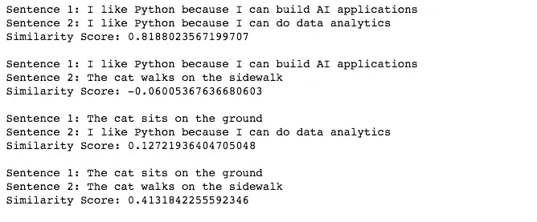

# 使用转换器的语义相似度

> 原文：<https://towardsdatascience.com/semantic-similarity-using-transformers-8f3cb5bf66d6?source=collection_archive---------4----------------------->

## 使用 Pytorch 和 SentenceTransformers 计算两个文本之间的语义文本相似度


照片由[🇸🇮·扬科·菲利](https://unsplash.com/@itfeelslikefilm?utm_source=medium&utm_medium=referral)在 [Unsplash](https://unsplash.com?utm_source=medium&utm_medium=referral) 上拍摄

# 介绍

[**语义相似度**](https://en.wikipedia.org/wiki/Semantic_similarity) ，或语义文本相似度，是 [**自然语言处理(NLP)**](https://en.wikipedia.org/wiki/Natural_language_processing) 领域中的一项任务，使用一个定义的度量对文本或文档之间的关系进行评分。语义相似度有着广泛的应用，如信息检索、文本摘要、情感分析等。

语义相似度有很多方法。**现在最直接有效的方法是使用一个强大的模型(例如 transformer)对句子进行编码，以获得它们的嵌入，然后使用一个相似性度量(例如余弦相似性)来计算它们的相似性得分。**相似度得分表示两个文本是否具有相似或更多不同的含义。**本帖将展示如何使用**[**Transformers**](https://en.wikipedia.org/wiki/Transformer_(machine_learning_model))实现语义相似性，这是一个强大的 NLP 架构，为各种 NLP 任务带来了一流的性能。

所以事不宜迟，让我们开始吧！

# 教程概述

1.  安装依赖项和库
2.  导入库
3.  模型选择和初始化
4.  计算两个句子之间的语义相似度
5.  计算两个句子列表之间的语义相似度
6.  从给定句子的语料库中检索前 K 个最相似的句子

# 安装依赖项

我们将要用来计算语义相似度的主要库是[sentence transformers](https://www.sbert.net/index.html)([Github source link](https://github.com/UKPLab/sentence-transformers))，这是一个简单的库，提供了一种简单的方法来计算文本的密集向量表示(例如嵌入)。它包含许多先进的预训练模型，针对各种应用进行了微调。它支持的主要任务之一是语义文本相似性，这是我们将在这篇文章中关注的。

要安装 SentenceTransformers，你必须先安装依赖项 [Pytorch](https://pytorch.org/) 和 [Transformers](https://github.com/huggingface/transformers) 。

## 安装 Pytorch

进入 [Pytorch 官网](https://pytorch.org/)按照说明安装 Pytorch。

## 安装变压器

要安装变压器，请运行:

```
pip install transformers
```

## 安装句子变压器

现在，您已经安装了 Pytorch 和 transformers，您可以通过以下方式安装 SentenceTransformers:

```
pip install sentence-transformers
```

*注:SentenceTransformers 推荐 Python 3.6 以上，PyTorch 1.6.0 以上，transformers v3.1.0 以上。*

# 导入库

在成功安装了 SentenceTransformers 库及其依赖项之后，我们可以开始使用这个库了。我们可以通过以下方式导入它:

```
from sentence_transformers import SentenceTransformer, util
import numpy as np
```

# 模型选择和初始化

SentenceTransformers 支持各种预训练模型，这些模型针对开箱即用的不同任务进行了微调。要查找针对语义文本相似性优化的模型列表，您可以在这里看到它[。](https://docs.google.com/spreadsheets/d/14QplCdTCDwEmTqrn1LH4yrbKvdogK4oQvYO1K1aPR5M/edit#gid=0)

截至本文撰写之时，`stsb-roberta-large`使用 [ROBERTA-large](https://arxiv.org/abs/1907.11692) 作为基础模型和均值池，是语义相似性任务的最佳模型。因此，我们用这个模型来证明。

选择模型后，我们可以通过以下方式初始化它:

```
model = SentenceTransformer('stsb-roberta-large')
```

# 计算两个句子之间的语义相似度

在定义了我们的模型之后，我们现在可以计算两个句子的相似性得分。如引言中所讨论的，该方法是使用该模型对两个句子进行编码，然后计算得到的两个嵌入的余弦相似度。最终结果将是语义相似度得分。

一般来说，我们可以使用不同的公式来计算最终的相似性得分(例如，点积、Jaccard 等。)，但在这种情况下，由于余弦相似性的性质，我们使用余弦相似性。更重要的因素是由模型产生的嵌入，因此使用合适的编码模型是很重要的。

为了使用所讨论的方法来计算语义相似性得分，我们可以运行以下内容:

```
sentence1 = "I like Python because I can build AI applications"
sentence2 = "I like Python because I can do data analytics"# encode sentences to get their embeddings
embedding1 = model.encode(sentence1, convert_to_tensor=True)
embedding2 = model.encode(sentence2, convert_to_tensor=True)# compute similarity scores of two embeddings
cosine_scores = util.pytorch_cos_sim(embedding1, embedding2)print("Sentence 1:", sentence1)
print("Sentence 2:", sentence2)
print("Similarity score:", cosine_scores.item())
```

我们首先定义两个句子，句子 1 和句子 2，然后使用我们之前定义的模型对它们进行编码。我们将最终的嵌入转换为张量，这样 GPU 可以更快地处理它们。对于像我们这样的小数据，这不是必需的，但仍然是一个很好的实践。

然后，我们可以使用 util 提供的 pytorch_cos_sim 函数方便地计算两个嵌入之间的余弦相似性得分，这要感谢句子转换器。


抽样输出

最后可以看到相似度得分。我们可以看到，在这种情况下，句子 1 和句子 2 的分数接近 1，这意味着它们非常相似。

# 计算两个句子列表之间的语义相似度

当你想相互比较更多的句子时，你可以把句子放入两个列表中，用和上面一样的代码计算它们之间的相似度得分。最终结果将是一个相似性得分矩阵，其中`i, j`元素包含列表 1 中的句子`i`和列表 2 中的句子`j`之间的相似性得分。为此，请运行以下命令:

```
sentences1 = ["I like Python because I can build AI applications", "The cat sits on the ground"]   
sentences2 = ["I like Python because I can do data analytics", "The cat walks on the sidewalk"]# encode list of sentences to get their embeddings
embedding1 = model.encode(sentences1, convert_to_tensor=True)
embedding2 = model.encode(sentences2, convert_to_tensor=True)# compute similarity scores of two embeddings
cosine_scores = util.pytorch_cos_sim(embedding1, embedding2)for i in range(len(sentences1)):
    for j in range(len(sentences2)):
        print("Sentence 1:", sentences1[i])
        print("Sentence 2:", sentences2[j])
        print("Similarity Score:", cosine_scores[i][j].item())
        print()
```



抽样输出

你可以看到这两个句子对(“我喜欢 Python，因为我可以构建 AI 应用”、“我喜欢 Python，因为我可以做数据分析”)和(“猫坐在地上”、“猫走在人行道上”)比较相似。因此，输出的相似性得分也相对较高。另一方面，Python 与猫非常不相似，反之亦然，因此其他两个句子对的相似度得分较低。

# **从给定句子的语料库中检索前 K 个最相似的句子**

语义相似性的一个流行用例是在给定查询句子的语料库中找到最相关的句子。这也可以称为语义搜索。为了进行语义搜索，我们需要一个句子语料库和一个充当查询的句子。然后，我们可以使用我们的模型对语料库和我们的句子进行编码，然后使用与前面相同的方法计算我们的句子和语料库中每个句子之间的余弦相似性得分。最后，通过获得前 k 个最高相似度得分，我们可以获得前 k 个最相似的句子。

```
corpus = ["I like Python because I can build AI applications",
          "I like Python because I can do data analytics",
          "The cat sits on the ground",
         "The cat walks on the sidewalk"]# encode corpus to get corpus embeddings
corpus_embeddings = model.encode(corpus, convert_to_tensor=True)sentence = "I like Javascript because I can build web applications"# encode sentence to get sentence embeddings
sentence_embedding = model.encode(sentence, convert_to_tensor=True)# top_k results to return
top_k=2# compute similarity scores of the sentence with the corpus
cos_scores = util.pytorch_cos_sim(sentence_embedding, corpus_embeddings)[0]# Sort the results in decreasing order and get the first top_k
top_results = np.argpartition(-cos_scores, range(top_k))[0:top_k]print("Sentence:", sentence, "\n")
print("Top", top_k, "most similar sentences in corpus:")
for idx in top_results[0:top_k]:
    print(corpus[idx], "(Score: %.4f)" % (cos_scores[idx]))
```


抽样输出

在我们的例子中，我们的语料库有 4 个句子，我们将 top_k 设置为 2，以检索与我们的查询句子最相似的前 2 个句子。我们的查询语句是“我喜欢 Javascript，因为我可以构建 web 应用程序”，返回关于 Python 的两个语句是因为 Javascript 比 cats 更类似于 Python。

# 结论

现在你有了！现在，你应该能够理解如何计算句子之间的语义相似度，句子列表，以及从语料库中检索最相似的数据。为了方便起见，下面是这篇文章的全部 Jupyter 代码:

如果你有任何问题，请在下面的评论中告诉我！

如果你喜欢我的作品，可以随意浏览我的其他文章:)

</top-nlp-books-to-read-2020-12012ef41dc1>  </top-nlp-libraries-to-use-2020-4f700cdb841f>  </bert-text-classification-using-pytorch-723dfb8b6b5b>  </fine-tuning-gpt2-for-text-generation-using-pytorch-2ee61a4f1ba7>  

# **参考文献**

[1] [Pytorch 官网](https://pytorch.org/)，脸书

【2】[变形金刚 Github](https://github.com/huggingface/transformers) ，拥抱脸

[3] [SentenceTransformers 网站](https://www.sbert.net/)，无处不在的知识处理实验室

[4][sentence transformers Github](https://github.com/UKPLab/sentence-transformers)，无处不在的知识处理实验室

[5]刘，，等.[“Roberta:一种稳健优化的 bert 预训练方法”](https://arxiv.org/abs/1907.11692) *arXiv 预印本 arXiv:1907.11692* (2019)。