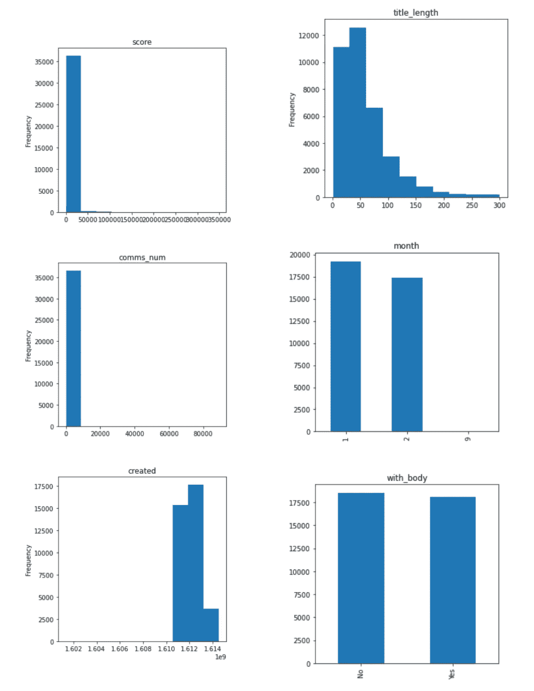

# Python 中的半自动探索性数据分析(EDA)

> 原文：<https://towardsdatascience.com/semi-automated-exploratory-data-analysis-eda-in-python-7f96042c9809?source=collection_archive---------0----------------------->

## 一键式全面数据探索流程


EDA 概述(图片作者来自[www.visual-design.net](http://www.visual-design.net)

探索性数据分析，也称为 EDA，已经成为数据科学中越来越热门的话题。顾名思义，就是在一个不确定的空间里试错的过程，目标是找到洞见。这通常发生在数据科学生命周期的早期阶段。尽管在数据探索、数据清理或特征工程之间没有明确的定义。EDA 通常位于数据清理阶段之后，特征工程或模型构建之前。EDA 有助于设置模型选择的总体方向，并有助于检查数据是否符合模型假设。因此，执行这一初步分析可以为您的后续步骤节省大量时间。

在本文中，我创建了一个半自动的 ed a 过程，它可以分为以下几个步骤:

1.  了解您的数据
2.  数据处理和特征工程
3.  单变量分析
4.  多变量分析

随意跳转到你感兴趣的部分，或者从[我的网站](https://www.visual-design.net/post/semi-automated-exploratory-data-analysis-process-in-python)获取完整代码，如果你觉得有用的话。

# 1.了解您的数据

首先，我们需要加载 python 库和数据集。在这个练习中，我使用了来自 Kaggle 社区的几个公共数据集，请使用下面的链接随意探索这些惊人的数据:

【2020 年餐饮商业排名

[Reddit WallStreetBets 帖子](https://www.kaggle.com/gpreda/reddit-wallstreetsbets-posts)

## 导入库

我将使用四个主要的库:Numpy——处理数组；熊猫——以我们熟悉的电子表格格式处理数据；Seaborn 和 matplotlib——创建数据可视化。

```
import pandas as pd 
import seaborn as sns 
import matplotlib.pyplot as plt 
import numpy as np from pandas.api.types 
import is_string_dtype, is_numeric_dtype
```

## 输入数据

通过复制数据集的路径从导入的数据集创建一个数据框，并使用`df.head(5)`查看前 5 行数据。


“reddit_wsb”数据集结果(图片由作者提供)


“餐馆”数据集输出(图片由作者提供)

在放大每个字段之前，让我们先鸟瞰一下整个数据集的特征。

## 信息()

它给出了每列及其数据类型的非空值的计数。


“reddit_wsb”数据集结果(图片由作者提供)


“餐馆”数据集输出(图片由作者提供)

## 描述( )

该函数提供每列的基本统计数据。通过传递参数“include = 'all '”，它输出**值计数、唯一计数、分类变量的最高频率值**和**计数、平均值、标准偏差、最小值、最大值和数值变量的百分比**


“reddit_wsb”数据集结果(图片由作者提供)


“餐馆”数据集输出(图片由作者提供)

如果我们让它为空，它只显示数字变量。如您所见，下面只显示了 info()输出中标识为“int64”的列。


描述“餐馆”数据集的()结果(图片由作者提供)

## 漏测值

处理缺失值是一个兔子洞，不是一两句话能盖住的。如果您想知道如何处理模型生命周期中的缺失值，并了解不同类型的缺失数据，下面的一些文章可能会有所帮助:

[](/simple-logistic-regression-using-python-scikit-learn-86bf984f61f1) [## 使用 Python scikit 的简单逻辑回归-学习

### 从数据预处理到模型评估的逐步指南

towardsdatascience.com](/simple-logistic-regression-using-python-scikit-learn-86bf984f61f1) [](https://medium.com/analytics-vidhya/how-to-address-common-data-quality-issues-2cb58a09b225) [## 如何在没有代码的情况下解决常见的数据质量问题

### 使用 Tableau 解决不一致的值

medium.com](https://medium.com/analytics-vidhya/how-to-address-common-data-quality-issues-2cb58a09b225) 

在本文中，我们将着重于确定缺失值的数量。`isnull().sum()`返回每列缺失值的数量。


“reddit_wsb”数据集结果(图片由作者提供)

我们还可以做一些简单的操作，使输出更有见地。首先，计算缺失值的百分比。


“reddit_wsb”数据集结果(图片由作者提供)

然后，基于数据框“missing_df”可视化缺失值的百分比。for 循环基本上是一种向条形添加标签的简便方法。从图表中我们可以看到，来自“reddit_wsb”数据集的“body”值有将近一半是缺失的，这就引出了下一步“特征工程”。


“reddit_wsb”数据集结果(图片由作者提供)

# 2.特征工程

这是唯一需要一些人类判断的部分，因此不容易自动化。不要害怕这个术语。我认为特征工程是一种奇特的说法，即转换手头的数据，使其更有洞察力。有几种常见的技术，例如，将出生日期转换为年龄，将日期分解为年、月、日和宁滨数值。但是一般的规则是，这个过程应该根据手头的数据和要实现的目标来定制。如果你想了解更多这些技术，我发现这篇文章[“机器学习的特征工程的基本技术”](/feature-engineering-for-machine-learning-3a5e293a5114)在实践中带来了特征工程的整体观点。如果您想了解更多关于特征选择和特征工程技术的信息，您可能会发现这些信息很有帮助:

[](/data-transformation-and-feature-engineering-e5181ef274b5) [## 数据转换和特征工程

### 如何为您的数据选择合适的技术

towardsdatascience.com](/data-transformation-and-feature-engineering-e5181ef274b5) [](/feature-selection-and-eda-in-python-c6c4eb1058a3) [## Python 中的特征选择和 EDA

towardsdatascience.com](/feature-selection-and-eda-in-python-c6c4eb1058a3) 

对于“reddit_wsb”数据集，我简单地对现有数据做了三个操作。

**1。标题→标题 _ 长度；**

```
df['title_length'] = df['title'].apply(len)
```

结果，高基数列“title”被转换成一个数字变量，可以在相关性分析中进一步使用。

**2。body → with_body**

```
df['with_body'] = np.where(df['body'].isnull(), 'Yes', 'No')
```

由于有很大一部分值缺失，“body”字段被转换为 with_body = "Yes "和 with_body = "No "，因此可以很容易地将其作为分类变量进行分析。

**3。时间戳→月份**

```
df['month'] = pd.to_datetime(df['timestamp']).dt.month.apply(str)
```

由于大多数数据都是从“2021 年”收集的，因此没有必要对这一年进行比较。因此，我保留了“日期”的月份部分，这也有助于将数据分组为更大的子集。

为了简化进一步的分析，我删除了对 EDA 没有贡献的列。

```
df = df.drop(['id', 'url', 'timestamp', 'title', 'body'], axis=1)
```

对于“restaurant”数据集，数据已经足够干净，因此我简单地删除了基数较高的列。

```
df = df.drop(['Restaurant', 'City'], axis=1)
```

此外，由于单变量分析和多变量分析需要不同的方法来处理不同的数据类型，因此剩余的变量分为数值型和分类型。“is_string_dtype”和“is_numeric_dtype”是识别每个字段的数据类型的方便函数。


“reddit_wsb”数据集结果(图片由作者提供)


“餐馆”数据集输出(图片由作者提供)

在最终确定数值和分类变量列表后，可以自动进行单变量和多变量分析。

# 3.单变量分析

第一部分中提到的 describe()函数已经以非图形方式提供了单变量分析。在本节中，我们将通过可视化数据获得更多见解，并通过图形分析发现隐藏的模式。

如果您有兴趣了解哪种图表类型最适合哪种数据类型，请阅读我的文章[“如何选择最合适的图表”](https://www.visual-design.net/post/choose-the-right-chart)。

[](/which-chart-to-choose-4b21929539eb) [## 如何选择最合适的图表

### 折线图、条形图、饼图……它们讲述了不同的故事

towardsdatascience.com](/which-chart-to-choose-4b21929539eb) 

**分类变量→条形图**

可视化分类变量属性的最简单也是最直观的方法是使用条形图来绘制每个分类值的频率。

**数值变量→直方图**

要绘制出数值变量分布，我们可以使用直方图，它非常类似于条形图。它将连续的数字分成大小相等的区间，并绘制出区间内记录的频率。


创建直方图和条形图(图片由作者提供)

我使用这个 for 循环遍历数据框中的列，并为每一列创建一个图。如果是数字变量，则使用直方图，如果是分类变量，则使用条形图。



“reddit_wsb”数据集结果(图片由作者提供)


“餐馆”数据集输出(图片由作者提供)

# 4.多变量分析

多变量分析分为这三种情况，以解决数字变量和分类变量的各种组合。

## 1.数值与数值→热图或配对图

首先，让我们使用**相关矩阵**来查找所有数字数据类型列的相关性。然后使用**热图**来可视化结果。每个单元格内的注释表示关系的相关系数。


“reddit_wsb”数据集结果(图片由作者提供)


“餐馆”数据集输出(图片由作者提供)

其次，由于相关矩阵只表示线性关系的强弱，所以最好使用 seaborn 函数 sns.pairplot()来绘制数值变量。注意，sns.heatmap()和 sns.pairplot()函数都忽略非数字数据类型。


“reddit_wsb”数据集结果(图片由作者提供)


“餐馆”数据集输出(图片由作者提供)

**成对图或散点图**是对相关矩阵的良好补充，尤其是当可能存在非线性关系(如指数、反比关系)时。例如，在餐馆数据集中观察到的“等级”和“销售额”之间的反比关系可能被误认为是强线性关系，如果我们简单地看相关矩阵的数字“- 0.92”的话。

## 2.分类与分类→带色调的计数图


样本输出集(图片由作者提供，来自[网站](https://www.visual-design.net/post/semi-automated-exploratory-data-analysis-process-in-python)

两个分类变量之间的关系可以使用**分组条形图**可视化。一级分类变量的频率被二级分类分解。这可以通过使用 sns.countplot()来实现。

我使用了一个嵌套的 for 循环，其中外部循环遍历所有分类变量，并将它们指定为主要类别，然后内部循环再次遍历列表，将主要类别与不同的次要类别配对。


分组条形图代码(图片由作者提供)

在一个分组条形图中，如果不同组之间的频率分布总是遵循相同的模式，则表明主要类别和次要类别之间没有相关性。但是，如果分布不同，则表明两个变量之间可能存在相关性。


“reddit_wsb”数据集结果(图片由作者提供)

因为在“餐馆”数据集中只有一个分类变量，所以没有生成图。

## 3.分类与数值→带色调的箱线图或配对图


boxplot 样本输出集(图片由作者提供，来自[网站](https://www.visual-design.net/post/semi-automated-exploratory-data-analysis-process-in-python)

**箱线图**通常在我们需要比较数字数据在不同组之间的变化时使用。这是一种直观的方式来图形化地描述分类特征的变化是否导致了值的差异，这可以使用 ANOVA 分析进行额外的量化。在这个过程中，我将分类列表中的每一列与数字列表中的所有列配对，并相应地绘制出箱线图。


箱线图代码(图片由作者提供)

在“reddit_wsb”数据集中，不同类别之间没有观察到显著差异。


“reddit_wsb”数据集结果(图片由作者提供)

另一方面，“餐馆”数据集给了我们一些有趣的输出。有些州(如“密歇根州”)似乎在情节中跳来跳去。这仅仅是因为这些州的样本量相对较小，值得进一步研究。


“餐馆”数据集输出(图片由作者提供)

另一种方法是建立在我们之前进行的数值对数值的 **pairplot** 之上的。为了引入分类变量，我们可以用**不同的色调**来表示。就像我们为 countplot 做的一样。为此，我们可以简单地遍历分类列表，并将每个元素添加为 pairplot 的色调。


带色调代码的 pairplot(图片由作者提供)

因此，很容易在散点图中看到每个组是否形成聚类。


“reddit_wsb”数据集结果(图片由作者提供)


“餐馆”数据集输出(图片由作者提供)

希望你喜欢我的文章:)。如果你想阅读更多我关于媒体的文章，请使用这个附属链接([https://destingong.medium.com/membership](https://destingong.medium.com/membership))注册媒体会员。

# 带回家的信息

本文涵盖了执行 EDA 的几个步骤:

1.  了解您的数据:了解数据集的特征。
2.  特征工程:将变量转化为更有洞察力的东西。
3.  单变量分析:1)直方图以可视化数值数据；2)可视化分类数据的条形图。
4.  多元分析:1)数值与数值:相关矩阵、散点图(pair plot)；2)分类对比分类:分组条形图；3)数值与分类:带色调的成对图，箱线图。

随意从我的[网站](https://www.visual-design.net/code)抓取代码。如前所述，除了特征工程部分，其余的分析可以自动化。然而，当自动化过程伴随着一些人的接触时，它总是更好，例如，试验箱大小以优化直方图分布。一如既往，我希望这篇文章对您有所帮助，并鼓励您尝试使用自己的数据集:)

## 更多相关文章

[](https://link.medium.com/2MOB57Y1lfb) [## 通过 YouTube 提升 7 项数据科学技能

### 我们都熟悉现代游戏设计，冠军或英雄总是配备有某些属性…

link.medium.com](https://link.medium.com/2MOB57Y1lfb) [](/simple-logistic-regression-using-python-scikit-learn-86bf984f61f1) [## 使用 Python scikit 的简单逻辑回归-学习

### 从数据预处理到模型评估的逐步指南

towardsdatascience.com](/simple-logistic-regression-using-python-scikit-learn-86bf984f61f1) [](https://medium.com/analytics-vidhya/top-15-websites-for-data-scientists-to-follow-in-2021-67352092c54d) [## 2021 年数据科学家关注的 15 大网站

### 启发学习的网站和博客

medium.com](https://medium.com/analytics-vidhya/top-15-websites-for-data-scientists-to-follow-in-2021-67352092c54d) 

*原载于 2021 年 2 月 28 日*[*【https://www.visual-design.net】*](https://www.visual-design.net/post/semi-automated-exploratory-data-analysis-process-in-python)*。*