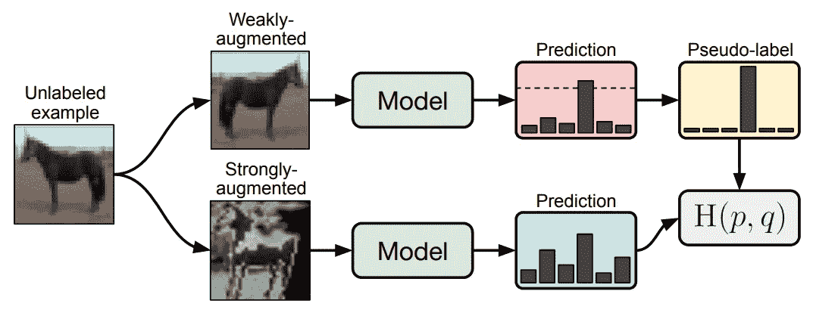

# 用 PyTorch 和 SESEMI 揭开半监督学习的神秘面纱

> 原文：<https://towardsdatascience.com/semi-supervised-learning-demystified-with-pytorch-and-sesemi-9656c14af031?source=collection_archive---------18----------------------->

## 我们如何利用世界上似乎无穷无尽的未标记数据来帮助我们解决监督学习问题？

在“[探索监督和半监督学习的自我监督正则化](https://arxiv.org/pdf/1906.10343.pdf)”中使用的“三螺旋”合成数据集的艺术渲染。

在开发机器学习解决方案时，最大的障碍一直是数据。像 [ImageNet](https://image-net.org/) 和 [COCO](https://cocodataset.org/) 这样的大规模、干净、完全注释的数据集并不容易获得，尤其是对于利基任务。深度学习尤其如此，随着深度学习越来越多地被采用，这一点将变得更加真实。为了克服标记数据瓶颈，研究人员和开发人员正在开发各种技术，如迁移学习、领域适应、合成数据生成以及许多半监督和自我监督技术。

半监督和自我监督技术的世界是一个特别迷人的领域，因为它几乎像魔术一样。我们如何利用世界上似乎无穷无尽的未标记数据来帮助我们解决监督学习问题？事实证明，这些技术比你想象的更容易获得，你可以马上开始应用它们。

# 自我监督学习

在我们开始之前，让我们先定义一下这些术语的含义。**自我监督学习**本质上是从完全无标签的数据中提取监督信息以创建监督学习任务的实践。基本上，我们创建一个“人工”监督学习任务，它具有以下特性:

*   它鼓励网络学习关于数据的语义上有用的信息。
*   它的标签可以从数据扩充中导出。

一种最简单但仍然非常有效的从未标记数据中学习的技术来自 Gidaris 等人的一篇名为“[通过预测图像旋转进行无监督表示学习](https://arxiv.org/abs/1803.07728)的论文。这种辅助任务非常直观:给定一幅输入图像，随机将其旋转 0、90、180 或 270 度。然后训练您的模型来预测标签“0”、“90”、“180”或“270”。

这里的直觉是，随机旋转图像引入了标签，同时保留了有用的语义信息。例如，给定一张旋转了 90 度的狗的图片，一个人可以清楚地知道图片被旋转了，因为狗不会站在墙上！然而，有些东西，如苍蝇、窗户和油画，确实是挂在墙上的。图像中的语义信息包含关于其旋转的线索。理论是，通过试图预测图像的方向，模型必须学习关于对象的预期方向的信息，从而隐含地学习那些对象的语义特征，然后可以应用于其他任务。

这些图像的内容包含关于它们旋转角度的线索。例如，第一幅图像中的鸟看起来是横着的，表明图像可能逆时针旋转了 90 度。

自我监督可以采取多种形式，例如图像的修补、着色和超分辨率，视频的帧预测，以及 NLP 中的单词或序列预测。想要深入了解自我监督学习的世界，请看由[阿米特·乔德里](https://twitter.com/amitness)撰写的[这篇博文](https://amitness.com/2020/02/illustrated-self-supervised-learning/)。

# 半监督学习

**半监督学习**是使用标记和未标记数据来训练任务的实践。半监督学习技术通常在两个任务上交替训练，首先是应用于标记数据的标准监督任务，然后是利用未标记数据和某种数据扩充的辅助任务。一个这样的辅助任务可能是预测图像旋转，就像我们之前讨论的那样。在许多情况下，半监督学习本质上就像将自我监督训练和监督训练一起应用。

一个特别值得注意，但有些不同的例子是来自谷歌研究论文的 [FixMatch](https://arxiv.org/abs/2001.07685) 。这里的辅助任务其实和目标任务是一样的:给定一个图像，预测它的类别。然而，我们不是用标记的数据来解决这个任务的。取而代之的是，未标记的输入图像被增强两次:一次以弱的增强量(例如翻转移位)，第二次以强的增强量。该模型然后预测弱增强图像和强增强图像的标签。弱增强图像的预测(如果它通过了置信度阈值)用作伪“地面真实”标签，由此我们评估强增强图像的标签。这里的目标是鼓励网络变得对极端增强更健壮，并鼓励它学习更强的特征，而不需要技术上的标记数据。

FixMatch 的图表。输入图像(顶部)被弱增强并生成模型预测。如果预测超过给定的阈值，则分配一个“伪标签”。然后，对同一图像应用强增强，并生成另一个预测。固定匹配损失函数鼓励该预测和先前的“伪标签”之间的一致

本文应用了一种最新的半监督学习技术，称为**一致性正则化**。首先对您的数据应用增强，保留其*语义内容*(即“这张猫的照片看起来还像猫吗”)。然后，通过明确的监督或损失函数中惩罚对这些变化的敏感性的条款，鼓励你的网络对非语义的增强变得有弹性。通过利用数据扩充，你可以通过自我监督将几乎任何监督学习任务变成半监督任务。

## 塞斯米

在这篇文章的其余部分，我们将专注于一种叫做 [SESEMI](https://github.com/FlyreelAI/sesemi) 的特定技术，这是一种由 [Flyreel AI Research](https://www.flyreel.co/) 发布的半监督训练技术。论文中描述的[想法与图像旋转任务非常相似，除了一些关键的区别。首先，他们为水平和垂直镜像添加了两个额外的类。更重要的是，这种技术联合训练被监督的和自我监督的目标，将自我监督的目标框定为一种自我监督的正则化形式。因此，损失函数看起来像一个典型的正则化损失函数，只是加权项和未加权项都是应用于不同数据子集的标准交叉熵损失。](https://arxiv.org/pdf/1906.10343.pdf)

SESEMI 损失函数由监督项和自监督项组成，并用权重项 *w* 进行平衡。最左边的项(未加权)是应用于标签的标记子集和 softmax 预测向量的损失。最右边的(加权)项是应用于具有我们的辅助标签及其 softmax 预测向量的未标记数据子集的损失。这两项都是标准的交叉熵损失。

这种技术的优雅之处在于它的简单。与其他需要大量调整超参数的最新一致性正则化技术不同，SESEMI 需要的唯一超参数是两个损失项之间的权重，作者建议将其设置为 1.0。使用这种技术不需要专门的理论或损失函数或自定义模型层。任何对深度学习技术有入门级熟悉的人都可以成功地应用这种技术。卷积神经网络？检查。范畴交叉熵？检查。数据增强？检查。你只需要知道这些。

我提供了一个简单明了的 [Google Colab 笔记本](https://colab.research.google.com/drive/1b1sbKo3mb16e_yBgfELMVT_kBAWtYn9f?usp=sharing)，在这里你可以很快尝试一下这个技巧。在这篇文章中，我使用`torchvision`中方便的预训练 ResNet 模型将 SESEMI 技术应用于 CIFAR-10 数据集。它唯一的主要依赖是“火炬”和“火炬视觉”，所以你可以马上开始。这篇文章的其余部分将在笔记本中继续。下表简要总结了您可以实现的结果。它们说明了 SESEMI 技术可以带来多大的不同，特别是对于非常小的数据集，同时只需要很少的代码修改，几乎不需要额外的超参数调整。

使用全监督和 SESEMI 技术对不同数量的标记图像测试分类准确性。

为了进一步探索 SESEMI 技术，我鼓励您在 GitHub 上测试一下[作者的代码。感谢阅读，继续学习！](https://github.com/FlyreelAI/sesemi)