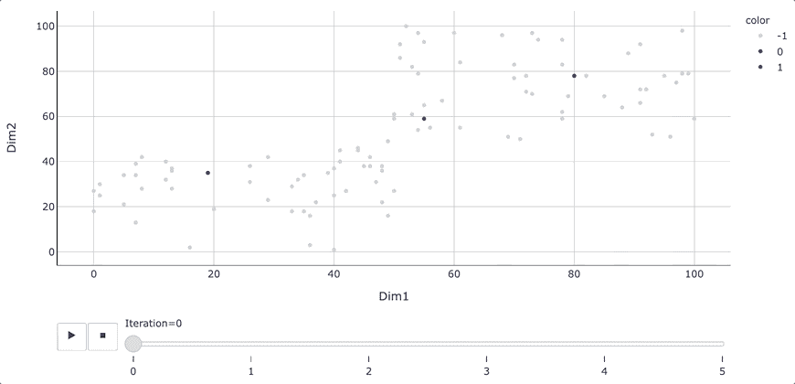

# 半监督学习——如何使用标签传播算法分配标签

> 原文：<https://towardsdatascience.com/semi-supervised-learning-how-to-assign-labels-with-label-propagation-algorithm-9f1683f4d0eb?source=collection_archive---------2----------------------->

## [实践教程](https://towardsdatascience.com/tagged/hands-on-tutorials)，机器学习

## 半监督机器学习是如何工作的，如何在 Python 中使用？

半监督学习-标签传播算法。图片由[作者](https://solclover.com/)提供。

# 介绍

尽管我们周围有大量的数据，但其中绝大多数是非结构化的和未标记的。同时，我们的很多机器学习应用，比如分类模型，都需要我们有目标标签。

不幸的是，我们可能并不总是有资源来检查成千上万的观察结果并手动分配标签。但是如果我们不需要这么做呢？如果我们可以用很小一部分的例子自动标记大量的数据，会怎么样？

我给你介绍一下**半监督学习！**

# 内容

*   什么是半监督学习？
*   标签传播算法在机器学习领域中处于什么位置？
*   标签传播工作原理的直观解释
*   在 Python 中使用标签传播的示例

# 什么是半监督学习？

通常，我们会使用具有特定目标变量的数据(标记数据)来构建监督模型(例如，分类、回归)。或者，当我们没有标记的数据时，我们将建立无监督的模型(例如，聚类、维度减少)。

然而，有时我们可能会发现自己处于有少量已标记数据和大量未标记数据的情况。这就是半监督学习可以帮助的地方，因为它结合了监督和非监督技术的元素。

## 例子

让我们考虑一个例子。假设你有 10000 句带有用户评论的句子，你想把它们分为正面和负面。不幸的是，您只有 50 个句子，您之前已经手动分配了标签(正面、负面)。

除非您想花更多的时间来标记其余的数据，否则您的选择是:

*   **使用 50 个带标签的例子建立一个监督模型**—由于可用样本数量少，这可能会导致模型表现不佳。
*   **用未标记的数据建立一个无监督的模型**，把例子分成两个组。然而，数据可能自然地想要形成多个更小的集群，而将它们强制分成两个组可能不一定会将它们在预期的目标(正/负)之间分开。
*   **使用所有标记和未标记的数据构建半监督模型**—这将使用 50 个例子来标记其余的数据，并在构建监督情绪预测模型时为您提供一个更大的数据集。

我相信你现在很想知道这是如何工作的。因此，让我们仔细看看一种称为标签传播的特定算法。

# 机器学习算法领域中的标签传播

你已经知道，我们将深入机器学习的半监督分支下的标签传播算法。然而，在陷入其中的一个角落之前，后退一步，想象 ML 模型的大千世界总是有益的。

下面是我对一些最流行的机器学习算法进行分类的尝试。旭日图是**交互式**，所以一定要点击👇在不同的类别上对**进行放大并揭示更多的**。

机器学习算法分类。由[作者](https://solclover.com/)创作的互动图表。

***如果你喜欢数据科学和机器学习*** *，请* [*订阅*](https://solclover.com/subscribe) *每当我发表一个新的故事，你都会收到一封电子邮件。*

# 标签传播工作原理的直观解释

标签传播是一种相对简单的算法，它基于更接近的数据点具有相似的类标签的假设。因此，我们可以通过密集的无标签数据区域传播这些类别标签。

该算法遵循迭代方法，我们可以将其描述为以下步骤的集合:

1.  **通过绘制不同节点(数据点)之间的边(链接)创建一个连通图**。请注意，在大型数据集上创建一个全连通图可能需要大量的机器资源。因此，限制想要连接在一起的邻居数量*(参见 Python 示例部分中的 n _ neighbors)*通常是有益的。
2.  **确定每条边的权重**，其中距离数据点较近的边权重较大(连接较强)，距离数据点较远的边权重较小(连接较弱)。较大的边权重使标签更容易通过，从而增加了传播特定标签的可能性。
3.  **从每个未标记的点执行随机行走**以找到到达标记点的概率分布。这种随机行走由许多迭代组成，并且持续到达到收敛，即，所有路径都已被探索，并且概率不再改变。

未标记的点基于上述过程找到的概率被分配新的标签。请注意，原始标记点永远不会改变，因为它们的标签是固定的。

这里有一张 gif 图片，让你直观地看到标签是如何在网络中传播的。

标签传播算法的应用。Gif by [作者](https://solclover.com/)。

我设计了上面的例子来展示半监督方法比使用监督或无监督方法更有优势的场景。

请注意，我们在开始时有三个带标签的样本(见下图)。根据这些信息，我们可以推断红色标签可能位于中间，蓝色标签位于外侧*(尽管拥有更多已知标签以确保我们的推断正确总是有益的)*。

具有三个已知标签的示例数据。图片由[作者](https://solclover.com/)提供。

在这种情况下，监督模型将很难绘制决策边界，因为它没有上下文的未标记数据。与此同时，一个无监督的模型也不会做得很好，因为没有两个明确定义的聚类来区分红点和蓝点。

如 gif 图像所示，标签传播算法能够通过网络向外传播标签，充分利用**整个数据**(有标签和无标签)。

标签传播算法的另一个重要方面是，在算法完成运行后，除了硬标签之外，我们还可以查看相应的概率。因此，如果我们对算法确定的边界不满意，我们可以手动调整阈值并重新标记一些点。

参见下面的交互式 3D 图，它显示了属于红色标签(标签 1)的概率，旁边是我们在上面的图片和 gif 图像中看到的两个维度(维度 1、维度 2)。

标签传播结果。互动 3D 图表作者[作者](https://solclover.com/)。

如您所见，硬标签是基于属于特定类别的概率分配的，阈值为 0.5。然而，该模型对于更靠近边界的点不太确定。因此，如果我们愿意的话，我们可以上下移动门槛，对边缘案例进行重新分类。

# 在 Python 中使用标签传播的示例

现在让我们抛开理论，使用真实数据和标签传播算法。

我选择的数据有适用于所有观察的标签。因此，在通过标签传播算法发送数据之前，我们将屏蔽其中的许多标签，然后使用实际标签来评估模型的执行情况。

## 设置

我们将使用以下数据和库:

*   [来自 Kaggle 的营销活动数据](https://www.kaggle.com/rodsaldanha/arketing-campaign)
*   [Scikit-learn library](https://scikit-learn.org/stable/index.html)for
    1)特征缩放([minmax scaler](https://scikit-learn.org/stable/modules/generated/sklearn.preprocessing.MinMaxScaler.html#sklearn.preprocessing.MinMaxScaler))；
    2)进行标签传播([标签传播](https://scikit-learn.org/stable/modules/generated/sklearn.semi_supervised.LabelPropagation.html))；
    3)模型评估([分类 _ 报告](https://scikit-learn.org/stable/modules/generated/sklearn.metrics.classification_report.html)、[混淆 _ 矩阵](https://scikit-learn.org/stable/modules/generated/sklearn.metrics.confusion_matrix.html)、[混淆矩阵显示](https://scikit-learn.org/stable/modules/generated/sklearn.metrics.ConfusionMatrixDisplay.html))
*   用于数据可视化的 [Plotly](https://plotly.com/python/) 和 [Matplotlib](https://matplotlib.org/)
*   用于数据操作的[熊猫](https://pandas.pydata.org/docs/)和[熊猫](https://numpy.org/doc/stable/)

第一步是导入我们上面列出的库。

接下来，我们下载并摄取营销活动数据(来源: [Kaggle](https://www.kaggle.com/rodsaldanha/arketing-campaign) )。这次我们将只利用两个特性来构建一个连通图并传播标签。因此，我将摄取限制在几个关键列，而不是读取整个表。

此外，您将看到，我们已经派生了一些创建带有屏蔽标签的目标变量所需的附加字段。

下面的代码片段显示了目标变量的数据和分布。

来自 [Kaggle](https://www.kaggle.com/rodsaldanha/arketing-campaign) 的营销活动数据。图片由[作者](https://solclover.com/)提供。

注意，我们保留了 15%的实际标签(1 和 0)并屏蔽了剩余的 85% (-1)。因此，我们的目标包含关于购物者是否有任何依赖项(1)，没有任何依赖项(0)，或者该信息被屏蔽(-1)的信息。

我们现在将试图给那些 85%被掩盖的观察分配一个标签。

## 执行标签传播

下一段代码由几个步骤组成，帮助我们准备数据、拟合模型和打印结果。

我们将使用购物者每年花在葡萄酒和肉类产品上的钱作为两个维度来创建一个关联图，并推断他们在家里是否有任何家属。

结果如下:

标签传播结果。图片由[作者](https://solclover.com/)提供。

正如您所看到的，我们已经相对成功地以 83%的模型准确度推断标签*(为了使评估公平，我们只使用带有屏蔽标签的记录进行模型性能评估)*。这是一个相当好的结果，因为我们只使用了 15%的观测值。然而，我们可以通过增加已知标签的数量或探索连通图的额外维度来进一步改进它。

为了更好地可视化，让我们将结果绘制在 3D 图上。

在此图中，颜色代表真正的标签:

*   红色=1，即有依赖项
*   黑色=0，即没有依赖项。

因此，图表上半部分的红点和下半部分的黑点代表正确识别的标签。同时，上半部分的黑点和下半部分的红点代表错误识别的标签。*注意，* d *概率=0 或概率=1 的数据点是模型训练中使用的标签已知的数据点。*

营销数据上的标签传播结果。互动 3D 图表作者[作者](https://solclover.com/)。

# 结论

在标记数据稀缺的情况下，半监督学习和标记传播可以提供巨大的帮助。但是，应该谨慎使用它，并且应该首先使用已知的标签对其进行测试，以确保该方法适合您的数据。

如果数据倾向于形成聚类，并且这些聚类中有一致的标签，那么它通常会工作得很好。

我希望您喜欢阅读这篇文章，并学到一些新的实用知识，以帮助您踏上数据科学之旅！如果您有任何问题或建议，请随时联系我们。

干杯👏
**索尔·多比拉斯**

***如果你已经花光了这个月的学习预算，下次请记得我。*** *我的个性化链接加入媒介是:*

<https://solclover.com/membership>  

您可能感兴趣的其他文章:

</umap-dimensionality-reduction-an-incredibly-robust-machine-learning-algorithm-b5acb01de568>  </lda-linear-discriminant-analysis-how-to-improve-your-models-with-supervised-dimensionality-52464e73930f> 