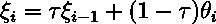

# 半监督学习变得简单

> 原文：<https://towardsdatascience.com/semi-supervised-learning-made-simple-141be294880c?source=collection_archive---------9----------------------->

## 了解如何在 PyTorch 中从头开始构建自己的半监督模型

半监督学习是一种从标记和未标记数据中获取有用信息的机器学习技术。

在本教程中:

*   你将学习什么是监督、无监督、半监督和自我监督学习。
*   一步一步地完成 BYOL 的 PyTorch 代码，这是一种半监督学习方法，你可以在 Google Colab 中自己实现和运行，不需要云或 GPU！
*   你将学习 BYOL 背后的一个基本理论——半监督学习方法。

在学习本教程之前，您应该对使用 PyTorch 对图像进行监督学习有基本的了解。

# 什么是半监督学习，我们为什么需要它？

一般来说，机器学习方法可以分为三类:

*   监督学习
*   无监督学习
*   强化学习

这里我们将省略强化学习，集中讨论前两种类型。

在**监督**学习中，我们的数据由带标签的对象组成。机器学习模型的任务是学习如何给对象分配标签(或值)。

> 例如:
> 1)医院有标有 [ICD-10](https://en.wikipedia.org/wiki/ICD-10) 代码的心电图读数。根据心电图读数，我们希望自动对患者进行预诊断。银行有关于债权人的数据——他们的财务状况、他们拥有多少资产、他们是否按时还款等等。银行想评估他们还能借给某人多少钱。

相反,**无监督的**学习只处理未标记的对象。

> 示例:我们可以让计算机将图像聚类成 10 个类别，而无需指定这些类别的含义( [k-means 聚类](https://en.wikipedia.org/wiki/K-means_clustering))。

**半监督**学习介于这两者之间:一些对象被标记，但大多数没有。未标记数据的优势来自于标记数据通常是资源密集型的事实。

> 例如:我们有一个包含推文的数据集。其中一些被标注了积极、消极或中性的[情绪](https://en.wikipedia.org/wiki/Sentiment_analysis)。不幸的是，注释是时间和成本密集型的——我们需要支付注释者这样做的费用，还要交叉检查他们的答案是否正确。因此，大多数推文都没有被贴上标签，因为下载它们相对便宜且容易，但给它们加注释并不便宜。

还有另外一种学习:**自我监督**。当我们想出一些我们不一定想要解决但可能成为模型学习的借口的监督任务时，我们可以谈论自我监督学习。自监督学习通常属于无监督学习的范畴，用于增强监督学习。

> 示例:假设我们有一个包含未分类图像的大型数据集。我们希望学习一个模型，从这些图像中提取一些有用的特征，这些特征可以帮助我们完成其他任务(如猫/狗识别)。我们在图像上随机应用 9 种不同的变形(或者不变形，所以有 10 种可能性)。然后，我们让一个模型去识别应用了哪种失真(如果有的话)。这样，我们希望模型将学会提取特征，然后可以在其他地方重用(如猫/狗识别)。

# STL-10——半监督学习的基准数据集

在我们进入方法之前，让我们看一下我们将使用的数据集。 [STL-10 数据集](https://cs.stanford.edu/~acoates/stl10/)由斯坦福大学的研究人员创建，灵感来自 CIFAR-10，你可能听说过。STL-10 由 100，000 个未标记图像和 5，000 个用于训练的标记图像以及 8，000 个用于测试的图像组成。图像平均分布在十个类中。

打开 [Google Colab](https://colab.research.google.com/) 并创建一个具有 GPU 环境的新笔记本。首先，为了方便起见，安装一个 Google Drive。STL-10 很重，每次运行环境时重新下载可能不方便。在单元格中运行下面的代码，并按照说明操作。

在 Google Colab 中安装 Google Drive

然后，为 STL-10 数据集创建一个文件夹。

为迷你项目和 STL-10 数据集创建一个文件夹/目录

下载 STL-10 数据集。如您所见，我们也在这里定义了转型。我们这样做是因为，默认情况下，所有图像都是 [PIL 图像对象](https://pillow.readthedocs.io/en/stable/reference/Image.html)，这对神经网络来说不是很方便。因此我们把它们转换成张量。

下载数据集并将其加载到变量中

我们还应该为这些数据集定义数据加载器。试着自己去做！填写缺失的代码部分。

为 STL-10 数据集创建数据加载器

太好了！正如您所看到的，批量大小被设置为 128—这个值是我通过实验获得的，作为一个不会使 Google Colab 环境崩溃的值，但是您可以随意进行实验。

# 获得受监督的基线

首先，我们需要获得一个只有监督学习的基线，以便与半监督学习进行比较。使用下面的代码。如果你需要这段代码的解释，请在评论中告诉我。

监督学习基线

# 引导你自己的潜能

BYOL(bootstrap your own latent)是一种自我监督的表征学习方法，于 2020 年 1 月首次发表，随后在顶级科学会议上发表。我们将实现这个方法。

## 粗略的概述

BYOL 有两个网络——在线网络和目标网络。他们互相学习。我们拍摄一幅图像，并对其执行两种不同的放大操作( *t* 和*t’*)。一个增强图像( *v* )被放到在线网络，并且第二个增强图像(*v’*)被馈送到目标网络。

图 1 —架构概述(基于 BYOL 论文的图 2；作者在 Lucidchart 中创建的图像)

在线网络将返回一些伪预测(它是*伪*，因为我们在这里没有实际的标签要预测)和目标网络—投影。两个输出都需要精确的尺寸。目标网络的输出将作为我们的地面实况。我们计算这些网络输出之间的均方误差。

然后，我们通过在线网络执行反向传播，但暂时离开目标网络。通过这样做，在线网络学会预测目标网络的输出。

反向传播后，用在线网络参数的移动指数平均值更新目标网络。稍后我们会详细说明它的含义。

在线网络从目标网络“快速”学习，目标网络从在线网络“缓慢”学习。在线网络试图尽可能接近目标网络的输出。

这种机制背后的直觉是，这两个网络的输出应该是相似的——它们都获得相同的图像，但具有不同的增强。如果我们有一张猫的图像，不管我们如何预处理它(在某种合理的程度上)，它仍然是一张猫的照片。在线网络学习目标网络对于图像中相同对象但具有不同“展示”的投影。

在最后，在线网络的部分(编码器， *fθ* )将被取出并用于监督学习。

如果你没有完全理解这个解释，不要担心——我们将一步一步地进行，所以你将有机会学习这个。

## 对比学习

同样值得注意的是，这个架构是**对比学习**的一个例子。对比学习是一种技术，在这种技术中，我们试图获得尽可能相似的相似物体的表征(嵌入),但尽可能不同的不同图像的表征。你可以在[这个中帖](/understanding-contrastive-learning-d5b19fd96607)里了解更多。BYOL 最重要的区别是这种方法没有负对。有了这样的改进，它的计算变得更加简单，因此可以在免费的 Google Colab 环境中演示。

 [## 理解对比学习

### 学会无标签学习。

towardsdatascience.com](/understanding-contrastive-learning-d5b19fd96607) 

## 增加

如前所述，对图像执行了两种不同的放大。更具体地说，我们从两个不同的分布 t ~τ和 t′~τ′中抽取两个变换。发表在 NIPS proceedings 上的论文没有详细说明这些增强，但是发表在 arXiv [上的预印本说明了这些增强。](https://arxiv.org/abs/2006.07733)

如果你想了解最新的方法，你应该能够阅读科学论文。因此，我建议您阅读预印本的 B 部分(第 16–17 页),并实现函数中缺失的代码。由于缺少信息，文章中的一些值未被采用。`[torchvision.transforms](https://pytorch.org/vision/stable/transforms.html)`的文档应该会有帮助。

图像增强代码

## BYOL 建筑的骨架

让我们再看一下图 1。

图 1 —架构概述(基于 BYOL 论文的图 2；作者在 Lucidchart 中创建的图像)

所以我们有图像(STL-10 数据集)和增强。其余的呢？编码器( *f* )可以是将给定图像转换成特征(表示)的任何网络，例如 resnet18。投影( *g* )负责从表示网络(编码器)的输出中创建更小的表示。预测层根据投影进行伪预测。

请注意，这种架构是不对称的。作者假设它防止崩溃的解决方案(例如，为每个图像输出相同的向量，将给出 MSE =0)。因此，预测图层需要具有相同的输入和输出维度，以便计算目标投影网络的输出和在线预测网络的输出之间的 MSE。

BYOL 类的初始化方法

## 实现投影仪

正如你在上面看到的，`BYOL.mlp`应该返回投影仪和预测器。那我们就这么做吧。第 3.3 节*实施细则*中的预印本规定:

> [……]表示 y 被多层感知器(MLP) gθ投影到更小的空间，对于目标投影 gξ也是如此。此 MLP 包含一个输出大小为 4096 的线性图层，随后是批量归一化、校正线性单位(ReLU)，以及一个输出大小为 256 的最终线性图层。

这意味着:

投影仪和预测器用 MLP

## 拟合模型

我们将拟合模型到未标记数据分为四个步骤:

*   在未标记数据上训练(拟合)模型
*   验证未标记的训练数据
*   对验证数据进行验证(标签将被省略)
*   打印结果

以上所有步骤将重复`epochs`次。

训练和验证循环

## 向前和向后传播

现在我们将关注代码中最关键的部分——在`train_one_epoch`中的自我监督学习。请记住，您可以查看图 1，并将其与代码进行比较。首先，我们必须将两个网络都设置为训练模式。

将网络设置为训练模式

然后我们需要迭代`DataLoader`返回的批次，放入 GPU。

将张量放入 GPU

正向传递将在一个单独的函数中实现，因为我们将在验证过程中重用它([干规则](https://en.wikipedia.org/wiki/Don%27t_repeat_yourself))。

执行向前传球

我们对损失张量进行反向传播…

添加了反向传播

…并更新目标网络的参数。

在正向传递中更新目标网络

我们来看一下`forward`的方法。首先，我们需要用两种不同的增强函数来增强图像。我们使用`torch.no_grad()`,因为我们不想通过这些转换执行反向传播。两个不同的增强图像被保存到`v`和`v_prime`变量中。

批量数据上的图像增强

图像`v`被送入在线网络，该网络返回伪预测。请注意，我们在这里不使用`torch.no_grad()`，因为我们将在这个网络上进行反向传递。图像`v_prime`通过`torch.no_grad()`输入目标网络。两个输出都是`[normalize](https://pytorch.org/docs/stable/generated/torch.nn.functional.normalize.html)` d 和…

带有输出标准化的目标和在线网络的前向传递

…并计算这些输出的均方误差(或者更确切地说，是我们在`__init__`中设置`sum`减少时的*总和*均方误差)。

损失的计算

该文件还指出:

> 我们通过分别向在线网络提供 v’和向目标网络提供 v 来计算[loss]，从而对称化损失[…]。

下面的代码引入了这种对称损失。

对称损失函数

现在我们只剩下更新目标网络了。还记得`__init__`中定义的`self.tau`吗？这是一个衰减参数。目标网络的参数 *ξ* 在第 *i* 步用在线网络的参数 *θ* 更新:

这个等式你可能已经很熟悉了。它定义了在每个步骤(批次)中更新的一系列参数 *θ* 的**指数移动平均值**。它用于 [**指数平滑**](https://en.wikipedia.org/wiki/Exponential_smoothing)**——我们平滑时间序列的过程。在这种情况下，目标网络的参数“消除”在线网络中参数的“快速”变化。**

**用在线网络的指数移动平均值更新目标网络**

**这是`BYOL`类的最终代码，也包括验证过程和运行训练的代码。我们将只运行一个时期的自我监督学习，因为在 Google Colab 上这样做通常需要一个小时。你可以把`train_loss = self.validate(train_dl)`改成`train_loss = 0`来节省一些时间。**

**resnet18 的最后一层被替换为`Identity`层——这样，我们将获得该网络提取的特征，而不是对 1000 个类别的预测。**

**完整的 BYOL 等级代码及其用法**

# **半监督学习**

**现在，让我们把自我监督学习和监督学习结合起来。首先，我们从 BYOL 类中取出在线编码器( *fθ* )并创建一个副本。因为我们想要预测十个类，我们将用`Linear`替换最后的`Identity`层。如果要冻结网络的编码部分，可以通过取消代码注释来实现。**

**使用在未标记数据上训练的 resnet18 的半监督学习**

# **结果**

**现在，我们用[色盲友好型托盘](https://davidmathlogic.com/colorblind/#%23FFC20A-%230C7BDC)绘制图表，比较监督和半监督学习的性能。**

**代码生成学习曲线**

**正如你在下面看到的，与监督学习相比，半监督学习获得了稍微好一点的结果。**

******

图 2——监督学习和半监督学习的性能比较。由于 DataLoader 中参数初始化和批次洗牌的随机性，您的结果可能会有所不同。作者创造的形象。** 

# **结论**

**我们从只使用有标签的数据进行监督训练转变为利用无标签的数据进行自我监督和半监督学习。正如你所看到的，我们在结果上没有得到显著的差异，但我们仍然表明，在某些情况下，使用半监督学习可以改善结果。**

**我鼓励你尝试这段代码——也许改变优化器，τ(*τ*)，编码器架构？如果你有一些令人兴奋的发现或者这篇文章对你的用例有帮助，请留下评论。我想听听这件事。**

**感谢您阅读本教程。如果你喜欢它，请在 Medium 上关注我——它将帮助我发展我的博客并继续我的工作。非常感谢您的评论、反馈和新想法！**