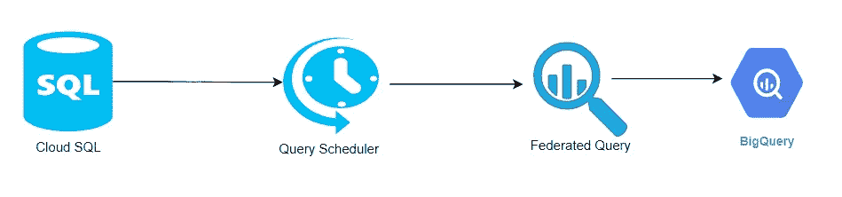
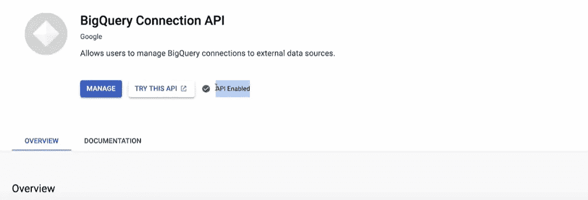
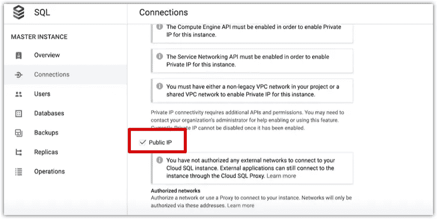
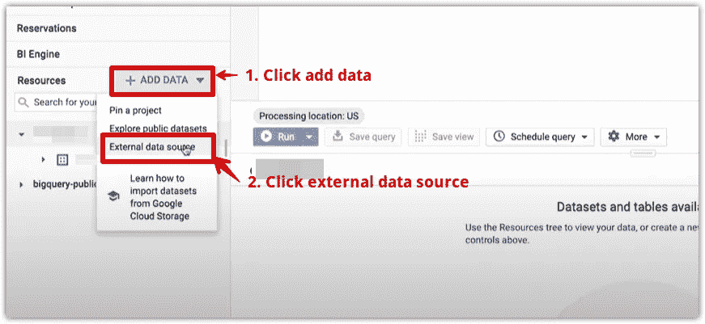
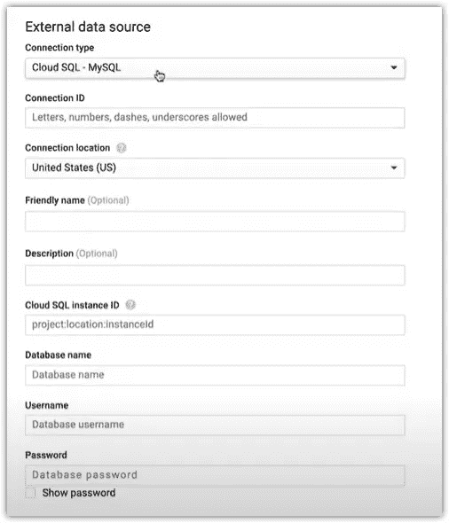
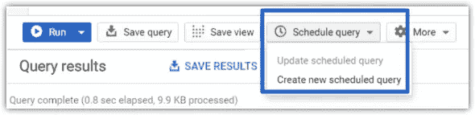
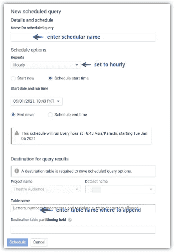
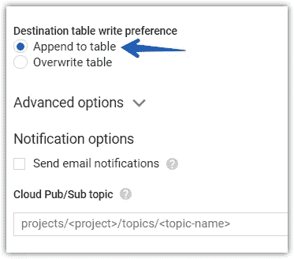
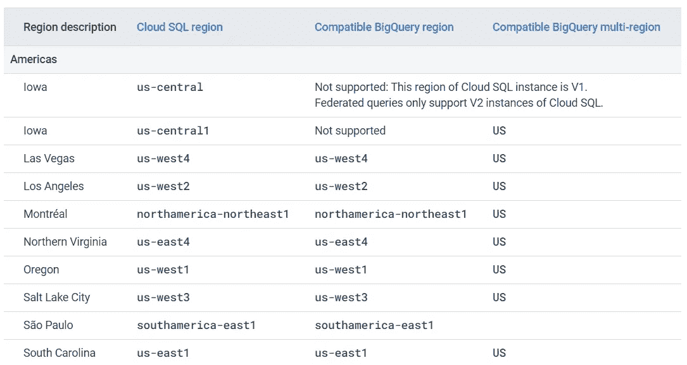

# 将云 SQL 数据发送到 BigQuery

> 原文：<https://towardsdatascience.com/send-cloud-sql-data-to-bigquery-2603489a4330?source=collection_archive---------15----------------------->

## 将云 SQL 数据移动到 BigQuery 的自动化数据管道

来源 [pixabay](https://pixabay.com/photos/assassin-spray-injection-fatal-3690300/) ，作者[迪侯](https://pixabay.com/users/dimhou-5987327/)

**Cloud SQL** 是谷歌云平台的一项数据库服务，可以轻松设置、维护和管理关系数据库。

但是，它不是为繁重的分析操作而构建的。你需要一个仓库服务，比如 **BigQuery** 来完成高级分析和机器学习任务，比如[使用 BigQuery ML](/rfm-analysis-using-bigquery-ml-bfaa51b83086) 执行 RFM 分析。为此，您需要将您的云 SQL 数据移动到 BigQuery。

在本指南中，我们将构建一个数据管道，以自动方式将云 SQL 数据发送到 BigQuery。

# 数据管道

对于我们的数据管道，我们将使用两个 GCP 组件
1。联邦查询
2。查询调度程序

这就是数据流动的方式

数据流插图，作者 Muffaddal

查询调度器将执行一个联邦查询，该查询将获取 BigQuery 环境中的 SQL 数据，并将其附加到 BigQuery 表中。

*如果你想在 GCP 了解更多关于数据流水线的知识* [*这里有一门极好的课程*](https://bit.ly/2X4kefM) *可以开始。*

# 云 SQL 到 BigQuery 的连接

在我们详细讨论如何将云 SQL 数据迁移到 BigQuery 之前，我们必须首先建立两个组件之间的连接。请按照以下步骤操作。

## 1- BigQuery 连接 API

启用 Bigquery 的连接 API，使其能够连接到云 SQL。

Muffaddal 的 BigQuery 连接 API

## 2 云 SQL 公共 IP

为了让 BigQuery 连接到 SQL，我们必须确保云 SQL 设置为公共网络。

转到您的 SQL 实例>连接选项卡，并启用公共 IP >点击保存

使实例公开，由 Muffaddal

即使你的实例是公共的，它仍然无法从公共互联网访问，因为你没有提供一个授权的地址。

## BigQuery 中的 3 云 SQL 连接

转到 BigQuery 接口并添加外部数据源。

通过 Muffaddal 创建外部连接的步骤

这将打开一个提示，要求输入关于 SQL 的详细信息。输入适当的信息以建立与云 SQL 的连接。

SQL 详细信息提示，按 Muffaddal

## 4-管理连接

接下来，为用户提供访问这个新添加的外部数据库的电子邮件地址和角色。

共享连接按钮，由 Muffaddal

这也让另一方可以使用 BigQuery 中的外部数据源。

完成以上工作后，我们就可以将云 SQL 数据导入到 BigQuery 中了。

# 联邦查询

联邦查询使我们能够实时查询驻留在云 SQL 中的数据，而无需将数据直接复制或移动到 BigQuery。它支持云 SQL 中的 MySQL(第二代)和 PostgreSQL 实例。

它使用函数`EXTERNAL_QUERY`来完成这个任务。这需要两个参数。首先是实例 Id，其次是实际的 SQL 查询。

> 外部 _ 查询(<instance id="">，<sql query="">)</sql></instance>

下面是在 BigQuery 接口中处理 SQL 数据的一个非常基本的查询。

Muffaddal 的联邦查询示例

EXTERNAL_QUERY 函数中的查询处理云 SQL 接口中的数据，并将其传递给 BigQuery 引擎进行处理。

这意味着两件事:
**首先是**，使用 EXTERNAL_QUERY 函数中的查询，我们可以进行过滤、连接、子查询，以便从云 SQL 中只获取我们想要的数据。

**其次，**一旦传递给 BigQuery 引擎，即上面示例查询中的外部 select，我们可以将它与其他现有的 BigQuery 表合并，以根据需要在 BigQuery 中转换和构建我们的数据集。

我们将使用这两个功能来确保我们只获得 BigQuery 最终表中不存在的数据。最后一个表是我们在 BigQuery 中存储云 SQL 数据的地方。

# 移动数据的查询

我们将每小时自动获取云 SQL 数据。

因此，我们只需要 SQL 表中前一小时的数据。因此，我们必须确保我们的查询只从 SQL 实例中获取数据的子集。

Muffaddal 的联邦查询示例

每当执行上述查询时，它都会获取前几个小时的所有内容。`posting_timestamp`在 where 子句中是表中的 DateTime 列。用您的日期列名替换它。

# 自动化数据插入

现在，我们只需每小时重新运行一次联邦查询，并将结果追加到 BigQuery 中。为此，查询调度器开始发挥作用。

1-在 BigQuery 控制台中，将查询粘贴到查询编辑器中，然后单击“调度查询”按钮创建新的调度程序。

通过 Muffaddal 创建新的计划查询

2-接下来，在调度程序创建菜单中输入所需的值来创建调度程序。

查询日程创建菜单，按 Muffaddal

不要忘记在“查询计划程序”对话框中选择“附加到表”选项。

查询调度程序创建对话框，由 Muffaddal 创建

这个调度器将每小时执行一次，从 cloud SQL 中获取最后一个小时的数据，并将其附加到 BigQuery 表中。

就是这样。您将每小时自动将 SQL 数据转移到 BigQuery。

# **需要牢记的几件事**

在实施解决方案时，您必须记住几件事情

1-BigQuery 不支持 SQL 的许多数据类型，例如 UUID 生成器类型，在这种情况下，请在联邦查询中将数据类型转换为 big query 可读数据类型。

2-并非所有云 SQL 实例区域都支持联邦查询，因此您必须将您的 SQL 实例移动到支持联邦查询的地方。见下面的截图是为美洲地区。

联邦查询区域支持，来源 [GCP](https://cloud.google.com/bigquery/docs/cloud-sql-federated-queries#regional-locations)

[看这里](https://cloud.google.com/bigquery/docs/cloud-sql-federated-queries#regional-locations)了解更多详情。

# 你可能喜欢类似的读物

 [## 在 BigQuery 中链接多个 SQL 查询

### 在 BigQuery 中依次执行多个查询

towardsdatascience.com](/chaining-multiple-sql-queries-in-bigquery-8498d8885da5)  [## 自动将数据导入 Google Analytics。

### 建立一个数据管道，使用 Google Cloud Platfrom 将数据导入 google analytics。

towardsdatascience.com](/automate-data-import-to-google-analytics-471de2c3fc76)  [## 向 BigQuery 发送 Google Analytics 点击量数据

### 如何发送标准的谷歌分析点击量数据到 BigQuery？

towardsdatascience.com](/send-google-analytics-hit-level-data-to-bigquery-5093e2db481b)