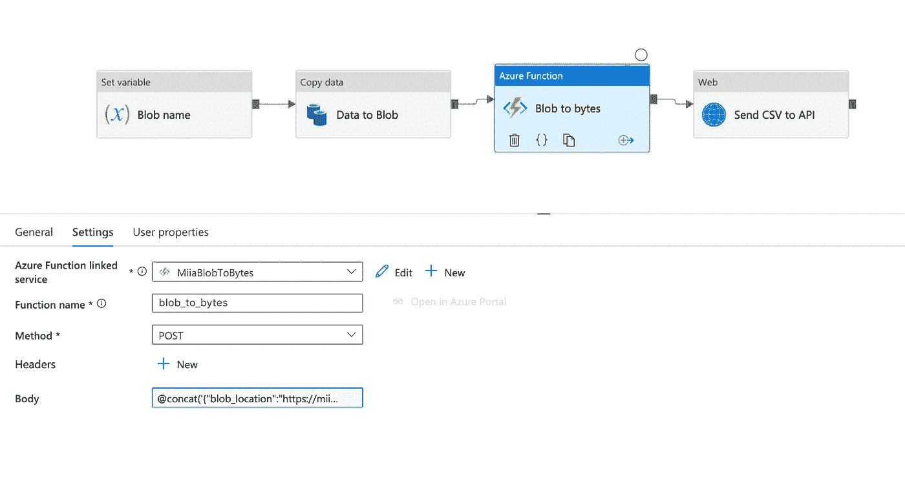

# 使用数据工厂将 CSV 有效负载发送到 API

> 原文：<https://towardsdatascience.com/send-csv-payload-to-api-with-data-factory-ff0cdddd6563?source=collection_archive---------23----------------------->

## 我将向您展示如何使用 Azure 数据工厂和函数应用程序将 CSV 有效负载发送到 API


皮奥特·穆西奥在 [Unsplash](https://unsplash.com/s/photos/kitten-box?utm_source=unsplash&utm_medium=referral&utm_content=creditCopyText) 上拍摄的照片

有人可能会认为，有一种直接的方法可以使用数据工厂从 SQL table/CSV Blob 中读取数据，并将其发送给需要 CSV 格式文本正文的 API。据我所知，没有，我们需要创建一个功能应用程序来实现这一点。

我遇到的这个问题的一个用例是在将数据上传到 [Salesforce Bulk API 2.0](https://developer.salesforce.com/docs/atlas.en-us.api_asynch.meta/api_asynch/asynch_api_intro.htm) 时。

## 概观

在本文中，我将向您展示一个解决方案，其中

1.  我从 SQL 数据库中读取数据，并将其作为 CSV 文件写入 Blob 存储中，
2.  我用 Azure Function 应用程序以字节形式获取 Blob 内容
3.  我将函数响应发送给我创建的示例 API。


## 1.从源到斑点

如果您想保留发送文件的历史，我建议将 Blob 名称设置为管道变量。如果没有必要保留历史记录，可以使用硬编码的 Blob 名称。


我的 Blob 名称包括当前时间戳和文件名:

```
[@concat](http://twitter.com/concat)(substring(utcnow(), 0, 19), 'canada_climate_data.csv')
```

我们将使用数据工厂复制活动来创建我们的 Blob。在这个例子中，我的源是我的 SQL DB 中的一个表。源数据集和汇数据集都被创建为通用数据集。参见我的文章[用通用数据集保持你的数据工厂整洁](/data-factory-generic-datasets-a998b832f060)获得解释。


## 2.用函数将 Blob 转换为字节

为了创建我的 Python 函数应用程序，我遵循了微软的这些指令。我的 __init__。py 文件如下:



JSON 主体的动态内容如下(用您的存储帐户名和正确的容器名替换“您的存储”和“容器”):

```
[@concat](http://twitter.com/concat)('{"blob_location":"[https://yourstorage.blob.core.windows.net/container/',variables('blob_name'),'](https://miiastorage.blob.core.windows.net/container/',variables('blob_name'),')"}')
```

## 3.向 API 发送字节


body 的动态内容是我的函数的响应:

```
[@activity](http://twitter.com/activity)('Blob to bytes').output.Response
```

就是这样！

感谢您的阅读！如果你学到了新的东西或者喜欢这篇文章，请在 Medium 上关注我。我发表关于数据工程和数据科学的文章。你可以从 be [网页](http://miiaramo.github.io/)了解更多关于我的信息。

你有没有找到更好的方法来实现这一点，或者有什么不清楚的地方？请在评论中告诉我😊