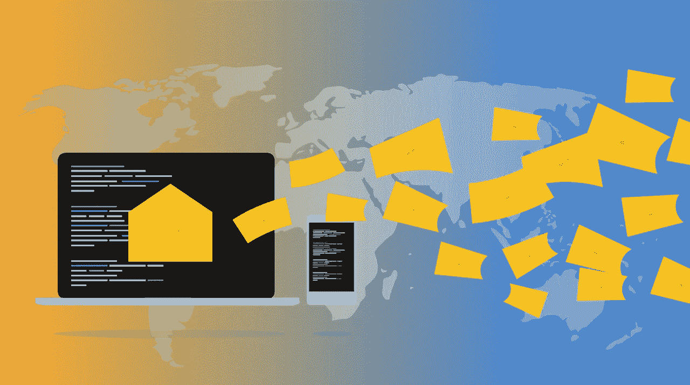

# 将 SendGrid 数据发送到 BigQuery

> 原文：<https://towardsdatascience.com/send-sendgrid-data-to-bigquery-d8bf0bd4a238?source=collection_archive---------32----------------------->

## 如何将 SendGrid 的电子邮件参与数据发送到 Google BigQuery

来源[皮克斯拜](https://pixabay.com/illustrations/email-newsletter-marketing-online-3249062/)，作者[里布汗](https://pixabay.com/users/ribkhan-380399/)

从多个来源捕获数据是创建丰富数据仓库的关键。当涉及在线业务时，这变得更加重要，因为数据分散在用于运营业务的众多平台上。

[SendGrid](https://sendgrid.com/) 就是这样一个营销平台，它发送交易和营销电子邮件，帮助用户保持知情和参与。

我们将讨论将 SendGrid 电子邮件数据存储到我们的数据仓库工具的不同方法。

# SendGrid 网页挂钩

SendGrid 提供了几种导出数据的方法。一种方法是使用 SendGrid webhooks。Webhooks 是当有事情发生时，应用程序自动发送的消息。因此，每当 SendGrid 发送一封电子邮件时，就会触发一个 webhook，其中包含有关已发送电子邮件的信息。

SendGrid 事件 webhooks 可用于以下电子邮件交付和接洽事件

由 Muffaddal 编写的 SendGrid 的 webhook 事件

因此，SendGrid 为上述所有事件触发了一个 webhook，并随之传递信息。下面是它在打开事件时发送的信息示例。

这些信息被称为有效载荷。[在此查看其他 SendGrid 事件](https://sendgrid.com/docs/for-developers/tracking-events/event/)的有效载荷示例。

## 数据管道

SendGrid 的 webhooks 和 Google Cloud 功能的结合可以帮助捕获 BigQuery 中需要的所有数据。

数据管道，由 Muffaddal

## 步伐

建立数据流涉及三个步骤。

1.  根据您希望从 SendGrid 存储的数据，创建一个具有模式的 BigQuery 表。示例电子邮件、事件、时间戳、类别。
2.  设置一个云函数，可以接收来自 SendGrid 的 webhook 调用，提取所需信息，并传递给 BigQuery。
3.  在发送网格中配置 webhook。

**大功告成！**

现在让我们来实际实施上述所有步骤。

***注意*** *这需要相当多的技术和编程背景。因此，我建议请您团队中的技术人员来实施解决方案。*

[*让我知道你是否需要我的帮助来实现*](http://bit.ly/3rLwbo2)

# 数据管道实现

## 1-大查询表

我们首先必须在 BigQuery 中创建一个可以存储 SendGrid 数据的表。输入列名，如下图所示。

muffaddal 的 BigQuery 表架构

将该表命名为 sendgrid_events。

## 2 云函数

接下来，我们必须创建一个云功能，它有两个职责。首先是获取 SendGrid 传递的数据。第二个是在我们上面创建的 BigQuery 表中处理和存储数据。

我们将使用 Node.js 来编写我们的云函数。这是我们将用于它的配置。

云函数配置，由 muffaddal

配置完成后，在 index.js 中添加以下代码，根据需要解析数据。

根据您的 GCP 项目替换我的项目，我的数据库。上面的代码解析从 SendGrid 发送的数据，然后将其附加到 BigQuery

另外，在 package.json 中添加 BigQuery 依赖项。

复制云函数触发 URL，我们就可以进入最后一步了。

## 3-网状挂钩配置

在 SendGrid UI 中，转到设置>邮件设置。从那里点击编辑启用 webhooks。

通过 muffaddal 启用 webhooks

一扇窗户将会打开。输入云函数 URL 并检查所有要发布的事件，如下所示。

Muffaddal 的 SendGrid webhook 配置

单击“Test Your Integration”按钮将测试事件发送到云函数，以便您查看这些事件是如何存储在 BigQuery 中的。这是它的样子

muffaddal 在 Bigquery 中发送网格测试数据

你是否注意到我们也按原样存储 event_payload？原因是，如果需要，我们可以从任何事件的有效载荷中提取更多的信息。

点击 webhook 配置窗口中的保存按钮，我们就完成了。

按照上面的步骤，您将在 BigQuery 中接近实时地获得所有需要处理和操作的 SendGrid 数据。

*如果实施对你来说太技术性了，你想自己学习更多，那么* [*这里有一个极好的课程*](https://bit.ly/2X4kefM) *在 GCP 开始数据工程。*

# 你喜欢的类似读物

 [## 将云 SQL 数据发送到 BigQuery

### 将云 SQL 数据移动到 BigQuery 的自动化数据管道

towardsdatascience.com](/send-cloud-sql-data-to-bigquery-2603489a4330)  [## 向 BigQuery 发送 Google Analytics 点击量数据

### 如何发送标准的谷歌分析点击量数据到 BigQuery？

towardsdatascience.com](/send-google-analytics-hit-level-data-to-bigquery-5093e2db481b)  [## 在 BigQuery 中链接多个 SQL 查询

### 在 BigQuery 中依次执行多个查询

towardsdatascience.com](/chaining-multiple-sql-queries-in-bigquery-8498d8885da5)