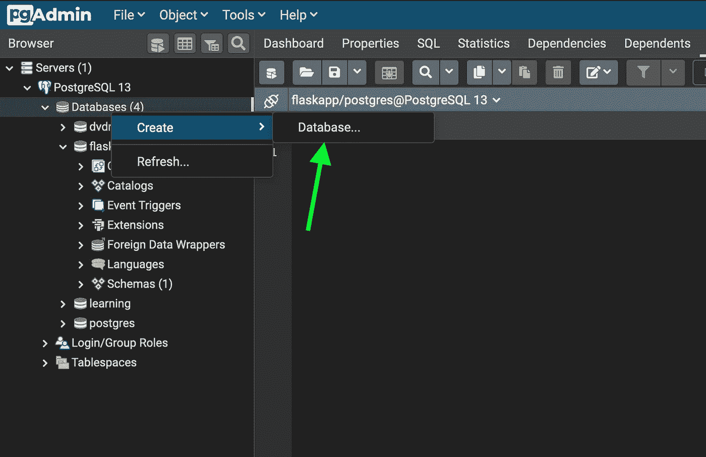
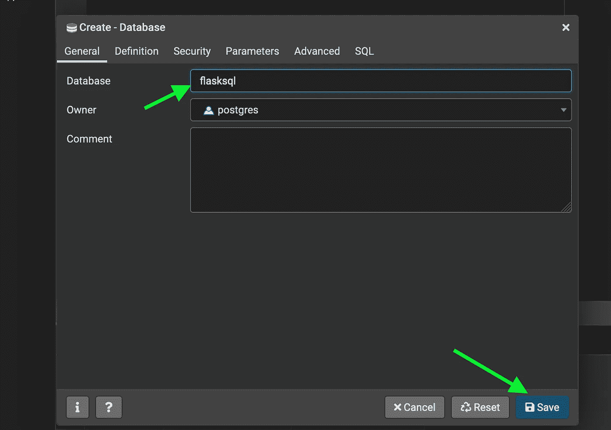
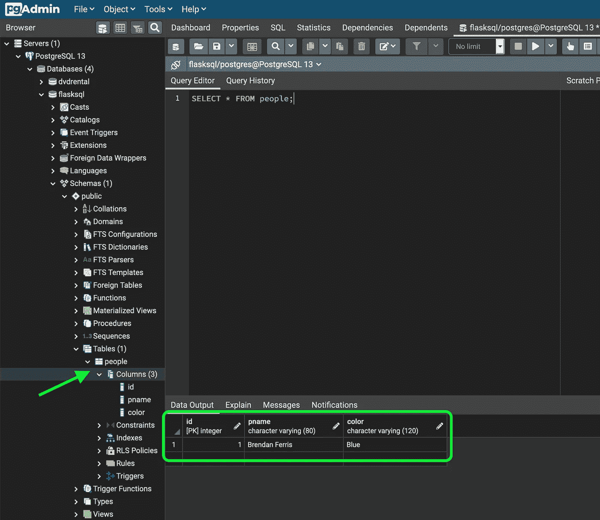

# 从 Flask 应用程序向 PostgreSQL 数据库发送数据

> 原文：<https://towardsdatascience.com/sending-data-from-a-flask-app-to-postgresql-database-889304964bf2?source=collection_archive---------1----------------------->


由[扬·安东宁·科拉尔](https://unsplash.com/@jankolar?utm_source=medium&utm_medium=referral)在 [Unsplash](https://unsplash.com?utm_source=medium&utm_medium=referral) 上拍摄

## 什么是 ORM

如果你打算开发任何类型的现代网络服务，管理网站或应用程序的数据流是一项需要掌握的关键技能。有了 flask，*对象关系映射器* (ORM)被用来允许你的应用与关系数据库交互。对象关系映射器是一个框架，在我们的例子中，它允许我们使用 python 而不是显式 SQL 查询与 SQL 数据库进行交互。我们使用的 ORM 的名称是[*SQLAlchemy*](https://pypi.org/project/SQLAlchemy/)*，可以下载如下:*

```
*pip install flask_sqlalchemy
pip install psycopg2-binary #for using postgres*
```

*本文假设您对 SQL 有一些基本的了解，并且在您的机器上安装了 [Flask](https://flask.palletsprojects.com/en/1.1.x/installation/#installation) 、 [PostgreSQL](https://www.postgresql.org/) 和 [pgAdmin](https://www.pgadmin.org/) 。*

***目录结构。***

*为了让我们的应用程序正常工作，目录需要如下所示。确保不要更改您在下面看到的任何文件/文件夹的名称或拼写。*

```
*# from the terminal in the project folder$ mkdir templates static
$ touch app.py
$ cd templates
$ touch index.html$ tree (optional: only works if [tree](https://superuser.com/questions/359723/mac-os-x-equivalent-of-the-ubuntu-tree-command/359727) is installed on OSX)├── app.py
├── static
└── templates
    └── index.html2 directories, 2 files*
```

*在接下来的部分中，我们将制作一个基本的表单，将一个人的名字和他最喜欢的颜色发送到本地 PostgreSQL 数据库。*

## *建立我们的数据库。*

*我们将在 pgAdmin 中创建一个数据库:*

****

*现在，我们需要设置 *app.py* 来连接我们的数据库和应用程序。我们首先创建我们的应用程序，并配置数据库 [URI](https://stackoverflow.com/questions/176264/what-is-the-difference-between-a-uri-a-url-and-a-urn) 和 secret_key。*

*`SQLALCHEMY_DATABASE_URI`是描述数据库连接的字符串。出于本文的目的，该连接是本地的，可以描述如下:*

```
*engine:[//[user[:password]@][host]/[dbname]]engine -> postgresql
user -> postgres (see `owner` field in previous screenshot)
password -> password (my db password is the string, `password`)
host -> localhost (because we are running locally on out machine)
dbname -> flasksql (this is the name I gave to the db in the previous step)*
```

*在配置了到本地数据库的连接之后，我们需要创建我们的`people`表。这将由整数类型的主键、必须唯一的名称列和颜色列组成。颜色和名称列都必须由用户输入。*

*现在，在登录页面通常所在的位置，我们将添加一个按钮，将我们带到输入表单。当我们点击表单上的`submit`时，我们将人名和他们最喜欢的颜色添加到 *People* 类/表中，然后使用 *db.session* 将该条目添加到数据库中，并提交更改。*

*在应用程序运行之前，我们需要使用`db.create()`来创建数据库:*

## *用于提交数据的 HTML 表单。*

*为了从用户那里获取信息并存入数据库，我们使用一个 HTML 表单，表单的输入具有与数据库中的列名相对应的`name`属性。我们用`request.form["pname"]`和`request.form["color"]`从 *personadd()* 函数的表单中获取这些信息。*

## *在 pgAdmin 中查看数据。*

*现在我们已经在数据库中有了名称和颜色，我们可以转到 pgAdmin 并直接查询数据库。每当我们使用表单添加一个新条目时，我们可以转到 pgAdmin 并刷新数据库以反映结果。*

**

*每次添加新条目时，按`F5`键，查询将使用新数据更新！*

## *结论。*

*本文并不是为了说明最佳实践或生产就绪的解决方案，而是为那些不知道从哪里开始的人准备的。我们讨论了一些基本概念，如 ORM 和 URI 数据库，这些基础知识应该可以很好地为您服务，因为您了解了更多关于数据库和应用程序基础架构的知识。*

*编码快乐！*

*GitHub 回购可以在[这里](https://github.com/brenfrrs/flasksql)找到。*

*💻请随意查看我的[网站](https://brendanferris.com/)。*