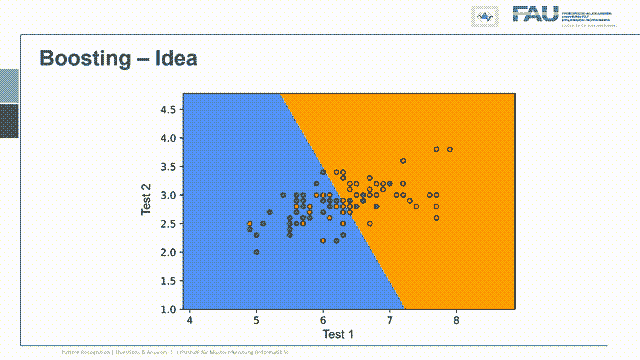

# 敏感性和特异性，解释！—和僵尸？！

> 原文：<https://towardsdatascience.com/sensitivity-and-specificity-explained-with-zombies-ae3f4801b35b?source=collection_archive---------40----------------------->

## 评估方法和 ROC 分析简介

评估方法和 ROC 分析简介。图片由 Andreas Maier 提供

欢迎大家，今天我们想简短地谈谈评估分类系统的措施，以及如何改变分类系统以改变评估结果。所以我想你会发现这很有趣，我也带来了一个非常有趣的例子来讨论分类系统的想法。今天的关键问题是“我如何评估一个分类系统？”。

来自[模式识别讲座](https://www.youtube.com/playlist?list=PLpOGQvPCDQzsWvT_bqmexrJ359RTQQuMO)的 [CC BY 4.0](https://creativecommons.org/licenses/by/4.0/) 下的图像。

所以我们在我们的[模式识别讲座](https://www.youtube.com/playlist?list=PLpOGQvPCDQzsWvT_bqmexrJ359RTQQuMO)中谈到了这一点。但是我发现我们需要一些额外的解释来真正理解分类系统是做什么的，以及我们如何评估它们。所以，当然，我们会用一个例子来讨论这个问题。如今每个人都在谈论疾病，似乎每个人都成了疾病分类的专家。所以，我也认为谈论一种典型的疾病会很有趣，我选了僵尸病。

来自[模式识别讲座](https://www.youtube.com/playlist?list=PLpOGQvPCDQzsWvT_bqmexrJ359RTQQuMO)的 4.0CC 下的图像。

我认为这是世界上可能发生的最可怕的事情之一。所以我认为这是一个合适的时间来讨论当我们遇到僵尸疾病时我们应该做些什么。你看，这是我们如何评估测试结果的。因此，我们已经在准备一个测试系统，以确定谁是僵尸，谁不是，我们当然会有几个可能的结果，你知道，人实际上可能是僵尸。这就是参考。所以这些是柱子，否则它们不可能是僵尸。所以它们要么是正的，要么是负的，然后当然我们的分类结果，假设会有两种结果之一。所以这也可能是积极的或消极的，当然，也有正常人。所以这是一个真正的否定，他们只是普通人，当然，测试结果也应该是否定的，那么我们当然希望我们的分类系统能够检测到僵尸。因此，我们希望检测到真实存在的僵尸，我们希望结果也是僵尸。所以这将是一个真正的积极因素。当然，我们的分类系统也会出错，有时我们会发现某人是僵尸，但他实际上并不是僵尸，我在这里举了一个小例子，你可以记住这个例子。这是一部非常有趣的恐怖电影《僵尸肖恩》，在这个场景中，肖恩宿醉未醒，他去商店买了一杯饮料。你看，他宿醉得很厉害，首先他没有意识到他周围有行尸走肉，其次他们没有认出他，因为他的行为像他们中的一员。所以这是一个假阳性。所以人们，幸运的是他也是行尸走肉僵尸认为你是他们中的一员，然后还有另一种情况，我们不知何故错过了某人死而复生。这里有一种情况，类似这样的事情实际上正在发生。所以你知道你在玩你最喜欢的电子游戏，你和你的朋友一起玩，在某个时候，你甚至没有意识到你的朋友已经变成了僵尸，而你还在玩电子游戏。所以这是假阴性的情况。现在我们已经了解了不同的结果是什么，我希望你们能够记住这一点。所以假阳性和假阴性是我们会犯的两种错误。所以很明显我绝不会让你毫无准备地染上可怕的僵尸病。所以，当然，我也有一些建议给你。好了，伙计们，我们被困在这个可怕的僵尸感染的大厦里了，我们分头行动吧。

来自[模式识别讲座](https://www.youtube.com/playlist?list=PLpOGQvPCDQzsWvT_bqmexrJ359RTQQuMO)的 [CC BY 4.0](https://creativecommons.org/licenses/by/4.0/) 下的图像。

好了，让我们回到评估我们的分类器。因此，可以用许多不同的方法来评估分类系统，您在这里可以看到如何评估该分类器的不同方法。当然，有许多不同的方法可以组合上述值来计算不同的比率。一个非常典型的例子是真阳性率，也称为命中率回忆或灵敏度，即真阳性的数量除以观察到的阳性数量，即真阳性加上假阴性。此外还有假阳性率，实质上是假警报率，它是假阳性的数量除以真阳性和假阴性的数量。同样高度相关的是像阳性预测值或精确度这样的度量，并且位置被给定为真阳性的数量除以真阳性加上假阳性的数量。然后还有阴性预测值，它是真阴性的数量除以两个阴性加上假阴性的数量。最后但并非最不重要的是，真阴性率或特异性，其计算方法是 1 减去假阳性率。所以这看起来有点复杂，我试着把这些事情分解一下。所以记住，一个人不能简单地理解敏感性和特异性。但是我会试着通过一些例子来简化这个问题，我给你们举的例子是下面这个。假设我们总共有 100，000 人，我们现在将填充这 100，000 人的整个示例表。我们知道实际上有 1 万人感染了僵尸病。这意味着这个数字在这里，另外 90，000 人没有被感染。所以他们只是普通人。所以这个数字会出现在我们的图中。现在我们想看看我们的测试有多好，让我们假设我们知道灵敏度。如果我们知道了敏感度，我们现在就可以实际计算真正阳性的数量，也就是我们集合中阳性的数量。然后我们乘以灵敏度，得到 9970 个真阳性，这个数字就在这里。我们现在也可以用这个来计算假阴性的数量，你可以在这里看到，当然，我也可以把它放在我们的表中。因此，与确定我们表格中的实际值非常相关的另一个值是特异性。特异性现在允许我们计算真正阴性的数量，这仅仅是参照中阴性的数量。所以真实人类的实际数量是这个数量乘以特异性。这样我们就得到了 98，280，我们可以把它放在这里的表中。这允许我们现在计算假阳性的数量，在这个图中是 720。这个值在这里。

来自[模式识别讲座](https://www.youtube.com/playlist?list=PLpOGQvPCDQzsWvT_bqmexrJ359RTQQuMO)的 [CC BY 4.0](https://creativecommons.org/licenses/by/4.0/) 下的图像。

现在让我们想想这对我们的测试实际上意味着什么。所以你记得我们的假阴性。这是每次我们探测不到丧尸的时候。因此，假阴性与敏感性有关，如果我们的敏感性低，这意味着我们对僵尸不太敏感。所以我们干脆无视他们，认为他们是真人。因此，在这种情况下，我们将有总共 30 个僵尸可能在某个地方玩视频游戏，甚至可能感染其他人，而他们被我们的测试遗漏了。所以我们无法识别它们，也无法对这些僵尸采取任何对策，因为我们没有检测到它们。还有假阳性，在我们的例子中，假阳性是宿醉者，看起来像僵尸，但实际上不是僵尸，这与特异性有关。所以这意味着低特异性与对僵尸不太明确有关。所以我们认为人是僵尸，其实并不是僵尸。因此，在我们的案例中，将有 720 人。现在，如果你是僵尸中的一员，实际上并不太坏，因为僵尸会认为你是他们中的一员，他们不会伤害你。但是想象一下你的人类同伴认为你是僵尸。嗯，他们可能会有点害怕，你知道可能会有很糟糕的事情发生在你身上。所以让我们想一想患病率或先验概率是如何影响我们的检出率的。现在，如果我们修正灵敏度和特异性，那么我们可以看到我们的先验是否只有百分之一。因此，假设我们处于疾病的非常非常早期阶段，那么我们基本上不会发现任何假阴性。所以我们几乎不会错过僵尸，僵尸的数量可能很低，人们会说那里没有僵尸。因此，甚至可能会有否认僵尸的人说，这些僵尸无法被检测到，如果你仔细看看已经被检测为僵尸的案例，那么它们非常少，在这个特定的案例中，如果我们只有 1000 个僵尸，我们仍然检测到大约 700 多人是僵尸。所以几乎一半被检测到的僵尸实际上并不是僵尸。虽然我们的测试做得很好。因此，这一切可能被简单地贴上神话或假新闻的标签，或者这种疾病根本就不存在。所以，如果我们现在逐渐增加患病率，我们会达到 50%的患病率。因此，就像有一半的人类留下来，一半的人类已经被转化为僵尸，你看到我们的错误发生了变化，随着先验知识的增加，我们有了更多的假阴性。因此，我们错过了实际感染疾病的人，他们去传播疾病，而与此同时，我们减少了假阳性，这只是与周围的阴性较少有关。所以假阳性的数量也在下降。假设这种疾病已经接管了它有 90%的患病率，所以在 90%的患病率情况下，假阳性的数量将大大减少，但我们有越来越多的僵尸被我们遗漏了，但老实说，90 或僵尸周围的事情已经非常糟糕，你可能不想相信任何人。所以这是非常糟糕的，尤其是大量的假阳性，在开始时，非常非常令人担忧。

来自[模式识别讲座](https://www.youtube.com/playlist?list=PLpOGQvPCDQzsWvT_bqmexrJ359RTQQuMO)的 [CC BY 4.0](https://creativecommons.org/licenses/by/4.0/) 下的图像。

所以让我们想想，我们是否可以做些什么来减少假阳性的数量，这样我们就不会伤害许多宿醉的人。因此，如果你只是有一个糟糕的宿醉，也许这不是那么好，你的邻居会决定使用对抗僵尸的对策，这实际上对你来说可能不是那么好。所以让我们想一想我们的测试，我们不知道谁是真正的僵尸，我们只是从测试中得到结果。但当然，这至少告诉我们，在我们是阳性的情况下，我们可能只是想再次测试它们，只是为了真正确定。那么，如果我们再次测试，会发生什么呢？我们只是再次运行相同的测试，在这种情况下，这是我们的测试结果，所以我们现在已经观察到阳性和阴性，它们仅由之前的测试结果确定。所以现在我们来看一下我们只想重新测试阳性病例的情况。让我们重新测试那些观察到的阳性结果，观察到的阳性结果当然是真阳性，真阳性现在我们必须乘以灵敏度，灵敏度将再次给出我们是阳性还是阴性的结果。这意味着我们重新测试，大量的真阳性将有另外 30 个被分配给假阴性的数量。现在让我们考虑假阳性的情况。所以我们有 720 人，我们重新测试他们，现在我们必须考虑特异性。我们现在看到，在 720 个中，我们可以将 714 个识别为假阳性。因此，它们将被指定为阴性，这意味着我们只剩下六个假阳性。所以我们得到了一个新的混淆矩阵。这些是我们已经考虑过再测试程序的新结果。所以你可以看到假阴性的数量增加到了 60 个，而假阳性的数量减少到只有 6 个。这意味着我们在这个新的测试程序中有了一个新的测试，我们只测试阳性两次，它的真阳性率降低了，但真阴性率却高得多。因此，假阳性大大减少，你可以看到这个数字现在高得多，但这是以降低灵敏度为代价的。当然，我们也可以走另一个方向。

来自[模式识别讲座](https://www.youtube.com/playlist?list=PLpOGQvPCDQzsWvT_bqmexrJ359RTQQuMO)的 [CC BY 4.0](https://creativecommons.org/licenses/by/4.0/) 下的图像。

所以我们只重新测试观察到的负面结果。现在，在这种情况下，我们要确保我们不会错过一个僵尸，所以我们重新测试所有被观察为负面的东西。现在，我们必须再次检查我们的敏感度，现在我们看到，在观察到的阴性结果中，只有 30 例是假阴性，乘以敏感度，现在实际上会给出 30 个正确的分类。所以我们的假负数变为零。现在让我们考虑另一个错误，我们用我们集合中的真阴性来做，这里我们必须使用特异性。我们看到，我们乘以这个数字，我们产生了另外 714 个假阳性。现在我们可以更新我们的混淆矩阵，看起来像这样。所以我们引入了这个重新测试程序，它给了我们 100%的灵敏度。所以我们没有漏掉一个僵尸，但代价是我们现在有 1434 个误报。因此，通过引入这一程序，假阳性的数量几乎翻倍。但是我们再也没有假阴性了。所以记住我们只有一万个阳性，现在我们有一千四百个假阳性。所以这意味着在观察到的一万一千四百个阳性中，有超过百分之十不是真正的僵尸。所以你以不漏掉任何人为代价，摆脱了一千四百多名普通人。所以你正在对 1400 名实际上没有被疾病感染的人采取对策。因此，这可能是一件相当艰难的事情，也许不是每个政府都能真正做到这一点。我们现在开发了三种不同的测试程序，现在你可能想知道它们是否相同，哪种更好，哪种更差。

来自[模式识别讲座](https://www.youtube.com/playlist?list=PLpOGQvPCDQzsWvT_bqmexrJ359RTQQuMO)的 [CC BY 4.0](https://creativecommons.org/licenses/by/4.0/) 下的图像。

让我们来看看它们，比较一下，比较的典型工具是所谓的受试者操作特性曲线 ROC 曲线。我在左边显示了评估的空间，你可以在这个图中看到，我们画的是灵敏度除以 1 减去特异性。你可以在左上角的图上看到几个重要的点，用你看到的完美分类器来表示，所以这个有 100%的特异性和 100%的灵敏度。所以这总是做正确的决定。你可以做的另一件事是，你可以简单地总是决定为正，那么你会在曲线的右上角，相反的是，你总是决定为负，那么你会在曲线的左下角。有一条线连接这两点，这基本上是一个随机的决定，但有不同的阈值。所以如果你掷骰子，你会在连接这两点的线上的某个地方，这意味着你在完全不知道任何观察的情况下做决定，这将产生下面的线。如果你在左上角的三角形中，你已经建立了一个有效的分类系统。所以我希望在左上角的三角形上有任何有效的分类系统。所以在对角线上方，对角线下方还有一个空间，这里用 4 表示，如果你的分类器位于那里的某个地方，那就错多过对。这意味着在一个两级系统中，如果你做的和你的分类系统所建议的相反，你实际上会在左上角的三角形中结束。所以这是我们现在必须定位分类器的空间，我们看到我们的普通僵尸分类器实际上做得并不差。它非常接近左上方，所以它非常接近，因为它具有非常高的灵敏度和非常高的特异性。现在，我们改变了我们的分类系统，重新运行所有的阳性结果，因此我们改变了敏感性和特异性，以得出这一点。所以我们稍微偏离了原来的分类系统，我们可以提高一个比率，但牺牲另一个比率。然后我们做了完全相反的事情，我们重新运行所有的阴性案例，然后我们在这里得到这个观察结果。所以我们在一个速率上增加，但在另一个速率上减少。因此，你可以看到，通过调整分类系统和重新运行决策，我可以改变结果。实际上，灵敏度和特异性有一整套不同的解决方案，这里用绿色曲线表示，我们可以根据给定的分类系统沿着这条绿色曲线前进。这里你可以看到这个分类系统非常非常好，因为它几乎覆盖了接近 1 的区域。所以如果我有完美的分类器，那么这条曲线下的面积，在绿色曲线下，正好是 1，我们非常非常接近这里的 1。所以我们有一个非常好的分类系统，因为我们使用的是同一个系统，所以需要通过这条曲线来检测。现在你可能想知道我是如何得到这条绿色曲线的。

来自[模式识别讲座](https://www.youtube.com/playlist?list=PLpOGQvPCDQzsWvT_bqmexrJ359RTQQuMO)的 [CC BY 4.0](https://creativecommons.org/licenses/by/4.0/) 下的图像。

实际上，我们的分类系统源于两种分布，正分布和负分布，确定实际的分类结果只是简单地通过选择测试统计的阈值。所以不管你做什么测试？所以在僵尸的例子中，我听说眼压是一个非常好的衡量标准，当我们实际上确定某人是否是僵尸时，你只需要改变阈值。这个人很重要，我可以简单地通过改变阈值来采样整个绿色曲线。所以我不需要经历重新测试的过程，运行两个测试，如果是相同的测试，它不会改变任何东西，因为你只需要根据不同的阈值调整你的分类器。所以那不会有很大帮助，我们能做些什么呢？

来自[模式识别讲座](https://www.youtube.com/playlist?list=PLpOGQvPCDQzsWvT_bqmexrJ359RTQQuMO)的 [CC BY 4.0](https://creativecommons.org/licenses/by/4.0/) 下的图像。

让我们考虑几个想法，其中一个非常明确的想法是，根据场景选择阈值。如果你想选择阈值，你必须确定决策的成本。因此，每一个决定都有成本，例如，根据疾病的流行程度，成本可能会非常不同。因此，如果你处于早期阶段，你想不惜一切代价阻止僵尸，错过一个会非常昂贵。因为僵尸会继续传播疾病。在疾病的晚期，这可能会非常不同。因此，您可能希望根据当前的测试场景调整阈值，如果您知道决策的成本，您就可以这样做，因为这样可以让您权衡什么成本更高，是假阳性还是假阴性。另一个想法是涉及另一个测试，你只是用两个不同的测试来测试，如果它们在统计上是独立的，你可以将两者结合起来，以获得更好的决定。这就引出了一些概念，比如推进 bagging 和集成分类器，我们也会在这堂课中讨论。为了理解这些集合属性，我想给你们看一个具体的例子。

来自[模式识别讲座](https://www.youtube.com/playlist?list=PLpOGQvPCDQzsWvT_bqmexrJ359RTQQuMO)的 [CC BY 4.0](https://creativecommons.org/licenses/by/4.0/) 下的图像。

所以，你通常要做的是运行第二个测试统计，利用第二个测试统计，你可以创建像这样的图，然后找到一个与两个测试之一正交的决策边界。这意味着您可以利用这两个测试的力量。每当我们进行提升和组合时，我们通常假设测试在统计上是独立的。这是一个关键因素，我们来看一个例子。

来自[模式识别讲座](https://www.youtube.com/playlist?list=PLpOGQvPCDQzsWvT_bqmexrJ359RTQQuMO)的 [CC BY 4.0](https://creativecommons.org/licenses/by/4.0/) 下的图像。

所以我有检验统计量 1，我们的 1 类和 2 类或者正负分布如下。所以有很大的重叠。所以他们都没有很好的区分这两个类，我做了另一个测试，同样的两个类又出现了。现在我想把这两个结合起来，现在让我们选择一个观察配置，这些现在被表示为真实类和真实的其他类，所以积极和消极的。在这里你可以看到，我必须找到沿着 x 轴和 y 轴投影到原始分布的点。我在这种情况下这样做了，你可以看到在这种特殊情况下，点的分布遵循各自的一维投影。所以如果我把它们移到一边或另一边，通过两个测试的结合，我可以得到非常清晰的分离。因此，这非常有用，在这种情况下，我们真的有两个测试的独立性，因为它们是独立的，所以将它们结合起来可能会有很高的产量。

来自[模式识别讲座](https://www.youtube.com/playlist?list=PLpOGQvPCDQzsWvT_bqmexrJ359RTQQuMO)的 4.0CC 下的图像。

现在让我们看一个例子，在这个例子中，类被很好地分开了，这里我有一个类，另一个类，现在重叠非常小。我在另一个轴上做同样的操作，重叠也非常小。这意味着蓝点必须分布在投射到蓝色曲线上的某个地方，而橙色点必须位于投射到橙色曲线上的某个地方。这有点问题，因为你可以看到我们非常接近对角线，实际上我们有测试一和测试二的相关性。所以这两个结果不是完全独立的，每当我已经有了这种很好的分离，并且假设这些是检验统计量上的高斯分布点，那么我就会遇到这个问题。现在的问题是，因为这两种测试是相互关联的，所以将这两种测试结合起来的结果很少。所以你在这里看到了一个决策边界。这稍微好一点，但是它不能像我们在前面的案例中看到的那样干净利落地解决问题。因此，如果两者相关，就很难将两个测试从另一个测试中分离出来，并从另一个测试统计中受益，因为它们几乎测量相同的东西。

来自[模式识别讲座](https://www.youtube.com/playlist?list=PLpOGQvPCDQzsWvT_bqmexrJ359RTQQuMO)的 [CC BY 4.0](https://creativecommons.org/licenses/by/4.0/) 下的图像。

当然这并不意味着这是不可能的。因此，相关的是这里的这个区域，如果我幸运地通过了测试，那么我可以找到一种配置来更好地解决这个问题。但是当然，只有两个类实际相连的小区域才是我能得到收益率的区域。这很难用两个轴中的一个轴上的统计数据来描述，所以你真的必须知道类的完整分布和它们的联合概率分布，否则你将不能如此容易地确定这一点。嗯，我认为这些是非常有趣的观察结果，让你对评估分类器的测试统计有了一点点的了解，以及分类系统的敏感性和特异性在含义方面也有什么影响。

来自[模式识别讲座](https://www.youtube.com/playlist?list=PLpOGQvPCDQzsWvT_bqmexrJ359RTQQuMO)的 [CC BY 4.0](https://creativecommons.org/licenses/by/4.0/) 下的图像。

我准备了一套额外的练习题，你可以思考一下，以便更深入地理解我在这个视频中展示的内容。特别是，你应该考虑改变敏感性和特异性，并考虑这将如何改变假阳性和假阴性的数量。此外，我认为筛选文献并寻找其他疾病等论文中报道的敏感性和特异性将是有趣的。因此，这可以帮助你了解分类器的相关性，你会得到多少假阳性等等，我还建议检查不同疾病的流行率，因为一些疾病非常流行，然后你会对假阳性和假阴性产生非常不同的影响，而不是以不同速率发生的疾病。所以我这里有两个例子，检查信用卡欺诈，你会发现欺诈实际上很少发生。因此，想象一下这对假阳性率的要求意味着什么，然后检查关于社交机器人的文献，这也非常有趣，因为分类器的准确性非常低。然后你可以思考这对于研究中发现和报道的机器人可能意味着什么，是的，你会看到这实际上是一个非常有趣的现象。如果你有一个非常糟糕的分类器，我的意思是它当然会识别社交机器人，但它真的有助于你判断这个人是否真的是社交机器人吗？以如此低的准确度进行大规模筛选真的是一件非常有意义的事情吗？你自己想一想，另一个非常有趣的问题是，如果你知道检测的灵敏度和特异性，并且有观察到的阳性和阴性数量，就可以计算实际的患病率。所以这也是你可以在一道习题中思考的。这已经把我们带到了这一单元的结尾。

来自[模式识别讲座](https://www.youtube.com/playlist?list=PLpOGQvPCDQzsWvT_bqmexrJ359RTQQuMO)的 [CC BY 4.0](https://creativecommons.org/licenses/by/4.0/) 下的图像。

所以保持健康，远离僵尸，是的，我不想让你失去希望。记住，如果查克·诺里斯被僵尸咬了，诺里斯不会变成僵尸，但僵尸会变成查克·诺里斯。所以这里有一些联系方式，如果你想跟进，看更多的视频。

来自[模式识别讲座](https://www.youtube.com/playlist?list=PLpOGQvPCDQzsWvT_bqmexrJ359RTQQuMO)的 [CC BY 4.0](https://creativecommons.org/licenses/by/4.0/) 下的图像。

所以我想我还有一些关于模式识别和机器学习的有趣的事情。这已经把我们带到了这个视频的结尾，我希望你看这个有一些乐趣，你对敏感性和特异性有一点点的了解，这意味着什么，这与假阴性和假阳性有什么关系，如果你在这方面做错了什么，实际上影响会有多大。非常感谢您的观看，并期待在其他视频中再次见到您。拜拜。！

如果你喜欢这篇文章，你可以在这里找到更多的文章，或者看看我们的讲座。如果你想在未来了解更多的文章、视频和研究，我也会很感激关注 [YouTube](https://www.youtube.com/c/AndreasMaierTV) 、 [Twitter](https://twitter.com/maier_ak) 、[脸书](https://www.facebook.com/andreas.maier.31337)或 [LinkedIn](https://www.linkedin.com/in/andreas-maier-a6870b1a6/) 。本文以 [Creative Commons 4.0 归属许可](https://creativecommons.org/licenses/by/4.0/deed.de)发布，如果引用，可以转载和修改。如果你有兴趣从视频讲座中获得文字记录，试试[自动博客](http://autoblog.tf.fau.de/)