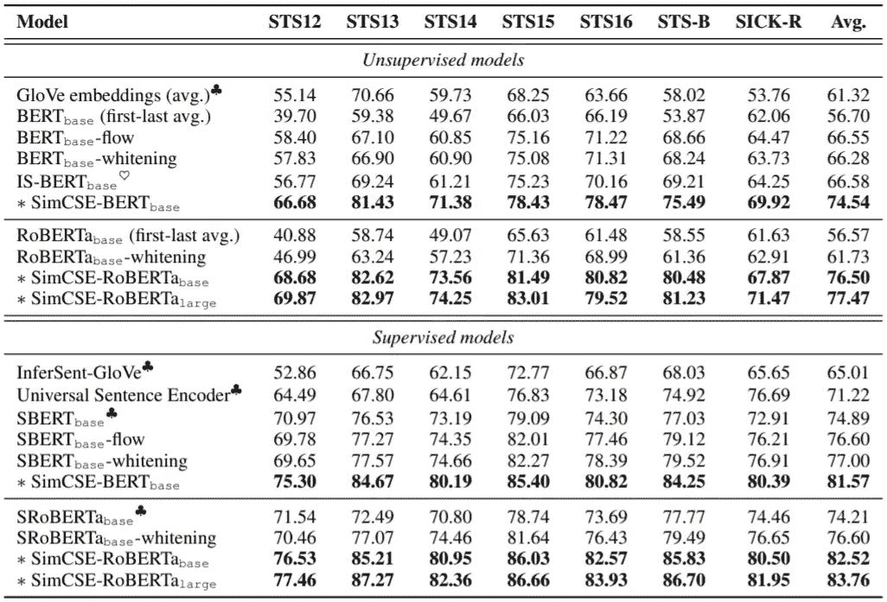

# 句子嵌入:没有足够的数据？只需申请退学两次！

> 原文：<https://towardsdatascience.com/sentence-embeddings-not-enough-data-just-apply-dropout-twice-e5122533786?source=collection_archive---------11----------------------->

## 评论一篇有趣的论文，该论文提出了一个简单的对比学习框架，可以产生优秀的句子嵌入

由[埃罗尔·艾哈迈德](https://unsplash.com/@erol?utm_source=medium&utm_medium=referral)在 [Unsplash](https://unsplash.com?utm_source=medium&utm_medium=referral) 上拍摄的照片

太多的未标记数据和创建标记数据的成本太高是深度学习中的常见问题。在计算机视觉中，我们可以使用数据扩充来生成更多的标记数据或提高模型的泛化能力。但是自然语言处理中的数据扩充往往不能有效地改进模型，而且可能会损害模型。高等人(2021)提出了 SimCSE，这是一种对比学习模型，利用简单而优雅的数据增强方法在监督和非监督文本相似性任务中实现 SOTA 结果。

# 无监督 SimCSE

在讨论 SimCSE 之前，我们应该知道句子嵌入被用来表示句子的特征向量。提取句子嵌入的常见方式是使用 BERT liked 大型预训练语言模型来提取`[CLS]`标记嵌入作为句子嵌入。SimCSE 使用预训练的 BERT 或 RoBERTa，在`[CLS]`表示的顶部有一个 MLP 层，作为编码器来获得句子嵌入。

SimCSE 作为一种对比学习模型，需要输入句子的正对和负对进行训练。作者简单地使用 dropout 向输入句子注入噪声来生成正对，并使用其他句子作为负对。是的，他们使用了 **dropout 作为数据扩充方法**！换句话说，一个输入的句子通过一个带有 dropout 的编码器得到第一个句子嵌入， *v1* 再通过编码器再次传递*句子得到第二个句子嵌入， *v2* 得到正对( *v1* ， *v2* )。*

有人可能会问，将一个句子通过同一个编码器两次，不会仅仅返回两个相似的句子嵌入吗？注意，基于 transformer 的编码器最初带有随机丢弃掩码，因此将一个输入句子通过编码器两次会导致两个稍微不同的句子嵌入。通过这种简单的方法，在 100 万对英语维基百科数据上训练的无监督 SimCSE 在标准语义文本相似性(STS)任务上取得了 SOTA 结果。

# 监督 SimCSE

除了无监督训练，高等人(2021)还利用来自 [SNLI](https://nlp.stanford.edu/projects/snli/) (Bowman 等人，2015)+ [MNLI](https://cims.nyu.edu/~sbowman/multinli/) (Williams 等人，2018)数据集的标记数据，进一步研究了 SimCSE 的性能。所选择的数据集由标记有蕴涵、矛盾和中性的句子对组成。他们用蕴涵对来构造肯定对，而否定对来自矛盾对。实验结果表明，标记数据的引入进一步提高了性能。下图显示了无监督和有监督模型的实验结果。

高等(2021)的结果

作者在 HuggingFace 的支持下在 [Github](https://github.com/princeton-nlp/SimCSE) 上发布了源代码。我们可以打开一个 Google Colab 笔记本，快速运行回购中提供的一些例子。

# 结论

令人惊讶的是，我们在几乎每个深度学习模型上应用的简单辍学可以用来进行数据增强。在计算机视觉上测试相同的方法并将其与常用的图像处理方法进行比较可能会很有趣。

我个人认为无监督的 SimCSE 具有更大的价值，并且非常有用，因为我们经常处理大量未标注的数据。无监督学习应该是未来人工智能的趋势，因为它可以更好地利用大数据集，并避免监督学习中的常见问题，如标签噪声。

这个故事只解释了原著的一小部分，我强烈建议你阅读原著以获得全面的理解。

# 参考

塞缪尔·r·鲍曼、加博·安格利、克里斯托弗·波茨和克里斯托弗·d·曼宁。2015.用于学习自然语言推理的大型标注语料库。在*自然语言处理的经验方法(EMNLP)* 中，第 632–642 页。

高天宇、姚兴成和陈。2021.SimCSE:句子嵌入的简单对比学习。 [arXiv:2104.08821](https://arxiv.org/abs/2104.08821) 。

艾迪娜·威廉姆斯，尼基塔·南吉亚，塞缪尔·鲍曼。2018.通过推理理解句子的大范围挑战语料库。计算语言学协会北美分会:人类语言技术(NAACL-HLT )，第 1112–1122 页。