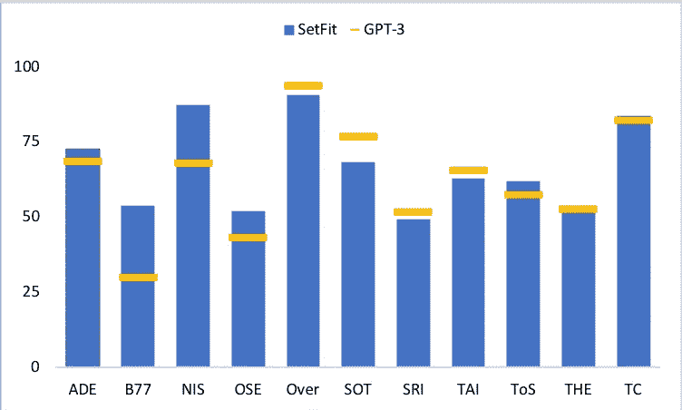
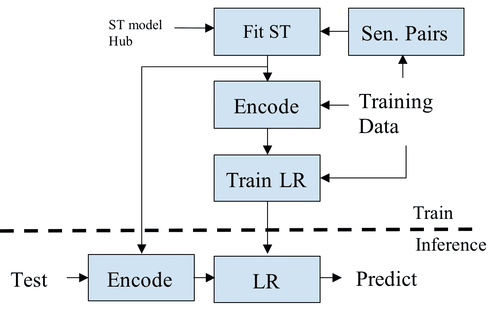
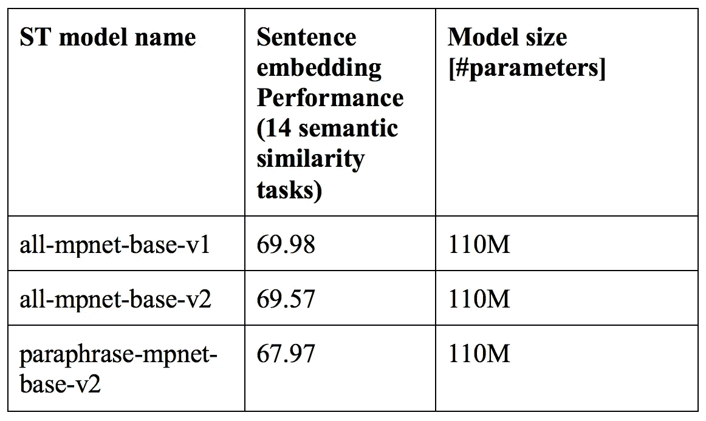
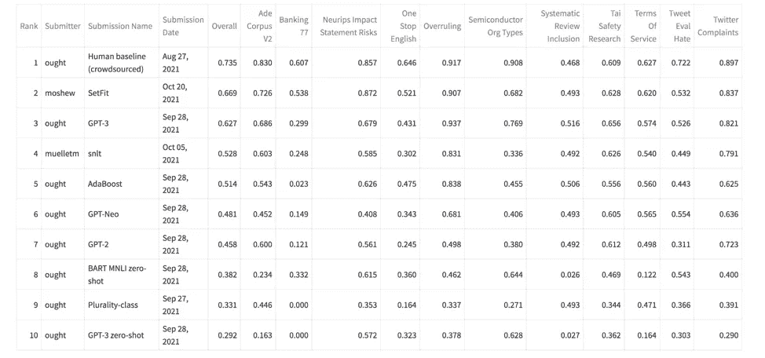
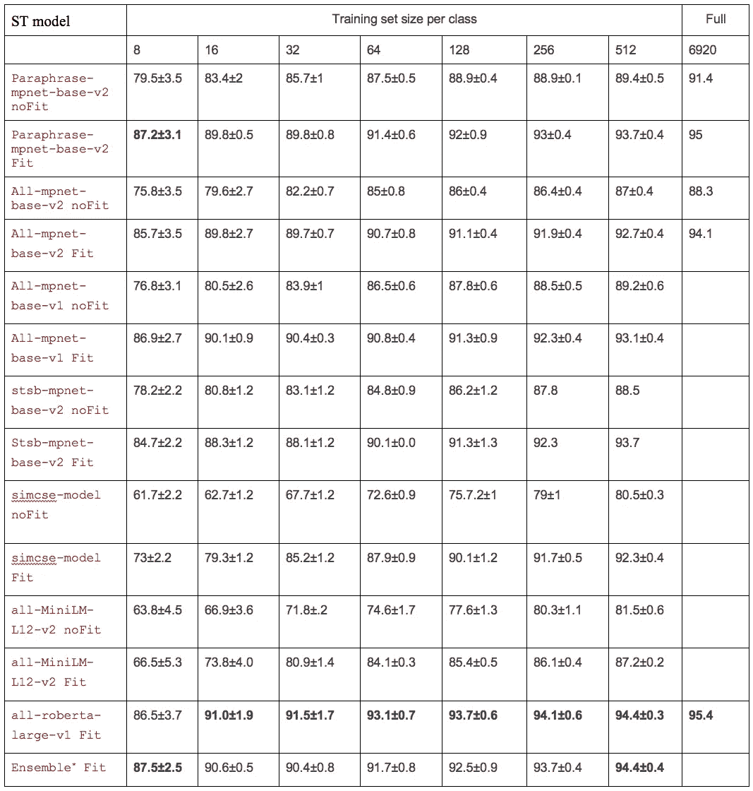

# 句子转换微调(SetFit):在少量文本分类方面优于 GPT-3，但体积却小了 1600 倍

> 原文：<https://towardsdatascience.com/sentence-transformer-fine-tuning-setfit-outperforms-gpt-3-on-few-shot-text-classification-while-d9a3788f0b4e?source=collection_archive---------3----------------------->

GPT-n 系列在少数镜头 NLP 分类任务中表现出非常有前景的结果，并随着模型规模的增加而不断改进(GPT 3–175B)。然而，这些模型需要大量的计算资源，并且它们对训练提示的选择很敏感。在这项工作中，我们演示了句子转换器微调(SetFit)，这是一种简单有效的少量文本分类方法。该方法基于用特定于任务的数据来微调句子转换器，并且可以容易地用句子转换器库来实现。我们通过将 SetFit 应用于 RAFT(真实世界少数镜头文本分类)基准测试来验证它，并显示它令人惊讶地优于 GPT-3 等模型，同时它的规模是 1600 倍，并缓解了对即时训练和使用未标记数据的需求。此外，我们的方法有助于缩小机器和人类性能之间的差距，只需提供 50 个实例进行训练。

**简介**

有监督神经网络在不同领域和领域的许多任务中表现出显著的性能，但是它们需要大量的标记训练数据。数据标记过程是劳动密集型和成本高昂的，并且阻碍了人工智能系统在行业中的部署。人工智能中的迁移学习(TL)对于低数据资源场景实现了相当大的鲁棒性。[NLP](https://ruder.io/state-of-transfer-learning-in-nlp/)(Ruder et al . 2019)中的 TL 涉及两个步骤:使用未标记数据训练的预训练语言模型(PLM)和针对特定任务的第二步微调。在 BERT (Devlin 等人，2019)等标准微调设置中，PLM 顶部的通用分类头输出用于生成最终预测的表示。基于 LM 微调的[文本到文本](https://ruder.io/recent-advances-lm-fine-tuning/)【1】的最新进展实现了 SOTA 少数镜头性能，包括上下文学习和任务特定提示学习。

**情境学习**模型根据作为提示提供的输入-输出训练示例直接生成答案，而不改变其参数。GPT-3(布朗等人，2020 年)利用上下文学习来证明在许多自然语言处理任务中优越的少数镜头能力。它的主要缺点是需要一个庞大的模型，只依赖于预先训练的知识，并且需要大量的快速工程。

**任务特定提示学习**将下游任务转换成屏蔽语言模型问题，由此在提供由任务特定模板定义的提示时，该模型生成作为屏蔽标记预测的文本响应。开拓性的模式开发训练(PET)方法(Schick & Schutze 2021a，b)结合了这种模式，并被证明在使用小三个数量级的模型的少量学习中胜过 GPT-3。然而，这种设置有几个限制:它需要多步训练，包括适应和几个 PLM 的集合；它利用特定任务的未标记数据；并且需要手工制作提示。ADAPET (Tam 等人，2021 年)通过利用更多的监督来训练模型，在没有任何未标记数据的情况下，在少量强力胶上的表现优于 PET。LM-BFF (Gao 等人，2021)通过将基于提示的微调(FT)与自动提示生成相结合，并动态选择任务示例作为输入上下文的一部分，提供了改进的少量微调性能。

最近，出现了几个针对 NLP 中少数镜头学习的基准，如 RAFT (Alex 等人，2021)，FLEX (Bragg 等人，2021)，和 CLUES (Mukherjee 等人，2021)。RAFT 是一个真实世界的少量文本分类基准，它只提供 50 个样本用于训练，没有验证集。它包括 11 个实际的现实世界的任务，如医疗案例报告分析和仇恨言论检测，其中更好的性能直接转化为更高的企业价值。该基准包括 GPT-3 产生的结果，成为比较的标准基线。在一篇相关的论文(Schick & Schutze 2021c)中，研究表明，像 PET 这样基于提示的学习者在 RAFT 基准测试中表现出色，在 11 个任务中有 7 个任务的表现接近人类水平，而没有使用任何验证数据。

在这篇博客中，我们介绍了 SetFit，一个经过调整的句子转换器模型，它通过少量数据进行微调，以解决现实世界中的文本分类挑战，如 RAFT。也就是说，验证 SetFit 是文本分类的通用灵丹妙药超出了本研究的范围。博客是这样组织的:我们从句子变形金刚相关的背景开始，然后提供改编方法的详细描述。由于目标基准缺乏任何验证数据，我们不得不根据外部相关任务搜索最佳参数集。我们选择 [SST-2](https://paperswithcode.com/sota/sentiment-analysis-on-sst-2-binary) 作为我们的验证数据集，并进行评估以选择 RAFT 实验的最佳参数。下一步是为 RAFT 任务微调 SetFit，并执行预测 RAFT 的测试数据，同时利用几种试探法和最佳实践。我们每项任务的表现都会在 RAFT 的排行榜网站上公布。在[发表后](https://huggingface.co/spaces/ought/raft-leaderboard) [2] SetFit 排名第二，紧随人类基线之后，在 11 个任务中的 7 个任务中超过了 GPT-3，尽管它比 x1600 小(见图 1)。

*图 1: F1 对比:筏形基准*上塞特菲 vs GPT-3

***方法***

***句子转换器(ST)** 是一种非常流行的方法，用于语义搜索、语义相似性和聚类。其思想是基于句子的语义签名对句子的唯一向量表示进行编码。如图 2 所示，在对比训练期间，通过在 Siamese 架构中采用 transformer 模型来构建表示(Remiers & Gurevych 2019)，旨在最小化语义相似的句子之间的距离，最大化语义遥远的句子之间的距离。*

**

**图 2:连体 BERT 架构**

*当应用于句子对之间的大规模比较时，句子转换器产生非常有效的表示，这是信息检索任务中非常常见的情况。STs 对于其他流行的 NLP 任务也是有效的，例如情感分析和命名实体识别，因为它们将文本转换为数值结构，然后很容易用现成的机器学习(ML)工具包和流行的 NLP 生产框架(例如[spark NLP](https://nlp.johnsnowlabs.com/)【3】)进行缩放、操作和处理。*

*sentence-transformers [库](https://www.sbert.net/) [4]是 ST 表示的模型中枢，包括一个抽象 API 和代码示例，用于在生产中训练、微调和推理 ST。*

***用于文本分类的 ST**使用 ST 进行文本分类的想法并不新颖，它包括一个编码步骤和一个分类步骤(如逻辑回归)。ST 性能优于其他嵌入表示，但无法与交叉编码器(如 BERT)分类相媲美(Remiers & Gurevych 2019)。令人惊讶的是，我们没有发现任何以连体方式为文本分类执行端到端 ST 微调的工作。原因可能是 STs 是在语义相似性任务上预先训练的(即句子对传达相同/不同的意思),并且为了相同的目标而进一步调整它们是直观的。此外，直到最近，具有显著性能提升的新 ST 模型才作为语句转换器(例如基于 [MPNet](https://arxiv.org/abs/2004.09297) 的具有大数据训练的模型)和其他模型(例如 [SimCSE](https://arxiv.org/abs/2104.08821) )的一部分发布，并且它们可能仍在为非相似性任务进行探索。*

***SetFit —句子转换器微调**图 3 是 SetFit 的训练和推理阶段的框图。交互式代码示例可以在[这里](https://colab.research.google.com/github/MosheWasserb/SetFit/blob/main/SetFit_SST_2.ipynb)【5】找到。*

*训练阶段的第一步是从句子-变形金刚[6]模型中枢中选择一个 st 模型。以下步骤是设置训练类、填充训练数据加载器和执行微调。为了更好地处理少数镜头场景中数量有限的标记训练数据，我们采用了一种经常用于图像相似性的对比训练方法(Koch et al. 2015):训练数据包括正面和负面句子对，其中正面对是从同一类中随机选择的两个句子，负面对是从不同类中随机选择的两个句子。句子对生成伪代码如图 4 所示。在每个句子对迭代中，我们生成 2x *N* 个训练对，其中 *N* 是每个任务的训练样本总数。生成的句子对用于微调(拟合)ST 模型。*

*在微调步骤的最后，产生一个适应的 ST。接下来，使用适应的 ST 对句子训练数据进行编码，然后为了简单起见，利用编码的数据来训练逻辑回归(LR)。在推理阶段，每个测试句子都用适应的 st 编码，然后用 LR 模型预测其类别。*

**

**图 3: SetFit 的示意图**

**

**图 4:句子对生成伪代码**

***实验***

*RAFT (Alex et al. 2021)是一个少数镜头分类基准，旨在通过将训练样本的数量限制为每个任务 50 个标记的示例，而不提供验证集，来匹配真实世界的场景。前者对于从业者来说是困难的，因为找到最佳的训练超参数集是具有挑战性的。影响 SetFit 性能的突出特征包括:*

1.  *st 的类型:句子-变形金刚模型中枢中的 ST 有很多种类型，问题是如何为给定的任务选择最佳的 ST。*
2.  *输入数据选择:在一些 RAFT 任务中，提供了几个数据字段作为输入，例如标题、摘要、作者姓名、ID、数据等。这就产生了一个问题:哪些数据字段应该用作输入，以及如何组合它们？*
3.  *超参数的选择:如何选择最佳的微调超参数集(例如#epochs，句子对生成迭代的次数)？*

*最后，我们应用简单的试探法和常识来选择 ST 模型、输入数据字段、超参数和序列长度。在接下来的部分中，我们将描述选择这些参数的最佳实践。*

*ST models 句子变形库包含了大量可供选择的句子嵌入模型。模型名称对应于它们所基于的转换器的类型以及训练数据集。例如，“释义-mpnet-base-v2”模型使用释义相似性数据集用 mpnet 模型来训练。*

*对于如何为下游 NLP 任务选择最佳模型或训练数据集，没有明确的指导原则，尽管对于相似性任务存在一些经验法则。由于 RAFT 是一个文本分类数据集，我们假设它将受益于一个嵌入模型，该模型被训练来检测句子对之间的语义相似性，因为这有点类似于文本分类设置中类之间的相似性。因此，我们考虑嵌入使用“[所有](https://huggingface.co/sentence-transformers/all-mpnet-base-v2)或“[释义](https://www.sbert.net/examples/training/paraphrases/README.html)训练数据集训练的模型，并将其设计为通用模型，我们排除了使用 [NLI](https://paperswithcode.com/task/natural-language-inference) 或 [Q & A](https://paperswithcode.com/task/question-answering) 数据集训练的嵌入模型，这些数据集与文本分类任务非常不同。*

*我们只瞄准尺寸与 BERT-110M 相当的型号。我们还测试了 STs 的蒸馏版本，如 TinyBERT-80M 和 MiniLM-80M，但发现它们的性能与原始教师模型不可比(见附件 A)。*

*考虑到以上所有因素，我们为验证步骤选择了以下三个候选模型。这些模型在句子变形器的[句子嵌入性能](https://www.sbert.net/docs/pretrained_models.html)中排名最高，如表 1 所示。*

**

**表 1:语义相似性任务的性能和被选择用于在 SST-2 数据集上验证 SetFit 的三个候选 ST 模型的大小**

***使用 SST-2 作为验证集**我们在 SST-2 数据集上验证了 SetFit，这是广泛使用的 GLUE 基准测试的一部分。SST-2 是试探性选择的，因为它与大多数 RAFT 基准任务具有几个共同的品质，例如:*

*●相对较短的序列长度(< 64)*

*●丰富的语义和句法结构，与其他分类器相比，Transformer 具有较高的准确性*

*●代表真实生活场景*

*SST-2 的选择不是 RAFT 的最佳选择，但可以作为替代验证集，因为 RAFT 不提供验证数据，也不为测试数据提供金标签。*

*通过从完整的 SST-2 训练数据中为每个类别随机选择少量训练样本(16 或 50)来模拟少炮设置，以适应和训练 ST。训练过程重复五次，每次使用不同的随机种子。通过对五次迭代的推理结果进行平均来产生最终的准确度。*

***ST 模型选择**表 2 显示了三个候选模型在 ST 模型微调(Fit)和不微调的情况下的性能，并与 PET 的性能进行了比较，PET 使用 RoBERTa 和 3 进行了标准微调(高等人，2021 年)。*

**

**表 2:SST-2 数据集上不同 ST 模型的少量和完整训练集性能与基线的对比。*任务特定提示。* *标准微调。***上下文微调。据*报道(高等 2021)。*

*如表 2 中所示，三个候选模型相当可比，具有 50 个训练样本的“释义-mpnet-base-v2”模型证明了略好的性能。因此，我们选择这个模型来评估我们的方法在 RAFT 基准上的性能。*

**

**图 5:微调后(左)和微调前(右)在*paraphrase-MP net-base-v2*ST 输出的二元分类任务的训练向量的 2D 表示。k 代表每类训练样本的数量。蓝色圆点代表类别“0”，而橙色圆点代表类别“1”。**

*少量的历元、句子对生成的五次迭代和 ST 微调足以达到收敛，并在 2D 向量空间(使用 T-SNE 建立)中产生良好的可分性。图 5 显示了训练数据的 2D 投影，有和没有 ST 微调。可以看出，与没有微调的相同模型相比，微调步骤显著提高了少量训练数据的可分离性，这导致 SST-2 测试的精确度更高。*

***超参数** **选择**以下是基于 SST-2 数据集实验选择的参数。我们对所有的 RAFT 基准测试使用了相同的参数集，除了任务 4(见表 3 ),为了达到可接受的分离，我们将迭代次数增加到了 10 次。*

*● ST 模型= '释义-mpnet-base-v2 '*

*●train _ loss = CosineSimilarityLoss*

*●#纪元数= 3*

*●句子对生成迭代次数= 5*

*●批量= 16*

*●预热步骤= 10*

***数据字段选择**RAFT 基准测试中的任务 3、7 和 8 包含多个数据字段作为额外的元数据(如日期、个人姓名和职务)。在这些情况下，我们确保只保留一个主要的文本特征，该特征直观地包括用于正确分类句子的足够的上下文。表 3 显示了每个任务的可用数据字段，以及所选择的数据字段(以粗体显示)，以及(mean+std)/max 文本长度。*

**

**表 3: RAFT 的数据字段和(均值+标准差)/最大文本长度**

***序列长度选择**如表 3 所示，任务 3、4、7 和 8 包括长文本序列(> 256 个标记)，这可能会导致意外结果(SetFit 仅针对 SST-2 进行验证)和微调期间的内存分配错误(取决于您的硬件设置)。在这些情况下，我们将输入文本长度限制为 128 个标记，如下所示:对于任务 4、7 和 8，我们选择了前 128 个标记，但是对于任务 3，我们选择了后 128 个标记，因为我们注意到正确分类的相关上下文通常位于文本输入的最后部分。*

***大量句子对生成迭代**对 SST-2 数据集实验的分析表明，五次句子对生成迭代和 ST 微调足以实现代表不同类别训练样本的向量的 2D 投影之间的良好分离(见图 5)。因此，我们对所有的 RAFT 任务使用了五次迭代，除了任务 4，为了达到可接受的分离，我们将迭代次数增加到 10 次。*

***其他最佳实践**没有对文本输入进行预处理。在 RAFT 数据集的任务 2 (Banking_77)中，由于标签样本具有相当稀疏的表示(77 个意图类别中只有 36 个在训练数据中包括至少一个样本)，我们将标签的名称作为输入样本添加到该类别。这是一个微不足道的附加，因为在文本分类任务中，类的名称(或它们的描述)是给定的。*

***结果**表 4 显示了 RAFT 排行榜的快照(2021 年 11 月)。SetFit 的总分是 0.669，在人类基线之后排名第二，比 GPT-3 高出 0.042 分。令人惊讶的是，在基准测试的 11 个任务中，SetFit 在 7 个任务中超过了 GPT3，在 NIS 任务中，SetFit 甚至超过了人类基线。*

**

**表 RAFT 排行榜快照(2021 年 11 月)**

***讨论***

*以下是基于将 SetFit 应用于 RAFT 基准测试的结果的一些想法:*

*●我们预计，ST 模型的集合，以及基于 RoBERTa large 等大型模型的 ST 模型，最终将在 RAFT 上实现更好的整体性能(如附录 A 中 SST-2 所示)。*

*●对于 NIS 任务，将文本输入长度限制在最后 128 个字符似乎是一个好的实践，对性能有积极的影响。*

*●将类别名称添加到 Banking_77 任务的训练数据中似乎非常有效，这可能导致比 GPT-3 更大的准确性优势(超过 0.2 点)。*

*●一个有趣的反常现象是，该表显示，一方面，在 NIS 和 OSE 任务中，SetFit 远远超过 GPT-3，甚至在 NIS 任务中超过了人类基线。另一方面，GPT-3 在 SOT 任务中的表现远远超过 SetFit 这可能与 SOT 任务比其他任务需要更多事实知识的直觉有关。*

*●通过将文本分类的一般问题解耦到句子嵌入生成和预测的两个阶段，实现了显著的准确性/效率提高，这乍一看似乎令人惊讶，但对于 SOTA 自然语言处理任务来说并不新鲜。事实表明，开放式问答的检索和阅读器架构(例如 Lewis 等人的 RAG)能够使小得多的模型获得与 T5–11B 等较大模型相当的结果。总的来说，SetFit 和 RAG 的分离带来了更高的健壮性(新数据/类别不需要重新训练)、可解释性和可伸缩性(更高级别的并行化)。*

*●SetFit 为 SST-2 数据集生成的结果(如附录 A 所示)，例如使用“all-roberta-large-v1”模型的完整训练集的准确度为 95.4，这将使 set fit 在 [SST-2 排行榜](https://paperswithcode.com/sota/sentiment-analysis-on-sst-2-binary) [7]上排名前 20。这些基于句子表征的高质量结果与句子表征被认为仅传达浅层信息并因此导致准确度下降的常见假设相反。*

***结论和未来工作***

*我们提出了 SetFit，一种有效的少镜头文本分类方法，它基于流行的句子转换库，基于预先训练的 ST 表示和微调。SST-2 数据集上的实验和 RAFT 基准上的提交结果证明了 SetFit 与大两到三个数量级的模型(如 GPT-3 和 GPT-近地天体)相比的有效性，以及对比培训对进一步改进下游 NLP 任务的 STs 的重要性。在未来的工作中，我们打算探索如何用 SetFit 实现无监督学习，以及如何将其扩展到其他任务，特别是两句话文本分类，如 [NLI](https://paperswithcode.com/task/natural-language-inference) ， [Q & A](https://paperswithcode.com/task/question-answering) 。*

***致谢***

*我们非常感谢柳文欢·佩雷格(英特尔实验室)、尼尔斯·雷默斯(拥抱脸)、卢克·贝茨(UKP —达姆施塔特)富有成效的评论和更正。*

*[1][https://ruder.io/recent-advances-lm-fine-tuning/](https://ruder.io/recent-advances-lm-fine-tuning/)*

*[2]最近，PET 进入 RAFT 排行榜，在人类基线之后排名第一，PET 基于比 SetFit 大 x2 的 ALBERT 模型(xxlarge，v2，235M 参数)。*

*[3]https://nlp.johnsnowlabs.com/*

*[4]https://www.sbert.net/*

*[5][https://colab . research . Google . com/github/MosheWasserb/set fit/blob/main/set fit _ SST _ 2 . ipynb](https://colab.research.google.com/github/MosheWasserb/SetFit/blob/main/SetFit_SST_2.ipynb)*

*[6]句子-默认情况下，变形金刚包括 ST 对象的微调选项。*

*[7][https://papers with code . com/sota/opinion-analysis-on-SST-2-binary](https://paperswithcode.com/sota/sentiment-analysis-on-sst-2-binary)*

***参考文献***

*汤姆·布朗、本杰明·曼、尼克·赖德、梅拉妮·苏比亚、贾里德·D·卡普兰、普拉富拉·达里瓦、阿尔温德·尼拉坎坦、普拉纳夫·希亚姆、吉里什·萨斯特里、阿曼达·阿斯凯尔、桑迪尼·阿加瓦尔、阿里尔·赫伯特沃斯、格雷琴·克鲁格、汤姆·海尼汉、雷文·蔡尔德、阿迪蒂亚·拉梅什、丹尼尔·齐格勒、杰弗里·吴、克莱门斯·温特、克里斯·黑塞、陈唐山、埃里克·西格勒、马特乌斯·利特温、斯科特·格雷、本杰明·切斯、杰克·克拉克、克里斯托弗·伯纳、萨姆·麦卡德里什、亚历克·拉德福德[语言模型是一次性学习者](https://arxiv.org/abs/2005.14165)。NeurIPS 2020。*

*[塞巴斯蒂安·鲁德](https://aclanthology.org/people/s/sebastian-ruder/)，[马修·e·彼得斯](https://aclanthology.org/people/m/matthew-e-peters/)，[斯瓦巴·斯瓦扬迪普塔](https://aclanthology.org/people/s/swabha-swayamdipta/)，[托马斯·沃](https://aclanthology.org/people/t/thomas-wolf/) lf。[自然语言处理中的迁移学习](https://aclanthology.org/N19-5004/)。NAACL 2019。*

*雅各布德夫林张明伟肯顿李克里斯蒂娜图塔诺瓦。 [BERT:用于语言理解的深度双向转换器的预训练](https://arxiv.org/abs/1810.04805)。NAACL 2019。*

*提莫·希克和辛里奇·舒茨。2021a。[利用完形填空题进行少量文本分类和自然语言推理](https://arxiv.org/abs/2001.07676)。EACL 2021。*

*提莫·希克和辛里奇·舒茨。2021b。[重要的不仅仅是规模:小型语言模型也是很少尝试的学习者](https://arxiv.org/abs/2009.07118)。NAACL 2021。*

*德里克·塔姆，拉克什·梅农，莫希特·班萨尔，沙尚克·斯里瓦斯塔瓦，科林·拉弗尔。[改进和简化花样拓展训练](https://arxiv.org/abs/2103.11955)。EMNLP 2021。*

*提莫·希克和辛里奇·舒茨。2021c。[真正的带提示的少量学习——现实世界的视角](https://arxiv.org/abs/2111.13440)。*

*尼尔斯·雷默斯和伊琳娜·古雷维奇。句子-伯特:[使用连体伯特网络的句子嵌入](https://arxiv.org/abs/1908.10084)。EMNLP 2019*

*格雷戈里·科赫，理查德·泽梅尔，鲁斯兰·萨拉胡季诺夫。[用于一次性图像识别的连体神经网络](https://www.cs.cmu.edu/~rsalakhu/papers/oneshot1.pdf)。2015*

*天宇高，亚当费舍尔，陈 2021。[使预先训练的语言模型成为更好的少量学习者](https://arxiv.org/abs/2012.15723)。ACL 2021。*

*Neel Alex、Eli Lifland、Lewis Tunstall、Abhishek Thakur、Pegah Maham、C. Jess Riedel、Emmie Hine、Carolyn Ashurst、Paul Sedille、l . Alexis Carlier、Michael Noetel、Andreas Stuhlmüller。 [RAFT:一个真实世界的少镜头文本分类基准](https://arxiv.org/pdf/2109.14076v1.pdf)。NeurIPS 2021，数据集和基准跟踪。*

*乔纳森·布拉格，阿尔曼·科汉，凯尔·洛伊兹·贝尔塔吉。 [FLEX:统一评估少镜头 NLP](https://arxiv.org/abs/2107.07170) 。NeurIPS 2021。*

*苏伯拉塔·慕克吉、、郑国庆、萨加尔·侯赛尼、格雷格·杨、克里斯多夫·米克、阿瓦达拉、高剑锋。[线索:自然语言理解中的少量学习评价](https://openreview.net/pdf?id=VhIIQBm00VI)。NeurIPS 2021，数据集和基准跟踪。*

*Patrick Lewis、Ethan Perez、Aleksandra Piktus、Fabio Petroni、Vladimir Karpukhin、Naman Goyal、Heinrich Küttler、迈克·刘易斯、Yih Wen-tau、Tim rocktschel、Sebastian Riedel、Douwe Kiela。知识密集型自然语言处理任务的检索增强生成。NeurIPS 2020。*

***附录 A***

**

**图 6: SST-2 对句子转换模型的评估。** 3 个模型的集合:**释义-mpnet-base-v2、All-mpnet-base-v1 和 Stsb-mpnet-base-v2***