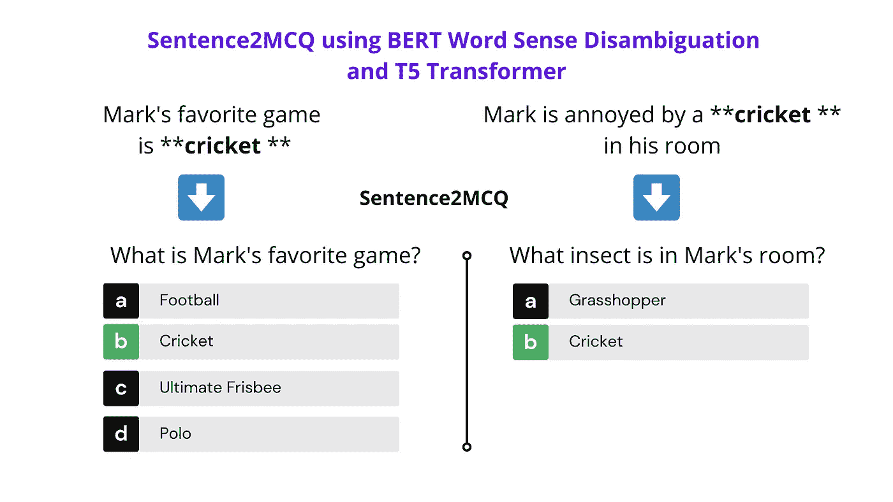
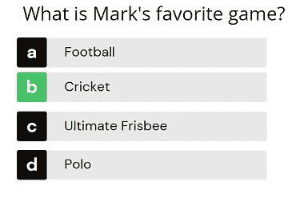
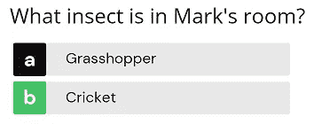
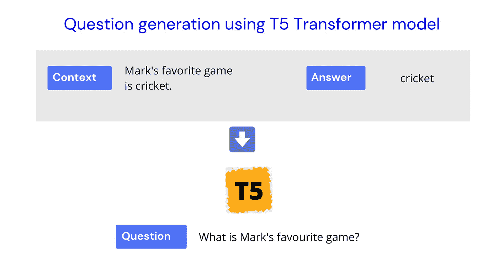
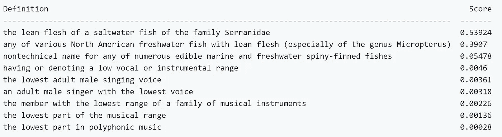
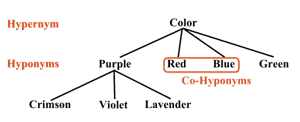
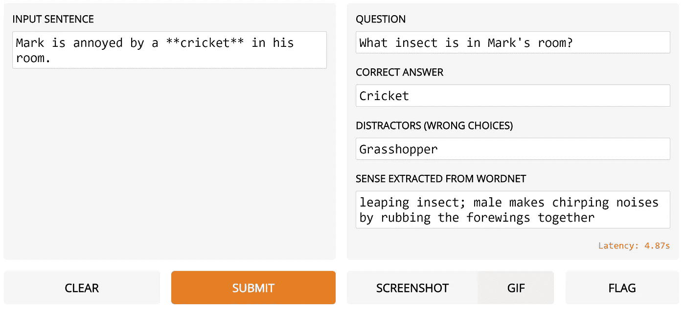

# 使用 BERT 词义消歧和 T5 转换器的 Sentence2MCQ

> 原文：<https://towardsdatascience.com/sentence2mcq-using-bert-word-sense-disambiguation-and-t5-transformer-e6bb5aaba29b?source=collection_archive---------14----------------------->

## 使用 HuggingFace transformers 和 Gradio App 的实用人工智能项目



作者图片

# 实际使用案例


来自[平面的图标图标](https://www.flaticon.com/authors/monkik)

想象一下,**中学的英语老师**正在为第二天的课准备阅读理解**测验**。老师不会给出过时的评估**，而是会根据当天的热门新闻文章快速生成一些评估(mcq)。**

一个**人在回路中的**管道可以是这样的，其中新闻文章被**总结**成几个重要的**句子**，并且从每个句子中提取一个**关键字**以形成一个 **MCQ** 问题。然后，教师可以使用 NLP**接受或拒绝**自动生成的问题，只保留**高质量的**问题进行测验。这为教师准备评估节省了大量的时间，同时也增加了学生的参与度，因为它基于当前的热门话题。

# 投入

我们程序的输入将是任何带有突出显示的关键字的**句子**(例如:cricket ),问题需要围绕该句子被框住。

示例输入 1:

```
**Mark's favorite game is **cricket**.**
```

示例输入 2:

```
**Mark is annoyed by a **cricket** in his room.**
```

# 输出

我们将把任何给定的句子转换成如下所示的 MCQ

输出例如输入 1:



作者图片

输出，例如输入 2:



作者图片

请注意，我们能够智能地**将单词 **cricket** 在第一句中区分为**游戏**，在第二句中区分为**昆虫**，并相应地生成**干扰项**(错误的 MCQs)。**

# 算法

给定我们的输入句子 eg: **Mark 最喜欢的游戏是**cricket**，**我们提取**关键字** (cricket)和**句子**，并将其交给 **T5 转换器**算法，该算法被训练为接受**上下文**和**答案**作为输入，并生成**问题**。



作者图片

我们并行地将句子( **Mark 最喜欢的游戏是**cricket**)** 和高亮显示的**关键词**作为输入传递给**基于 BERT 的**算法，该算法被训练来进行词义消歧(WSD)并从 [**Wordnet**](https://wordnet.princeton.edu/citing-wordnet) 中识别正确的**词义**。

如果我们有一个句子**“蝙蝠飞入丛林，落在一棵树上”**和一个关键词**“蝙蝠”**，我们就自动知道这里我们说的是有翅膀的哺乳动物蝙蝠，而不是板球拍或棒球棒。

虽然我们人类很擅长，但算法不太擅长区分这两者。使用算法来区分给定单词的确切**上下文含义**的想法被称为**词义消歧** (WSD)。

[WordNet](https://wordnet.princeton.edu/) 是一个大型的英语词汇数据库。在 Wordnet**“bat”**有几个**义项**(上下文含义)一个表示板球拍，一个表示会飞的哺乳动物，等等。在给定单词的所有几种可能的含义(上下文含义)中，我们的目标是找到句子中给定单词的正确含义。

我们将使用令人敬畏的 [BERT-WSD](https://github.com/BPYap/BERT-WSD) 项目，它是**预训练的**来识别句子中给定单词的**正确含义**。

给定一个像`**(He caught a [TGT] bass [TGT] yesterday)**`一样突出显示**关键字**的句子，BERT-WSD 将对 Wordnet 中所有可能的词义进行评分和排序，如下所示。我们使用具有最高概率**的意义**并提取干扰物。



图片来自 [BERT-WSD](https://github.com/BPYap/BERT-WSD) 回购

## 使用 Wordnet 生成干扰项

假设我们得到一个单词，比如" **Red** "并识别它的**义项**，然后我们使用 Wordnet 找到它的上位词。一个**上位词**是一个给定单词的更高层次的类别。在我们的例子中，**颜色**是**红色**的上位词。

然后我们去寻找所有属于颜色组的**颜色**的下位词(子类别),它们可能是紫色、蓝色、绿色等。因此，我们可以使用紫色、蓝色、绿色作为给定 MCQ 的干扰物(错误答案选项)，该的正确答案是**红色**。紫色、蓝色、绿色也被称为红色的**的同音异义词**。

因此，使用 Wordnet，提取一个给定单词的**同音异义词**就能得到该单词的**干扰词**。所以在下图中，红色的干扰物是蓝色、绿色和紫色。



来源:[https://en.wikipedia.org/wiki/Hyponymy_and_hypernymy](https://en.wikipedia.org/wiki/Hyponymy_and_hypernymy)

类似地，对于我们的例子，我们提取单词 **Cricket** 的同音异义词，得到 **Football** 、 **Polo** 、**Ultimate fribsee**等作为干扰词。

## 谷歌 Colab 笔记本

这里有一个易于使用的谷歌 Colab 笔记本，上面有所有必要的代码。

# 密码

安装必要的库:

```
!pip install --quiet transformers==2.9.0
!pip install --quiet nltk==3.4.5
!pip install --quiet gradio==1.4.2
```

连接您的个人 google drive 来存储经过训练的 BERT-WSD 模型

```
from google.colab import drive
drive.mount('/content/gdrive')
```

从[此处](https://entuedu-my.sharepoint.com/:f:/g/personal/boonpeng001_e_ntu_edu_sg/EiWzblOyyOBDtuO3klUbXoAB3THFzke-2MLWguIXrDopWg?e=08umXD)下载预先训练好的 BERT WSD 模型

点击链接左上方的下载按钮，下载一个名为“**Bert _ base-augmented-batch _ size = 128-lr = 2e-5-max _ gloss = 6 . zip**”的文件。将 zip 文件放入 Google drive **home** 文件夹。

使用下面的代码将上面的文件解压到你的 Google drive 中。

```
import os
import zipfilebert_wsd_pytorch = "/content/gdrive/My Drive/bert_base-augmented-batch_size=128-lr=2e-5-max_gloss=6.zip"
extract_directory = "/content/gdrive/My Drive"extracted_folder = bert_wsd_pytorch.replace(".zip","")#  If unzipped folder exists don't unzip again.
if not os.path.isdir(extracted_folder):
  with zipfile.ZipFile(bert_wsd_pytorch, 'r') as zip_ref:
      zip_ref.extractall(extract_directory)
else:
  print (extracted_folder," is extracted already")
```

初始化 BERT-WSD 模型

为 BERT-WSD 创建预处理步骤，为问题生成初始化 **T5 转换器**并定义 Wordnet **干扰项**提取函数。

运行 get **MCQs** 函数，将一个给定的句子和高亮显示的关键字作为输入。

上面的输出是-

```
**Question:** What is Mark's favorite game? 
**Correct Answer :** Cricket
**Distractors:** ['Ball Game', 'Field Hockey', 'Football', 'Hurling', 'Lacrosse', 'Polo', 'Pushball', 'Ultimate Frisbee'] 
**Sense from wordnet:** a game played with a ball and bat by two teams of 11 players; teams take turns trying to score runs
```

如你所见，我们输入了一个句子**(马克最喜欢的游戏是**板球* *。)**并正确生成正确答案的**问题**和相关**干扰项**(板球)。

现在让我们使用 [Gradio](https://www.gradio.app/) 并构建一个漂亮的 **GUI** 来做同样的事情。

在 **Colab** 笔记本本身中，你得到一个漂亮的 **GUI** 来输入任何**文本**并在那里看到**输出**。



作者图片

有时，如果**单词**不在 **Wordnet** 中，你不会得到任何干扰物。如果你想找到替代的方法来找到干扰物，在这里找到我的详细博客。

## 格拉迪欧是什么？

有了 [Gradio](https://www.gradio.app/) 你可以为你的 **ML** 模型创建**易于使用的图形用户界面**，只需在你的 colab 笔记本上写几行代码。

最棒的是。你可以通过一个**简单链接**(例如: [12345.gradio.app](http://12345.gradio.app/) )与你的非技术经理/朋友分享 GUI，以便在网络上的任何地方试用。Gradio 不仅仅是为了文字。你也可以上传一张图片作为输入，并在里面做任何预测。

# 使用自然语言处理的问题生成——教程

我推出了一个非常有趣的 Udemy 课程，名为“使用 NLP 生成问题”,扩展了这篇博文中讨论的一些技术。如果你想看一看，这里是[链接](https://www.udemy.com/course/question-generation-using-natural-language-processing/?referralCode=C8EA86A28F5398CBF763)。

# 结论

希望你喜欢我们如何使用 NLP 解决从给定的句子生成 MCQ 的现实问题。

祝 NLP 探索愉快，如果你喜欢它的内容，请随时在 [Twitter 上找到我。](https://twitter.com/ramsri_goutham)