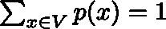
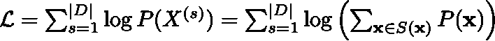

# 句子片段标记器去神秘化

> 原文：<https://towardsdatascience.com/sentencepiece-tokenizer-demystified-d0a3aac19b15?source=collection_archive---------1----------------------->

## [入门](https://towardsdatascience.com/tagged/getting-started)

## 深入探究句子分词器的内部工作原理，为什么它如此强大，以及为什么它应该成为你的首选。你可能会开始关心符号化。


由[克里斯蒂安·埃斯科瓦尔](https://unsplash.com/@cristian1?utm_source=medium&utm_medium=referral)在 [Unsplash](https://unsplash.com?utm_source=medium&utm_medium=referral) 上拍摄的照片

我将是第一个承认学习记号化方案可能很无聊，如果不是非常痛苦的话。通常，在训练自然语言时，选择和实现标记化方案只是增加了一层复杂性。它会使你的生产流程变得复杂，用不合时宜的[OOV]或[UNK]来破坏气氛，或者可能只是把你送进 unicode 地狱的深处，在那里你想知道为什么是“字符串”！= "字符串"。

然而，就像你的第一杯真正的好酒，或者你第一次品尝高质量的寿司，一旦你品尝了这种好东西，你就会以完全不同的眼光看待剩下的东西。这篇文章旨在讨论 SentencePiece，并展示它使标记化过程变得多么轻松。在此过程中，您可能会认为标记化并没有那么糟糕。

# 什么是句子片断？

令人惊讶的是，它实际上并不是一个标记，我知道，误导。它实际上是一种从预编译列表中选择标记的方法，根据提供的语料库优化标记化过程。句子片断[1]，是一个实现*子字正则化*算法[3]的包的名字(此处可用【2】)(全部由同一作者 Kudo，多久完成)。在这篇文章的持续时间里，我将继续使用 SentencePiece 来指代算法和它的包，因为这有望减少混淆。

如果你想要关于如何使用实际软件的说明，看一看文章结尾或参考文献[18]中的 [colab 链接](https://colab.research.google.com/github/google/sentencepiece/blob/master/python/sentencepiece_python_module_example.ipynb)。

## 句子的优点

1.  它是用 C++实现的，速度快得惊人。你可以在几秒钟内训练一个 10⁵语料库的分词器。
2.  标记化的速度也快得惊人。这意味着您可以直接在原始文本数据上使用它，而无需将标记化的数据存储到磁盘。
3.  子词正则化就像数据扩充的文本版本，可以极大地提高模型的质量。
4.  它是空白不可知的。您可以像训练英语或法语一样轻松地训练非空格描述的语言，如汉语和日语。
5.  它可以在字节级工作，所以你几乎不需要使用[UNK]或[OOV]令牌。这不仅仅是针对句子。
6.  本文[17]: *字节对编码对于语言模型预训练*——【https://arxiv.org/pdf/2004.03720.pdf】T2 来说是次优的

SentencePiece 功能强大，但它的目的到底是什么？提到第(3)点，它使我们能够训练子字正则化任务，我们现在解释它。

## 子字正则化目标

我们在这一小节的目标是明确开发子字正则化的学习目标。首先，让我们考虑如何给序列分配概率。一般来说，我们喜欢认为序列包含一个方向，这意味着有一个向前和向后的方向。你按顺序说话。股票会随着时间的推移而上涨和下跌。因此，我们可以根据序列在早期的条件分布来确定它的分布。给定一系列单字 X = ( *x_1，…，x_n)，*，通过重复应用贝叶斯规则，我们将其概率重写为


熟悉朴素贝叶斯方法[5]的读者应该知道这个公式。在朴素贝叶斯中，我们做一个条件独立性假设(强假设)，如果 *X* 以某个变量 *y，*即 P(X|y)为条件，那么我们可以假设 *p(x_2|x_1，y) = p(x_2 | y)，p(x_3|x_2，x_1，y) = p(x_3|y)* 等等。也就是说，如果我们得到了关于另一个东西 *y* 的信息，我们可以完全忘记 x_i 所依赖的所有变量 *x_{j < i}* 。

为了给这种简化做准备，我们考虑一下人工机器翻译的问题(NMT)。这里，我们想要评估给定输入句子 *X.* 的目标句子 *Y* 的概率 *P(Y|X)* 因为 *Y* 和 *X* 都是序列，我们可以写出概率【3】


这里，小写的变量表示实际的记号，大写的表示这些记号的顺序。θ代表我们的模型参数(神经网络的权重)。就目前情况来看，这个公式不太正确。实际上， *X* 和 *Y* 可以由指数数量的可能子字序列构成。想想分解“你好”这个词。我们可以用很多方式来标记:


甚至像“hello”这样的简单单词也可以呈现出指数数量的可能标记化

所以实际上，我们应该用特定的序列表示法 **x** 和 **y** 来代替左边的 X 和 Y。SentencePiece 承认这一现实，并利用这一点。然后，我们可以将 NMT 任务的完整分段平均成本函数写成


|D|是可能分割的数量，x 和 y 都是从这些分割上它们各自的分布中提取的。l 是成本函数，P 和之前一样。

这个公式有点吓人，但是你不需要想太多。在实践中，我们能做的是去掉期望值 E ……,用单个随机分段的**代替 **x** 和 **y** 。**就是这样。我们通常为训练 NMT 模型所做的其他事情都没有改变(这包括短长度惩罚和任何其他模型攻击)。

“使用一个样本”的近似应该为任何使用过变分自动编码器的人所熟悉[6]，其中隐藏状态的期望值类似地由一个样本大小来近似。

既然我们已经定义了培训任务，我们必须回答实际问题；是的，很酷，但是我们如何在指数数量的状态上建立概率分布呢？！像科学中的其他事情一样，我们拼命地作弊和近似，直到有人告诉我们我们不能。

## 单字语言模型

从本质上来说，SentencePiece 只是另一个普通的老式单字符模型。这意味着，考虑仅仅两个令牌的联合分布 *P(x_1，x_2)* 都太难了，更不用说指定 *P(X)* 所需的 *n* 了。所以，我们只是做了近似:


受制于标准化约束:



其中每个子词(这里称为一元词)出现的概率独立于所有其他子词。是的，这是一个极端的假设，但从经验上来看并不太有害。

Unigram 语言模型非常常见，并且已经存在了一段时间。一种称为字节对编码(BPE)的流行方法，首先由 Gage [7]在信息文献中介绍，后来由 Sennrich 等人在 NMT 的上下文中使用。艾尔。[8](一篇可读性很强的论文 btw)是一种基于用最少所需信息位对文本进行编码的简单方法。BPE 的一个小变体叫做 WordPiece，是另一个流行的标记器，我们建议读者参考其他容易理解的摘要文章，如[9]以获得更好的概述。

原则上，SentencePiece 可以构建在任何 unigram 模型上。我们唯一需要喂它的东西是

1.  单字概率
2.  训练语料库

然后，我们只需在语料库上训练句子片段标记器，我们可以自由地执行子词正则化(或不正则化)NMT 训练。美妙之处在于，如果我们不想使用子词正则化，我们甚至不需要使用它。我们也可以使用 SentencePiece 作为快速标记器，让我们可以动态处理原始文本。

尽管做了极端的 unigram 假设，但如何训练标记器一点也不明显，这也是这篇文章的原因之一。我们将在下一节详细解释这一点。

但是为了实际做一些具体的事情，最终我们必须选择一个 unigram 模型。在这篇文章中，我们将使用 BPE，因为它简单明了，我们可以当场自制一个版本。

# 字节对编码

总的想法是这样做:

1.  浏览你的语料库，找到所有的“字节”,即不可约的字符，所有其他字符都可以从这些字符中构建出来。这是我们的基地。它确保我们几乎总能重建任何看不见的输入。
2.  在整个语料库上运行滑动窗口(实际代码略有不同)并找到最频繁的二元模型。二元模型由当前可见子词列表中的连续子词形成。因此，“hello”的计数是{“he”:1，“El”:1，“ll”:1，“lo”:1 }。
3.  选择最常见的二元模型，将其添加到子词列表中，然后合并语料库中该二元模型的所有实例。
4.  重复直到你达到你想要的词汇量。

通过总是挑选最频繁的二元模型(即字节对)，我们本质上最小化了编码我们的语料库所需的编码长度，因此整个“最小化信息”的事情。

实际上，每当我们想要找到一个新的字节对时，循环遍历整个语料库是没有效率的。相反，我们在开始时循环一次，找到所有的*单词*(不是子单词，是实际的单词)，并创建*词汇表，*，这是一个将单词与其字数相匹配的字典。然后，我们每次只需要在字典中循环单词，如果一个单词出现 20 次，那么它的任何子单词也将出现至少 20 次。

BPE 是一种增量的确定性方法。我们总是可以通过遵循相同的合并顺序来标记化。我想暂停一下，强调一下这一点的重要性。如果我们不遵循同样的顺序，一切都会乱套。在 BPE，我们首先对单词进行预处理，用一个特殊的标记来表示单词的换行。考虑这个词

船→B . o . a . t

假设我们的语料库谈论了很多关于蛇(大蟒蛇)、早餐和帆船的内容，那么我们可能会看到“蟒蛇”、“燕麦”和“船”这些词。如果我们谈论蛇多于早餐，我们可能会得到令牌化

(针对贪吃蛇爱好者)船→宝儿 t

(给早餐爱好者)船-> B 燕麦

如果我们从不谈论船只，那么令牌化者就永远不会排队。一个有蟒蛇，另一个有燕麦，他们不会同意。

撇开这个题外话，让我们直接进入 BPE 代码，因为这不是我们的主要关注点，它实际上在原始论文中已经写了一半了[8]

标准的 BPE 格式就是我们上面写的 Boat。由空格分隔的子词，带有单词结束标记。我们选择标记“_”而不是来更好地与句子对齐。

首先，在“initialize_vocab”方法中，我们通过获取所有单词及其计数来初始化词汇表，然后通过找到所有不可约字符来初始化标记。

get_bigrams 方法是确定最频繁二元模型的辅助方法。merge vocab 负责更新 vocab 以使用新的 bigram，并返回 bigram → bytepair merge，以便我们可以将操作存储在一个列表中。

最后，find_merges 函数完成实际查找二元模型的工作，fit 函数只是协调所有的 helper 方法。

# 如何训练句型

太好了！现在我们已经有了字节对编码器，可以在现场制造子字了，我们可以开始训练句子了。我们假设我们有一个大的二元模型集合，比我们最终想要的 vocab 大小要大。为了训练，我们想要最大化获得语料库的特定标记化 *X=(x_1，…，x_n)* 的对数概率，给定单字概率 *p(x_1)，…，p(x_n)* 。由于只观察到完整的未标记序列 *X* ，实际的标记化( *x_1，…，x_n)* 未观察到*。这是使用 EM 算法的经典设置[10]*

*所以应该很简单吧？只要翻到任何一本旧的 ML 教科书，复制/粘贴 EM 结果。嗯，…没有。问题是这些 *x_i* 的尺寸都不一样！*

*原来，语句块的代码实现使用贝叶斯方法训练，而论文描述使用最大似然 EM 方法。如果这是令人困惑的，只要知道一般贝叶斯=更难。要理解我所说的，你要么必须真正钻研 C++代码，要么只看我在参考文献[11]和[12]中告诉你的地方。*

*由于这一点将会出现，我们需要展示如何解决狄利克雷过程的基本贝叶斯 EM 问题。由于有点跑题，详情请见**附录一**。现在，我们将继续前进。*

*句型训练的目标如下。我们希望最大化对数似然*

**

*其中 **x** 是单字序列，S( **x** )表示所有可能序列的集合。同样，这些是隐藏变量，我们只看到未标记的语料库！为了解决这个问题，我们引入了 EM 类型的算法。如果你熟悉 EM，你会注意到步骤实际上是向后的，我们做一个 ME 方法。尽管名字很花哨，但它实际上非常直观和简单。这些步骤是:*

1.  *初始化单字概率。记住 P( **x** ) = P(x_1)…P(x_n)所以一旦我们有了单字，我们就有了任何序列的概率。在我们的代码中，我们只是使用 BPE 频率计数来接近目标。*
2.  *M-step:给定当前概率，计算*最可能的*单字序列。这定义了单个标记化。实现这一点需要一些思考。*
3.  *步骤 e:给定当前的标记化，通过计算标记化中所有子词的出现次数来重新计算单字概率。频繁词出现的概率就是该词出现的频率。在实践中，对此进行贝叶斯化(见附录)并不困难，而是进行计算*

**

*这里，c_i 是当前标记化中子词(unigram) *i 的计数。m 是子词的总数。Psi 是 digamma 函数。箭头指示我们如何贝叶斯化。**

*4.重复步骤 2 和 3，直到收敛。对数似然理论上保证单调增加，所以如果不是这样，你就有一个错误。*

*我们就快到了，我们需要的最后一部分是如何计算第二步。*

## *寻找最佳标记化*

*如果所有子字长度相同，这将是维特比算法的经典应用[13]。但是唉，生活并不是那么简单。维特比算法适用于以下问题*

> *你有一些隐藏态 z_1，…，z_n，你想从 z_1 →z_2 →… →z_n 跃迁，你知道*跃迁矩阵* A_ij，给出从 z_i^{(1)} → z_j^{(2)}的概率，其中 I 和 j 是隐藏态维数，上标是序列顺序。所有的转换都得到相同的矩阵。你可以使用维特比来构建*一个*最优路径*

*问题是 A 不在相邻的州之间。为了理解这可能是一个问题，让我们用图解法表示一个简单的记号化过程。*

*考虑对单词“hello”进行标记。假设我们有子词:*

*{“他”、“h”、“ll”、“e”、“o”、“地狱”}。*

*然后，我们可以生成下面的“网格状”图形(它不是网格，因为我们没有显示到所有可能的隐藏状态(即字符)的转换，并且转换不限于最近的邻居，我们可以向右跳过不止一个框。):*

**

*来源:现作者。虚线描绘了基本的字符/字节间距。箭头指示哪些单词可以通过允许的标记到达。每一列代表一个隐藏的州 z_i^{(j)}.I 的维数由基本字符的数目给出，上标表示序列顺序。*

*每个箭头代表一个转换，我们也可以认为它带有一个概率，由从箭头的尾部(不包含)到头部(包含)创建的标记的一元概率给出。现在的目标是选择箭头，使我们以尽可能高的概率到达<eos>——序列的结尾。</eos>*

*这个问题有最优子结构，可以用动态规划来解决。假设我们处于状态(4)。有三个箭头，一个红色的，一个蓝色的，一个绿色的。(4)处的最大概率是三种可能选择中的最佳路径:来自红色、蓝色或绿色。在等式中:*

**

*我们差不多准备好编码了，但是还有一个问题。我们如何找到我们画的那些箭头呢？我们如何有效地做到这一点？为此，我们需要利用 Trie 数据结构[14]。有点有点难以用语言解释(双关！)所以让我们展示一下当前问题的 trie 是什么样子的:*

**

*来源:现作者。这是子词词典{'h '，' he '，' hell '，' hello'}对应的 Trie。还有额外的节点 <sos>-e- <end>，同样对于‘o’和‘l’也是如此，为了清楚起见，我们省略了这些节点。</end></sos>*

*根节点是序列开始标记<sos>。任何时候我们遇到 and <end>节点，它表示从<sos>到<end>的路径中的所有东西都是有效的子字。词根<sos>将以我们的子单词列表中的每个唯一字符的一个分支开始。随着可用子词的增长，我们在 trie 中创建了更多的分支。Trie 将成为我们的标记器用来存储和检索子词的基本数据结构。</sos></end></sos></end></sos>*

*下面是 python 中的一个基本 Trie 实现，它将满足我们的所有需求:*

*我们现在已经得到了我们需要的一切。计算序列的实际算法可以根据我们是想要最佳序列(Viterbi)还是 n_best 而变化，因此我们将为此保留两个独立的函数。这类问题的动态编程解决方案很老了，所以它有其他的名字；它被称为前向-后向算法，是用于训练有向图形模型的和积算法的特殊子集[13，pg。613].更复杂的算法包括前向 DP 后向 A*算法[15]和前向滤波和后向采样算法(FFBS) [16]。我们的解决方案会更接近后者。*

*在展示代码之前，还有最后一点需要注意。当执行 max over p_{i <j we="" brute="" force="" search="" p_="" where="" class="my">T 是最长子字的长度。这可能是一个很小的数字，不应该损害我们的 O(N)算法。</j>*

*好了，下面是我们的**全句子训练器。**目前你只需要注意方法 1)前进 _ 步 2)后退 _ 步*

*向前和向后的步骤实现了我们刚刚谈到的算法。尽管后退一步还没有被讨论过。当我们计算向前的步长时，我们还存储在任何给定索引处结束的最大令牌的长度。这样，我们可以回溯所有导致最大概率的箭头，因为箭头的长度完全指定了转换！这是因为标记化的文本没有改变，这意味着隐藏状态被设置。我们实际上只是在选择每个角色跳多少步。*

*完整的 EM 步骤现在很容易组合在一起。我们遵循前面概述的步骤，并使用贝叶斯化的 EM 步骤，这就是为什么我们必须从 scipy 导入 digamma 函数。*

*还有一件事(再次双关)使这变得完整。一般来说，我们希望能够固定我们的 vocab 大小。sentencepiece 首先聚合比它实际需要的更多的子词标记。然后，我们执行修剪“回合”,从而优化 EM 算法，然后移除或修剪掉最不可能的 20%令牌(概率在 E 步骤中计算)。我们重复这个过程，直到我们达到我们想要的 vocab 大小。*

*fit 方法现在负责运行 EM 步骤，在每一轮后修剪，然后在需要进一步减少时继续。那是培训师。*

# *子字采样*

*最后一部分是子字采样。免责声明，我们不使用相同的算法，但它足以生成随机令牌化并提供概念证明。*

*在向前向后传递中，我们只存储最优序列。为了找到可替换的记号化，在每个索引处，不是只保存最佳结束子词，而是保存 *n_best* 个结束子词。现在，我们可以通过从提供的列表中随机抽取每个最终子词来进行标记化。这给了我们子字正则化！*

*为什么是免责声明？好吧，如果你考虑一下，我们实际上仍然有和以前一样的问题，在本地随机抽样结束子词并不能保证完全标记化将是第二、第三、第四或任何最好的。要做到这一点，请查看实际的句子实现[2]或 FFBS 算法[16]。*

*随机抽样器由`generalized_forward_step`和`generalized_backward_step`方法提供。下面是一个输出示例*

```
*Sample 1: ['h', 'e', 'l', 'l', 'o', '_', 'w', 'or', 'l', 'd']
Sample 2: ['h', 'e', 'l', 'l', 'o', '_', 'w', 'o', 'r', 'l', 'd'] Sample 3: ['h', 'e', 'l', 'l', 'o', '_', 'w', 'or', 'l', 'd']*
```

# *结论*

*这是一个深入句子的漫长过程，但我希望它是值得的。现在你对它的工作原理有了更多的了解，你可以很快忘记一切，只需要*从文章顶部的要点中拼凑出你需要的**(仍然是双关语！！):**

1.  **速度速度速度。可以在训练时直接处理文本数据。**
2.  **子词正则化→更好的模型、数据扩充、改进的语言建模预训练**
3.  **可以很容易地标记非空白语言，如日语和汉语**
4.  **不再有[UNK]代币(嗯…几乎不再有[UNK]代币)**

**如果你有任何 NLP 任务，请强烈考虑使用 SentencePiece 作为你的分词器。对于使用实际的软件，我发现下面的 google colab 教程非常有用**

**<https://colab.research.google.com/github/google/sentencepiece/blob/master/python/sentencepiece_python_module_example.ipynb>  

谢谢，祝令牌化愉快！

# 附录

在这里，我们讨论如何贝叶斯化你的 EM 算法。也可以跟着参考文献[12]一起读。

> 讨论基于平均场理论。我们将简单地使用它的主要结果，即用于确定隐藏参数/状态的后验分布的耦合方程。更多阅读见[13]的第 10 章。

变分推理的目标是确定我们的模型的未观测参数和/或状态的后验分布。我们从编写模型的日志证据开始:


这是我们之前定义的重复。还没有新消息。回想一下，X 是未标记化的语料库，S(x)表示所有可能的序列，粗体小写 **x** 表示特定的标记化。由于日志内部的求和，该模型是难以处理的。为了取得进展，我们首先引入隐藏变量 pi，表示单字概率。我们进一步将这些概率置于狄利克雷先验条件下，创建贝叶斯模型。我们写道:


概率 p(π|α)是对称的狄利克雷分布:


任何特定序列的概率都是其单字概率的乘积


x_{nk}二进制值(只能是 0 或 1 ),表示序列中的第 n 个位置是否由词汇表中的第 k 个子字给出。我们现在对后验分布作平均场近似


下标纯粹是标签；它们不代表维度之类的东西，它们只是名字。从这里，我们可以利用一般公式计算后验概率:


类似地，对于圆周率


将我们对对数模型证据的定义插入到期望值中，并取出所有未平均的项，我们找到两个方程


现在我们做如下观察。顶部的方程精确地是狄利克雷分布的形式，具有修正的先验。此外，由于 z_nk 是二元变量，我们可以将它们的期望作为各种单字的计数。我们用变量来定义它


这也只是一元计数。现在我们知道了圆周率的分布，我们可以用已知的结果计算它的期望值。B.21 或去维基百科——快得多]


把这个代入 log q_z(z)的方程，我们就找到了分布


这正是我们在权重 pi 上的分类分布！换句话说，我们立刻意识到括号里的东西就是我们的权重 pi。我们唯一需要提到的是，当应用贝叶斯化方法时，我们设置α= 0。这具有增强高计数单字和减少低计数的效果。

# 参考

[1]工藤，多久和约翰·理查森。" Sentencepiece:一个简单且独立于语言的子词分词器和去分词器，用于神经文本处理." *arXiv 预印本 arXiv:1808.06226* (2018)。

[2]https://github.com/google/sentencepiece/

[3]工藤多久。"子词正则化:用多个候选子词改进神经网络翻译模型." *arXiv 预印本 arXiv:1804.10959* (2018)。

[4]史蒂文·斯科特。2002."隐马尔可夫模型的贝叶斯方法:21 世纪的递归计算."美国统计协会杂志。

[5][http://cs229.stanford.edu/notes-spring2019/cs229-notes2.pdf](http://cs229.stanford.edu/notes-spring2019/cs229-notes2.pdf)

[6]金玛、迪德里克·p 和马克斯·韦林。"自动编码变分贝叶斯." *arXiv 预印本 arXiv:1312.6114* (2013)。

[7]菲利普·盖奇。"一种新的数据压缩算法."《用户杂志》第 12 卷第 2 期:第 23 至 38 页(1994 年)。

8 Rico senn rich、Barry Haddow 和 Alexandra Birch。"具有子词单元的稀有词的神经机器翻译."进行中。ACL 的(2016)。

[9][https://huggingface.co/transformers/tokenizer_summary.html](https://huggingface.co/transformers/tokenizer_summary.html)

[http://cs229.stanford.edu/notes-spring2019/cs229-notes8.pdf](http://cs229.stanford.edu/notes-spring2019/cs229-notes8.pdf)

【11】**具体到第 271 行**[https://github . com/Google/sentence piece/blob/master/src/unigram _ model _ trainer . cc](https://github.com/google/sentencepiece/blob/master/src/unigram_model_trainer.cc)

[12]如果你看了[11]你会发现链接，特别是第 178 页的:[https://cs . Stanford . edu/~ pliang/papers/tutorial-ACL 2007-talk . pdf](https://cs.stanford.edu/~pliang/papers/tutorial-acl2007-talk.pdf)

[13]Christopher m . Bishop，“模式识别和机器学习”斯普林格(2006 年)。**看第 629 页**

https://en.wikipedia.org/wiki/Trie——抱歉，我没有更好的参考资料，我真的不知道自己是怎么知道这些的。

[15]永田正明。"一个随机的日语词法分析器，使用了一个向前-向后-最佳搜索算法."进行中。科林的(1994)。

16 史蒂文·斯科特。"隐马尔可夫模型的贝叶斯方法:21 世纪的递归计算."美国统计协会杂志(2002 年)。

[17] Bostrom、Kaj 和 Greg Durrett。"字节对编码对于语言模型预训练来说不是最理想的."arXiv 预印本 arXiv:2004.03720 (2020)。

[18][https://colab . research . Google . com/github/Google/sentence piece/blob/master/python/sentence piece _ python _ module _ example . ipynb](https://colab.research.google.com/github/google/sentencepiece/blob/master/python/sentencepiece_python_module_example.ipynb)

[19]墨菲，凯文 P. *机器学习:一个概率观点*。麻省理工学院出版社，(2012 年)。**