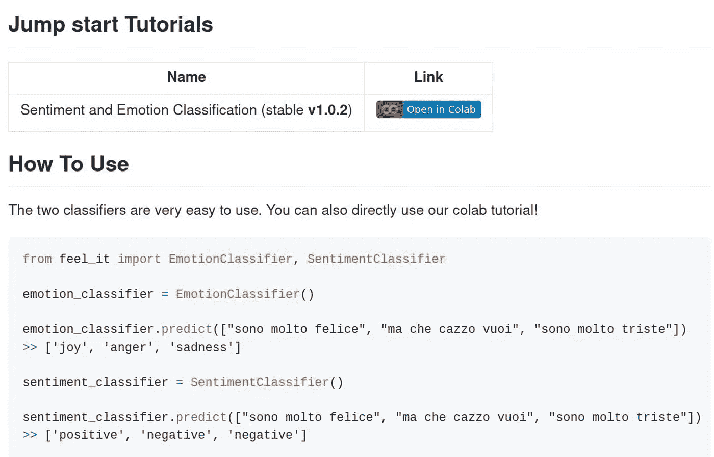
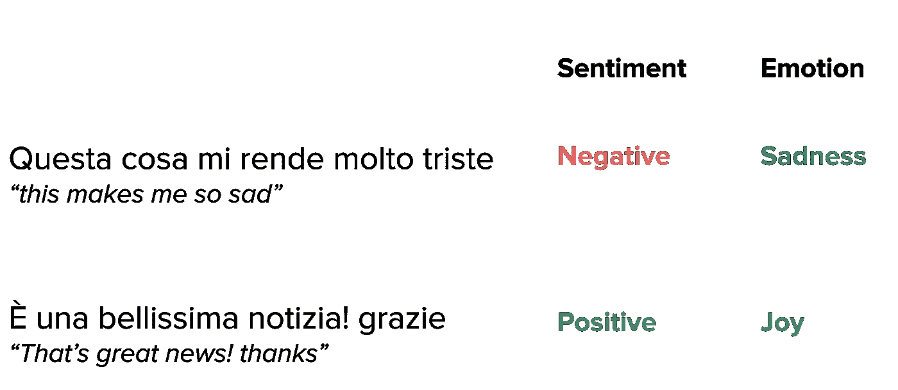
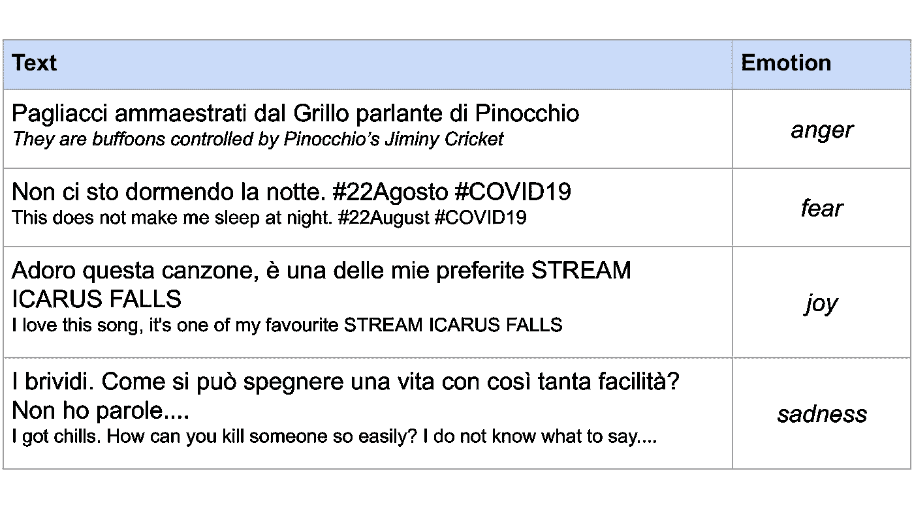
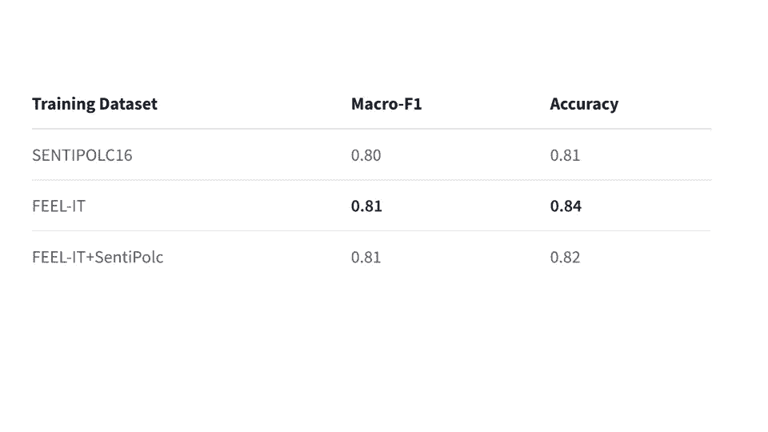

# 意大利语的情感分析和情感识别(使用 BERT)

> 原文：<https://towardsdatascience.com/sentiment-analysis-and-emotion-recognition-in-italian-using-bert-92f5c8fe8a2?source=collection_archive---------14----------------------->

## [思想和理论](https://towardsdatascience.com/tagged/thoughts-and-theory)

## 意大利语情感分析和情感识别的数据集和软件包。

我们搭建的情绪情感分类库截图。

# 情感分析和情感识别

识别文本中的情感是更好地理解人们谈论某事的基础。人们可以谈论一个新事件，但正面/负面的标签可能还不够。被某件事激怒和被某件事吓到，区别很大。这种差异就是为什么在文本中考虑情绪和情感是至关重要的。

有很多关于英语情感分析和情感识别的研究。在谷歌上快速搜索会给你带来不同的可能算法，这些算法可以为你处理情绪/情感预测。但有些语言缺乏数据，其中一种语言是意大利语(但有一些工作，例如 Sprugnoli，2020)。

所以我们([黛博拉](https://dnozza.github.io/)、[德克](http://dirkhovy.com/)和[你真正的](https://federicobianchi.io/))试图提供这个问题的解决方案。我们为意大利情绪和情感预测创建了一个新的数据集，并对 BERT 模型进行了微调。

在这篇博文中，我们描述了我们创建这个新数据集的经历，解释了我们做的一些事情和我们的结果。我在这里描述的内容也可以在同行评议的研究论文中找到:

费德里科·比安奇、德博拉·诺扎和德克·霍维(2021)。 **FEEL-IT:意大利语的情感和情绪分类**。第 11 届主观性、情感和社交媒体分析计算方法研讨会。

由于这些方法的可用性对社区至关重要，您可以在网上找到:

*   [我们的 python 包](https://github.com/MilaNLProc/feel-it)
*   [我们的拥抱脸情感模型](https://huggingface.co/MilaNLProc/feel-it-italian-sentiment)
*   [我们的拥抱脸情感模型](https://huggingface.co/MilaNLProc/feel-it-italian-emotion)

# 感觉:意大利语的情感和情绪分类

## 为情绪和情感识别建立新的数据集

当创建一个新的数据集时，我们需要解决的一个问题是，它需要代表领域。一个人不可能收集两天三个关键词的推文。收集的推文过于依赖于领域，使得训练的模型不够通用，无法应用于不同的领域。

相反，我们采取了不同的方法:我们决定每天收集 1000 条与 Twitter 上的热门话题相关的推文。通过这种方式，我们每天都能获得最相关的推文，而且因为每天都有新的话题，我们收集了很多不同的东西。这种方法让我们获得了一个数据集，其中包含了从足球比赛到政治等广泛话题的推文。

然后，我们用情绪来注释推文，排除那些没有可识别情绪的推文。最终，我们得到了 2037 条带注释的推文:912 条**愤怒**，103 条**恐惧**，728 条**喜悦**，294 条**悲伤。**

虽然这个数据集并不庞大，但正如我们所说的，它涵盖了广泛的不同主题，并在更广泛的情绪和情感分类任务中非常有用。

您可以在下表中看到一些带注释的推文示例(以及英文翻译):

在我们的数据集中，一些带有情感注释的推文的例子。

正如你所料，这个过程在注释方面的成本很高，因为我们丢弃了大部分推文。然而，它具有非常高的精确度，因为我们从广泛的主题中收集了推文，并且我们有精确的注释。

## 微调(嗯)伯特(o)

作为最近预训练时期的标准，我们用我们提出的数据集微调了 BERT 模型。BERT 是自然语言处理中最流行的神经结构之一。微调 BERT 允许我们有一个健壮的分类模型来预测我们的标签。微调是允许我们调整 BERT 模型的权重来执行我们的分类任务的操作。

对于许多语言，有许多不同的 BERT 模型(参见 Nozza et al .，2020 的综述和 [BERTLang](http://bertlang.unibocconi.it/) )。这里，我们使用 [UmBERTo](https://github.com/musixmatchresearch/umberto/) ，一个非常高效的意大利 BERT 模型。特别是，我们微调了在[通用抓取](https://huggingface.co/Musixmatch/umberto-commoncrawl-cased-v1)数据集上训练的 UmBERTo 模型。

## 情感分类

为了评估我们的数据集和情感分析模型，我们将我们的 FEEL-IT UmBERTo 与另一个数据集上的相同模型进行了比较: [SentiPolc16](http://www.di.unito.it/~tutreeb/sentipolc-evalita16/) 。两个模型都根据各自的数据进行了微调。

SentiPolc 带有一个训练集和一个测试集。因此，我们评估了下面这个有趣的研究问题:是使用“感觉”好还是“感知”好？

我们在 SentiPolc 的测试集上对 FEEL-IT 和 test 进行了微调，并将其与 SentiPolc 的训练集上的微调和 SentiPolc 的数据集上的测试进行了比较。请注意，在训练集中使用 SentiPolc 的模型应该有很大的优势，因为我们希望训练和测试是相似的。在下图中，你可以看到结果。

在 senti pol 16 测试集上使用 FEEL-IT 和 senti pol 16 作为训练集的比较结果。使用感觉-它更好。截图来自我们的 HuggingFace 知识库。

然而，这些结果表明，使用 FEEL-IT 比使用之前最先进的数据集 SentiPolc 要好得多。

## 情感分类

现在，除了我们的感觉之外，Twitter 上没有情感分类的数据集。因此，我们运行了一个简单的交叉验证，表明一个微调的翁贝托模型可以让我们达到 **0.71** 宏 F1！那是一个极好的结果！

## 创建 Python 库:感受一下

我的一个爱好是写代码，我试着做一些其他人可以使用的库。因此，黛博拉和我一直在开发一个[小库](https://github.com/MilaNLProc/feel-it)，它包装了 HuggingFace 的内部 API，为情绪和情感预测提供了一个简单的接口。

我们的库超级好用！:)

这个库的好处是，它允许你用很少的编码工作进行快速的情感和情绪分类:你可以加载你的熊猫数据帧，提取文本，将其传递给库，并得到结果。这正是我们现在要做的。

首先要做的是: **pip install -U feel-it** 在命令行中:)

下面是我们将要使用的小文件:

现在，让我们导入我们的分类器。包装器将为您处理模型的下载。

现在，让我们开始预测吧！我们只需要使用我们感兴趣的分类器的预测方法。分类器将句子列表作为输入——在本例中，我们将从我之前展示的 CSV 文件中获取。

你看到了吗？有了我们建的库，用意大利语做感悟和情感分类超级容易！

## 参考

诺扎博士、比安奇女士和霍维博士(2020 年)。**那个什么【面具】？理解特定于语言的 BERT 模型。** *arXiv 预印本 arXiv:2003.02912* 。

比安奇，f .，诺扎，d .，&霍维，D. (2021)。 **FEEL-IT:意大利语的情感和情绪分类**。第 11 届主观性、情感和社交媒体分析计算方法研讨会。

斯普鲁尼奥利河(2020 年)。 **MultiEmotions-it:一个新的意大利观点极性和情感分析数据集。**第七届意大利计算语言学会议，CLiC-it 2020(第 402–408 页)。

## 承认

非常感谢黛博拉和德克对此的评论！