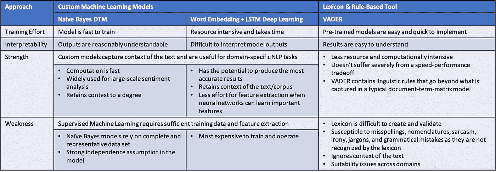
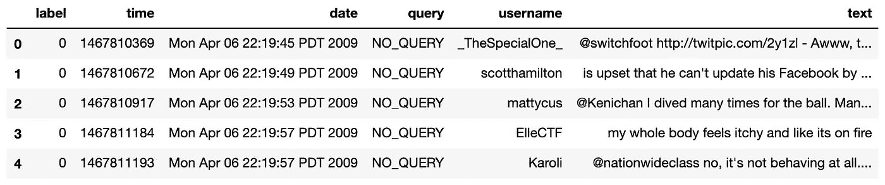
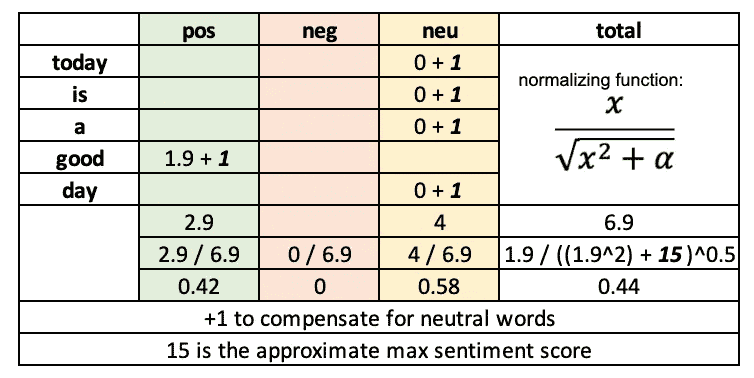
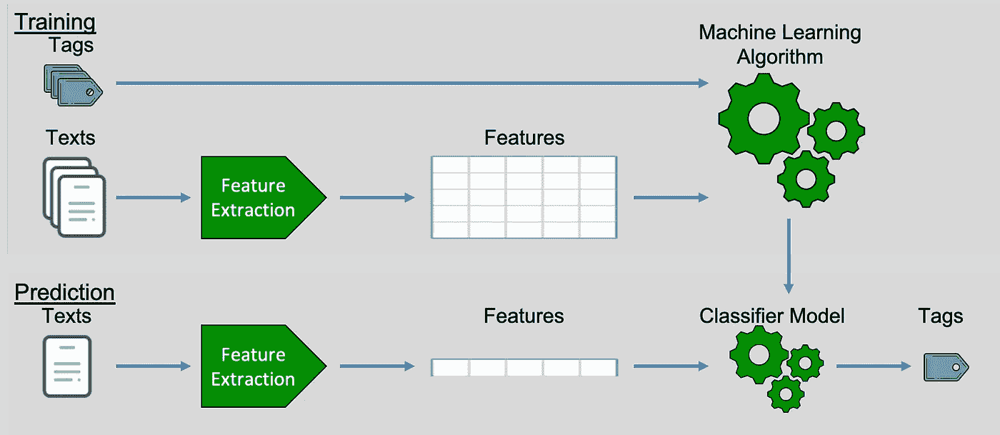
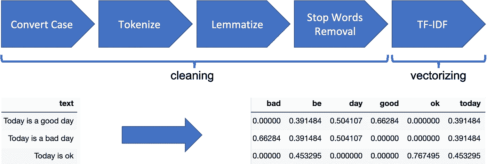
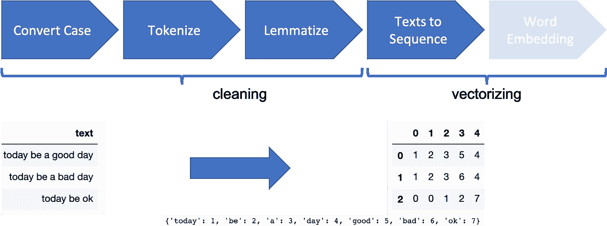
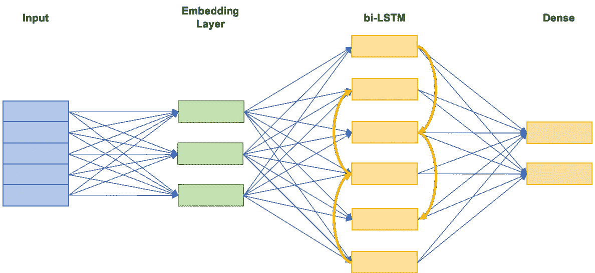

# 情感分析——比较 3 种常用方法:朴素贝叶斯、LSTM 和 VADER

> 原文：<https://towardsdatascience.com/sentiment-analysis-comparing-3-common-approaches-naive-bayes-lstm-and-vader-ab561f834f89?source=collection_archive---------5----------------------->

## 不同方法的优缺点研究(带有示例代码)

*注:本帖代码可在* [*这里*](https://github.com/kevinclee26/sentiment_analysis_classification) 找到


情感分析(图片由作者提供)

**情感分析**或**意见挖掘**，是 **NLP** (自然语言处理)的一个子领域，旨在从文本中提取态度、评价、意见和情感。受客户互动向电子邮件、聊天室、社交媒体帖子、评论、评论和调查等**数字格式快速迁移的启发，情感分析已成为分析组织必须执行的不可或缺的一部分，以了解他们在市场中的定位。需要说明的是，情感分析并不是一个新的概念。事实上，它一直是 **CRM** (客户关系管理)和**市场研究**的重要组成部分——公司依靠更好地了解他们的客户来发展和创新。最近的增长主要是由客户互动记录的可用性和可访问性以及处理这些数据的计算能力的提高所推动的。这一进步确实以有意义的方式使消费者受益。组织比以往任何时候都更愿意听取其成员的意见来进行改进。有许多方法可以进行情感分析。在本文中，我们将探索三种这样的方法:1) **朴素贝叶斯**，2) **深度学习 LSTM** ，以及 3) **预训练的基于规则的 VADER 模型**。我们将重点比较模型的简单开箱即用版本，并认识到每种方法都可以进行调整以提高性能。我们的目的并不是要详细说明每种方法是如何工作的，而是从概念上研究它们如何进行比较，以帮助确定何时应该选择一种方法。**

## 情感分析的背景

情感分析的目标范围从正面到负面。与其他 NLP 工作一样，它通常被认为是一个**分类**问题，尽管当精度很重要时，它可以被视为一个回归问题。情感分析过去是通过大量劳动力通读和人工评估文本来完成的。这种方法**成本高**并且容易出现**人为错误**。为了实现这一过程的自动化，公司寻求先进的分析方法来解决这一问题。情感分析的挑战在于人们表达和解释**情感极性**和**强度**的方式不同。此外，单词和句子可以根据上下文有多种含义(称为**多义性**)。虽然其中一些问题可以缓解，但像任何分析任务一样，几乎总是要在速度和性能之间进行权衡。我们回顾了三种通用方法，每种方法都有自己的优点和缺点:



优势和劣势分析

## 数据集介绍

除了突出显示**概念差异**之外，我们使用 [**感知 140**](https://www.kaggle.com/kazanova/sentiment140/code) 数据集来**基准**性能。这个数据集包含 160 万条推文和相应的情绪标签(正面和负面)。



原始资料

## VADER 词典和基于规则的情感分析工具

我们从使用流行的 [**VADER**](https://github.com/cjhutto/vaderSentiment) (价感知词典和情感推理机)工具的一个容易应用的方法开始。其核心是，VADER 使用全面、高质量的词汇(约 7500 个特征)和复杂的语言规则来产生情感分数。情感词典的构建和验证(统计上)在它的[发表的论文](http://comp.social.gatech.edu/papers/icwsm14.vader.hutto.pdf)中有详细的记载——这个巨大的成就怎么说都不为过。

```
// vader_lexicon.txt
...
good: 1.9
happy 2.7
awesome 3.1
bad -2.5
sad -2.1
catastrophic -2.2
...
```

如上面的例子所示，VADER 词典是一个字典，它为每个特征分配一个在-4(最极端的负面)和 4(最极端的正面)之间的**预先确定的**情感分数，这些特征可以是一个单词、一个首字母缩略词或一个表情符号。VADER 策划了一个基于**化合价的**词汇，能够检测情感的**强度**和**极性**两个方面。这与诸如否定、缩写、连词、助词、程度副词、大写、标点和俚语等强大的**修饰语**相结合，用于计算输入文本的分数。这些修饰符被实现为一个基于规则的模型，它改变初始价分值。慷慨的 VADER 开发者使它开源且易于使用:

```
# import SentimentIntensityAnalyzer class 
from vaderSentiment.vaderSentiment import SentimentIntensityAnalyzer# polarity_scores method of SentimentIntensityAnalyzer
SentimentIntensityAnalyzer().polarity_scores('Today is a good day.')# output: 
# {'neg': 0.0, 'neu': 0.58, 'pos': 0.42, 'compound': 0.4404}
```

VADER 产生一个得分`compound`，该得分**概括了**输入文本的情感强度。它是通过对词典中每个特征的效价分数求和来计算的，根据规则进行调整，然后归一化到-1(最极端的负面)和+1(最极端的正面)之间。[文档](https://github.com/cjhutto/vaderSentiment)将`compound`分数描述为“**标准化加权综合分数**”。此外，`pos`、`neg`、`neu`分数代表属于每个类别的文本的比例(例如基于规则的增强)。



VADER 计算

vader _ 情操 _ 分析. py

基于规则的模型易于理解，实现起来也很快，这使得它成为情感分析的一个很有吸引力的选择。它们取决于拥有强大的词汇和全面的语言规则。基于规则的模型的挑战在于词汇的创建和验证是**耗时的。他们努力应对可能很重要的词汇特征的无限组合的覆盖范围，以及当单词有不同含义时跨领域的适用性问题。此外，该方法仅评估**单个单词**，而忽略使用它们的**上下文**。这往往会导致错误，特别是对于**讽刺**和**讽刺**。**

使用 VADER —我们能够在我们的测试数据集上产生 **72%** 的准确率。VADER 认为，在社交媒体文本中常见的表情符号和首字母缩写词/首字母缩写词在该领域可以表现良好，但在其他领域可能表现较差。重要的是要注意，VADER 确实产生精确的极性分数，我们为了比较的目的将其分类为正或负。

*P.S .其他词汇还有*[](https://liwc.wpengine.com/)**(语言查询和字数统计)和* [*从新*](https://www.uvm.edu/pdodds/teaching/courses/2009-08UVM-300/docs/others/everything/bradley1999a.pdf) *(英语词汇情感规范)。**

## *自然语言处理的机器学习*

*虽然基于规则的解决方案已经被证明是有效和可靠的，但是它是严格的，并且受到可能过期的词典的限制。手动**创建**和**验证**一个全面的情感词典是困难的。相反，我们希望转向一种机器学习解决方案，通过算法将输入文本与相应的标签关联起来。在训练过程中，成对的文本和标签(情感)被输入到机器学习算法中，以创建能够对新文本进行预测的模型。值得一提的一个重要警告是，**监督机器学习**需要对数据进行标记，这可能意味着数据中的任何**主观性**和**偏差**都会在模型中得到反映。与预先训练的模型相比，定制模型给予**对输出的更多控制**，并且适用于特定的应用。*

**

*机器学习 NLP 文本分类过程*

## *朴素贝叶斯*

*[朴素贝叶斯分类器](https://en.wikipedia.org/wiki/Naive_Bayes_classifier)根据可能相关条件的**先验知识**使用概率进行预测。换句话说，它使用每个词汇特征在训练数据的正面或负面文本中出现的条件概率来得出结果。*

*NLP 的机器学习需要**预处理**从原始文本中提取特征。具体来说，它需要在算法能够处理它们之前将文本数据转换成数字表示，即**矢量化**。对于朴素贝叶斯，我们将构建一个简单的 **DTM** (文档-术语矩阵)用于模型消费，尽管还可以包括其他特征，如文本长度、发布时间/位置、命名实体等。DTM 倾向于产生一个**宽的特征空间**，因为整个语料库的词汇表中的每个独特的单词或短语都成为一个特征。我们包括一些数据清理步骤，以帮助**降维**和**模型**(分类器)**性能**。关于 NLP 数据预处理的更多信息可以在[这里](/what-you-need-to-know-about-data-preprocessing-and-linguistic-annotations-for-natural-language-439d42f2f355)找到。通过对 **TF** (术语频率)进行计数，并用 **IDF** (逆文档频率)对它们进行加权，来构建向量表示。我们可以使用 [**N-grams**](https://en.wikipedia.org/wiki/N-gram) (连续术语)来捕捉文本中的一些上下文，例如否定。N-gram 上下文是一个**钝器**，不能总是正确地捕捉表达式。它们还会给模型增加过多的功能，从而对模型产生负面影响。*

*我们应用以下转换来生成训练/测试数据:*

**

*朴素贝叶斯数据预处理管道(加权频率计数)*

*naive _ bayes _ 情操 _ 分析. py*

*朴素贝叶斯模型使用相当容易理解的特性。它支持**大规模**情感分析工作，因为训练所需的计算速度很快。然而，它也有一些明显的缺点。作为一个**概率分类器**，它高度依赖先验知识，因此训练数据必须完整且具有代表性。缺乏良好的训练数据会导致对看不见的数据或**不在词汇表中的**文本的推理不佳。如果数据中存在偏差或不平衡，它也会受到影响。此外，它假设特征是相互独立的，这意味着 DTM 中的词汇特征在所有句子中的贡献是相等的，而与文本中的相对位置无关。朴素贝叶斯 DTM 模型(具有 30 万个一元和二元特征)训练很快(< 7 分钟)。它产生了准确度为 **86%** 的训练分数和准确度为 **79%** 的测试/验证分数。*

**对于更长更宽的数据集，可以使用*[*Spark*](https://spark.apache.org/)*快速训练模型，这里使用* [*这里使用*](https://gist.github.com/kevinclee26/95ef550f53df7d6fae6c332425367028) *。**

## *深度学习*

*深度学习允许以更复杂的方式处理数据。一种 [**长短期记忆**](https://en.wikipedia.org/wiki/Long_short-term_memory) 模型，或称 LSTM，是一种[](https://en.wikipedia.org/wiki/Recurrent_neural_network)**【RNN】递归神经网络，用于处理[](https://en.wikipedia.org/wiki/Temporal)**数据。既然我们认为一个句子中特征(词)的顺序是有意义的，这就是我们使用的神经网络架构。*****

*****深度学习在计算上是昂贵的，并且在高维、稀疏向量的情况下做得不好(**性能差**和**收敛慢**)。当我们从原始文本中提取特征用于模型训练时，我们需要将它们表示为**密集**的向量。一种这样的技术是将每个文本转换成数字的序列，每个数字映射到词汇表中的一个单词。更进一步，我们需要使用**单词嵌入**将具有相似用法/含义的单词映射到相似的实数向量(而不是索引)。如果没有单词嵌入，模型会将单词的索引号误解为有意义。单词嵌入将所有单词放入一个多维向量空间，因此它们的相似性可以通过**距离**来测量。使用开源预训练模型(如 [Word2vec](https://www.tensorflow.org/tutorials/text/word2vec) 、 [GloVe](https://nlp.stanford.edu/projects/glove/) 或 [fastText](https://fasttext.cc/) )或定制神经网络(**无监督** **学习**)模型来生成单词嵌入。当训练自定义单词嵌入时，它可以单独完成，也可以与手头任务的神经网络模型联合完成(作为附加层)。这是我们采用的方法，因为它倾向于导致**针对**数据的**上下文**以及**目标**的嵌入。与稀疏(几十万维)的文档术语矩阵相比，使用单词嵌入产生具有更少(几百)维的向量，同时捕捉语义相似性。单词嵌入被认为是深度学习挑战自然语言处理问题的关键突破之一。*****

*****我们应用以下转换来生成训练/测试数据:*****

**********

*****单词嵌入+ LSTM 数据预处理流水线*****

**********

*****文字嵌入 LSTM 建筑*****

*****word _ embedding _ lstm _ 情操 _ 分析. py*****

*****深度学习神经网络方法的一个大优势是，我们不必尝试和**设计特征**，因为神经网络将学习上下文和重要特征。然而，这是以**可解释性**为代价的——使得它在某些情况下成为一个显著的限制。此外，就计算时间而言，这是最昂贵的方法，特别是如果联合训练单词嵌入，因为它需要大的数据集。对于我们的数据集，单词嵌入 LSTM 模型(具有 61MM 参数)花了 20 个小时来训练。它确实产生了令人瞩目的训练分数 **96%** 的准确度和测试/验证分数 **80%** 的准确度。*****

## *****情感分析应用*****

*****如果做得正确，情感分析可以为任何组织提供巨大的价值。如今，组织使用情感分析来了解公众对其产品、服务和品牌的感受。这可以**指导营销策略**，**激励产品开发**，**告知政治活动**，**检测潜在的破坏性事件**。以下是一些经过验证的例子:*****

*   *****确定潜在的贬低者以提高净推广者分数(NPS) ( ***客户关怀/反馈分析*** )*****
*   *****快速评估客户参与度，以识别并解决负面客户体验，从而改善客户服务并提高回头率( ***票证分类*** )*****
*   *****监控和管理公众对该品牌的看法( ***品牌智能*** )*****

## *****总结和选择合适的工具*****

*****我们回顾了三种情感分析方法，每种方法都有自己的优点和缺点。在选择合适的方法时，需要考虑一些关键因素:*****

*   *****精确度和/或速度的公差是多少？如果速度优先于准确性，基于规则的解决方案可能是正确的解决方案。*****
*   *****培训数据的可用性和完整性？有了稳健的训练数据，**朴素贝叶斯模型**可能是正确的解决方案，因为它实现起来很快。*****
*   *****模型的可解释性有多重要？**如果准确性优先于模型可解释性，深度学习**可能是正确的解决方案。*****

*****并行运行多个模型进行比较并不少见。一旦部署，该过程应该包括一个反馈循环，以通知模型何时需要更新。*****

> *****我还致力于分享如何用并行计算更快地训练 NLP 模型的代码。如果你喜欢这篇文章，我邀请你跟我来，这样你就可以得到这个项目继续的通知。*****