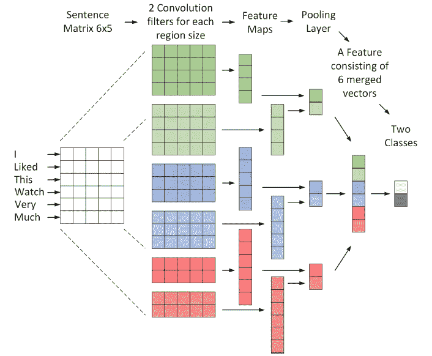
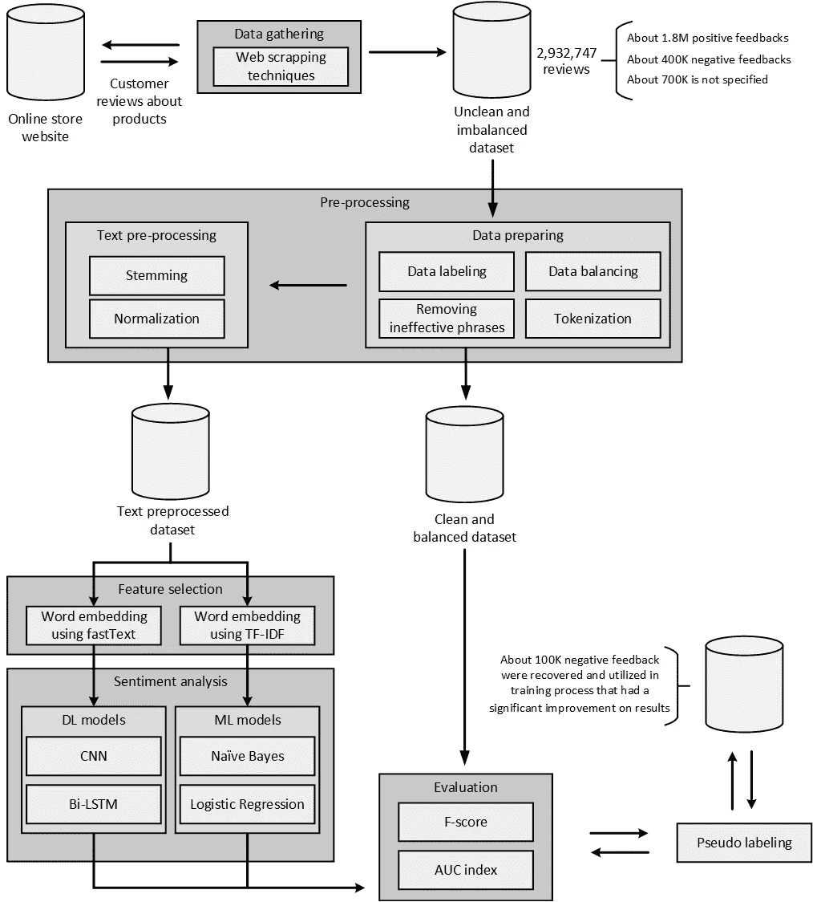
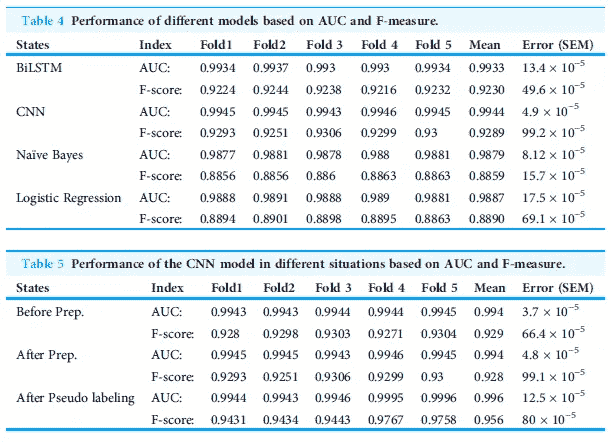

# 独立于预处理的在线商店情感分析

> 原文：<https://towardsdatascience.com/sentiment-analysis-of-an-online-store-independent-of-pre-processing-42c8d195ad08?source=collection_archive---------35----------------------->

## 当预处理困难或耗时时，您会怎么做？

在这篇文章中，主要目标是检查有多大可能减少对文本预处理的需求。下面，我将简单解释一下，您可以在这里找到详细信息:

<https://peerj.com/articles/cs-422/>  

一种用于情感分类的卷积网络结构。参考:10.7717/peerj-cs . 422/图 1

1.  摘要

情感分析在公司，尤其是商店中起着关键作用，提高确定客户对产品意见的准确性有助于保持他们的竞争条件。我们打算在伊朗最大的网上商店网站上分析用户的意见；迪吉卡拉。然而，波斯语是非结构化的，这使得预处理阶段非常困难，并且这是波斯语情感分析的主要问题。加剧这一问题的是缺乏用于波斯语预处理的可用库，而大多数库侧重于英语。为了解决这个问题，使用网络挖掘技术从 Digikala 网站收集了大约 300 万条波斯语评论，并使用 fastText 方法创建了单词嵌入。人们认为，考虑到单词在句子中的位置以及单词之间的关系，这将极大地减少通过 skip-gram 方法进行文本预处理的需要。使用 TF-IDF 与 fastText 并行创建了另一个单词嵌入，以比较它们的性能。此外，还比较了卷积神经网络(CNN)、BiLSTM、逻辑回归和朴素贝叶斯模型的结果。作为一个重要的结果，我们使用 fastText 和 CNN 获得了 0.996 的 AUC 和 0.956 的 F 值。在这篇文章中，不仅证明了在多大程度上可以独立于预处理，而且所获得的精度优于用波斯语所做的其他研究。避免复杂的文本预处理对其他语言也很重要，因为大多数文本预处理算法是为英语开发的，不能用于其他语言。由于其高准确性和预处理的独立性，所创建的单词嵌入在波斯语中除了情感分析之外还有其他应用。

2.方法学

代表所采取步骤的流程图。参考:[10.7717/peerj-cs . 422/图 4](https://doi.org/10.7717/peerj-cs.422/fig-4)

在这篇文章中，我们寻求分析伊朗最大和最知名的在线商店(Digikala)的网站上客户评论的感受。起初，语言问题被认为是一个重大挑战。波斯语文本预处理存在一些问题，如使用俚语，使用其他语言尤其是阿拉伯语的字母，短语之间缺乏明确的界限。为了解决这些问题，我们采用了 fastText，因为我们想检验这种方法的使用是否能够减少数据预处理的需要，并使语言处理更容易。在下文中，我们将检验这一假设，并将所得结果与其他算法和其他报告进行比较。另一个严重的限制是深度学习模型需要庞大的数据集，但大多数可用的波斯语数据集都很小，以至于无法在深度模型中使用。因此，必须从 Digikala 网站中提取丰富而庞大的数据集，这是通过网络挖掘方法进行的。应当指出的是，这一条旨在实现以下目标:

> 通过在波斯语处理或其他语言处理中实施快速文本等方法，调查减少文本预处理需求的情况；
> 
> 基于各种类型的数字商品收集全面的客户评论数据集，以创建用于与数字商品相关的各种作品的通用单词嵌入；
> 
> 与其他研究相比，Digikala 网站评论的情感分析具有更高的准确性。

能够访问具有丰富性和内容完整性的大型数据集对于训练深度模型是不可或缺的。大多数可用于训练深度模型和情感分析的数据集都是英文的。为了收集丰富的数据集，使用了网络挖掘方法，提取了 Digikala 网站上的波斯语评论。买家发布的评论表达了他们对购买和产品功能的满意程度。提交评论后，买家可以在“我建议”和“我不建议”选项中进行选择。这两个选项被提取并在模型中用作情感分析问题的标签。我们的目标是分析 Digikala 网站用户的意见，因此我们使用 web 挖掘库(如 Beautiful Soup)提取了与数字商品相关的部分的数据。Beautiful Soup 是一个 Python 包，用于解析 XML 和 HTML 文档，对于 web 抓取非常有用。这样就提取出了 Digikala 网站的数码商品评论，总共是 2932747 条评论。

3.结果

采用 TF-IDF 和 fastText 方法提取特征。BiLSTM 和 CNN 模型使用 fastText 输出，nave Bayes 和 Logistics 回归模型使用 TF-IDF 输出，最后在表 4 中比较了它们的准确性。根据该表，BiLSTM 和 CNN 模型的结果比其他模型更准确，CNN 给出了最好的结果。正如预期的那样，由于使用了 fastText 方法，对数据预处理的需求已经减少。换句话说，词干化和规范化方法并没有影响最终结果。为了更仔细地检查这一点，我们选择了 CNN 模型作为最佳模型，并且我们曾经使用预处理步骤和没有这些步骤的情况下执行了情感分析过程。预处理前的 AUC 和 F 值分别为 0.9943 和 0.9291，预处理后分别为 0.9944 和 0.9288。结果见表 5。在该表中,“预处理之前”的含义正好在词干提取和规范化步骤之前。换句话说，用于创建单词嵌入的方法可以在相同的空间范围内描述相同的单词，而不需要标准化字母，也不需要识别单词的原始词根。与预处理相反，伪标记法的使用显著改善了结果。使用伪标记后，AUC 和 F-score 的值提高到 0.996 和 0.956。

基于 AUC 和 F-measure 的不同模型的性能，以及基于 AUC 和 F-measure 的 CNN 模型在不同情况下的性能。参考:[10.7717/peerj-cs . 422/table-4](https://doi.org/10.7717/peerj-cs.422/table-4)和[10.7717/peerj-cs . 422/table-](https://doi.org/10.7717/peerj-cs.422/table-4)5

所建议的模型比先前在波斯语情感分析中使用预处理方法的模型具有更好的结果。例如，一些研究人员引入了预处理算法，并成功增强了机器学习算法的结果(Saraee & Bagheri，2013)。在研究中，使用朴素贝叶斯作为分类算法的预处理算法的 F 值是 0.878。在另一项研究中，对预处理和分类器算法的各种备选方案进行了检查，最佳结果由 SVM 分类器辅助，F 值为 0.915(阿斯加里安、卡哈尼和沙里菲，2018 年)。此外，一些研究试图利用最先进的深度模型，以减少对预处理的依赖，避免复杂的步骤(Roshanfekr，Khadivi 和拉赫马蒂，2017 年)。BiLSTM 和 CNN 算法在研究中的 F 值分别为 0.532 和 0.534。所有提到的文章的重点是在波斯两类情感分析的数字商品评论与本文相同。与其他研究和常用算法的比较表明，本文的结果不仅消除了对数据预处理的依赖，而且精度显著提高。

4.结论

该数据集包括从伊朗最大的在线商店 Digikala 网站的数字商品部分提取的大约 300 万条评论。使用基本的预处理方法来修改单词并对其进行标记。由于大部分数据集缺少标签，因此采用伪标签方法来改善结果。还使用随机过采样来执行数据平衡。发现波斯语数据预处理很困难，因此使用 fastText 方法来减少对数据预处理和单词嵌入开发的需求。嵌入被用作 BiLSTM 和 CNN 模型的输入。使用建议的模型，不仅所获得的结果非常令人满意，而且在波斯语中比其他报告更准确，而且没有与数据预处理相关的复杂性。评估了词干化和归一化对输出的影响，并揭示了所提出的方法不依赖于数据预处理。最后，除了机器学习和深度学习方法在情感分析中的比较之外，还比较了 TF-IDF 和 fastText 方法来创建单词嵌入。最好的结果与 fastText 和 CNN 有关。该模型的主要成就是减少了对数据预处理的需求。扩展的文本预处理库使得英文数据预处理更加方便和准确。然而，在其他语言中，由于缺乏适当的库，数据预处理非常复杂。在建议的模型上，证明了这种需求在很大程度上是可解决的(AUC = 0.996)，并且预处理步骤可以减少到初步的记号化过程。避免复杂的文本预处理对其他语言也很重要，因为大多数文本预处理算法是为英语开发的，不能用于其他语言。换句话说，独立于预处理步骤，所采取的步骤可能被实现或以其他语言实现相同的结果。此外，由于其高准确性，所创建的单词嵌入可以用于其他文本分析问题，尤其是与在线数字商品相关的问题。

GitHub:

<https://github.com/mosiomohsen/persian-sentiment-analysis-using-fastText-word-embedding-and-pseudo-labeling> 