# 新冠肺炎疫苗推文的情感分析

> 原文：<https://towardsdatascience.com/sentiment-analysis-of-covid-19-vaccine-tweets-dc6f41a5e1af?source=collection_archive---------12----------------------->

## [实践教程](https://towardsdatascience.com/tagged/hands-on-tutorials)

## 使用 TextBlob API 和 word cloud 可视化来综合有关全球疫苗接种工作和进展的论述

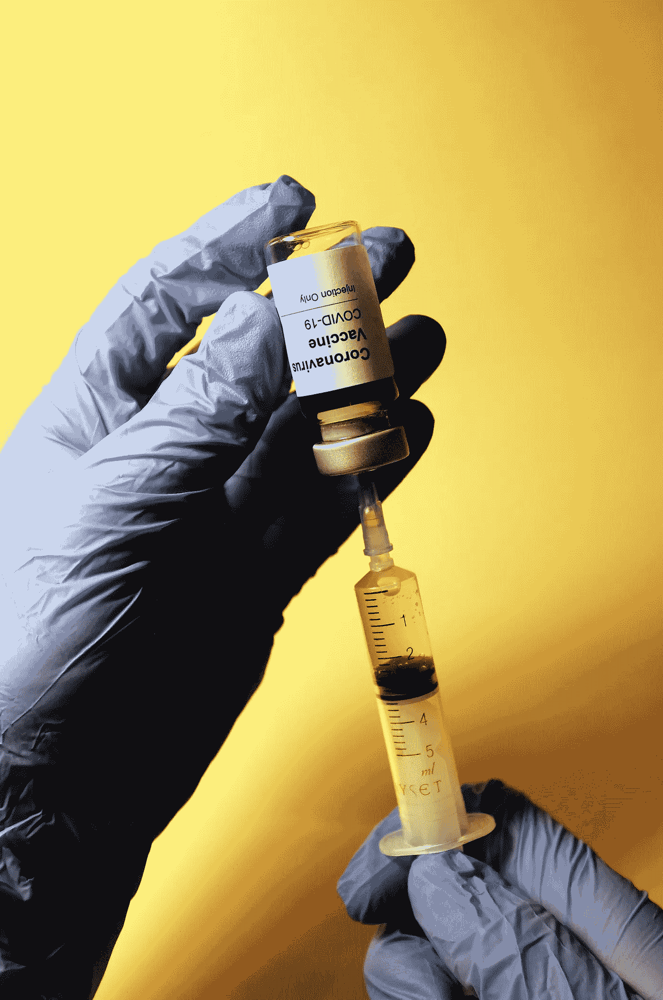

由[哈坎·努拉尔](https://unsplash.com/@hakannural)在 [Unsplash](https://unsplash.com/photos/9c3C_KojYMQ) 上拍摄

这是疾病、破坏、悲伤和绝望的漫长一年，但新冠肺炎疫苗的全球推广让许多人感到宽慰，并重新找到了乐观。关于疫苗接种进展、可及性、功效和副作用的讨论仍在继续，并且每天都在新闻报道和 Twitter 上传播。然而，作为在线用户，我们的可见性仅限于我们自己的回音室。因此，这个项目的动机是通过利用 Twitter 数据的力量来拓宽我对全球疫情状况的视角。

对于一个人来说，阅读和消化人们在推特上发布的关于新冠肺炎疫苗的所有信息几乎是不可能的。幸运的是，在自然语言处理(NLP)技术的帮助下，我们可以通过文本特征化、情感分析和词云可视化的方式来窥视极其复杂和广泛的讨论。

接下来的工作使用了一个名为“所有新冠肺炎疫苗推特”的数据集。数据是使用名为 Tweepy 的 Python 包收集的，如果用户成功创建了 Twitter 开发人员帐户并获得了访问凭据，就可以使用该包访问 Twitter API。在这种情况下，由于数据都是预先收集的，并以 10 MB 的表格格式存储在 Kaggle 上，所以任何希望得到它的人都可以访问它。这些数据包括与各种疫苗相关的推文，包括辉瑞/BioNTech、国药控股、科兴生物、Moderna、牛津/阿斯利康、Covaxin 和 Sputnik V。对于每种疫苗，使用相关的搜索词来查询最近的推文。

## 探索性数据分析

该项目的探索性数据分析阶段的主要目标是熟悉数据框的列，并开始头脑风暴研究问题。

从使用 pandas 加载数据的步骤开始，一些基本的数据框操作允许我们看到，对于每个 tweet，以下所有信息都是可用的:

*关于发推文的用户的信息* **用户名**:推文句柄
**用户位置**:发推文的人来自世界的哪个地方(注意:这里没有验证……“你的床”在技术上是可以接受的)
**user_description** :用户撰写的传记
**user_created** :他们创建 Twitter 帐户的时间
**user_followers** :关注者数量
**user_friends** :用户关注的帐户数量
**user_favourites** :用户喜欢的推文数量
**user_verified** :表明用户是否是知名人士

*关于 tweet 本身的信息* **id**:Twitter API
**date**的索引值:YYYY-MM-DD HH:MM:SS
text 形式的日期时间对象:tweet 本身(**最重要* *)
**hashtags**:tweet 中使用的 hash tags 列表(不带“#”字符)
**源**:哪台设备用于推文
**转发**:收集数据时收到的转发数
**收藏夹**:收集数据时收到的点赞数
**is_retweet** :指示推文是原创还是转发(布尔值)

在上面的列中，文本、日期、用户名、用户位置、标签、收藏夹和转发与此分析最相关。虽然推文是使用疫苗相关的关键字查询的，但推文中提到的特定疫苗并没有明确地作为一列包含在数据集中。因此，我们需要筛选疫苗参考文献，以便进行任何比较分析。

做任何 EDA 的第一步都是制作一些列(或特性)及其分布的图表。熊猫内置函数 df.describe()可以帮助我们一目了然地看到每个数值列的统计数据。

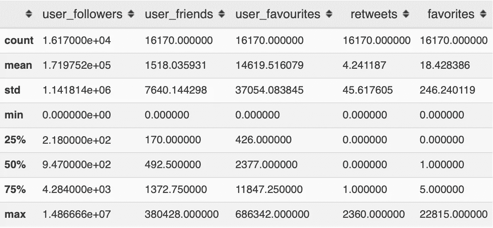

每个数字列的关键统计数据

从上图中我们可以看到，在这个疫苗推文中，普通用户有超过一千个朋友，并喜欢上千条其他推文，所以这些主要是活跃的 Twitter 用户，我们正在分析他们的推文。我们还可以看到，平均转发次数为 4 次，平均点赞次数为 18 次。然而，我们应该对这些统计数据有所保留，因为“std”(标准偏差)行向我们显示，正如人们可能想象的那样，数据集中有很多变化。

这个数据集中总共有 16，170 条推文(在完成项目时)，所以为了在开始之前直观地检查一些推文的可行性，我们可以看一看转发最多的推文。高转发数表明该推文可能足够丰富，可以广泛分享，或者在推特上足够相关，可以“病毒式传播”。通过对我们的数据框执行以下操作，我们可以预览转发次数最多的前 10 条推文:

```
df.sort_values(by='retweets', ascending=False)[['text', 'date', 'user_name', 'user_location', 'hashtags', 'favorites', 'retweets']].head(n=10)
```

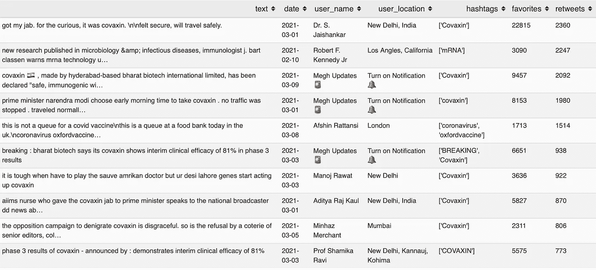

转发次数最多的 10 条推文

从上面的图片中，我们可以看到许多转发量最大的推文是印度用户在 3 月份发布的，具体指的是 Covaxin 疫苗。同样显而易见的是，转发量最高的 10 条推文中有 3 条来自一个名为“Megh Updates”的账户🚨似乎是新闻更新，而不是对疫苗的基于观点的评论。这是有道理的，因为信息性的推文通常比基于观点的推文更容易被转发。有趣的是，转发量最高的推文来自一位名叫 J Jaishankar 博士的用户，他是印度外交官和政治家，现任印度政府外交部长。他的推文只是更新状态说“挨了我的刺拳。出于好奇，它是 covaxin。感到安全，将安全旅行。”虽然这条消息似乎没有什么信息或观点，但因为 Jaishankar 博士在印度和全球政治领域是一个如此知名的人物，所以他的大量推特粉丝对他的状态更新反应积极是有道理的。

现在，我们可以做另一个快速检查，以了解在疫苗推出的早期阶段，Twitter 上的讨论是如何开始加速的:

```
df.sort_values(by=['date', 'favorites'], ascending=[True, False])[['text', 'date', 'user_name', 'user_location', 'hashtags', 'favorites', 'retweets']].head(n=10)
```

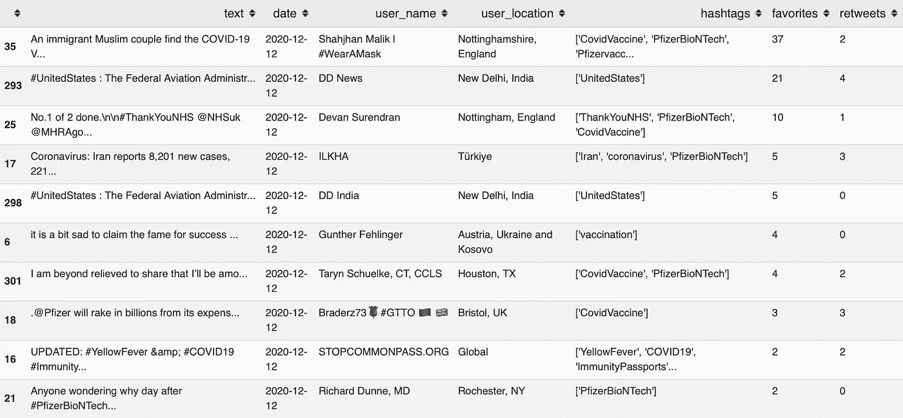

十大最早、最受欢迎的推文

上面的预览按照日期(升序)对数据集进行排序，然后按照哪些推文获得了最高的喜欢/收藏数(降序)进行排序。我们可以看到，2020 年 12 月 12 日，辉瑞-BioNTech 疫苗获得批准的第二天，Twitter 上开始出现关于新冠肺炎疫苗的讨论。大多数推文都提到了 PfizerBioNTech 疫苗，但这些推文显然没有获得大量受众，当天最受欢迎的推文只有 37 个赞和 2 个转发。

## 文本 Blob 情感分析

转到这项工作的情感分析部分，我们可以直觉地认为一些推文是信息丰富的，一些推文是有见解的，以将更大的话语划分为具有类似量化特征的独立推文集。这些功能可以使用名为 [TextBlob](https://textblob.readthedocs.io/en/dev/) 的 Python 包来获得，该包提供了一个用于 NLP 任务的 API，如词性标注、名词短语提取、情感分析、分类、翻译等。

要安装 TextBlob，请确保在终端窗口中执行以下两个命令:

```
$ pip install -U textblob
$ python -m textblob.download_corpora
```

TextBlob 的情感分析处理采用了两个关键指标:极性和主观性。极性得分是[-1.0，1.0]范围内的一个浮动值，它反映了一个陈述或段落的情感负荷。主观性是在[0.0，1.0]范围内的浮动，其中 0.0 非常客观，1.0 非常主观。让我们来看几个简单的例子:

```
>>> TextBlob("So excited to get my vaccine!").sentiment
Sentiment(polarity=0.46875, subjectivity=0.75)

>>> TextBlob("Is the vaccine painful?").sentiment
Sentiment(polarity=-0.7, subjectivity=0.9)>>> TextBlob("The Pfizer vaccine is now FDA approved").sentimentSentiment(polarity=0.0, subjectivity=0.0)
```

在第一个例子中，我们可以观察到 TextBlob 识别与陈述相关联的相对积极的情绪负荷，而它识别与第二个例子相关联的消极的情绪负荷。在第一个和第二个例子中，它正确地识别出表达他们对接种疫苗的感受的人是高度主观的。在第三个例子中，陈述被识别为极性中性且高度客观。这三个例子展示了 TextBlob 情感分析如何帮助我们获得定量的文本特征。

虽然 TextBlob 是在大型语料库上训练的，并采用了相当可靠的语言模型，但它的服务最适合于*从文本数据中识别*句法和语义特征，而不是*理解*文本。TextBlob 不是上下文感知的，所以从它的 API 返回的分数应该以一种促进进一步分析的方式被松散地解释。

作为 TextBlob 缺点的一个例子:

```
>>> TextBlob("I tested positive for COVID-19").sentiment
Sentiment(polarity=0.227272727, subjectivity=0.54545454)
```

TextBlob 被“阳性”这个词搞混了，因为它没有经过识别医学术语的训练。它把这个句子归类为带正电的和相当主观的，即使它实际上应该是消极的或中立的和客观的。当我们解释数据集中每条推文的分类时，了解这一点很重要。对于需要更多上下文感知语言模型的任务，我推荐查看`nltk`、`vader`、`sklearn`和`allennlp`。

让我们来看看 TextBlob 如何看待德克萨斯州州长格雷格·阿博特(Greg Abbott)的以下推文的情绪。

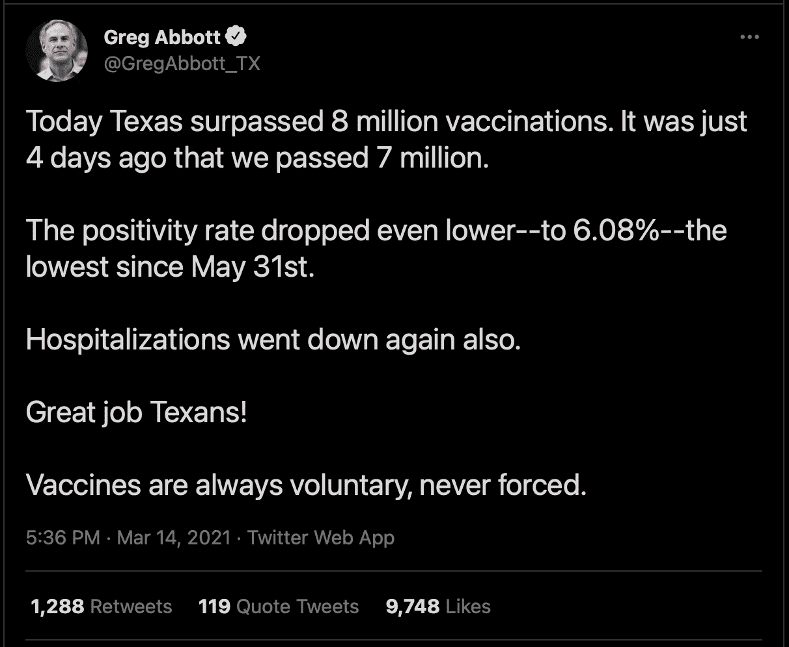

2021 年 3 月 14 日 Greg Abbott 的新冠肺炎状态推特截图(在推特上公开)

```
for sentence in blob.sentences:
    print(sentence)
    print("polarity:", sentence.sentiment.polarity)
    print("subjectivity:", sentence.sentiment.subjectivity)
```

遍历每个句子并检索极性和主观性得分，我们获得以下结果:

```
Today Texas surpassed 8 million vaccinations.
polarity: 0.0
subjectivity: 0.0

It was just 4 days ago that we passed 7 million.
polarity: 0.0
subjectivity: 0.0

The positivity rate dropped even lower--to 6.08%--the lowest since May 31st.
polarity: 0.0
subjectivity: 0.0

Hospitalizations went down again also.
polarity: -0.15555555555555559
subjectivity: 0.2888888888888889

Great job Texans!
polarity: 1.0
subjectivity: 0.75

Vaccines are always voluntary, never forced.
polarity: 0.15000000000000002
subjectivity: 0.2
```

前三句已被确定为具有中性和最大程度的客观性，这是有道理的，因为它们包含了关于疫苗推出和疫情状况的事实趋势。有趣的是，第四句话“住院率也下降了”，被贴上了带有轻微主观性的负面情绪标签。这可能是因为“住院”和“倒下”这两个词有负面含义，而且这里也没有数字或事实证据。如果州长阿博特说“住院率降低了 X %”，这将被认为是一个中立和客观的说法。“干得好，德克萨斯人！”另一方面，是一个积极的、高度主观的陈述的主要例子。

我们现在可以将 TextBlob API 应用到我们的 Twitter 数据上，对所有 16，170 条推文进行情感分析！

```
df['polarity'] = df['text'].apply(lambda x: TextBlob(x).sentiment.polarity)
df['subjectivity'] = df['text'].apply(lambda x: TextBlob(x).sentiment.subjectivity)
df.head()
```

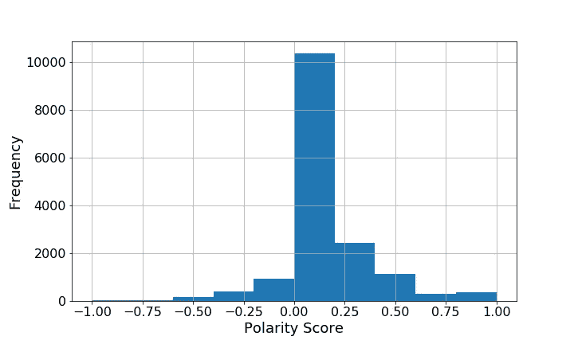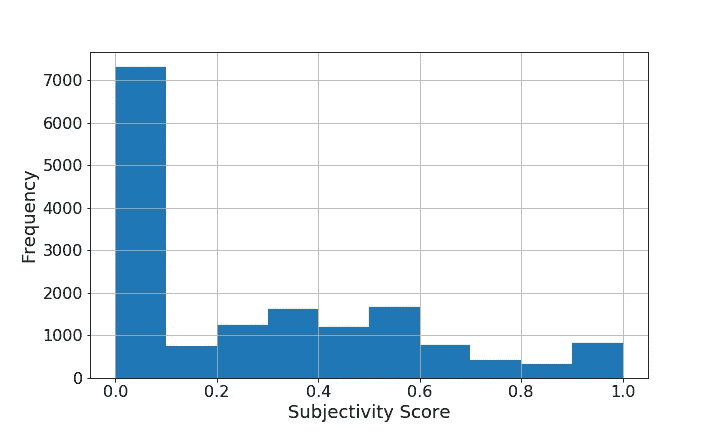

数据集中所有推文的极性和主观性直方图

上面的直方图描述了数据集中所有推文的极性和主观性得分的细分。数据集中的大多数推文似乎都是信息丰富的疫苗更新，具有中性的极性，没有主观性。然而，在极地推特中，带正电荷的推特略多于带负电荷的推特。我们可以推断，twitter 上的疫苗讨论总体上是乐观的，但如果能知道人们表达的是什么样的乐观情绪，以及人们可能表达的是什么样的焦虑或绝望情绪，那就更好了。

我们可以通过极性得分对数据帧进行排序，然后显示前 10 行来检查这些类型的推文:

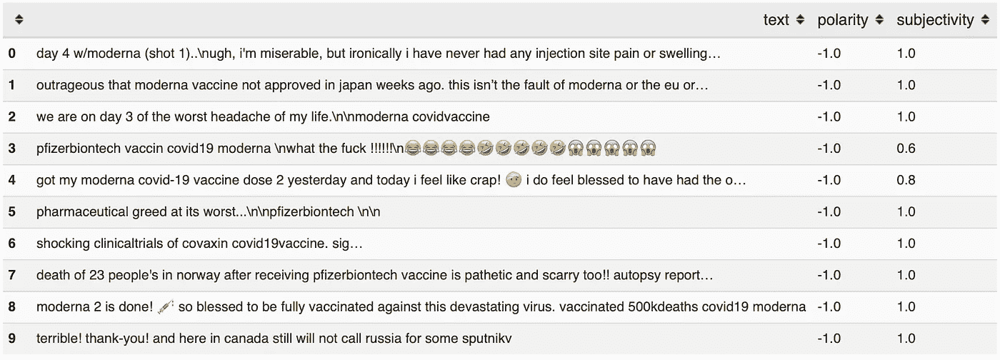

数据集中负面最多的 10 条推文

上面一条负面推文中一些值得注意的短语包括“啊，我很痛苦”，“令人发指的是……”，“我一生中最头疼的事”，“他妈的”，“我感觉像个废物”，“贪婪到了极点”，“太可怕了！”。在这里，表情符号没有被纳入情感得分，但如果表情符号足够突出，足以纳入分析，肯定有办法将表情符号转换为文本。TextBlob 情感分析的一个明显缺点是，它不认为“祝福”这个词有积极的含义。在第 8 行，当用户说，“如此幸运地完全接种了针对这种毁灭性病毒的疫苗”，单词“毁灭性的”可能混淆了语言模型。这个模型没有认识到疫苗是用来防御毁灭性病毒的，这是一件好事。

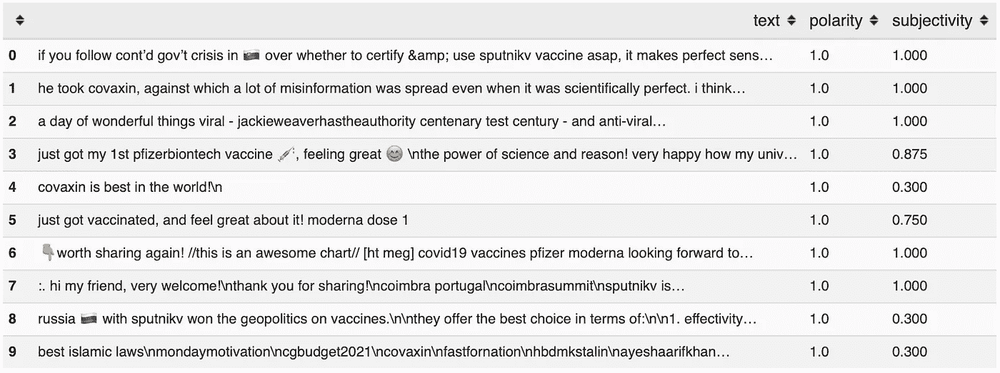

数据集中最积极的 10 条推文

同样，当我们检查前 10 个最积极的推文时，我们注意到许多高度主观的表达。使用最多的单词和短语包括“感觉棒极了”、“最好的”、“美妙的”和“完美的”。

## 时间序列分析

对于这个项目的下一个组成部分，我们将看看是否可以探索任何关于时间的趋势。首先，可视化数据集中所有推文的时间分布是有价值的。

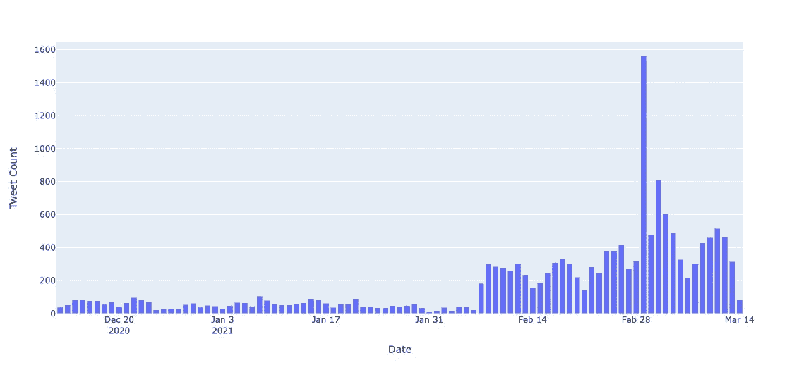

相对于时间的推文频率

在上图中，很明显，讨论的高潮发生在 3 月 1 日。经过更深入的调查，我得知印度总理纳伦德拉·莫迪在那一天接受了第一剂印度研发的新冠肺炎疫苗 Covaxin。对于印度人来说，这一特殊事件非常令人兴奋和振奋，这从他们在 Twitter 上的活动中可以反映出来。

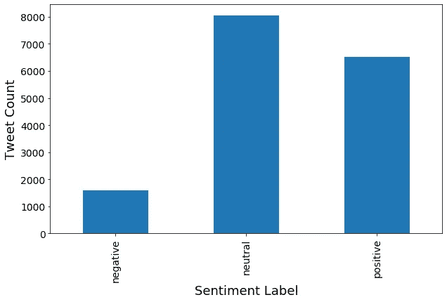

按情感标签分类的推文

在数据集中的所有推文中，大约一半被 TextBlob 指定为情绪中性(极性= 0.0)，另一半由 75%带正电荷的推文(极性> 0.0)和 25%带负电荷的推文(极性< 0.0)组成。

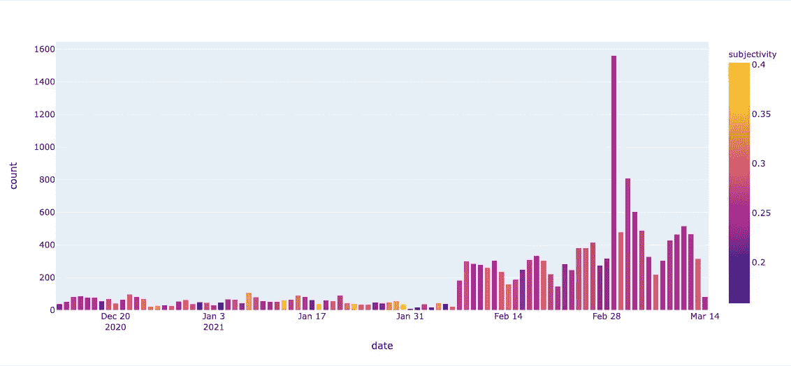

按日期汇总的推文的平均主观性得分

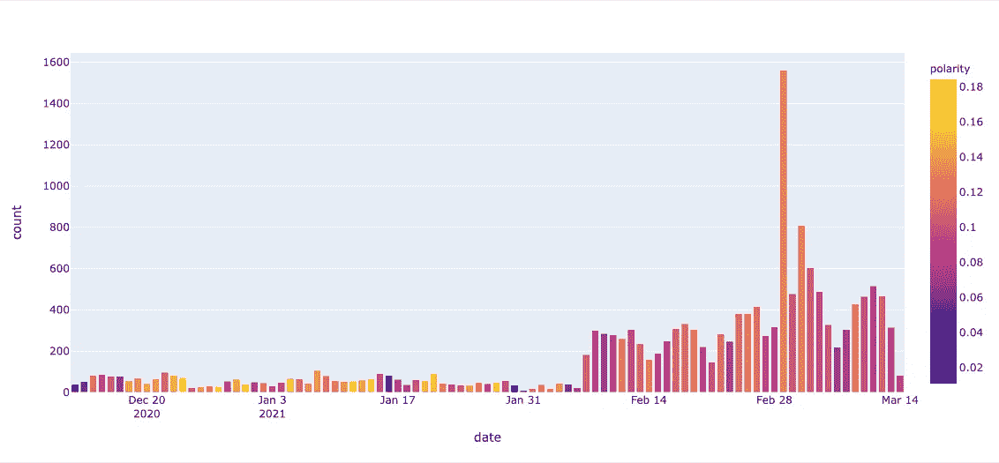

按日期汇总的推文平均极性得分

上面的图表提供了主观得分和极性得分随时间平均变化的快照。从上面的平均极性得分图中，我们可以假设 Twitter 上的话语在二月之前是乐观的，预期疫苗的分发。在 2 月和 3 月，疫苗的推广非常引人注目，人们开始在推特上发布与他们个人经历相关的状态更新。如果一个人有一个关于特定事件在时间上的影响的研究假设，或者如果他们希望获得关于一个事件的直觉，时间序列分析会很有帮助。也就是说，我们的数据涉及多种不同的疫苗，并且推文没有按位置划分，所以很难推断积极或消极的情绪到底意味着什么。为了进一步研究这一点，我们可以使用一种叫做单词云的可视化表示。

## 词云可视化

这个项目的最后一步是生成颜色编码的单词云，看看哪些单词代表了每种情绪。实现这一点的方法大致如下

*   执行更彻底的预处理，如拼写检查、拆分无空格短语等。
*   计算对数似然值
*   基于对数似然值生成合成语料库
*   生成更智能的单词云

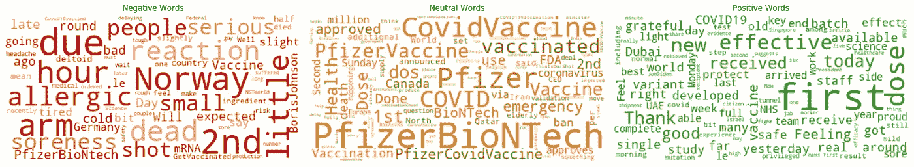

辉瑞生物技术公司:智能词汇云按情绪进行颜色编码

上面的词云描述了对于提到“Pfizer”和/或“BioNTech”的推文的每个情感，通常使用哪些词。积极的推文似乎来自刚刚接受第一次疫苗接种的人，或者对科学家和医护人员所做的工作表示感激的人，而消极的推文似乎来自在接受疫苗后遭受副作用、不良反应或全身不适的人。关于辉瑞疫苗的中性推文中使用的词语似乎类似于新闻标题。其中一些词包括“健康”、“宣布”、“FDA”、“批准”、“百万”、“说”和“疫苗接种”。

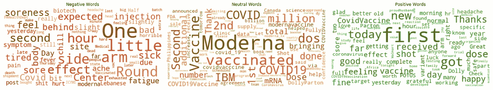

Moderna:智能词汇云，通过情绪进行颜色编码

Moderna 疫苗的词云产生了与辉瑞推特相似的见解。在带有负面词汇的词云中，有许多关于副作用、手臂酸痛、发冷、发烧、头痛、疲倦感和其他人们可能倾向于在 Twitter 上分享的轻微症状的引用。中性词包括“供应”、“百万”、“十亿”、“诊所”、“mRNA”、“加拿大”、“菲律宾”、“增加”、“总数”以及许多其他与新闻相关的术语。有趣的是，在中立的推文中经常提到 IBM，这可能与宣布 [Moderna 和 IBM 计划在新冠肺炎疫苗供应链和分销数据共享方面进行合作](https://newsroom.ibm.com/2021-03-04-Moderna-and-IBM-Plan-to-Collaborate-on-COVID-19-Vaccine-Supply-Chain-and-Distribution-Data-Sharing)有关。也有正面和中性的提及多莉·帕顿，[谁帮助资助了现代疫苗](https://www.nytimes.com/2021/03/02/world/dolly-parton-moderna-vaccine-covid.html)，后来接受了现代疫苗。与正面的辉瑞特定推文类似，正面的 Moderna 特定推文往往来自于在接受第一剂疫苗时表达感谢的用户。

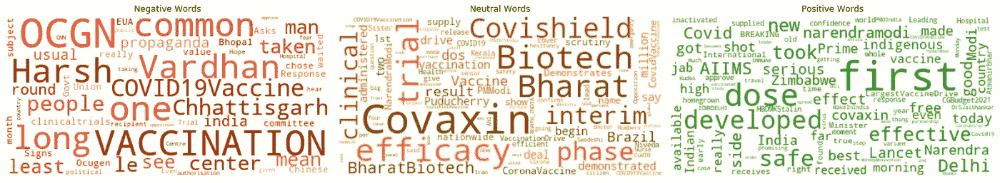

Covaxin:智能单词云，通过情绪进行颜色编码

最后，Covaxin 的“云”一词包含了许多对印度特定人物和地点的引用。对于负面关联的推文，“宣传”和“政治”这两个词似乎足够吸引人，足以引发进一步的探索。积极相关的推文包括大量提及总理纳伦德拉·莫迪。鉴于印度是一个有着强烈民族自豪感的国家，这些推文中有许多积极情绪是有道理的。此外，从文化的角度来看，这个数据子集与辉瑞和 Moderna 子集相比，存在语言上的细微差别。在印度，如果有人刚刚接种了疫苗，他们可能会说，“我接种了疫苗，”如果没有这些文字云可视化，我们可能不会意识到这一点！

## 扩展问题

我不相信一个项目会有一个明确的结束，但是，我们会在某个时候决定结束。带着这种心态，我喜欢通过头脑风暴来结束我有兴趣进一步探索的研究问题:

*   使用`tweepy` [API](https://docs.tweepy.org/en/latest/) 获取关于强生&强生疫苗的推文，并对其进行情感分析。
*   人们在使用哪些标签？标签的使用与更高的点赞数和/或转发数相关吗？
*   分析包含 URL 的推文的派别。有网址的推文主要是中性情绪吗？
*   经过验证的推特用户对新冠肺炎疫苗有什么看法？
*   人们对副作用有什么看法？哪种疫苗副作用最大？
*   将[新冠肺炎世界疫苗接种进展数据集](https://www.kaggle.com/gpreda/covid-world-vaccination-progress)与该情绪分析相关联，以监测随着推广的继续，人们对疫苗的态度是如何变化的。

## 结束语

如果你做到了这一步，非常感谢你的阅读！这项工作的代码可以在下面的 GitHub 资源库中找到:

[](https://github.com/sejaldua/covid19-vaccy-tweets-NLP) [## sejaldua/covid 19-vacci-tweets-NLP

### 新冠肺炎疫苗推特的情感分析。为 sejaldua/covid 19-vaccy-tweets-NLP 的发展做出贡献，创建…

github.com](https://github.com/sejaldua/covid19-vaccy-tweets-NLP) 

如果你想了解更多我的作品或与我联系，请随时访问我的[网站](https://sejaldua.com)、 [GitHub](https://github.com/sejaldua) 、 [LinkedIn](https://www.linkedin.com/in/sejaldua) 和/或 [Twitter](https://twitter.com/sejaldua) 。我很乐意连接！