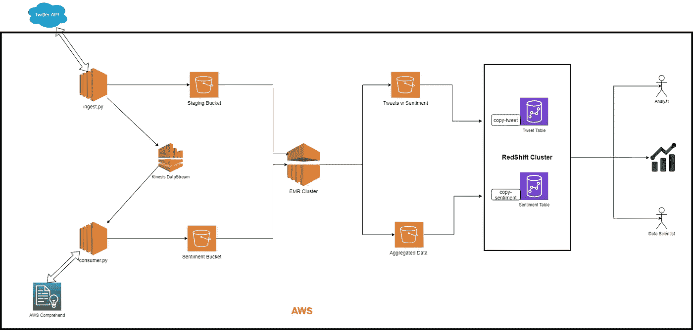

# 使用 AWS 通过特别批处理对实时推文进行情感分析

> 原文：<https://towardsdatascience.com/sentiment-analysis-on-live-tweets-with-ad-hoc-batch-processing-using-aws-f77036dc337?source=collection_archive---------25----------------------->

## 使用 AWS 实现的用于摄取的可扩展数据管道的系统设计，具有存储的 NLP。

https://github.com/hvp004/twitter-sentiment-analysis[(图片作者提供)](https://github.com/hvp004/twitter-sentiment-analysis)

我是一家制造公司的数据科学家，通常情况下，我的任务是为部署 ML 模型的数据平台构建计算单元、数据库模式和基础设施。通常，我的任务是边缘处理。

作为一个好奇的灵魂，我一直想在云上建立一个端到端的机器学习模型的可扩展的大数据管道。我通常处理控制器级别的数据或传感器数值数据。我想做一些不同于我日常工作的东西。即文本数据。

我[申请了 twitter 开发者 API](https://developer.twitter.com/en/apply-for-access) 。经过几天 Twitter 的反复询问，我被允许访问 Twitter 的开发者 API。这意味着我现在可以使用这个 API 获取实时推文流，并查询一周前的历史推文。

整个项目可以在 [Github](https://github.com/hvp004/twitter-sentiment-analysis) 上找到。

# **项目概述**

Twitter API 将用于从 Twitter 获取 tweet 数据。数据以 15 分钟的时间间隔提取，在指定的时间段内每隔 15 分钟回顾 100 条推文。tweet 文本和一些用户元数据存储在 staging 区域。将`tweet_id`和`text` (tweet 本身)推送到 Kinesis 数据流中进行进一步处理。

使用 Kinesis 数据流，对于每条推文，使用 AWS Comprehend ML as a service 进行情感分析。情感分析 API 以正面、负面、中性或混合类别返回文本的总体情感，并以最终结论作为标签。标签只是一个字符串，代表所有指定类别的最高概率。消费者使用这些结果并将数据写入情感桶。

在这里，每个 Kinesis 数据流最多包含 100 条推文。一旦摄取了数据，并且处理了所有 Kinesis 数据流，就使用弹性 Map Reduce (EMR)服务来处理数据。EMR 旨在使用 Hadoop、Spark framework 和 Hive 以完全托管的集群方式以分布式方式处理数据。我们可以通过 ssh 进入主实例，在集群上执行操作。使用`pyspark`的 EMR 脚本首先通过 AWS cli 从 S3 桶复制到 EMR 主实例中。EMR 从存储桶中加载阶段和情感数据，并使用`tweet_id`合并它们。然后，它基于 15 分钟的时间窗口执行聚合，以计算该时间段内每个情感类别的平均情感和总推文百分比。这样，聚合的数据可以很容易地可视化，而不必在每次用户想要查看分析时对数千条推文进行聚合。EMR 将合并结果的所有 tweets 数据存储在 s3 桶中。聚集的数据存储在单独的位置(不同的 s3 文件夹或不同的 s3 存储桶)。这样，我们就有了一个所有推文及其主流观点的事务视图，以及一个带有时间窗口的聚合结果的数据集市，该数据集市可用于可视化以时间为参数的数据。

AWS Redshift 是一个完全托管的数据仓库系统，其中的表是使用 SQL 命令制作的。这些表将保存存储在存储桶中的事务性和聚合数据。为了将存储在 s3 存储桶中的数据加载到红移数据仓库，使用了 COPY 命令。建立到红移集群的连接(SQL Workbench 或红移集群查询编辑器),并在集群上执行复制命令，以将数据从存储桶提取到表中。

EC2 实例上的 Grafana 用于可视化。

# 系统结构

该项目在 AWS 上运行，公开了一些 AWS 服务:

1.  S3:用于存储分期数据、情感数据、推特交易数据、聚合数据
2.  EC2:运行`ingest.py`和`consumer.py`。你也可以在自己的笔记本电脑上运行它们。这是可选的。
3.  EMR 集群:处理所有批量产生的数据。在将数据存储回 S3 之前，合并数据并运行聚合。
4.  红移集群:最终数据会以红移结束。
5.  AWS understand:为了从 tweet 文本数据中获取情感，使用了 AWS understand。这可以用本地 NLP 模型或带有 HTTP 端点的开源或企业版 ML 模型来代替。这里的领悟是通过`boto3` python API 使用的。

系统架构([https://github.com/hvp004/twitter-sentiment-analysis](https://github.com/hvp004/twitter-sentiment-analysis))(图片由作者提供)

这里，S3 用于每个处理单元的主存储。AWS S3 为平面文件提供了非常廉价的数据存储能力，具有高可用性和用例灵活性。

摄取与 NLP 工作流保持分离，因为 NLP 完全是一个独立的实体。这样，摄取就独立于 ML 工作流。这种解耦允许我们在不延迟数据获取的情况下，从摄取并行地一起运行多个 NLP 服务。

AWS Kinesis 作为一种临时存储机制，可以更快地检索下游组件和 NLP。数据一旦产生，就被消费者消费。根据对文本执行的分析类型，可以有多个消费者，并且所有消费者都是相互独立的。此外，如果任务失败，就处理和存储而言，在完全隔离的情况下再次运行它会更容易。

EMR 提供了一系列高性能 EC2 实例，并采用了 Hadoop Spark 等广泛使用的分布式处理框架。它有能力对万亿字节或千兆字节的数据进行数据处理。EMR 将数据写入 S3 桶，而不是直接写入红移，原因有几个。可能有许多不同的子系统想要使用经过处理和聚合的数据。S3 的存储比红移便宜得多，红移是按小时付费的。此外，S3 读/写比红移读更便宜，因为我们要为每个请求及其数据包大小付费。Redshift 的主要目标是提供数据的全貌，并能够更快地查询历史数据。红移的数据查询比 S3 快得多。因此，当该系统可能是具有许多微服务的更大架构的一部分时，S3 用于平衡成本。

一旦数据被加载到红移数据库中，像 Grafana 这样的数据可视化系统就可以提取数据并将其可视化。

# 安装和使用

我是 docker 的粉丝，因为它使我的生活变得简单，可以部署多个计算模块，而且我不必担心主机的环境。为了这个项目，我创建了一个`docker-compose``。我不会深入这个部分的细节，因为它已经在我的 [github 回购](https://github.com/hvp004/twitter-sentiment-analysis)中描述过了。

**仪表盘**

我用 grafana 主持仪表板，因为对我来说使用 grafana 进行 ay 项目是很自然的。它有一个丰富的插件集[和时间序列数据。我用它创建了一个快速仪表板。](https://grafana.com/grafana/plugins)

在 AWS 上配置 Linux/Windows 机器。确保它可以访问红移星团。在上面安装 Grafana。将其连接到红移星团，并开始可视化数据。

我用查询字符串`biden`跑了 4 天，收集了大约 33，000 条推文。

下面的交互式仪表板在第一行显示了每个类别的推文百分比，带有仪表盘。

在第二行中，我将 tweet 的总数显示为一个标签，以及时间轴上每隔 15 分钟收集的 tweet。

在最后一行，我展示了一个饼图，其中显示了该时间段内每个类别的平均情绪得分(NLP)及其时间线。

格拉夫纳仪表板[https://github.com/hvp004/twitter-sentiment-analysis](https://github.com/hvp004/twitter-sentiment-analysis)(图片由作者提供)

# **结论**

摄入依次进行。出现故障时，系统可能处于这样一种状态，即我们必须从最后一个分区开始再次运行摄取。它应该是并行的，因为以前的加载独立于当前正在进行的加载。

可能的解决方案:可以使用类似 Airflow 的调度程序来运行分区并行数据接收。

消费者作为一个独立的消费单位。它按顺序工作。它严重依赖于第三方 API(不属于本系统的 API)。因此，第三方 API 中的任何常规延迟都可能导致消费中的大量延迟，并且随着每个消费周期，随着生产者继续生产数据，数据可能会增加。

可能的解决方案:生产者和消费者数据包之间应该有 1:1 的关系。AWS Kinesis Firehose 是一个数据流传输系统。λ函数可以用于产生的每个数据流，它可以以无服务器的方式处理每个流。

此外，您可以使用类似 Airflow 的调度程序来运行摄取，从而定期运行摄取，使之成为一个定期的批处理过程。在设计上稍作改变，你也可以使用 spark stream 让它与实时推文情感分析一起工作。