# 情绪分析:预测一条推文是否是关于一场灾难

> 原文：<https://towardsdatascience.com/sentiment-analysis-predicting-whether-a-tweet-is-about-a-disaster-c004d09d7245?source=collection_archive---------13----------------------->

## [自然语言处理笔记](https://towardsdatascience.com/tagged/nlpnotes)

## 探索自然语言处理

由 [Joshua Hoehne](https://unsplash.com/@mrthetrain?utm_source=medium&utm_medium=referral) 在 [Unsplash](https://unsplash.com?utm_source=medium&utm_medium=referral) 上拍摄的照片

## 介绍

我经常采用机器学习优先的方法来分析数据，但在探索了我的 Github 之后，我意识到我没有太多的探索笔记本，特别是在自然语言处理(NLP)领域，这是我热衷于关注的领域——更具体地说，是感兴趣的对话式人工智能。

 [## 面向 NLP 爱好者的 7 个免费在线资源

### 一定要将它们加入书签

pub.towardsai.net](https://pub.towardsai.net/7-free-online-resources-for-nlp-lovers-26b1e0bba343) 

情感分析任务包括使用自然语言处理(NLP)和机器学习(ML)的技术对主观数据进行解释和分类。由于世界上的许多数据都是数字格式的，许多企业正在利用情感分析的力量来收集关于品牌声誉、客户对各种产品的想法等更多信息。

 [## 情感分析入门

### 自然语言处理专业课程 1 第 1 周笔记

towardsdatascience.com](/getting-started-with-sentiment-analysis-731531ec880d) 

## 问题陈述

一段时间以来，我一直在用机器学习和 NLP 脚本探索特定的数据集。然而，我从来没有用实际的探索性数据分析(EDA)和数据可视化真正探索过数据集，所以我认为专注于同一个项目来发现一些我以前从来不知道的关于数据的见解是明智的。

> Twitter 已经成为紧急情况下的重要沟通渠道。智能手机的普及使人们能够实时宣布他们正在观察的紧急情况。正因为如此，越来越多的机构对有计划地监控 Twitter 感兴趣(即救灾组织和新闻机构)。但是，人们并不总是清楚一个人的话是否实际上是在宣布一场灾难。举个例子:
> 
> 作者明确地使用了“闪亮”这个词，但它是隐喻性的。这对人类来说是显而易见的，尤其是有了视觉辅助。但是对机器来说就不那么清楚了。
> 
> 在这场比赛中，你面临的挑战是建立一个机器学习模型，预测哪些推文是关于真正的灾难，哪些不是。你可以访问一个由 10，000 条推文组成的数据集，这些推文都是经过人工分类的。【 ***来源****:*[*Kaggle—自然语言处理带灾推文*](https://www.kaggle.com/c/nlp-getting-started/overview)*】*

链接到使用此数据集完成的其他文章:

*   [用机器学习预测推文情绪](/predicting-tweet-sentiment-with-machine-learning-3599c8add259)
*   [使用 Word2Vec 嵌入预测推文情感](/predicting-tweet-sentiment-with-word2vec-embeddings-67aace9b019d)
*   [系统地改进你的机器学习模型](/systematically-improving-your-machine-learning-model-41d327adf347)

> **注意**:本文中用于生成可视化效果的所有代码都可以在 Github 上找到。

 [## kurtispykes/twitter 情绪分析

### 通过在 GitHub 上创建一个帐户，为 kurtispykes/twitter 情绪分析开发做出贡献。

github.com](https://github.com/kurtispykes/twitter-sentiment-analysis/blob/master/notebook/03_kpy_data_exploration.ipynb) 

## 数据分解

典型的 Kaggle，我们的数据集已经分为训练集和测试集。训练集由 **7613 行**和 **5 列**组成，而测试集由 **3263 行**和 **4 列**组成——缺少的列是目标列，我们要预测的。因为我们只是探索数据，所以我将训练和测试数据结合在一起进行进一步分析。

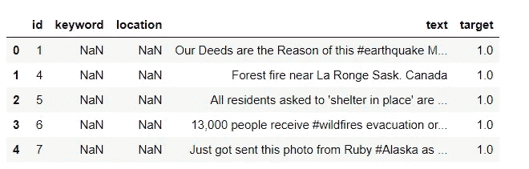

作者图片

## 简单探索性数据分析

在处理分类任务时，我喜欢检查的第一件事是目标标签，因为我想从一开始就知道我们是否有不平衡的分类任务——有关不平衡分类的更多信息，请参见[过采样和欠采样](/oversampling-and-undersampling-5e2bbaf56dcf)。

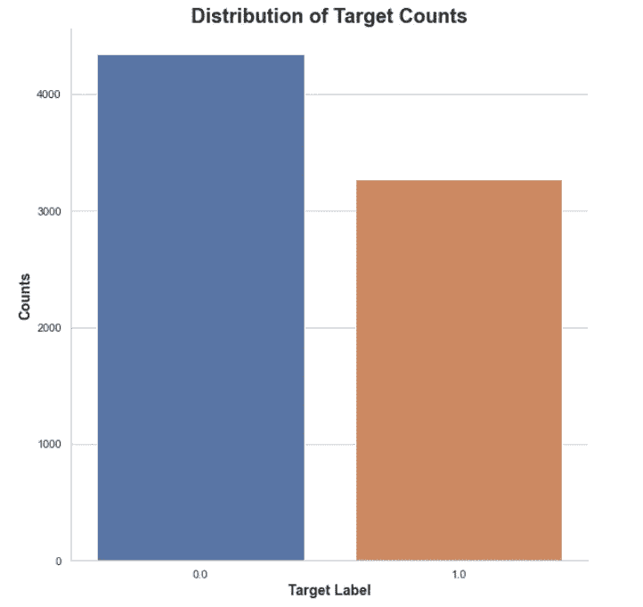

作者图片

在我们的数据集中有一个向负面类别(0 → tweet 不是关于灾难)的不平衡。了解这些信息非常重要，因为这可能会对我们创建的最终分类器产生严重影响。例如，分类器可能倾向于预测主要类别，这反过来意味着我们的分类器具有高精度。对于这些类型的问题，这是一个误导性的度量，因为它没有反映分类器正在采取的行动，所以当它被部署到现实世界的环境中时，它将是无效的。在我们的例子中，这种不平衡是不可接受的，但仍然是值得注意的。

接下来，我通常想知道数据集中每个要素缺失的数据量。许多机器学习算法无法处理缺失数据，因此我们需要一种方法来在构建分类器之前处理这些实例(取决于我们使用的分类器)——了解更多关于[处理缺失数据](/handling-missing-data-f998715fb73f)的信息。

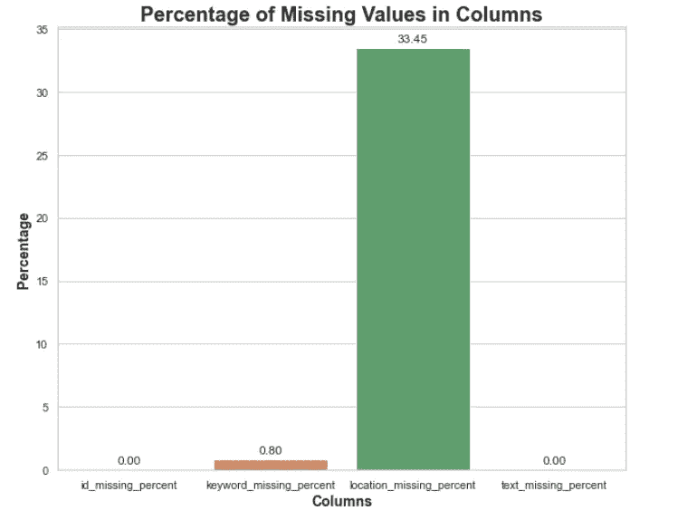

作者图片

在训练和测试集中，location 列中有 33.45%的值缺失，这是非常显著的。由于这些是推文的位置，Twitter 上的用户可以选择关闭他们的位置，我在想我们可能会估算一些东西来表明位置丢失。此外，由于大量位置丢失，我们可以考虑从我们的管道中完全删除此功能。

推文的前 10 个位置列出了国家和城市，所以我将城市转换为国家，并计算每个国家的推文数量。

**注意**:数据集中有 **4521** 个唯一地点，但是，我只把出现在前 10 个地点的城市转换成国家。因此，很可能在数据集的其余部分仍有一些城市，如果我们保留这一特征，这是需要考虑的事情。

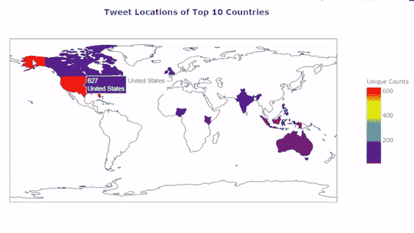

作者 Gif

在同样的地点话题上，我认为找出是否有某些地点更有可能出现灾难推文会很有趣。考虑到这一点，我创建了一个可视化的图表，显示了来自前 10 个地点的灾难性推文的百分比。

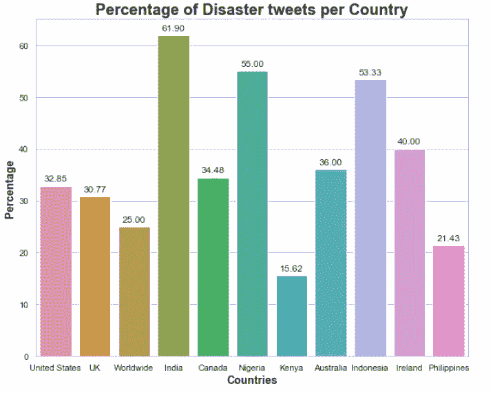

作者图片

新手数据科学家不常问的一个非常重要的问题——我无意贬低有志之士，尤其是因为我不会责怪你们任何人没有问。像这样的事情在我们在线学习的许多课程中通常不会教授，只能通过动手实践来学习——数据究竟来自哪里，如何收集等等。这些类型的数据查询非常重要，原因超出了本文的范围，但在将来，我一定会再次访问它。

尽管如此，其中一个原因是，您可能希望验证从收集源获得的数据。例如，我知道这些数据是由一家名为 figure-eight 的公司创建的，但我不确定这些数据是如何标记的，以及是如何创建的。我可以向你保证的一件事是，如果人类参与到这个过程中，总会有很大的出错空间，因为我们可能会疲劳——当然，计算机也会出错，但希望你明白我的意思。

由于我不知道数据是如何收集或标记的，我的第一个想法是考虑我们的数据集中是否有重复的推文。结果如下:

*   198 在训练和测试数据中出现重复的 tweets
*   这些副本中的 110 个在训练数据中
*   **88** 是来自测试数据的重复推文

这让我很担心。如果数据中存在重复，那么如果人类标记了实例，则可能存在不同标记的重复标签。这个想法是对的。

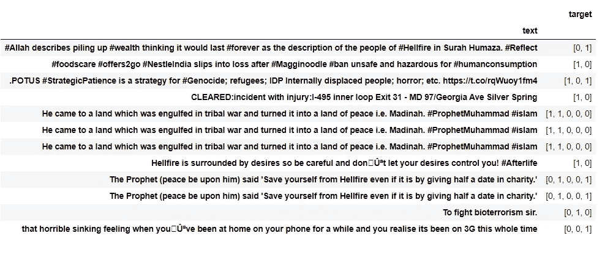

作者图片

Kaggle 有一个看不见的数据集，它用来评估你在私人排行榜上的位置，有可能标签也贴错了。在商业环境中，如果对分类器结果有严重影响，您会想要手动重新标记它们，那么这肯定是需要调整的。然而，为了安全起见，我手动更改了这些标签以适应正确的类别。

在处理文本时，很难在传统的图(例如条形图和线图)上将其可视化。相反，我们可以使用[单词云](https://amueller.github.io/word_cloud/)来可视化数据中出现的常见单词。我用这种方法将与灾难联系最紧密的关键词特征可视化…

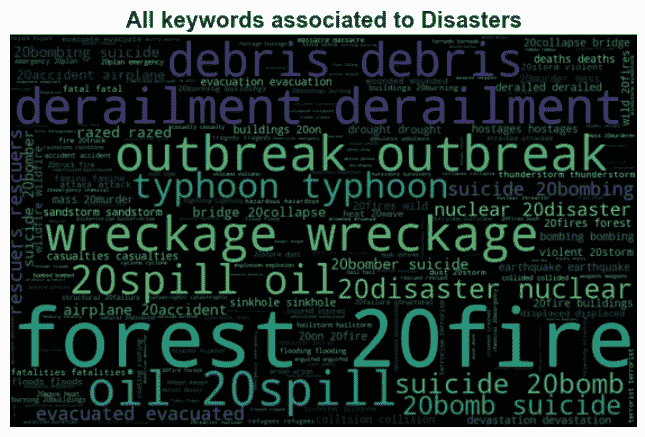

作者图片

而那些与灾难无关的…

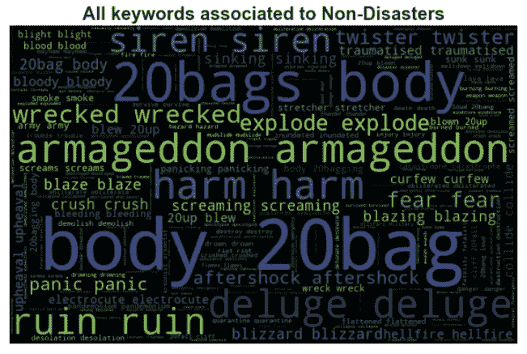

作者图片

在大得多的文本中显示的单词是那些在数据集中具有更频繁计数的单词。关于新实例，我们可以做一个天真的假设，任何包含关键字“爆发”和“残骸”的实例都可能是关于灾难的，而包含“世界末日”和“尸体”的实例可能是非灾难的。

还有许多其他因素需要考虑。例如，如果有人正处于灾难之中，他们会写更长的推文还是更短的推文，以及那个人会使用更多还是更少的标点符号。这些想法可以用统计数据来捕捉。

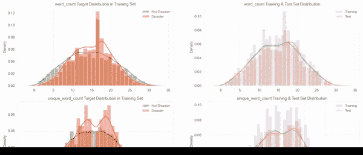

作者 Gif

## 做预测

为了确定我将继续开发哪个模型，我构建了各种不同的模型，仅使用`text`作为输入，并使用 5 重分层[交叉验证](/cross-validation-c4fae714f1c5)测试每个模型。我使用的模型是:

*   [支持向量机](/algorithms-from-scratch-support-vector-machine-6f5eb72fce10)
*   [逻辑回归](/algorithms-from-scratch-logistic-regression-7bacdfd9738e?source=collection_tagged---------5----------------------------)
*   [朴素贝叶斯分类器](/algorithms-from-scratch-naive-bayes-classifier-8006cc691493?source=collection_tagged---------1----------------------------)
*   随机梯度下降分类器
*   [随机森林](/random-forest-overview-746e7983316)
*   LightGBM
*   双向 LSTM

为了将文本从自然语言转换成计算机语言——仅仅是数字——我使用了 3 种不同的方法:

*   术语频率—逆文档频率
*   字数
*   Word2vec

在使用我的交叉验证策略运行每个模型后，我取了每个模型在所有折叠上的表现的平均值，并以此作为指标来决定我要继续使用的模型，并用于进一步的分析。

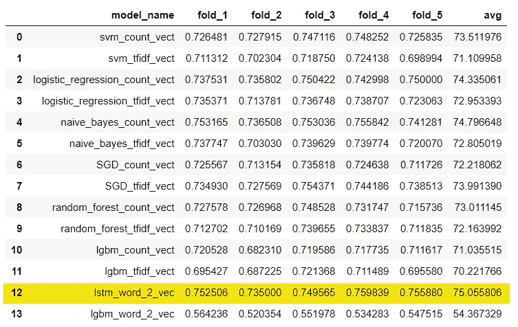

作者图片

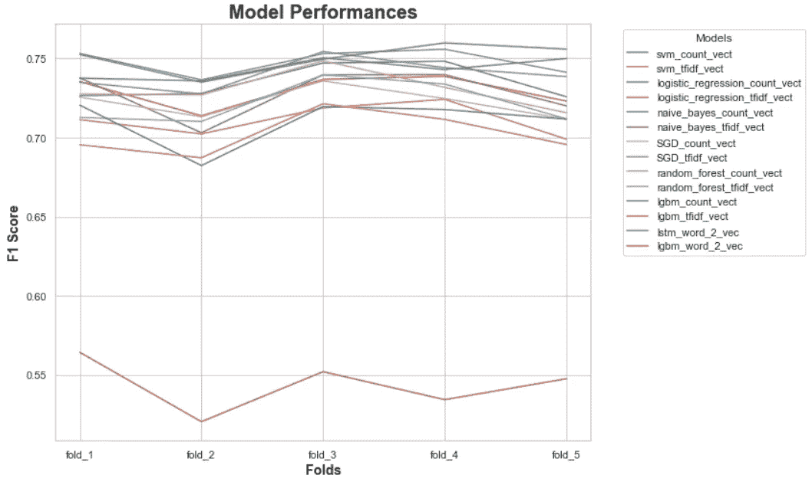

作者图片

实际上，我确实认为这个数据集足够小，不需要递归神经网络，但无论如何，在没有任何调整、特征工程和仅使用`text`特征的情况下，我们得到了双向 LSTM 非常不错的平均 F1 分数(这是本次比赛使用的指标)——如果你不熟悉 F1 分数，可以在我的[混淆矩阵](/confusion-matrix-un-confused-1ba98dee0d7f)文章中了解更多信息。

## 估价

为了评估模型，我将完整的训练数据分为 70%的训练数据和 30%的验证数据，这样我就可以构建一个模型，并评估模型在哪里出错。首先，我注意到我的 LSTM 模型非常严重地过度拟合了训练数据:

*   训练 F1 分数— 0.9019 (4 标准英尺)
*   验证 F1 分数— 0.7444 (4 标准偏差)

为了减少过度拟合，我们可以添加一些正则化作为即时解决方案，但我会在另一篇博客文章中进一步探讨这一点。

从混淆矩阵中，我意识到该模型很难预测正面类，因为它犯了 294 个第二类错误——这意味着它预测负面，而推文实际上是正面的。这种现象的另一个名字叫做假阴性。这个问题可以追溯到我最初对不平衡的班级的关注。

## 包裹

在这篇文章中，我讨论了我从 Twitter 中探索文本数据的过程，以及我如何着手建立模型，以查看我将使用哪个模型进行进一步开发。在未来的工作中，我计划解决我们的数据存在的过度拟合问题，并建立一个非常基本的前端，以便你可以键入一些你自己的推文，你将能够看到系统是否认为你的推文是关于灾难的。

在 [LinkedIn](https://www.linkedin.com/in/kurtispykes/) 和 [Twitter](https://twitter.com/KurtisPykes) 上与我联系，及时了解我和我关于人工智能、数据科学和自由职业的帖子。