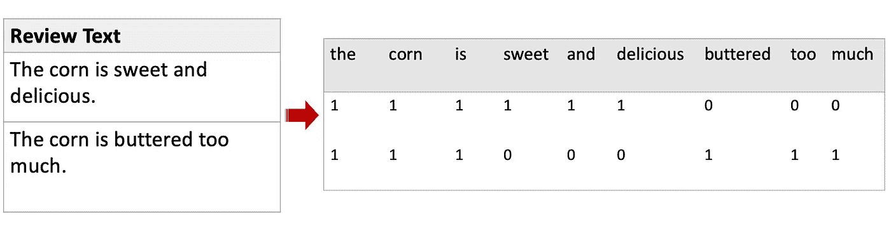

# 使用分类的情感分析

> 原文：<https://towardsdatascience.com/sentiment-analysis-using-classification-e73da5b4159f?source=collection_archive---------30----------------------->

## 如何根据历史数据计算情感得分


阴阳咖啡由亚历克斯从 [Unsplash](https://medium.com/u/2053395ac335?source=post_page-----e73da5b4159f--------------------------------)

情感分析是一种常用的文本分析技术，用于确定文本是正面的、负面的还是中性的。它可以用来了解观众的满意度，也是一个很好的预测功能。如果您有一个标记良好的数据集(带有基本事实情感得分)，您可以考虑使用文本分类来计算情感得分。

## 使用分类的好处:

1.  分类的使用**可以从特定于行业或主题的历史数据**中自动捕获模式。你不需要搜索特定主题的肯定或否定单词列表。
2.  包含不同的词袋计算作为情感分类的特征更加方便，因为您可以在现有的包中直接定义它。像“不好”和“不喜欢”这样的否定短语是可以捕捉到的，但是你自己很难捕捉到所有这些短语。
3.  有很多现有的分类算法供你选择。最佳拟合模型的潜力很大。

> 唯一的缺点是:你需要有标签数据！

# 资料组

我们使用的数据是 Yelp 标记的数据集，来自 [Kaggle](https://www.kaggle.com/ilhamfp31/yelp-review-dataset) 。第一列是评论文本，第二列是情感分数的基本事实(1 是负面情感，2 是正面情感)

首先，让我们将数据集分成训练集和测试集(您可以根据您拥有的数据量来决定 test_size)。如果你有一个足够大的数据集，你可以选择降低测试集的比例。

```
from sklearn.model_selection import train_test_split
Y=sample_new['rating']
X=sample_new['review']
X_train,X_test,Y_train,Y_test=train_test_split(X,Y,test_size=0.2)
```

# 数据预处理

这里我们使用了两个 sklearn 包:

1.  [**计数矢量器**](https://scikit-learn.org/stable/modules/generated/sklearn.feature_extraction.text.CountVectorizer.html) :将文本转换成令牌计数矩阵。令牌可以是单个单词或 2-gram 或 3-gram 短语。它还允许您在参数中指定 n_gram 范围、停用词移除等。



CountVectorizer(单个单词标记)后的两个评论句子示例

2. [**TfidfTransformer**](https://scikit-learn.org/stable/modules/generated/sklearn.feature_extraction.text.TfidfTransformer.html) :这里我们需要先了解一下 TF-IDF。TF-IDF 全称是‘词频-逆文档频’。术语频率是指单词或短语在整个文本中出现的频率。然而，如果一个术语出现得太频繁，那么它传达的有用信息就少了，TF-IDF 计算使用对数函数**缩小出现得太频繁的术语**。你也可以选择只使用词频来代替。

> TF-IDF(术语，文档)=术语频率(术语，文档)*日志(文档总数/(文档频率+ 1))

例如，数据科学文章通常包含“数据”一词。但是，它通常不会告诉你文章的观点(只是一个笼统的词)。TF-IDF transformer 基本上**把字数矩阵转换成频率矩阵**。

```
from sklearn.feature_extraction.text import CountVectorizer
vectorize = CountVectorizer(ngram_range=(1,2))
X_train_counts=vectorize.fit_transform(X_train)from sklearn.feature_extraction.text import TfidfTransformer
tfidf_transformer = TfidfTransformer()
X_train_tfidf = tfidf_transformer.fit_transform(X_train_counts)
X_train_tfidf.shape#(24000, 44563)
```

这里，我在 ngram_range 参数中将标记指定为单个单词或 2-gram 单词(可以根据需要将(1，2)改为 n_gram)，最后输出频率矩阵作为分类的特征。

# 分类模型和评估

> 最后，建模部分

对于使用什么没有限制，您可以对整个数据集进行采样，并查看哪个模型在准确性或其他评估指标方面最适合该样本。你可以在这里[参考](/top-5-metrics-for-evaluating-classification-model-83ede24c7584)如何评估你的分类模型。

```
from sklearn.linear_model import LogisticRegression
lr=LogisticRegression().fit(X_train_tfidf, Y_train)X_test_count=vectorize.transform(X_test)
X_test_tfidf=tfidf_transformer.transform(X_test_count)predicted=lr.predict(X_test_tfidf)#evaluate accuracy
np.mean(predicted == Y_test)
#0.89883
```

逻辑回归给出了几乎 90%的准确率

```
from sklearn import svm
from sklearn.pipeline import Pipelinetext_svm = Pipeline([
     ('vectorize', CountVectorizer()),
     ('tfidf', TfidfTransformer()),
     ('svm', svm.SVC()),
 ])text_svm.fit(X_train,Y_train)
predicted=text_svm.predict(X_test)
np.mean(predicted==Y_test)
#0.9
```

这里我使用了 sklearn 包管道将所有进程组合在一起。支持向量机精确地给出 90%的准确度。

```
from sklearn.neural_network import MLPClassifier
text_nn = Pipeline([
     ('vectorize', CountVectorizer()),
     ('tfidf', TfidfTransformer()),
     ('nn', MLPClassifier(solver='lbfgs', alpha=1e-5,
                     hidden_layer_sizes=(5, 2), random_state=1)),
 ])text_nn.fit(X_train,Y_train)
predicted=text_nn.predict(X_test)
np.mean(predicted==Y_test)
#0.88167
```

深度学习 MLP 分类器可以达到 88%左右

# 进一步改进

1.  **count vectorizer**的参数调整:n_gram_range、最大/最小文档频率等参数，用于检索分类的理想频率得分。这需要对数据集有很好的理解，也需要一些反复试验来达到理想的输出
2.  **分类模型的参数调整**:您可以使用 grid_search 或 random search 之类的搜索方法，在准确性或其他指标方面找到最佳的参数集。这将导致整个过程运行更长时间。
3.  **分类模型评估:**评估多个指标的性能，如召回率、精确度，而不仅仅是准确度

# 结论

数据量对于分类性能非常重要。如果没有足够大的数据集，不要让模型太复杂，因为有**过度拟合**的风险。此外，对数据的初步理解很重要，在做所有这些工作之前，你应该拿出一些样本文本来更多地了解数据的模式。

最后，如果你没有带标签的数据，想看看如何通过计算正面/负面词汇来计算情感得分，你可以参考我下面的另一篇文章。

[](/design-your-own-sentiment-score-e524308cf787) [## 设计你自己的情感分数

### 熊猫的情感分析

towardsdatascience.com](/design-your-own-sentiment-score-e524308cf787)