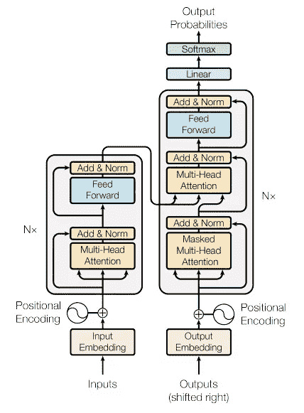
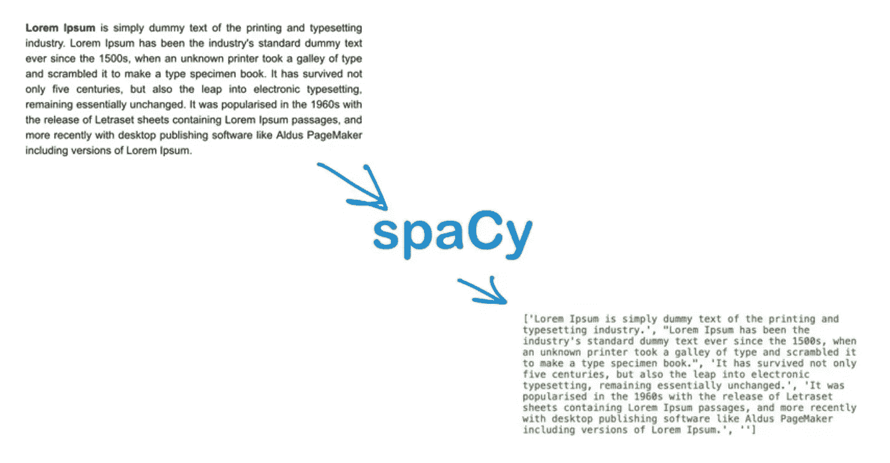
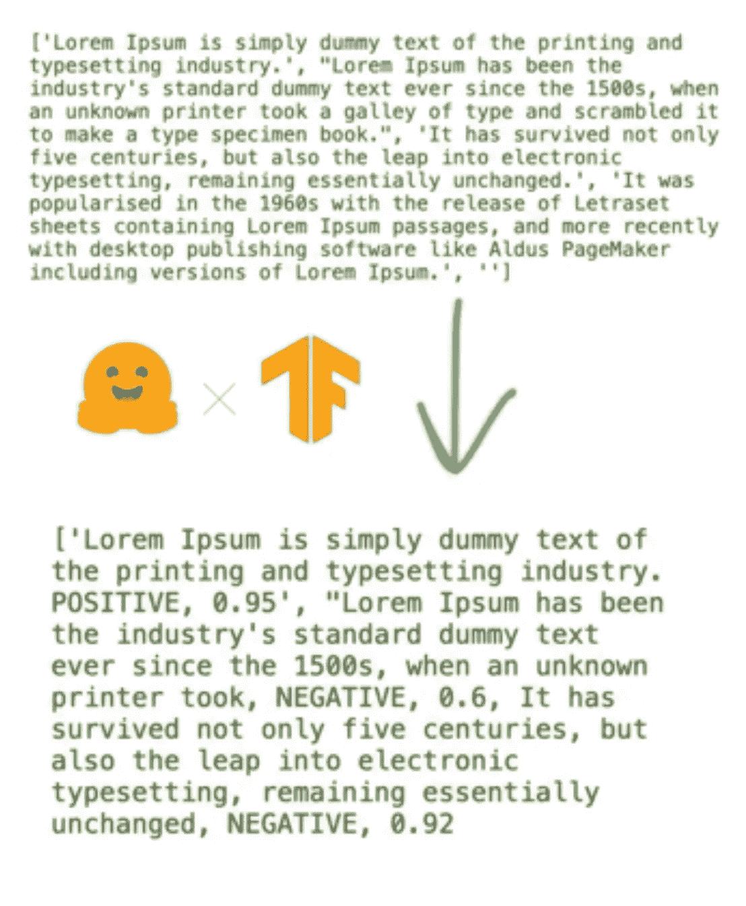
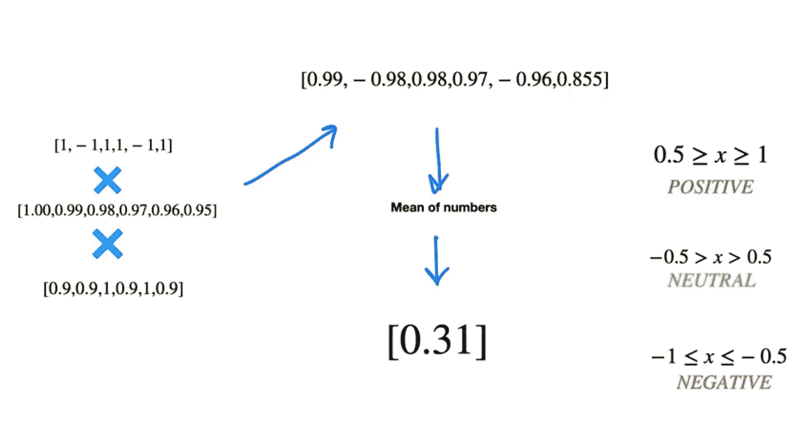

# 使用变形模型和心理扭曲进行情感分析

> 原文：<https://towardsdatascience.com/sentiment-analysis-with-transformer-models-with-a-twist-of-psychology-fe19fe5383ae?source=collection_archive---------24----------------------->

## [入门](https://towardsdatascience.com/tagged/getting-started)

## 为什么情感分析需要先理解我们的思维方式，然后才能告诉我们我们的感受


[Samule 孙](https://unsplash.com/@samule?utm_source=unsplash&utm_medium=referral&utm_content=creditCopyText)在 [Unsplash](https://unsplash.com/s/photos/transformers?utm_source=unsplash&utm_medium=referral&utm_content=creditCopyText) 上的照片

所以，你已经投入了大量的时间来开发热门的营销内容或撰写下一篇大文章(有点像这篇文章)，并希望向你的观众传达某种情感。你想知道你的内容是否会引起你的观众的共鸣，并得出一种特定的感觉，无论是喜悦、愤怒、悲伤，以了解不同的人对你的内容的反应。

文本分析，更具体地说是情感分析，无论如何都不是一个新概念，然而它也经历了几次模型的迭代，随着时间的推移变得越来越好。首先，我们从单词袋方法开始，来理解某些单词是否会传达某种情感。然后我们转到 RNN/lstm，它使用更复杂的模型来帮助我们理解情绪，尽管需要大量的训练，但缺乏并行性，这使得它非常慢，而且需要大量资源。2017 年，谷歌的研究人员提出了变压器模型的概念(图 1)，这比它的前辈们效率高得多。首先，输入嵌入是多维的，它可以处理完整的句子，而不是一个接一个的一系列单词。其次，它有一个强大的多头注意力机制，使句子能够保持上下文和句子中单词之间的关系。它对每个单词进行多次注意力分析，以确保足够的采样。最后，它使用前馈神经网络来归一化结果，并提供情绪(或极性)预测。要了解更多关于 transformer 架构的信息，请访问 [huggingface](http://Huggingface.co) 网站



图一。变压器模型架构[1]

现在我们已经理解了 transformer 模型，让我们双击这篇文章的要点，即对一个文档而不一定是一个句子进行情感分析。转换器模型使用的输入嵌入是句子嵌入，而不是整个段落或文档。为了分析一个文档，我们需要把句子分解成句子。为此，我使用 spacy 并定义了一个函数来获取一些原始文本并将其分解成更小的句子。

以下面的句子为例。我们会把这个句子放入一个空间模型，这个模型会分析文本，并把它分解成一个语法句子列表。这里有一个函数来帮助我们完成这个任务和输出

```
class Sentiment:# Constructor with raw text passed to the init function
    def __init__(self, raw_text):
        self.raw_text=raw_text.lower()

def breakSentence(self, text_content):
     self.text_content=text_content
     nlp = English()
     nlp.add_pipe(nlp.create_pipe(‘sentencizer’)) 
     doc = nlp(self.text_content)
     sentences = [sent.string.strip() for sent in doc.sents]
     return sentences
```



图 2: Spacy 句子列表[图片由作者提供]

一旦你有了一个句子列表，我们将通过 transformer 模型循环它，以帮助我们预测每个句子是积极的还是消极的，以及得分是多少。您最终会得到类似下面的结果(图 3)



图 3:带有情感极性和得分的句子突破[图片由作者提供]

现在，一旦我们有了这些句子，我们可以假设你只是平均出你的正面和负面，并得出一个最终的极性分数。这种假设存在一些挑战。首先，我们假设每个句子都具有相同的权重，但这并不总是如此(稍后会详细介绍)，其次，我们包括模型识别为负面的置信度相对较低的句子(60%负面，40%正面)。在我的研究中，我想过滤掉任何没有至少 90%得分的句子，无论是正面还是负面的。这是我为此开发的一些代码和结果。在这段代码中，我还定义了一个 before 和 after 结果，它可以帮助我理解我从多少个句子开始，又过滤掉了多少个句子。最后，它返回适当的句子和一个矩阵，每个过滤后的句子是如何分类的，1 表示肯定，1 表示否定。

```
def findRawTextPolarity(self):
    confidence_level=0.9
    nlpSA = pipeline("sentiment-analysis")
    sentences=self.breakSentence(self.raw_text)
    print('Before: ', len(sentences))
    result = [{'sentence' : sentences[i],'label':nlpSA(sentences[i])[0]['label']} for i in range(len(sentences)) if nlpSA(sentences[i])[0]['score']>confidence_level]
    print('After: ', len(result))
    sentences= [result[i]['sentence'].lower() for i in range(len(result))]
    labels= [result[i]['label'] for i in range(len(result))] 
    map_polarity={'NEGATIVE': -1, 'POSITIVE': 1}
    matrix_result=[map_polarity[k] for k in labels]
    return sentences, matrix_result
```

好了，到这一点，我们应该有一个过滤句子的列表，至少有 90%的预测和一个极性矩阵。现在是阅读心理学有趣的部分。

当读者阅读文件时，他们倾向于在接近文件结尾时记住更多的内容，而在接近开始时记住较少的内容。第二，读者倾向于记住文档的顶峰或高潮。作者希望读者记住什么？如果你考虑峰端法则，这些陈述是正确的。峰值结束规则声明*“该理论声明总体评级由体验的峰值强度和体验的结束来确定。它不关心整个体验的平均值"*

因此，理解 peak end rule 的含义并将其与我们的用例联系起来，确实，当我们给模型一个大的文本语料库时，我们会努力理解文章的峰值并赋予它稍微更多的权重，以及确定一种机制来为文档中后面的句子提供更多的权重。我们该怎么做？

为了识别文章的高潮，我的假设是，我们需要理解机器如何对高潮进行分类，其中一种方法是使用文本摘要。文本摘要从文档中提取关键概念来帮助提取关键点，因为这将提供对作者希望你记住的内容的最佳理解。第二，我们需要定义一个衰减因子，这样当你在文档中往下移动时，前面的每一句都会减轻一些重量。好了，让我们来定义完成这些任务的函数。

首先，让我们获取一个文本语料库，并使用 transformer 预训练模型来执行文本摘要。这个函数返回到峰值句子。

```
def findPeak(self):
    summarizer = pipeline("summarization")
    peak = (summarizer(self.raw_text))[0]['summary_text']
    peak_sentences=self.breakSentence(peak)
    return peak_sentences
```

接下来，我们将在本文前面定义的句子列表中找到这些峰值句子的位置。如果一个句子是峰值的一部分，我们将保留值 1，但如果它不是峰值句子，我们将删除它。我用过 0.9，但是你可以测试一些适合你的用例的东西。下面的函数可以完成这项任务。

```
def getPeakposition(self):
    peak_weight_red=0.9
    peak=self.findPeak()
    sentences = self.findRawTextPolarity()[0]
    matches=[[1 if operator.contains(s.replace(' .', ''),p.replace(' .', '')) else 0 for s in sentences] for p in peak]
    match_filter=[m for m in matches if sum(m)>0]
    sum_matrix=np.sum(np.array(match_filter),0)
    map_polarity={1: 1, 0: 1* peak_weight_red}
    matrix_result=[map_polarity[k] for k in sum_matrix]
    return matrix_result
```

好了，现在我们需要创建一个机制来引入一个衰减因子，当一个句子在一篇文章中对人脑来说变老时，这个衰减因子会移除一定程度的权重。我已经创建了一个函数，使用线性衰减因子来降低它，但我也使用了工作良好的指数衰减。

```
def textWeights(self):
    decay=0.01
    matrix=self.findRawTextPolarity()
    matrix_size=len(matrix[1])
    decay_matrix=[1-(decay*i) for i in range(matrix_size)]
    return decay_matrix
```

好了，我们现在应该有三个矩阵了

1.  提供衰减权重因子
2.  为高峰句子提供权重
3.  过滤句子的极性

现在变得容易了。我们将三者相乘，这将给出文档中每个句子的加权结果。既然这些都是加权的，我们就可以对整个文档的最终得分进行加权平均。我已经定义了我自己的分类尺度，但是你可以定义任何对你自己的用例有意义的东西。

这里得到的最终分数是我开发的代码，后面是我得到的结果。

```
def getFinalScore(self):
    peakposition=self.getPeakposition()
    decay=self.textWeightsexp()
    sent_polarity=self.findRawTextPolarity()[1]
    fin_score = [a*b*c for a,b,c in zip(peakposition,decay, sent_polarity)]
    fin_sent_fct = lambda x: 'POSITIVE' if x>0.5 else ('NEUTRAL' if 0.49>x>-0.5 else 'NEGATIVE')
    fin_sent=fin_sent_fct(np.mean(fin_score))
    print('This document is categorized as {} with a final score of {}'.format(fin_sent, np.mean(fin_score)))
```



图 4:最终情绪得分[图片由作者提供]

这就是结局吗？不。情绪分析实际上是一个非常棘手的问题，需要适当的考虑。首先，情绪可能是主观的，不同的人有不同的解释。例如，我可能喜欢某篇文章的巅峰，而其他人可能会将不同的句子视为巅峰，因此引入了很多主观性。第二，我们利用了一个预先训练好的模型，但该模型应该用您自己的数据和特定用例来训练。您可以利用各种模型，其中一个很流行的模型是 BERT，但是您可以根据您的用例再次使用其他几个模型。如果做得好，情感分析也是一种分析文本的好方法，可以释放大量的洞察力，帮助你更好地做出数据驱动的决策。

要观看视频示例，请访问 youtube 上的以下链接

```
[https://youtu.be/sZOV5pD4ELg](https://youtu.be/sZOV5pD4ELg)
```

来源:

1.  Google 的 [Attention is all you need](https://arxiv.org/pdf/1706.03762.pdf) 一文中提出的变压器架构