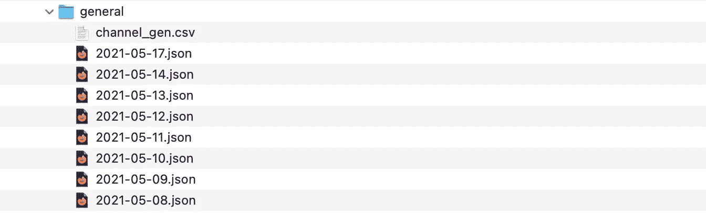
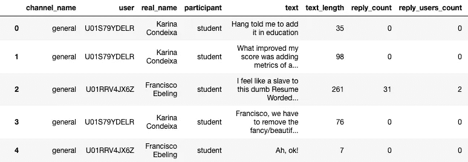
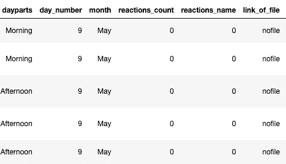
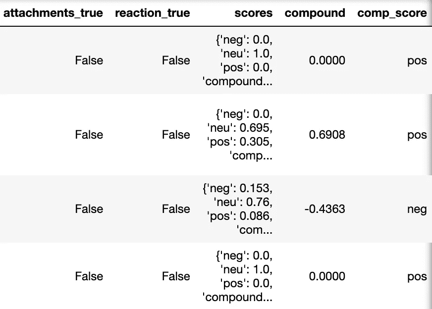
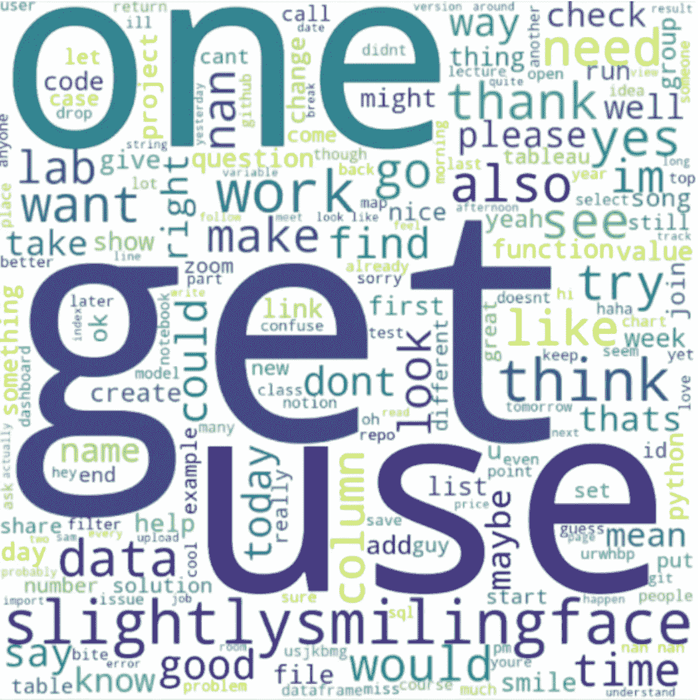
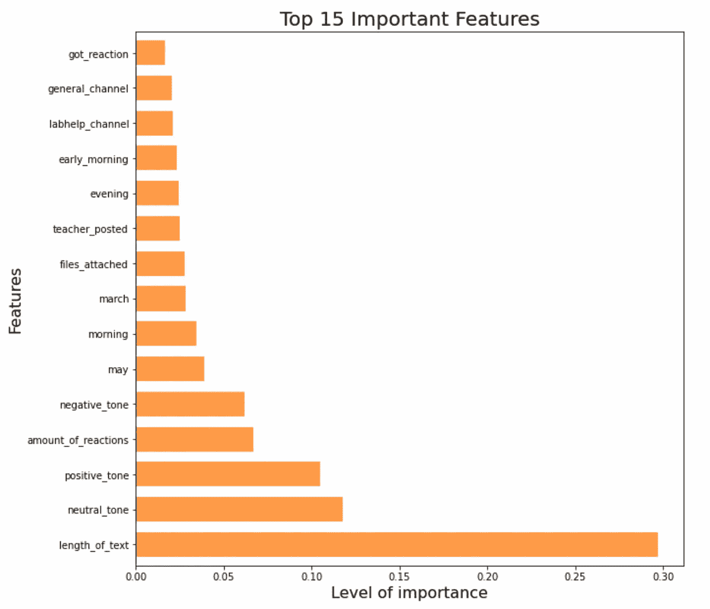

# 根据您的闲置数据进行情绪和参与度分析

> 原文：<https://towardsdatascience.com/sentiment-engagement-analysis-from-your-slack-data-11f7ff995b62?source=collection_archive---------17----------------------->

## 一瞥你松弛空间的情绪


图片由 Pankaj Patel 从[Unplash.com](https://unsplash.com/photos/OXkUz1Dp-4g)拍摄

有没有想过你发布的内容有多吸引人？它是清晰的还是令人困惑的？或者在全公司会议上人们误解了你的意思？

远程环境让教师和领导者很少有机会获得反馈并优化他们的内容以取得更好的绩效。

因为我职业生涯的相当一部分已经是远程完成的了(实际上是在 covid 时代之前！)，我发现这些问题在我渴望创造性解决方案的大脑中闪烁着兴奋和喜悦。我有数据，我所要做的就是起草我想回答的问题，然后去做。

这也是我训练营的最后一个 e2e 项目，我身边有主题专家作为利益相关者(我的首席老师和我的项目导师)指导我开发一个价值驱动的产品。

# 数据源

我的数据集包括从第一天到最后一天由 Slack 管理员提供的 Ironhack 训练营的公开对话。也可以通过 Slack API 来完成，但是这超出了我的项目范围。

为了保持这篇博文的简洁，请注意，我重点强调了代码中令人兴奋的部分，而不是它给出的见解。

如果您正在寻找:

*   视觉效果(在画面中完成)看看我的[演示](https://docs.google.com/presentation/d/1qMoWoY_3LL31Y4WvFe2di2z1FIUNOo3gU2yuRwjrI6o/edit?usp=sharing)
*   详细代码，浏览我的 GitHub repo [这里](https://github.com/lillaszulyovszky/ironhack-final-project)。

# 数据清理和争论

为了表示我在 JSON 文件数量方面遇到的挑战，这里是通用频道的文件夹，其中包含按天细分的所有对话，如下所示:



所以我首先将每个通道的 JSON 文件加载到一个数据帧中。

```
*# defining file path*
path_to_json = '../raw_data/general/' 

*# get all json files from there*
json_pattern = os.path.join(path_to_json,'*.json')
file_list = glob.glob(json_pattern)

*# an empty list to store the data frames*
dfs = []
**for** file **in** file_list:
    *# read data frame from json file*
    data = pd.read_json(file)
    *# append the data frame to the list*
    dfs.append(data)

*# concatenate all the data frames in the list*
channel_gen = pd.concat(dfs, ignore_index=**True**)
*# test*
channel_gen.tail(100)
```

然后为了方便起见，将每个通道的独立数据帧合并成一个数据帧。

```
*#frames = [channel_gen, channel_books, channel_dmemes, channel_dresource, channel_dbootcamp, channel_funcommittee, channel_dvizbeauties, channel_frustrations, channel_finalproject, channel_frustrations, channel_funcommittee, channel_katas, channel_labhelp, channel_music, channel_random, channel_vanilla]*

df = pd.concat([channel_gen, channel_books,
                    channel_dmemes, channel_dresource, 
                    channel_dbootcamp, channel_funcommittee,
                    channel_dvizbeauties, channel_frustrations, 
                    channel_finalproject, channel_frustrations, 
                    channel_funcommittee, channel_katas, 
                    channel_labhelp, channel_music, 
                    channel_random, channel_vanilla], ignore_index=**True**, join="outer")
```

到目前为止，我的 dataframe 有 5263 行和 13 列，其中有一堆与我的项目无关的数据。清洁是艰难的。

**清洗柱子&抬杠:**

```
- subtype: filter out it's values from df, remove the original column\
- ts: changing it to datetime, remove miliseconds, get days of the week, months of the year, type of the day, parts of the day\
- user_profile: extract real_name in new column, remove the original\
- attachments: extract title, text, link in new columns\
- files: extract url_private and who shared\
- attachments: extract title, text, link in new columns\
- reactions: extract user, count, name of the emoji\
```

因为几乎所有的数据都嵌套在 JSON 库中，所以我项目的大部分时间都花在了迭代特性工程任务上，以获得可以用来训练模型的变量。同时，提取数据是我最喜欢的。下面你可以看到几个函数的例子，这些函数被创建来从数据帧中获得洞察力。

谁发送的回复最多:

```
*#* user_profile column: extract real_namedef getrealnamefromprofile(x):
    """this function is applied to column user_profile
    """

    if x != x:
        return 'noname'
    else:
        return x['real_name']df_clean['real_name'] = df_clean['user_profile'].apply(getrealnamefromprofile)df_clean
```

群组中使用最多的表情符号是什么:

```
*# reactions column:  extract frequency*

**def** getcountfromreactions(x):
    *"""this function is applied to column reactions*
 *"""*

    **if** x != x:
        **return** 0
    **else**:
        **return** x[0]['count']

df_clean['reactions_count'] = df_clean['reactions'].apply(getcountfromreactions)

df_clean
```

人们在频道上分享了哪些链接:

```
*# files column: extract link*

**def** geturlfromfile(x):
    *"""this function is applied to column files*
 *"""*

    **if** x != x:
        **return** 'nofile'
    **else**:
        **try**:
            **return** x[0]['url_private']
        **except** **KeyError**:
            **return** 'nolink_infiles'

df_clean['link_of_file'] = df_clean['files'].apply(geturlfromfile)

df_clean
```

为了帮助我找到交流的来源，我创建了另一个函数来区分首席教师和助教与学生。

```
*# create a new column with teaching and students*
**def** applyFunc(s):
    **if** s == 'siand the LT (she/her)':
        **return** 'teacher'
    **if** s ==  'Florian Titze':
        **return** 'teacher'
    **if** s ==  'Kosta':
        **return** 'teacher'
    **else**:
        **return** 'student'
    **return** ''

df_clean['participant'] = df_clean['real_name'].apply(applyFunc)
df_clean['participant'].value_counts()
```

最后，在准备模型之前，我花了一点时间带着感激的心情检查了一下我清理过的数据框:



# 自然语言处理

在学习这一部分的时候，我意识到这是我想专攻的。文本分析，听起来很酷，对吧？想象一下，当机器可以在几毫秒内完成时，人们花在阅读繁琐的文本并试图用充满偏见的大脑分析它的时间有多长。让我颤抖。

我的范围最初还包括文本特征提取(因为这是你可以从书面交流中获得的最有价值的东西),这是我现在正在做的事情，但是，在那 5 天里我没有时间做这件事，这个主题也超出了训练营的范围。

相反，我专注于获得每条评论的情感分数，并从最常用的单词中生成一个令人敬畏的 worldcloud，作为给我同事的礼物。❤️

## 密码

```
**def** clean_links(df):
*#replace URL of a text*
    df_sent['text'] = df_sent['text'].str.replace('http[s]?://(?:[a-zA-Z]|[0-9]|[$-_@.&+]|[!*\(\),]|(?:%[0-9a-fA-F][0-9a-fA-F]))+', ' ')

clean_links(df_sent)
df_sent['text']*# load VADER*
sid = SentimentIntensityAnalyzer()# add VADER metrics to dataframedf_sent['scores'] = df_sent['text'].apply(lambda text: sid.polarity_scores(text))df_sent['compound']  = df_sent['scores'].apply(lambda score_dict: score_dict['compound'])df_sent['comp_score'] = df_sent['compound'].apply(lambda c: 'pos' if c >=0 else 'neg')#test 
df_sent.head()
```



这很容易。现在，到了具有挑战性的预处理部分，创建一个没有链接、数字、标点、停用词的世界云:

```
*# set of stopwords to be removed from text*
stop = set(stopwords.words('english'))

*# update stopwords to have punctuation too*
stop.update(list(string.punctuation))

**def** clean_text(text_list):

    *# Remove unwanted html characters*
    re1 = re.compile(r'  +')
    x1 = text_list.lower().replace('#39;', "'").replace('amp;', '&').replace('#146;', "'").replace(
    'nbsp;', ' ').replace('#36;', '$').replace('**\\**n', "**\n**").replace('quot;', "'").replace(
    '<br />', "**\n**").replace('**\\**"', '"').replace('<unk>', 'u_n').replace(' @.@ ', '.').replace(
    ' @-@ ', '-').replace('**\\**', ' **\\** ')
    text = re1.sub(' ', html.unescape(x1))

    *# remove non-ascii characters*
    text = unicodedata.normalize('NFKD', text).encode('ascii', 'ignore').decode('utf-8', 'ignore')

    *# strip html*
    soup = BeautifulSoup(text, 'html.parser')
    text = soup.get_text()

    *# remove between square brackets*
    text = re.sub('\[[^]]*\]', '', text)

    *# remove URLs*
    text = re.sub(r'http\S+', '', text)

    *# remove twitter tags*
    text = text.replace("@", "")

    *# remove hashtags*
    text = text.replace("#", "")

    *# remove all non-alphabetic characters*
    text = re.sub(r'[^a-zA-Z ]', '', text)

    *# remove stopwords from text*
    final_text = []
    **for** word **in** text.split():
        **if** word.strip().lower() **not** **in** stop:
            final_text.append(word.strip().lower())

    text = " ".join(final_text)

    *# lemmatize words*
    lemmatizer = WordNetLemmatizer()    
    text = " ".join([lemmatizer.lemmatize(word) **for** word **in** text.split()])
    text = " ".join([lemmatizer.lemmatize(word, pos = 'v') **for** word **in** text.split()])

    *# replace all numbers with "num"*
    text = re.sub("\d", "num", text)

    **return** text.lower()*# apply cleaning function*
df_train['prep_text'] = df_train['text'].apply(clean_text)
df_train['prep_text'].head(5)*# apply wordcloud function*
make_wordcloud(df_train['prep_text'])
```

结果呢:(ta-daa)



# 机器学习模型

为了在这里强调一些很酷的东西，我采用了随机森林分类模型来查看您需要哪些特征来获得回复(在这种情况下，从群组中获得帮助),准确度分数为 0.86:

```
*# feature importance*
feat_importances = pd.Series(importances, index=X.columns)
plt.figure(figsize=(10,10))
feat_importances.nlargest(15).plot(kind='barh', color='#FF9B48', width= 0.7)
plt.xlabel('Level of importance', fontsize=16)
plt.ylabel('Features', fontsize=16)
plt.yticks([0,1,2,3,4,5,6,7,8,9,10,11,12,13,14], ['length_of_text', 'neutral_tone', 'positive_tone',
                                                   'amount_of_reactions', 'negative_tone',
                                                   'may', 'morning','march', 'files_attached', 
                                                   'teacher_posted', 'evening', 'early_morning',
                                                   'labhelp_channel', 'general_channel', 'got_reaction'])

plt.title("Top 15 Important Features", fontsize=20)
plt.show()
```



看起来你有更好的机会得到回复，如果你:用中性或积极的语气写一封长信，收到很多回复，早上发送也有帮助，或者你有一个附件。

# 结论

通过这个项目，我学到了一些东西:

*   在你投资的事情上工作是一个游戏改变者
*   利益相关者在你身边是无价的
*   迭代是关键
*   从长远来看，函数可以节省您的时间

接下来，我将利用这个数据集，运用我从 Udemy 的 NLP 课程中获得的知识，从评论中提取一些很酷的东西。