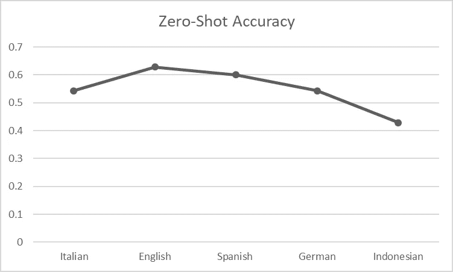

# 拉丁语的零距离情感分类(借助其后代)

> 原文：<https://towardsdatascience.com/sentiments-of-rome-80eb617b5980?source=collection_archive---------42----------------------->

## 一种用于死(和/或低资源)语言的 NLP 方法


在 [Unsplash](https://unsplash.com?utm_source=medium&utm_medium=referral) 上由 [L A L A S Z A](https://unsplash.com/@lalasza?utm_source=medium&utm_medium=referral) 拍摄的照片

# 介绍

[拉丁语](https://www.britannica.com/topic/Latin-language)可以被认为是“旧世界的英语”。我把它与英语进行了比较，以强调这样一个事实，就像英语是当今世界上最流行的语言一样，拉丁语在古代西方世界占据主导地位。这不仅仅是因为受欢迎，而是因为罗马扩张的影响，尤其是在西欧和地中海地区。然而，拉丁语直接塑造了许多现代语言([罗曼语](https://en.wikipedia.org/wiki/Romance_languages))，也对其他语言产生了一些影响(比如英语)。我想看看拉丁语在现代自然语言处理(NLP)环境中是如何工作的(使用基于 transformer 的预训练模型)，我在这篇短文中提到了这一点。

古典拉丁语现在被认为是一种死亡的语言，这使得它在 NLP 领域也是一种低资源语言。拉丁语的近亲被认为是撒丁语和意大利语。然而，它们大多是从“[粗俗拉丁语](https://en.wikipedia.org/wiki/Vulgar_Latin)”演变而来，这是一种在平民中流行的非文学拉丁语。我假设涉及拉丁语的 NLP 任务(情感分类任务)将由这些语言中的一种来帮助，尽管预训练模型在其预训练或微调阶段没有见过拉丁语。这也被称为零起点学习，我们可以将相关语言的知识转移到拉丁语中，而无需在拉丁语语料库中进行微调。

# **方法**

作为一种资源匮乏的语言，要获得一个庞大的带注释的拉丁语语料库并不容易。我在互联网上使用了一个可访问的[数据集](https://github.com/CIRCSE/Latin_Sentiment_Analysis/blob/main/data/GoldStandardv1-Horace.tsv)【4】【5】，它由 45 个拉丁句子组成，分为 3 个情感类别(积极、消极、中性、混合)，并从[贺拉斯的颂歌](https://en.wikipedia.org/wiki/Odes_(Horace))中提取(数据集的创建者有一篇即将发表的论文使用了相同的数据集，请检查参考文献)。为了简单起见，我去掉了混合句和中性句。我使用了基于 transformer 的微调单语模型(用于情感分类)，可用于[意大利语](https://huggingface.co/MilaNLProc/feel-it-italian-sentiment) (Bert)、[英语](https://huggingface.co/siebert/sentiment-roberta-large-english) (Roberta)、[西班牙语](https://huggingface.co/finiteautomata/beto-sentiment-analysis) (Bert)、[德语](https://huggingface.co/oliverguhr/german-sentiment-bert) (Bert)、以及[印尼语](https://huggingface.co/w11wo/indonesian-roberta-base-indolem-sentiment-classifier-fold-3) (Roberta)上的 [Huggingface](https://huggingface.co/) 。撒丁语也是一种资源匮乏的语言(或者至少网上没有足够的资源)，因此它被抛弃了。拉丁语数据集由如下句子组成，

> “这是一个很好的例子”——否定的
> “非自我的酒神是我的朋友”——肯定的

对于 Huggingface 模型，剩下的工作很容易，每个模型都遵循通常的步骤(在 Huggingface 中也提到过)。结果是通过将标记化的拉丁句子直接输入到微调模型中获得的。

```
import torch
import numpy as np
from transformers import AutoTokenizer, AutoModelForSequenceClassification
import pandas#Read the corpuslat=pandas.read_csv('latin.tsv',sep='\t')lat=lat[lat['Value']!='mixed']
lat=lat[lat['Value']!='neutral']sentences=lat.loc[:,'Text']labels=lat.loc[:,'Value']
true_val=map(lambda x:1 if x=='positive' else 0,labels)# Load model and tokenizertokenizer = AutoTokenizer.from_pretrained(“MilaNLProc/feel-it-italian-sentiment”)model = utoModelForSequenceClassification.from_pretrained(“MilaNLProc/feel-it-italian-sentiment”)#tokenize the sentencesinputs = tokenizer(list(sentences),padding=True, return_tensors="pt")#first 4 lines can slightly change with the model, e.g.- for spanish model, outputs = model(**inputs),logits = outputs.logitsproba = torch.nn.functional.softmax(logits, dim=0)labels = torch.tensor([0]*len(list(sentences)).unsqueeze(0)
outputs = model(**inputs, labels=labels)
loss, logits = outputs[:2]
logits = logits.squeeze(0)prob = torch.nn.functional.softmax(logits, dim=0)result=[]for i in prob:
result.append(list(i.detach().numpy()).index(np.max(i.detach().numpy       ())))from sklearn.metrics import accuracy_score
accuracy_score(list(true_val),result)#for some models, their output further needs to be processed in order to have numerical valueresult=[]for i in sentences:
     result.append(1 if sentiment_analysis(i)[0]['label']=='POSITIVE' else 0)
```

对于包括任务流水线的模型，

```
from transformers import pipeline#Here the pytorch models are not created explicitly like in the previous snippet. Yet, the models gives an output similar to previoussentiment_analysis = pipeline(“sentiment-analysis”,model=”siebert/sentiment-roberta-large-english”)result=[]for i in sentences:
     result.append(1 if sentiment_analysis(i)[0]['label']=='POSITIVE' else 0)accuracy_score(list(true_val),result)
```

# 结果

[遗传相似度](https://en.wikipedia.org/wiki/Genetic_relationship_(linguistics))是语言学中用来衡量一对语言之间的相似性或关联性的一种尺度。它的值越高，这一对语言之间的距离就越大！。我使用了一个[在线工具](http://www.elinguistics.net/Compare_Languages.aspx)来测量拉丁语和上面提到的其他语言之间的相似性。它显示了如下关系。


按作者

像意大利语和西班牙语这样的罗曼语最接近拉丁语，而像英语和德语这样的日耳曼语则稍远一些。印尼语和拉丁语没有关系，但是印尼语在其拼写中采用了拉丁语。让我们来看看所选语言的每个模型如何执行零镜头分类。对于具有 3 个类别输出(德语)的模型，将少数中性/混合预测分别改为阴性和阳性，并考虑其中的最高准确度得分。



按作者

令人惊讶的是，语言之间的关系模式在这里没有出现。每个实例(除了印度尼西亚语)的准确度都大于 0.5，西班牙语显示了罗曼语的最高准确度分数。英语表现的最好，同时也是最接近拉丁语的语言；意大利语在后面。尽管一种语言与拉丁语相差甚远，但这并不总是意味着性能下降。

这种结果的一个可能原因是模型的能力(这取决于模型中的参数数量、预训练目标和用于预训练模型的语料库)。另一个主要原因是每个语言模型中使用的预训练/微调数据集的大小。意大利模型[1]使用由 2k 条推文组成的情感数据集进行了微调，而英国模型[2]也在属于不同领域的多个数据集(推文、评论等)上进行了微调。).西班牙模型[3]利用了大约 5k 的 tweets 进行微调。

有人可能会认为，无论源语言是什么，用于模型的训练语料库的质量/规模都会直接影响其零炮性能。此外，该模型可能能够学习句子情感的底层表示，而不管语言如何，并且所学习的知识可以在目标语言的零射击任务期间使用。你怎么想呢?在评论里提！！！这不是一套广泛/完整的实验和分析，因此无法对导致这一结果的因素做出明确的结论。甚至其他可用的和未经测试的模型也可能揭示一个新的结果。然而，据观察，语言相关度并不是唯一决定拉丁语情感分类零命中率的因素。我相信这是一个有趣的研究领域。

感谢您的阅读！

# 参考

[1]——“感受:意大利语的情感和情绪分类，比安奇等人”，[https://aclanthology.org/2021.wassa-1.8/](https://aclanthology.org/2021.wassa-1.8/)

[2]——“不止是一种感觉:情感分析准确性的基准，[海特曼](https://papers.ssrn.com/sol3/cf_dev/AbsByAuth.cfm?per_id=1911466)等，【https://papers.ssrn.com/sol3/papers.cfm?abstract_id=3489963】T4

[3]—[https://github.com/finiteautomata/pysentimiento/](https://github.com/finiteautomata/pysentimiento/)

[4]——[https://github.com/CIRCSE/Latin_Sentiment_Analysis](https://github.com/CIRCSE/Latin_Sentiment_Analysis)

[5]——“拉丁诗歌的情感分析:贺拉斯颂歌的第一次实验。，曼布里尼等人，“CLiC-it，202，[https://clic2021.disco.unimib.it/](https://clic2021.disco.unimib.it/)