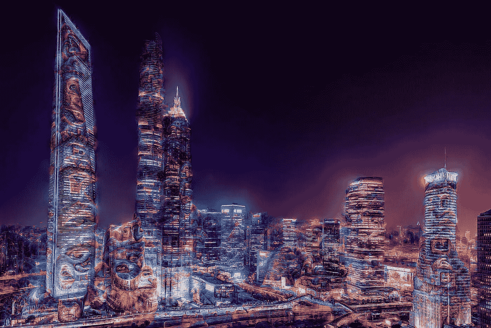
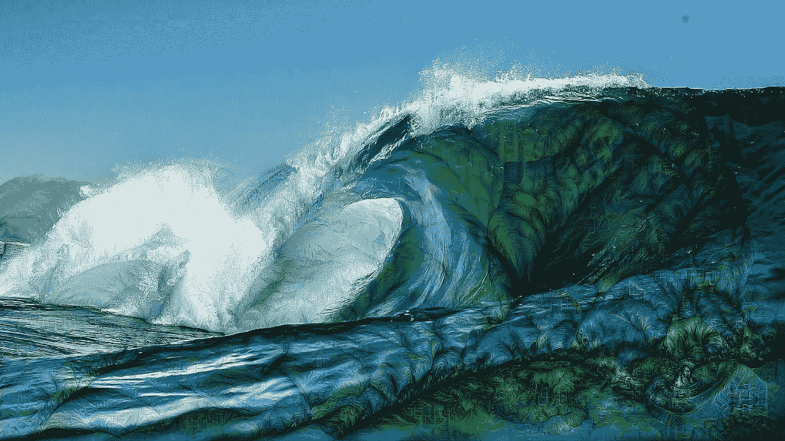
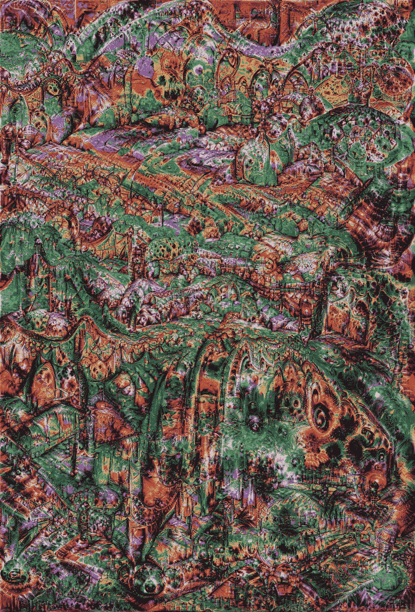
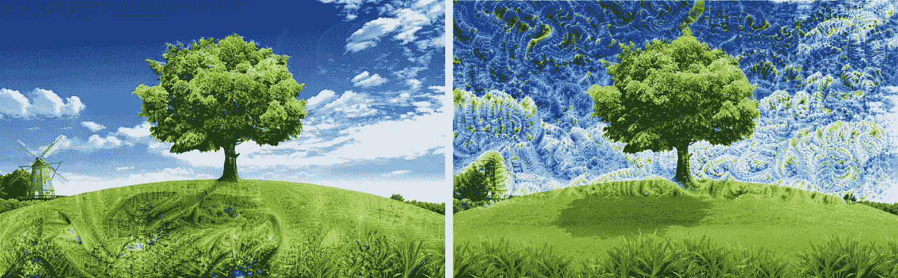

# PyTorch 中带深度估计的序列做梦

> 原文：<https://towardsdatascience.com/sequence-dreaming-with-depth-estimation-in-pytorch-d754cba14d30?source=collection_archive---------23----------------------->

梦境类:图腾柱+减噪。作者图片

## 人工艺术合成

虽然“沉睡”仍然是 reddit 上的大炒作，但我决定在连续帧(即视频)的深度做梦背景下，再看看开放性问题。受之前工作的启发，例如[这个 Caffe 实现](https://github.com/samim23/DeepDreamAnim)，除了将所有东西集成到最新的 PyTorch 框架中，我还想包含更多关于单类做梦(见我之前的[帖子](/deep-lucid-dreaming-94fecd3cd46d))和深度估计的最新见解。

三轮车系列梦。

**你可以在这里找到我的回购**(っ◔◡◔)っ♥****♥****

****与我以前使用的一些类似的代码相比，我的实现大大改善了梦模式的闪烁。这个问题的发生通常是因为光流算法计算的矢量场在变化很小的区域接近于零，这导致了后续帧之间相应的梦内容的较大差异。这可能导致模式以高达每秒帧数的频率变化。我通过将前一个梦的模式扭曲到下一帧，并用流矢量场来参数化更新的强度，来解决这个问题。这种方法可以跟踪场景中运动的物体，还可以平稳地梦到新出现的物体和背景。目前，场景切换仍然必须手动处理，否则结果通常会显示不同场景之间梦境内容的不自然重叠。这个问题将来会得到解决。****

****在每一步中，使用 [Farneback 方法](https://link.springer.com/chapter/10.1007%2F3-540-45103-X_50)(由 opencv2 提供)或可选的[空间金字塔网络](https://arxiv.org/abs/1611.0085) (SPyNet)计算矢量场。为了获得更高的流量预测精度，应该使用 SPyNet。****

****我的代码可以用 PyTorch 1.8 运行。实现了以下附加功能:****

*   ****单一阶层做梦****
*   ****用 Pytorch MiDas 进行深度估计****
*   ****各种分类模型(resnet、vgg19、inception……)****
*   ****带 SPyNet 或 Farneback 的光流(opencv2)****

********

****睡袋海洋与深度估计。作者图片****

# ******设置******

****config 文件夹中提供了一个基本配置文件。它包含了做梦所需的所有参数。****

******视觉表现******

****输入图像被二次抽样到更小的分辨率，以便在许多不同的尺度上生成梦的结构。在较高分辨率下做梦会给在较低分辨率下产生的粗糙结构增加细节。参数 **num_octaves** 和 **octave_scale** 表征图像金字塔。 **num_iterations** 表示网络处理输入的次数。以下是将 **num_iterations** 或学习率( **lr** )设置为非常大的值时获得的示例结果:****

********

****涉及到一些后期处理步骤，如改变颜色和锐化。作者图片****

****我们可以观察到大量的细节，然而，图像的原始内容已经完全消失了。通过将 **random** 设置为 True，可以使上述参数随机化。****

******梦的内容******

****如果你想对你一直看到的狗的典型眼睛和脸之外的梦的特征有更多的控制，你可以将**引导的**参数设置为*真*以启用特定类的梦。这是我在之前的[帖子](/deep-lucid-dreaming-94fecd3cd46d)中提到过的一个话题。通过将相应的索引添加到 **channel_list** 中，您可以从[该列表](https://gist.github.com/yrevar/942d3a0ac09ec9e5eb3a)中选择并混合任意数量的 ImageNet 类。在下面的示例视频中，我使用了三个类:蘑菇、天鹅绒和雨伞。****

****在蘑菇、天鹅绒和雨伞上做梦****

****相反，如果您希望算法动态选择模型分配最高概率的类别，请将 **max_output** 设置为 *True* 。一个实验特性是**金字塔 _ 最大值**参数，当设置为真时，在每个八度音阶中独立选择最可能的类别。****

******深度估计******

****还可以将梦的内容与感知的图像深度联系起来。首先，使用 PyTorch MiDas 模块计算图像的相对逆深度。深度图随后被归一化到区间[0，1]中，用于放大或抑制做梦。通过将**使用深度**设置为*真*可以激活深度估计。您还可以通过设置 **depth_str** 为遮罩指定一个倍增强度因子。****

****将 **use_threshold** 设置为真会将低于阈值 **th_val** 的所有内容归零。通过更改此参数，可以根据预测深度动态指定排除距离。如果你想排除前景，设置**反转深度**为*真*。****

********

****前景(左)和背景(右)做梦。作者图片****

****太棒了。****

****对于非常大的输入，通过利用兼容硬件上的 Nvidia Apex 模块提供的混合精度算法，还可以减少所需的内存并加快推理速度。好在已经在 PyTorch 中实现了，所以只需要设置 **fp16** 为 *True* 即可。****

****现在发挥创意，制作一些很酷的图片和视频吧！****